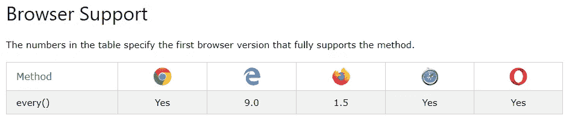

# 使用。every()验证 JavaScript 数组值

> 原文：<https://betterprogramming.pub/use-every-to-validate-javascript-array-values-2ce548756543>

## 检查数组中所有元素的最佳方法


凯文·梅勒弗在 [Unsplash](https://unsplash.com/s/photos/check?utm_source=unsplash&utm_medium=referral&utm_content=creditCopyText) 上拍摄的照片

数组是主要的数据结构；对于任何程序员来说，学习使用它们的不同和最佳方式都是一项关键技能。数组有内置的方法用来用[替换](https://medium.com/better-programming/stop-using-for-loops-to-iterate-over-arrays-5c46940e79d1) `[for](https://medium.com/better-programming/stop-using-for-loops-to-iterate-over-arrays-5c46940e79d1)` [循环](https://medium.com/better-programming/stop-using-for-loops-to-iterate-over-arrays-5c46940e79d1)。

`[map()](https://medium.com/better-programming/how-to-start-using-map-filter-and-reduce-e01edba0d81)``[filter()](https://medium.com/better-programming/how-to-start-using-map-filter-and-reduce-e01edba0d81)`[和](https://medium.com/better-programming/how-to-start-using-map-filter-and-reduce-e01edba0d81) `[reduce()](https://medium.com/better-programming/how-to-start-using-map-filter-and-reduce-e01edba0d81)` [方法](https://medium.com/better-programming/how-to-start-using-map-filter-and-reduce-e01edba0d81)得到了大部分的关注，但它们不是唯一的。如果您手头的任务是验证数组中的所有元素，那么您需要使用`every()`方法。

# 的。every()方法

根据 [MDN web docs](https://developer.mozilla.org/en-US/docs/Web/JavaScript/Reference/Global_Objects/Array/every) ，通过传递回调函数调用`every()`方法。箭头中的每个元素都将被传递给回调函数，如果所有元素都返回 true，那么`every()`将返回 true。

```
function isFive(n) {
  return n == 5;
}var nums = [5,5,5];console.log(nums.every(isFive)); // true
```

我们的代码示例可以通过几种方式进行优化。如果回调只被使用一次，匿名的[箭头函数](https://medium.com/better-programming/learning-javascript-arrow-functions-36cce13351c2)可以代替它使用。

```
var nums = [5,5,5];// full arrow syntax
console.log(nums.every((n) => { return n == 5; }));// shorthand arrow syntax
console.log(nums.every(n => n == 5));
```

如果您在支持 ES6 的环境中工作，您应该使用`[let](https://levelup.gitconnected.com/stop-using-var-to-declare-variables-in-javascript-6c0caec16f43)` [或](https://levelup.gitconnected.com/stop-using-var-to-declare-variables-in-javascript-6c0caec16f43) `[const](https://levelup.gitconnected.com/stop-using-var-to-declare-variables-in-javascript-6c0caec16f43)` [而不是](https://levelup.gitconnected.com/stop-using-var-to-declare-variables-in-javascript-6c0caec16f43) `[var](https://levelup.gitconnected.com/stop-using-var-to-declare-variables-in-javascript-6c0caec16f43)`来定义数组。

```
// use if nums will change
let nums = [5,5,5];// use if nums will not change
const nums =  [5,5,5];
```

# for 循环呢？

如果你坚持使用普通的`for`循环，那么让我们看看前面重构为`for`循环的例子。

```
let isFive = true;
let nums = [5,5,5];for(let i=0; i < nums.length; i++) {
   if(nums[i] != 5) { isFive = false; }
}
```

对我来说，`for`循环更长，更难阅读。使用`every()`——不管实际的回调是什么——让读者知道目标是验证所有元素。

使用`[for…of](https://medium.com/better-programming/use-for-of-to-loop-through-your-javascript-arrays-57ebb900ab5a)` [循环](https://medium.com/better-programming/use-for-of-to-loop-through-your-javascript-arrays-57ebb900ab5a)会产生类似的结果。

```
let isFive = true;
let nums = [5,5,5];for(n of nums) {
   if(n != 5) { isFive = false; }
}
```

另外，注意这两个例子都需要一个否定，这会使你的代码更加复杂。

# 与 every()方法有关的问题

遗憾的是，`every()`并不是对所有场景都完美；这种方法存在一些挑战。

这种方法不是通用的。从这张表中我们可以看到，由于 W3Schools 的帮助，这种方法被广泛接受，但也有一些例外。



该方法还有一些边缘行为，比如当传递一个空数组时返回`true`。

```
let nums = [];console.log(nums.every(n => n == 5)); // true
```

这是因为回调永远不会被调用，因为没有元素传递给它。如果您希望空数组返回`false`，您可以将回调嵌套在`if`语句中。

既然我们已经做了一些重构，让我们再试试用三元运算符优化`if`语句。

```
let nums = [];
let result = (nums.length) ? nums.every(n => n==5) : false;
```

# 结论

使用`every()`方法有效地从语义上验证数组元素。

如果这对你来说是新的，你计划重构的一些块是什么？如果你是一个经验丰富的用户，你最喜欢的用例是什么？下面分享你的经历，感谢阅读！