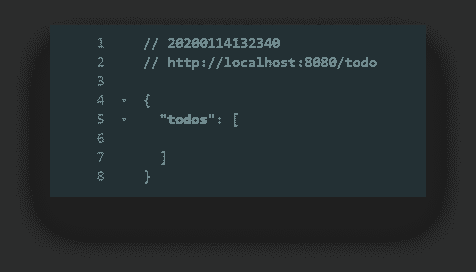
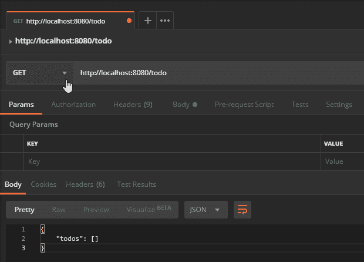
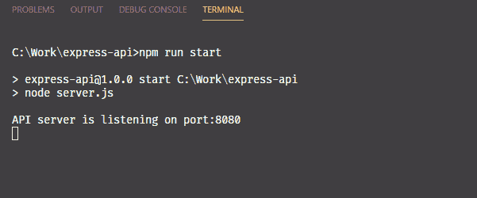
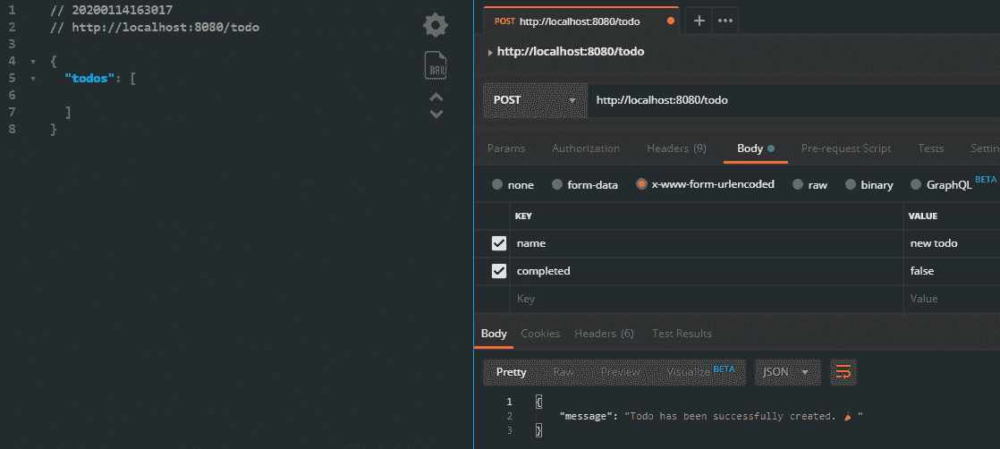
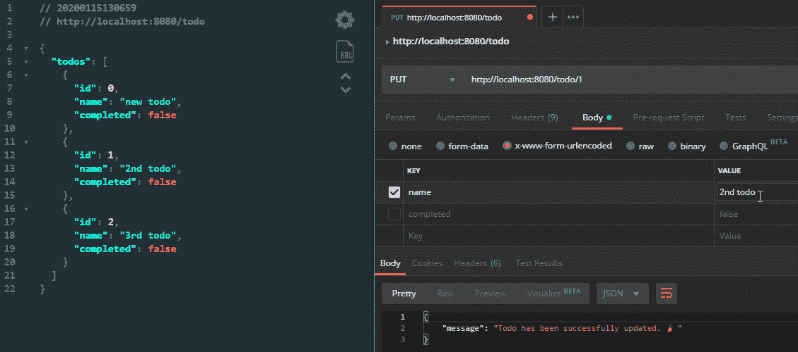
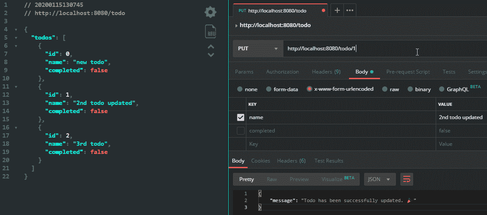
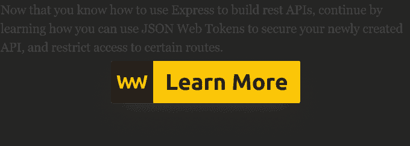

# 如何使用 Express 构建 REST API

> 原文：<https://betterprogramming.pub/use-express-to-build-a-rest-api-69bd4abb8e4a>

## 在 Node 中构建可伸缩 API 的介绍

照片由 [Clément H](https://unsplash.com/@clemhlrdt?utm_source=medium&utm_medium=referral) 在 [Unsplash](https://unsplash.com?utm_source=medium&utm_medium=referral) 上拍摄

你知道吗，根据 JS 的[状态，2019 年 Express 在知名度、兴趣和满意度方面排名第一，这项年度调查有超过 20，000 名受访者。它主要用于为 web 创建健壮的 API，通过其灵活的 API 快速而容易地实现。](https://2019.stateofjs.com/back-end/)

API 是不同软件组件之间通信的常用手段。它们提供了一种在两个应用程序之间交换数据的简单方法。在我们的例子中，这是在浏览器和数据库之间。在本教程中，我们将使用 Express 在 Node 中构建一个可伸缩的 REST API。

为了简单起见，我们将使用经典的 todo 示例。我们将构建一个 API 来存储、检索、修改和删除待办事项。每个操作将由不同的 HTTP 请求方法处理。我们的第一项工作将是建立快递。

# 设置 Express

为了使本教程简明易懂，我将使用`LocalStorage`替换数据库功能。当然，我们在 node 中没有这个，所以我们必须填充它。这意味着我们将有两个依赖项:`[express](https://www.npmjs.com/package/express)`和`[node-localstorage](https://www.npmjs.com/package/node-localstorage)`。`npm init -y`您的项目，并将它们添加到您的依赖项中。

我还把默认脚本换成了`node server.js`；这是我们将在其中设置 Express 服务器的文件。在根目录下创建`server.js`文件，并在其中添加以下几行:

我们可以用传入端口的`app.listen`来启动 web 服务器；从命令行或默认为 8080。现在没什么发生。如果你打开`localhost:8080`，你会看到服务器没有返回任何东西。所以让我们改变这一点，增加一些路线！

# 创建路线

对于路由，我创建了一个名为`routes`的单独目录，并添加了一个`index.js`。我们将有四个不同的端点:

*   `GET`用于获取所有或单个待办事项
*   `POST`用于创建新的待办事项
*   `PUT`用于更新现有待办事项
*   `DELETE`用于删除特定的待办事项

这就是我们的`routes/index.js`的样子:

`routes`将是一个获取 express 应用程序作为参数的函数。`app`变量公开了一个`route`方法，该方法接受一个端点作为参数。我们可以使用冒号来指定路由参数。通过在末尾添加一个问号，我们可以告诉 express 这只是一个可选的参数。

在`route`上，我们可以链接不同的 HTTP 请求方法。对于每个方法，我们将执行不同的函数。这些方法来自于`Todo.js`下控制器文件夹中定义的一个对象，所以这将是我们的下一步。

但是首先，要实际告诉 Express 使用这些路线，请返回到您的`server.js`文件，并使用以下内容扩展它:

我已经导入了`routes`并传递了 Express `app`给它。现在，如果你导航到`localhost:8080/todo`，它将调用`todo.get`方法，我们还没有指定，所以让我们现在就这样做。

# 请求和回应

如果还没有，创建一个`controllers`文件夹并添加一个`Todo.js`文件。我们将为这四个请求导出一个包含四个方法的对象:

每个方法将访问一个`request`和`response`对象。我们还需要导入`LocalStorage`包，因为我们将使用它来代替真正的数据库。它会自动在根目录下为你创建一个`db`文件夹。

让我们按顺序进行，看看如何使用`get`方法返回到 dos。

## 获取路线

我们希望根据 URL 中是否提供了 id 来获取全部或特定的 todo。我们还想检查我们是否有一个`localStorage`项目集，这样我们就不会以一个错误结束。这留给我们以下检查:

要获得 URL 参数，我们只需访问`request.params`对象。属性的名称将是在`app.route`中指定的名称。 *(* `*:id*` *)* 要返回一个 JSON 响应，我们可以用一个我们想要返回的对象调用`response.json`作为响应:

如果`localStorage`里连`todos`都没有，我们可以返回一个空数组。否则，我们可以返回存储在 localStorage 中的项目。由于我们只能存储字符串，我们需要在对象上调用`JSON.parse`。当我们想要访问单个 todo 时，情况也是如此。但是这一次，我们还想筛选单个项目。

如果你刷新页面，你会得到一个空的`todo`列表。

## 邮寄路线

让我们用一些项目填充数组。这一次，我们希望使用`x-www-form-urlencoded`内容类型发送请求数据。由于我们不能在没有任何前端的情况下直接在浏览器中发送`POST`请求，我们需要找到另一种方法。对于这个任务，我正在使用流行的[邮递员](https://www.getpostman.com/downloads/)应用程序。你可以免费下载安装。

打开应用程序并创建新请求。将方法类型设置为`POST`，将主体设置为`x-www-form-urlencoded`。如果已经提供了一个`name`和一个`completed`标志，我们只想添加一个新的 todo。

为了从 Express 内部的请求中获取值，我们可以访问`request.body`。然而，如果您发送一个 post 请求并尝试注销`request.body`，您会注意到它是`undefined`。这是因为默认情况下 express 不能处理 URL 编码的值。为了通过 JavaScript 访问它们，我们必须使用中间件。在定义路线之前，将以下行添加到您的`server.js`文件中:

现在，如果您发送`POST`请求并尝试再次注销`request.body`，您将获得注销到控制台的值。

因此，我们可以从检查请求中是否有这两个值开始，如果没有，我们可以发送一个错误来指出问题:

我们想要添加一个新条目的方法是，我们只是想从 localStorage 获取`todos`(如果有的话),解析 JSON 并将一个新对象推送到数组中。然后将其转换回 JSON，当然，发送一个响应让我们知道我们是否成功了。

请注意，由于我们可能在 localStorage 中没有`todos`,我们需要返回到一个空数组。还要注意，因为我们得到的请求是字符串，所以我们需要将`completed`标志转换为布尔值。

## 放置路线

一旦我们的待办事项列表中有了足够多的项目，我们就可以尝试更新它们。同样，我们需要检查 id 和`name`或`completed`标志的存在。

我们希望遵循与对`create`方法类似的逻辑:解析 localStorage 数据，更新数组中 id 与作为请求参数传递的 id 相匹配的条目，将数据转换回 JSON 并发送成功响应:

请记住，我们希望将`completed`标志转换为布尔值。我们不能像对`todo.name`那样做逻辑 OR 的原因是，如果我们想让`completed`设置为假，它总是会回到默认的`todo.completed`值。

## 删除路线

可能所有方法中最短最简单的是`delete`。我们所要做的就是过滤掉 id 与传入端点的 id 相匹配的项:

并将它的字符串版本重新分配给 localStorage 中的`todos`。

# 结论

现在，您已经有了一个处理 todo 项的工作 API。我会把 UI 部分留给你。这种方法的优点是每个操作都被分成不同的方法。这样，您的 API 更容易扩展。这也有助于减少寻找 bug 的时间。如果您遇到某个请求的问题，您可以快速查明哪里出了问题。你就会知道问题出在一个单一的函数上。

如果你想知道我在整个教程中得到的 JSON 响应的外观和感觉，我正在使用 [JSON Viewer](https://chrome.google.com/webstore/detail/json-viewer/gbmdgpbipfallnflgajpaliibnhdgobh) Chrome 扩展，你可以从提供的链接中获得。如果你想弄乱最终项目，你可以在 [express-api](https://github.com/flowforfrank/express-api) Github repo 找到它。

感谢您通读。无论你是否有构建 API 和使用 Express 的经验，请在下面的评论中分享你的想法，让我们知道你的方法。

