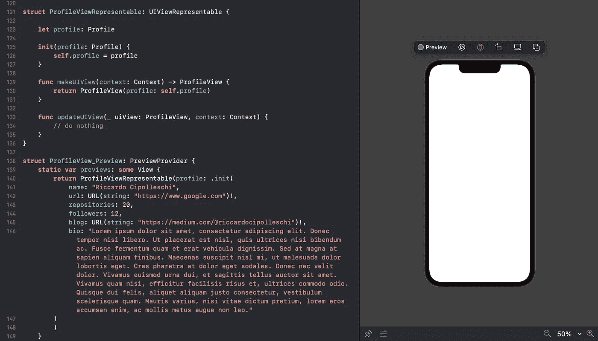
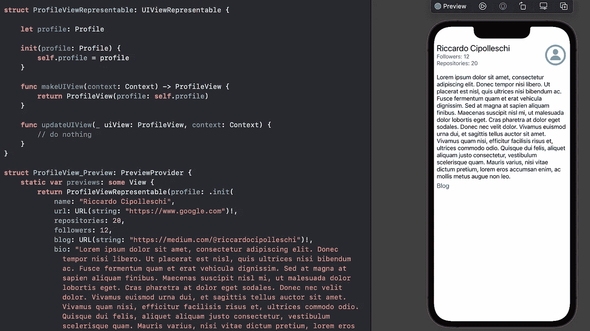

# 使用泛型来减少 SwiftUI Preview 的样板文件

> 原文：<https://betterprogramming.pub/use-generics-to-reduce-swiftui-previews-boilerplate-7924bc763ba5>

## 如何使用泛型和值类型来减少预览和其他协议实现中的样板文件

照片由 [pmv chamara](https://unsplash.com/@pmvch?utm_source=medium&utm_medium=referral) 在 [Unsplash](https://unsplash.com?utm_source=medium&utm_medium=referral) 上拍摄

在使用 UIKit 的 iOS 开发中，最令人讨厌的事情之一是实现一个 UI 和在屏幕上看到它之间的缓慢反馈循环。

当使用 UIKit 开发时，尤其是使用代码优先的 UI 时，我们必须先编写所有的 UI 代码，然后才能看到它的外观。有时，我们不得不修复小故障，运行应用程序的开销比实际修复花费更多的时间。

在 iOS 13 和`SwiftUI`中，苹果推出了 SwiftUI 预览:这项技术让我们在编写应用程序时，可以在 Xcode 中看到应用程序的外观。这大大缩短了开发周期。

苹果还引入了一些协议，我们可以用它们来收获 UIKit 中预览的好处。这些协议是`[UIViewRepresentable](https://developer.apple.com/documentation/swiftui/uiviewrepresentable)`和`[UIViewControllerRepresentable](https://developer.apple.com/documentation/swiftui/uiviewcontrollerrepresentable)`。

在今天的文章中，我将回顾如何实现这些协议，以便在 SwiftUI 预览中呈现 UIKit 视图。然后，我们将开发一个实用程序来删除一些不必要的样板文件。最后，我们将应用相同的机制使我们的 ViewControllers 也可用于预览，讨论这种方法的一般适用性。

# 使 UIKit 视图对 SwiftUI 预览可用

`[UIViewRepresentable](https://developer.apple.com/documentation/swiftui/uiviewrepresentable)`的诞生是为了允许我们将 UIKit 视图与 SwiftUI 架构相结合。最初，两年前，SwiftUI 不提供许多组件，开发人员使用该协议创建他们可以在 SwiftUI 中使用的 UIKit 视图。

协议有一个`UIViewType: UIView`作为关联类型。此协议的关联类型必须是`UIView`的子类。协议要求我们实现两种方法:`[makeUIView(context:)](https://developer.apple.com/documentation/swiftui/uiviewrepresentable/makeuiview(context:))`和`[updateUIView(_:context:)](https://developer.apple.com/documentation/swiftui/uiviewrepresentable/updateuiview(_:context:))`。前者由 SwiftUI 生命周期用来创建视图，后者用于在发生某些事情时更新视图。

对于本文，我们将使用 UIKit 实现一个配置文件屏幕，我们将在 SwiftUI 预览中看到它。为此，我们需要经历以下步骤:

1.  定义视图
2.  使其符合`UIViewRepresentable`协议
3.  定义`SwiftUI_preview`
4.  实现视图。

## 定义视图

让我们先按下`⌘+N`来创建一个新文件，我们称它为`ProfileView`。

定义该视图的代码如下所示:

在代码中，我们创建了一个新的空 UIKit 视图。我已经定义了实现视图所需的方法框架。

我还定义了对我们需要呈现的数据建模的`Profile`结构。

## 使其符合`UIViewRepresentable`

下一步是添加`UIViewRepresentable`协议一致性。

为此，我们需要导入`SwiftUI`并实际实现一致性。代码如下所示:

我们正在定义一个包装 UIKit 视图的结构。该结构需要一些必须呈现的数据，因此我们用一个`Profile`来初始化它。

在`makeUIView(context:)`方法中，我们返回新创建的`ProfileView`。主要目标是在 SwiftUI 预览中呈现视图，我们不需要在那里处理任何更新，所以`updateUIView(_:context:)`方法有一个空体。

## 定义 SwiftUI_Preview

SwiftUI 管道的最后一步是添加预览代码。我们需要定义另一个结构:在这种情况下，它必须符合`[PreviewProvider](https://developer.apple.com/documentation/swiftui/previewprovider)`协议。这个协议需要一个`static var previews: some View`属性来让 Xcode 呈现预览。

预览的代码如下所示:

我们定义了新的结构，并实现了`PreviewProvider`协议。计算出的 var 创建了上一步中定义的`UIViewRepresentable`结构，传递了一个将在预览中呈现的模型。

此步骤还会自动启用 Xcode 预览。如果没有发生，我们可以使用`⌥+⌘+↩︎`快捷键或`Editor > Canvas`菜单来触发画布。IDE 应该是这样的:

## 实现视图

要开始预览，我们可以点击出现在画布右上角的`Resume`按钮。随着预览的激活，我们可以实现我们的视图，我们可以在右边的面板中看到它。

要使视图出现在预览中，我们必须:

1.  将其添加到超级视图中。
2.  设计它。
3.  设置它们的布局约束。

这些步骤编码在第一步中描述的方法中。视图的代码可能如下所示:

我省略了一些重复的代码。按照上述步骤，我们:

1.  定义我们想要添加的视图(第 4 到 9 行)。
2.  添加视图作为`ProfileView`(`setup`方法)的子视图。
3.  样式化视图(方法`style`)。
4.  设置它们的自动布局约束(`setConstraints`方法)。

最后的结局大概是这样的:

# 样板文件的问题

现在想象一下，我们需要实现许多不同的视图。对于每个视图，我们必须使它符合`UIViewRepresentable`协议。过程总是一样的:

1.  定义一个符合它的新结构。
2.  定义一个属性来保存数据。
3.  实现`makeUIView`方法来实例化视图。
4.  将`updateUIView`方法留空。

考虑到所有这些重复，找到一种自动化这一步的方法看起来很自然。我们可以通过利用[协议见证](https://www.youtube.com/watch?v=3BVkbWXcFS4)和[值语义](https://en.wikipedia.org/wiki/Value_semantics)来实现。

## 定义一个通用的 UIViewRepresentable

我们希望为`UIViewRepresentable`协议提供一个通用的实现，这样我们就可以将任何需要的视图传递给预览。

定义此结构的代码如下:

这个结构实现了`UIViewRepresentable`，并且是一个我们称之为`ViewType`的泛型。该类型被约束为`UIView`的子类型。

然而，当我们试图实现`makeUIView(context:)`方法时，我们没有足够的信息来创建一个通用的实现。

## 实现 MakeUIView 方法

当我们没有足够的信息时，我们可以遵循的一个常见方法是推迟操作，直到我们有了足够的信息。用编码术语来说，这意味着将实现委托给结构的使用者。

我们可以通过请求一个由结构体的消费者提供的[工厂关闭](https://refactoring.guru/design-patterns/factory-method)来实现这一点。`GenericUIViewRepresentable`的代码现在看起来像这样。

我们引入了一个实例变量来存储闭包，并在`makeUIView(context:)`方法中调用它。

## 如何使用`GenericUIViewRepresentable`

最后，我们可以在预览中使用这个新对象。我们只需要:

1.  定义一个`SwiftUI_Preview`结构。这与上述实现中的步骤 3 相同，也是 SwiftUI 本身所需要的(Xcode 在 SwiftUI 视图模板中创建该结构)。
2.  在`previews`属性中实例化`GenericUIViewRepresentable`。
3.  实现闭包以返回您的特定视图。

我们可以将这些步骤应用于`ProfileView`。代码如下所示:

在`previews`属性中，我们定义了数据模型并创建了一个`GenericUIViewRepresentable`，传递了一个实例化我们的`ProfileView`的闭包。

同样的`GenericUIViewRepresentable`可以用来预览许多不同的 UIKit 视图。如果我们有一个包含用户名列表的表格视图，我们可以使用以下代码创建一个预览:

并且`UserListView`不一定要符合`UIViewRepresentable`。

# 对 UIViewControllerRepresentable 应用相同的方法

我们对`UIViewRepresentable`所做的可以用任何其他协议来完成。这个过程被称为去协议化，并在协议见证中转换协议，协议见证是一种符合协议的值类型，它防止我们创建各种一致性。

例如，我们可以将此应用于`GenericUIViewControllerRepresentable`。SwiftUI 使用这个协议使`UIViewController`的与 SwiftUI 一起工作。在这种情况下，它与我们对`UIViewRepresentable`所做的非常相似。

代码将如下所示:

过程总是一样的:我们创建一个实现协议的通用结构，并要求消费者提供一个闭包来返回`UIViewController`。

# 结论

在今天的文章中，我们探讨了如何在 UIKit 代码库中利用 SwiftUI 预览。我们探索了基本过程，这需要我们使我们的观点符合`UIViewRepresentable`。

在这一点上，我们意识到，如果我们想让所有视图在 SwiftUI 预览中可见，我们将添加许多样板代码来实现这种一致性。因此，我们将这些代码统一在一个`GenericUIViewRepresentable`结构中，该结构实现了协议并将视图的初始化委托给消费者。

最后，我们探讨了如何将这一过程推广到其他协议。我们创建了一个`GenericUIViewControllerRepresentable`结构，目的与`UIViewRepresentable`协议相同。

我们可以将该过程应用于任何其他协议。在您的代码库中寻找具有许多彼此非常相似的实现的协议:它们是创建这些`Generic`结构以减少样板文件的绝佳候选。