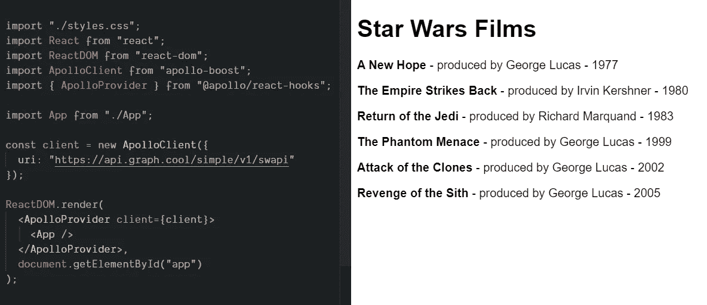
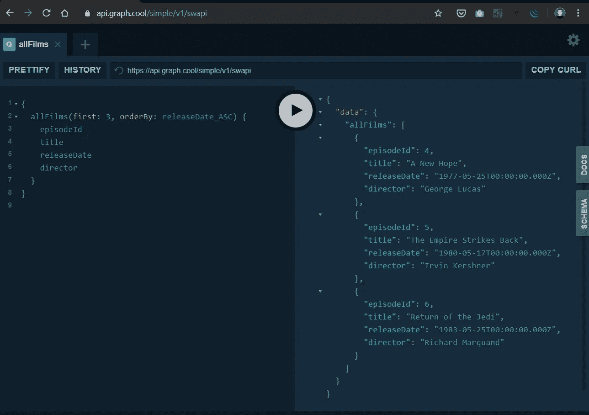
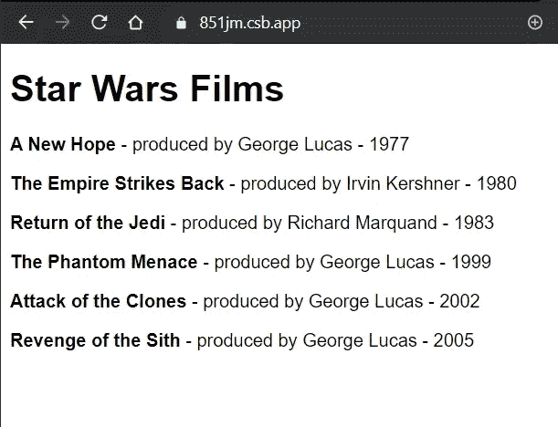

# 使用带有 React 的 GraphQL 查询挂钩

> 原文：<https://betterprogramming.pub/use-graphql-query-hooks-with-react-d440c6dcb57d>

## 钩子减少了 React 应用程序的样板文件，同样的事情也可以用 React 为 Apollo 做


https://unsplash.com/photos/c0VRNWVEjOA

GraphQL 和 Apollo**T5 是与 React 一起使用的很好的工具组合！GraphQL 使得从服务器获取、修改或获得实时数据变得更加容易。它也是完全开源的标准。**

[Apollo](https://github.com/apollographql/react-apollo) 提供了一套简单的工具来实现 React 中与 GraphQL 相关的一切，它也是 GitHub 上托管的开源工具。

最近，Apollo 发布了一个[更新](https://blog.apollographql.com/apollo-client-now-with-react-hooks-676d116eeae2)，引入了 React 挂钩，这大大减少了使用 GraphQL 所需的代码，使得在 React 中使用[查询、订阅和变异](https://blog.apollographql.com/apollo-client-now-with-react-hooks-676d116eeae2?gi=23e6c378834c)简单了十倍。

# 决赛成绩

我们将建立一个简单的网页，按照时间顺序列出所有的星球大战电影:

*   前端将是一个用阿波罗客户端制作的 [React app。](https://github.com/Giorat/graphql_react_hooks/tree/master/)
*   后端将是一个公共的 GraphQL 星球大战 API。

[](https://codesandbox.io/s/graphql-hooks-with-react-16-ixnpd)

您可以在此获得最终应用程序:

*   [GitHub](https://github.com/Giorat/graphql_react_hooks/tree/master/)
*   代码沙盒


# 先决条件

你需要一个可用的 React 应用程序，你可以从以下样板文件中找到一个:

*   [使用反应脚本](https://codesandbox.io/s/l4w3o6my59)进行反应。
*   [使用包裹](https://codesandbox.io/s/03jy316xqp)进行反应。

# 阿波罗依赖


Apollo 需要一些依赖项来提供 GraphQL 所需的所有工具，您需要打开终端并键入:

```
npm install apollo-boost @apollo/react-hooks graphql
```

这些软件包带来的功能有:

*   `apollo-boost`:包含设置 Apollo 客户端所需的一切的包。
*   `@apollo/react-hooks`:基于 React Hooks 的视图层集成。
*   `graphql`:解析你的 GraphQL 查询。

# 阿波罗客户端

为了在我们的项目中启用 Apollo，我们创建了一个 Apollo 客户端，并使用`ApolloProvider`将其注入到我们的组件树中:

*   在本例中，我们使用远程 GraphQL 的 URL 创建客户端:[https://API . graph . cool/simple/v1/swapi](https://api.graph.cool/simple/v1/swapi)。你可以在第十行看到它。
*   然后，我们添加了`ApolloProvider`，它的强大之处在于，客户端将在 app 组件内的每个组件上自动作为单例被传递。

`[src/index.js](https://github.com/Giorat/graphql_react_hooks/blob/master/src/index.js)`:

# 我应该查询什么？

添加客户端后，我们需要考虑我们可能希望从这个 GraphQL 端点[请求哪些数据，我们可以在那里轻松完成。](https://api.graph.cool/simple/v1/swapi)

我们可能想要请求前三部或六部电影，更改参数“first”，然后选择不同的信息，如标题或上映日期。

[](https://api.graph.cool/simple/v1/swapi)

# 获取并显示数据

然后，我们必须进行最后，也是最漂亮的一步:

*   首先，我们声明在上一部分中创建的查询，以在第 6 到 13 行获得前六部电影作为常量变量`STAR_WARS_FILMS` 。
*   我们在第 18 行应用了`useQuery`，在重命名为`dataFilms`的数据变量中取回电影的数据，使其更具可读性。然后我们使用`dataFilms`作为一个简单的 JavaScript 数组。
*   我们在渲染返回中显示这些标题或信息。
*   您还可以使用 error 或 loading 变量来了解来自服务器的数据是正在加载还是返回了错误。

`[src/App.js](https://github.com/Giorat/graphql_react_hooks/blob/master/src/App.js)`

瞧！我们的[应用](https://codesandbox.io/s/graphql-hooks-with-react-16-ixnpd)现在运行得非常好！

[](https://codesandbox.io/s/graphql-hooks-with-react-16-ixnpd)

[https://code sandbox . io/s/graph QL-hooks-with-react-16-ixnpdhttps://851 JM . csb . app/](https://codesandbox.io/s/graphql-hooks-with-react-16-ixnpd)

# 如果你想了解更多关于钩子的知识

当我开始使用钩子时，我曾亲自阅读过 React 钩子，它帮助我理解它们如何使用工具，例如来自 Apollo React 的工具

# 参考资料和资源

*   [https://API . graph . cool/simple/v1/swapi](https://api.graph.cool/simple/v1/swapi)
*   [https://codesandbox.io/s/graphql-hooks-with-react-16-ixnpd](https://codesandbox.io/s/graphql-hooks-with-react-16-ixnpd)
*   [https://github.com/Giorat/graphql_react_hooks/tree/master/](https://github.com/Giorat/graphql_react_hooks/tree/master/)
*   [https://www.graphqlbin.com/v2/6RQ6TM](https://www.graphqlbin.com/v2/6RQ6TM)
*   [https://codesandbox.io/s/graphql-query-in-react-ixnpd](https://codesandbox.io/s/graphql-query-in-react-ixnpd)
*   [https://www.apollographql.com/docs/react/](https://www.apollographql.com/docs/react/)
*   [https://amzn.to/2Y8hoX9](https://amzn.to/2Y8hoX9)