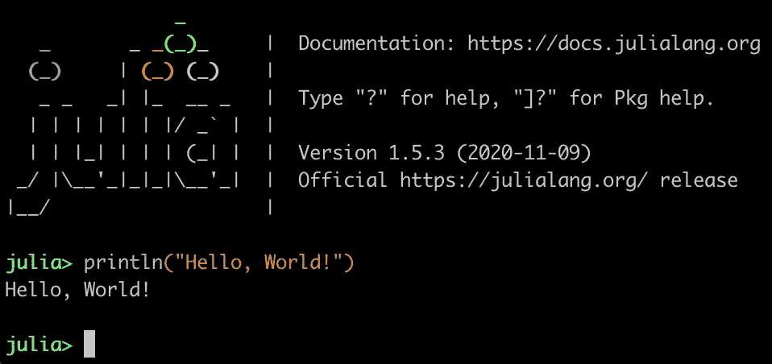
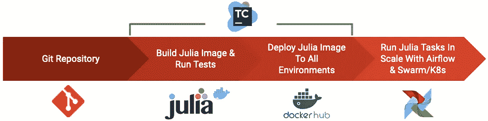

# 将 Julia 用于出色的数据科学项目

> 原文：<https://betterprogramming.pub/use-julia-for-awesome-data-projects-71d39c345aa9>

## 了解 Julia 能提供什么，以及它在 Python 面前表现如何



作者图片

作为维护多功能工具箱和跟上公司技术进步的一部分，我们有时会开始尝试新技术，其中可能也包括编程语言。

[Julia(编程语言)](https://julialang.org/)从 0.6 版本开始，我就一直关注它，但我从未觉得它已经完全成熟。大约三年前，在 2018 年 8 月，当我读到 Julia 1.0 已经推出，并且“准备好生产”这句话向我发出信号，这一时刻终于到来时，我感到非常兴奋。

# **那么，朱莉娅是什么？**

有很多关于 Julia 的信息，但只言片语——Julia 是一种现代、开源、高性能、动态类型的语言，用于数据科学、机器学习、科学计算等领域，于 2012 年在麻省理工学院创建。它是一种利基编程语言，社区相当小(与 Python 等相比)，但它正在快速成长。

> 超过 700 所大学和研究机构以及 Aviva、BlackRock、Capital One 和网飞等公司都在使用它。

如果网飞正在使用它，你是否也应该看看它？

Julia 的创造者心中有一个独特的目标——将 R 和 Python 等定量环境的功能与 Java 和 C++等生产编程语言的速度结合起来，这是一个真正雄心勃勃的努力。

# 为什么要用？

尽管 Julia 在我们的技术堆栈中所占的份额很小，但它的影响却非常重大。它主要用于数据工程项目，其中计算的规模和速度是主要因素。

虽然有许多现成的基准，但我将在 Julia 和 Python 之间进行一个简短的比较来展示这一点:

首先，让我们比较一个简单的*排序*函数，下面的示例代码演示了如何使用这两种语言对一个包含 1 百万到 2 百万整数的数组进行排序(并计时)。

在 Python 中:

```
import timeit

num_runs = 100

SETUP = """
import random as rd

data = rd.sample(range(1, 2000000), 1000000)
"""

STMT = """
sorted(data)
"""

timeit.Timer(STMT, setup=SETUP).timeit(number=num_runs) / num_runs
```

在朱莉娅中，事情是这样简单地完成的:

```
using BenchmarkTools@benchmark sort(data) setup=(data=rand(1:2000000, 1000000))
```

# Python 和 Julia 的性能比较

看到语法上的相似之处了吗？嗯，基本上就到此为止了。

Julia 平均在`67.355ms`完成排序，而 Python 平均需要`754.512ms`(在 2018 款 MacBook Pro 15 上运行)。茱莉亚展示了一场大胜，在这里快了一个数量级。

但也许一个简单的函数并不那么令人印象深刻。让我们来看一个更复杂且极其相关的数据`split-apply-combine`功能的例子(更广为人知的是 map-reduce)。

让我们创建一个有两百万行和两列( *A* 和 *B* )的`DataFrame` ，由一个从 1 到 3 百万的随机整数和两个随机字母的字符串组成。然后按列 *B* 将其拆分，并应用`max(A) / count(rows)`的计算。

在 Python 中:

```
import timeitnum_runs = 10

SETUP = """
import pandas as pd
import random as rd
import string as s

letters = [''.join(rd.sample(s.ascii_uppercase, 2)) for i in range(0,2000000)]

def split_apply_combine(r):
    return pd.DataFrame(dict(A=rd.sample(range(1, 3000000), 2000000), B=r)). \
        groupby(by=['B']). \
        apply(lambda x: max(x['A']) / len(x))
"""

STMT = """
    split_apply_combine(letters)
"""

timeit.Timer(STMT, setup=SETUP).timeit(number=num_runs) / num_runs
```

在朱莉娅:

```
using BenchmarkTools, DataFrames, Randomsplit_apply_combine(r) = 
  DataFrame(A=rand(1:3000000, 2000000), B=r) |> 
  dataframe -> by(dataframe, :B, sdf -> max(sdf.A...)/nrow(sdf))@benchmark split_apply_combine(r) setup=(r=map(x -> randstring("ABCDEFGHIJKLMNOPQRSTUVWXYZ", 2), 1:2000000))
```

让我们比较一下这两种解决方案的性能。

Julia 平均在`702.348ms`完成这个任务，而 Python 平均在`4,180.999ms` (4.18 秒)完成，虽然没有上一个例子中的差别大，但这仍然是一个相当大的进步。

一个毫不费力的添加，比如在 Julia 函数中提供类型，减少了大约 120ms 的运行时间，并使 Julia 接近更好的数量级。

```
split_apply_combine(r::Vector{String})::DataFrame = 
  DataFrame(A=rand(1:3000000, 2000000), B=r) |> 
  dataframe -> by(dataframe, :B, sdf -> max(sdf.A...)/nrow(sdf))
```

Python 确实有办法变得更快，像提供了一个`jit`装饰器的`[Numba](http://numba.pydata.org/)`这样的包可能会使它非常接近 Julia 的性能，但是 Python 的强大带来了一个很大的警告(许多代码约束)。

# 结果

总的来说，当在一些密集的任务中从 Python 到 Julia 重写和替换相同的功能时(有严格的 SLA)，我看到了运行时的巨大改进。我必须承认，我没有在分析代码效率上投入时间，纯粹按现在的样子，我经历了大约三倍的改进，轻微的多处理增加甚至进一步改进了它。

所有这些听起来都很不错，对吧？但是如何让 Julia 投入生产并部署它呢？让我们在[自然智能](https://www.naturalint.com/)中深入了解一下我们的环境。

# 朱莉娅提供了什么？

Julia 完全是功能性的，代码被组织在包中。每个包就像 OOP 语言中的一个类，有自己的方法。

Julia 在其核心支持多分派，因此以后扩展这些方法通常是一种令人愉快的体验。尽管没有必要，我总是添加类型来减少编译器的工作量(和推理时间)并巩固程序。不用说，我认为任何一个程序员都会在这种语言中找到自己真正喜欢的东西。

# 我们如何组织我们的朱莉娅代码？

在我们的代码库中有两种包:

1.  跨多个项目使用的基础设施/公用设施包
2.  利用不同方法并完成特定任务的专用和定制解决方案包

每个包都有自己的依赖管理器(`Pkg`)，使用起来非常简单。您可以在包级别添加、删除、升级、降级和固定依赖版本。最好的部分是，一个项目有两个包，需要相同的依赖项，尽管版本不同，将获得两次编译的依赖项，每个包都有基本版本。

每个包都有自己的测试，因为我们使用 TeamCity 作为 CI/CD 平台，所以我扩展了基本的`@test`和`@test_throws`宏来额外发送所需格式的消息。因此，TeamCity 将显示通过和失败的测试数量。

包也可能有一个*构建*脚本，可以在编译之前做一些事情，比如检索一些外部依赖和工件或者计算并保存一个工件。非常简单。

```
[PackageName]
|
├── Project.toml               << metadata and direct dependencies
├── Manifest.toml              << the whole dependencies tree
├── src                        << all Julia source code inside
|   └── [PackageName.jl]       << main package file (gateway)
├── test                       << package tests inside
|   └── runtests.jl            << main tests file (gateway)
├── deps                       << external dependencies inside
|   └── build.jl               << external dependencies build script 
|                 
└── [Additional Folders/Files] << additional folders, like `docs`
```

# 环境设置—如何开始？

在编写一行代码之前，需要完成几个步骤。

1.  Julia 需要知道项目驻留在哪里——类似于 Python 中的`PYTHONPATH`,但不幸的是不太方便。变量`LOAD_PATH`(或环境变量`JULIA_LOAD_PATH`)必须用每个包的路径填充。
2.  Julia 可以通过一个简单的命令启动多个 worker，例如`julia -p 4`(除了 master 之外还有 4 个 worker，每个 worker 都使用你的机器的一个内核)，但是为了在它们上面运行代码，每个 worker 都必须有可用的`LOAD_PATH`。
3.  `ENV`变量`JULIA_PROJECT`必须声明，让 Julia 知道初始项目路径。

幸运的是，Julia 尊重一个`startup.jl`文件，它在启动时就被执行。我发现它非常有用，并从我的`.zshrc`中准备了以下命令，因此整个过程将是自动的:

```
cd /Users/daniel.giterman
mkdir -p .julia/config \
 && rm -f .julia/config/startup.jl \
 && export JULIA_PROJECT=julia \ 
 && echo "using Revise, OhMyREPL, Distributed" >> .julia/config/startup.jl \
 && echo "@everywhere include(\".julia/julia_env_variables.jl\")" >> .julia/config/startup.jl \
 && for pkg in julia/*/; do echo "@everywhere push!(LOAD_PATH, \"$pkg\")" >> .julia/config/startup.jl; done
```

让我们跑过上面的街区:

1.  创建`startup.jl`所在的路径(以防不存在)。
2.  清理干净(每次都是从头开始)。
3.  导出环境变量`JULIA_PROJECT`(主要用于使用 s 的
4.  *将执行以下操作的代码写入`startup.jl`:*

*   *在主进程上加载一些有用的包，比如`Revise`(让我们不必在修改包的源代码后重新编译)。*
*   *在所有可用的工人上加载项目相关的环境变量文件。*
*   *迭代项目包，并将它们逐个添加到所有可用工人的`LOAD_PATH`中。*

*您现在已经准备好开始在 Julia 中发展了！*

*您应该不会再有丢失环境变量的问题了；任何新的包都将自动添加到`LOAD_PATH`中，使用多处理变得完美无缝。*

# *部署漏斗*

**

*作者图片*

***第一步:**将开发好的 Julia 源代码推送到 Git 仓库。*

***步骤 2:** TeamCity 在 Git 中的 VCS 变更事件上触发 Julia build 配置。此步骤通过以下方式构建 Julia Docker 图像:*

*   *下载并安装[茱莉亚](https://julialang.org/downloads/)。*
*   *准备 Julia 环境(`startup.jl`文件),类似于我之前展示的，但是没有 ENV 变量文件，因为它是后来从外部注入的(气流),也没有像`Revise`这样的开发辅助包(我们这里不需要它们)。*
*   *通过执行下面的 Julia 代码片段准备好所有的包:*

```
*julia -e 'using Pkg; \
          @show LOAD_PATH; \
          pkg_lps = filter(x -> occursin(r"julia/", x), LOAD_PATH); \
          foreach(package -> begin \
                               Pkg.activate(package); \
                               Pkg.resolve(); \
                               Pkg.instantiate(); \
                               Pkg.build(); \
                               Pkg.precompile(); \
                          end, pkg_lps)'*
```

*默认情况下，`LOAD_PATH`通常包含像`@`和`@v#.#`这样的值，如果没有提供项目文件，这些值会让 Julia 知道在哪里寻找项目文件。因此我过滤掉它们，只留下通过`startup.jl`添加的包。*

*对于列表中的每个包，请执行以下操作:*

1.  ***激活** —切换到打包环境。*
2.  ***Resolve** —对齐所有依赖版本(当在一个包中更新另一个包所依赖的依赖时，必须在该包的`Manifest.jl`中更新)。*
3.  ***实例化**——获取所有依赖项的源代码。*
4.  ***构建** —如果存在，执行`build.jl`脚本。*
5.  ***预编译** — Julia 的 JIT 编译器将编译的结果部分缓存到一个文件中(`~/.julia/compiled`目录中的`.ji`文件)，以减轻使用包时的负担。*

*   *从 Docker 容器内部对每个包运行测试。*

*这个过程的结尾是一个大约 1GB 的基于 Debian 的映像，它包括 Julia 环境，有 100 多个依赖包和几个我们的项目。考虑到里面的东西，这是我们堆栈中迄今为止最小的图像。*

***第三步:**只有在所有相关测试都成功之后，Julia Docker 映像才会被推送到 DockerHub，然后部署到我们在所有环境中的所有相关服务器(例如群管理器)上。*

***第四步:** Julia 任务由 Airflow 调度，在 Docker Swarm/K8s 集群上规模化运行。*

# *摘要*

*Julia 确实是一种圆滑的编程语言。个人感觉很“轻巧”；它不会让你被概念和工具淹没，但它提供了无限的开发可能性，以及备受赞赏的极简主义(和速度！).*

*它的设置相当简单，没有外部依赖性，并且有一个简单的部署选项(如上所述)。*

*不幸的是，没有多少程序员熟悉这种语言，坦率地说，更少的人有兴趣或时间去钻研它。虽然通常与 Python 相比，Julia 仍然缺乏全面的包库，其社区也小得多。只是派对来的太晚了。因此，有些人可能会认为不值得投资，因为改编和重写大量遗留代码会消耗太多的资源和时间。这可能完全是一个交易破坏者。*

*朱莉娅在某些地方可以被认为是外国人。然而，考虑到它已经提供的一切，我认为它最终受欢迎的增长只是一个时间问题。*

*我很幸运能成为一个拥有多语言环境的团队的一员。我们的编程工具箱相当丰富，对于每项任务，我们都尝试匹配合适的工具。因此，在某些情况下，朱莉娅提供了一个优雅而准确的解决方案。*