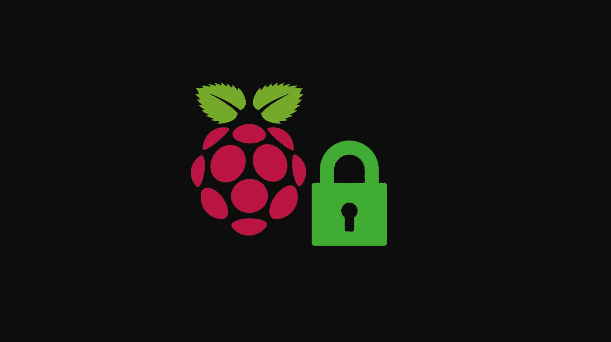
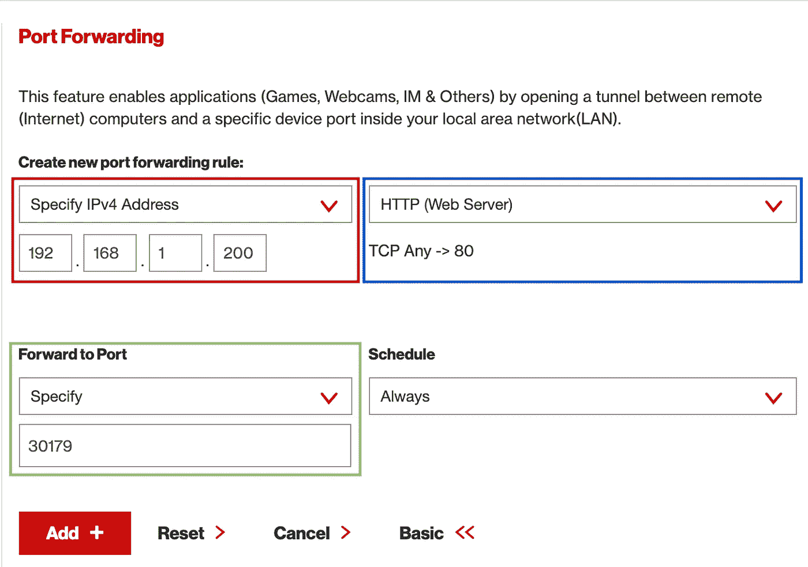
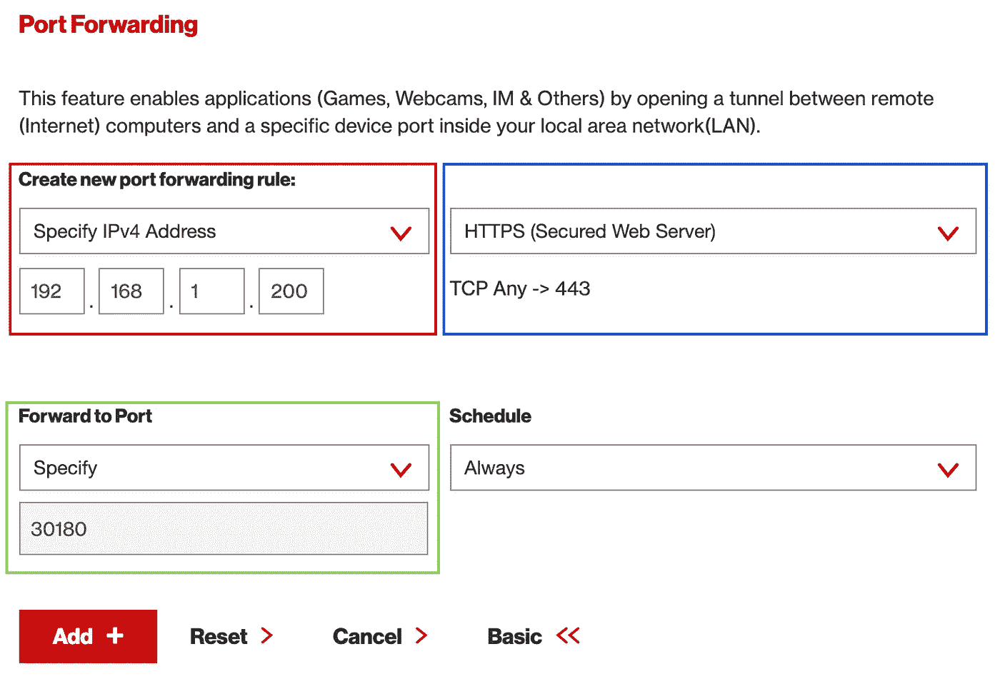
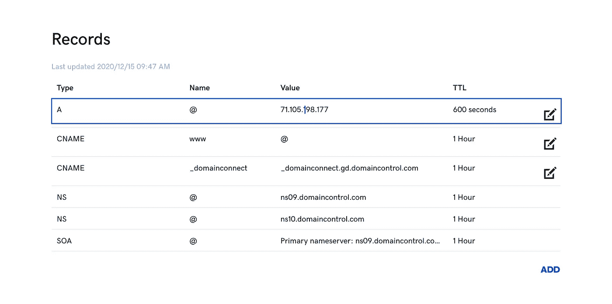

# 使用 Let's Encrypt 在 Raspberry Pi 上为您的 Kubernetes 集群自动化 HTTPS

> 原文：<https://betterprogramming.pub/use-lets-encrypt-to-automate-https-for-your-kubernetes-cluster-on-raspberry-pi-802351f34f23>

## 自动生成证书是升级集群的最佳方式之一



作者照片。

*自动证书生成*听起来太公司化了，因此对于在运行于 Raspberry Pis 上的 Kubernetes 集群上托管内容的周末战士来说遥不可及。幸运的是，由于[让我们加密](https://letsencrypt.org)，自动证书生成是非常容易实现的。最棒的是，任何拥有域名的人都可以使用 Let's Encrypt 免费获得证书。

本指南将使用“让我们加密”自动为入口资源提供证书，以便您的应用程序可以通过 HTTPS 从互联网访问。

# 先决条件

1.  [一簇树莓派](https://medium.com/coming-about/ultimate-guide-to-building-a-raspberry-pi-cluster-a71d04937a83)。
2.  [K3s](https://medium.com/coming-about/10-minutes-to-k3s-on-raspberry-pis-efe3daf2a33d) 运行在树莓 Pi 集群上。
3.  Traefik 作为 [Kubernetes Ingress](https://levelup.gitconnected.com/a-guide-to-k3s-ingress-using-traefik-with-nodeport-6eb29add0b4b) 的提供商。
4.  一个域名。你可以在 godaddy.com 创建一个域名。

# 让我们看看加密是如何工作的

让我们加密一个`Certificate Authority` (CA)，它实现了 [ACME 协议](https://tools.ietf.org/html/rfc8555)，这样就可以在没有任何人工干预的情况下配置 HTTPS 服务器。我们将为域`[https://cloud-tack.com](https://cloud-tack.com.)`配置一个 HTTPS 服务器，但是您应该在每一步用您的域替换这个域。更具体地说，本指南中的 HTTPS 服务器是 Traefik 入口控制器，它作为一个容器在 Raspberry Pis 上的 K3s 中运行。

证书颁发有两个步骤。第一步是，打算申请证书的代理必须向 CA 证明它拥有将为其颁发证书的域。这个过程称为*域验证。只有代理证明了这一点，它才能请求、更新和撤销证书。在本指南的上下文中，代理是部署在`cert-manager`名称空间中的`cert-manager`应用程序(在接下来的小节中会有更多相关内容)。*

代理通过询问 CA 如何证明将为其颁发证书的域的所有权来启动该过程(例如`cloud-tack.com`)。CA 用一组挑战来响应，并且代理必须完成其中一个挑战以证明所有权。在本指南中，代理将完成 HTTP01 挑战:

*   在`[http://cloud-tack.com/](http://cloud-tack.com/)`(例如`[http://cloud-tack.com/8303](http://cloud-tack.com/8303)`)上的知名 URI 下提供 HTTP 资源。

代理将在指定的 URI 放置一个 HTTP 文件，并且 CA 将通过在指定的 URI 下载该文件来验证该文件是可访问的、具有正确的内容和正确的签名(例如`[http://cloud-tack.com/8303](http://cloud-tack.com/8303)`)。如果我们不拥有该域，那么我们就不能将文件放在正确的位置，也不能使用正确的内容和签名，所以这是所有权的证明。`cert-manager`负责创建这个文件和一个临时入口，以便`[http://cloud-tack.com/8303](http://cloud-tack.com/8303)`将流量路由到该文件供 CA 下载。只有在证明所有权之后，代理才能提交证书颁发请求、续订和撤销。

由 Let's Encrypt 颁发的证书存储为 Kubernetes 秘密。当这个秘密被应用到域`cloud-tack.com`的入口资源时，你将能够通过 HTTPS 从互联网访问`cloud-tack.com`。

# 配置网络

您的本地路由器必须将默认的 HTTP (80)和 HTTPS (443)端口分别转发到 Traefik 节点的 HTTP 和 HTTPS 端口。

## 创建 Traefik 节点端口

HTTP 流量可在端口`30179`上访问，HTTPS 流量可在端口`30180`上访问，如以下清单中所配置:

```
kubectl create -f traefik-svc-http-https.yaml
```

## 路由器上的端口转发 HTTP 和 HTTPS 默认端口

以下截图来自威瑞森 Fios 路由器。每个路由器的接口略有不同，但所有路由器都应该允许您配置端口转发。

在 [192.168.1.1](http://192.168.1.1) 登录路由器后，导航到端口转发页面(查阅您的路由器手册)。在图 1 中，红框是我指定 Kubernetes 主节点的 IP 地址的地方。蓝框是我选择默认 HTTP 端口(80)的地方。最后，绿框指示默认 HTTP 的流量应该路由到哪个端口。该值对应于来自`traefik-svc-http-https.yaml`的`traefik-http`节点端口。要指定默认 HTTP 和 HTTPS 的目标端口，你可能必须打开*高级选项*，就像我对威瑞森 Fios 所做的那样。点击*添加*添加 HTTP 配置。



图一。默认 HTTP 端口转发

遵循与 HTTP 相同的过程，但是调整默认 HTTPS 端口的值，如图 2 所示。



图二。默认 HTTPS 端口转发

转发 HTTP 端口允许`cert-manager`和咱们加密来完成*域验证*挑战和发布。您的 HTTPS 域的流量将通过 HTTPS 转发端口。

# 配置 DNS

您打算为其创建证书的域必须指向您路由器的公共 IP。比如`cloud-tack.com -> 71.105.198.177`。我们将创建一个 DNS A 记录，将我们的域指向此 IP。A 记录是一个简单的 DNS 资源，用作别名。所有对`cloud-tack.com`的请求都将解析到幕后的 IP 地址`71.105.198.177`。

去[whatsmyip.org](https://www.whatsmyip.org/)确定你路由器的公共 IP。有了这个 IP，我们将创造一个 A 记录。我用 GoDaddy 创建了域`cloud-tack.com`,所以如果你用不同的提供者创建了你的域，那么创建 A 记录的接口将与你的不同。图 3 中的蓝框显示 type `A`记录指向我的路由器的公共 IP `71.105.198.177`。请确保这是唯一列出的 A 记录，并且您的域没有任何自定义转发。



图 3。cloud-tack.com 的记录

通过对您的域运行`dig`来验证 DNS 配置是否正确。响应必须是您路由器的公共 IP 地址:

```
$ dig +short cloud-tack.com
71.105.198.177
```

现在创建了 A 记录，您的域中的 HTTP 流量将被路由到路由器的端口 80。同样，HTTPS 流量将被路由到您路由器上的 443。然后，您的路由器会将这些端口上的流量分别转发到端口 30179 和 30180 上的 Traefik 入口控制器。

# 部署证书管理器

Let's Encrypt 需要一个代理，该代理运行的软件能够完成*域验证*挑战以及证书的颁发、更新和撤销。稍微调整一下在 Raspberry Pis 上运行，我们将按照 Kubernetes [指南](https://cert-manager.io/docs/installation/kubernetes/)部署`cert-manager`代理。

## 准备清单

下载 Jetstack 为 cert-manager 提供的清单，并将每个`cert-manager`映像替换为 ARM 兼容的映像。请注意，您下载的清单取决于您运行的 Kubernetes 版本。

```
*# Kubernetes 1.16+*
$ curl -sL [https://github.com/jetstack/cert-manager/releases/download/v1.1.0/cert-manager.yaml](https://github.com/jetstack/cert-manager/releases/download/v1.1.0/cert-manager.yaml) | \
sed -r 's/(image:.*quay.io\/jetstack\/cert-manager-.*):(.*)$/\1-arm:\2/g' > cert-manager.yaml*# Kubernetes <1.16* $ curl -sL [https://github.com/jetstack/cert-manager/releases/download/v1.1.0/cert-manager-legacy.yaml](https://github.com/jetstack/cert-manager/releases/download/v1.1.0/cert-manager.yaml) | \
sed -r 's/(image:.*quay.io\/jetstack\/cert-manager-.*):(.*)$/\1-arm:\2/g' > cert-manager.yaml
```

## 应用证书管理器

创建名称空间`cert-manager`:

```
$ kubectl create namespace cert-manager
```

将`cert-manager`应用于集群:

```
$ kubectl apply -f cert-manager.yaml
```

验证`cert-manager`的安装:

```
$ kubectl get pods --namespace cert-manager
NAME                              READY   STATUS    RESTARTS   AGE
cert-manager-84f968b6f9-jm9rd     1/1     Running   0          52s
cert-manager-cainjector-64cdd465  1/1     Running   0          52s
cert-manager-webhook-57b8c5f965   1/1     Running   0          52s
```

# 创建 ACME ClusterIssuer

ACME 发行者代表向自动证书管理环境证书授权服务器注册的帐户。该帐户由公钥和私钥对唯一标识，并且需要颁发证书。如上所述，代理必须解决*域验证*的挑战。下面是一个示例 ClusterIssuer 清单，它将解决 HTTP01 挑战。将 ClusterIssuer 应用到您的群集。请务必更改第 7 行的电子邮件:

```
$ kubectl apply -f staging-issuer.yaml
```

验证 ClusterIssuer 是否配置正确:

```
$ kubectl get clusterissuers
NAME           READY   AGE
acme-staging   True    10s
```

## 创建测试证书

我们应用的 ClusterIssuer 将针对一个非生产环境。这种环境具有更高的限制，因此您可以在调试时颁发许多证书，而不会被阻塞。一旦我们确认可以在非生产环境中创建证书，我们将把目标放在生产环境中，让我们加密。

将证书应用到您的群集:

```
$ kubectl apply -f test-acme-certificate.yaml
```

验证证书设置是否正确:

```
$ kubectl get certificate
NAME             READY   SECRET               AGE
cloud-tack-com   True    cloud-tack-com-tls   13s
```

如果状态仍然是`False`，那么您将不得不进行一些调试。例如，验证您的域是否可以成功地将 HTTP 请求的 internet 流量路由到群集中运行的应用程序。最快的方法是将流量路由到 Traefik 的未知路径(例如[http://your-domain.com/test-http-traffic](http://cloud-tack.com/nginx-app.))。如果端口转发配置正确，响应应该是`404 page not found`。如果您收到此响应，但仍然无法提供测试证书，则需要进一步调试。

## 删除暂存资源

我们只需要准备资源来验证我们的设置。我们现在可以删除资源了。

删除证书:

```
$ kubectl delete certificate cloud-tack-com
certificate.cert-manager.io "cloud-tack-com" deleted
```

删除秘密:

```
$ kubectl delete secret cloud-tack-com-tls
secret "cloud-tack-com-tls" deleted
```

删除 ClusterIssuer:

```
$ kubectl delete -f staging-issuer.yaml
```

## 应用生产集群发行者

现在我们知道 Let's Encrypt 可以发布证书，我们的`cert-manager`可以通过挑战，我们可以继续使用 Let's Encrypt 的生产环境。请务必更改第 7 行的电子邮件:

```
$ kubectl apply -f prod-issuer.yaml
```

验证颁发者已被设置:

```
$ kubectl get clusterissuers
NAME        READY   AGE
acme-prod   True    20s
```

太好了！您的群集已准备好自动为入口资源提供证书。

# 为 HTTPS 配置入口资源

下面的清单为在我的集群中运行的`fma-ui`应用程序创建了一个入口。您需要部署自己的应用程序，并为其配置此入口。

入口资源为加密提供了可选的配置部分。以下清单是为域`cloud-tack.com`配置证书的入口资源的示例。如果应用了这个入口，并且证书秘密不存在，那么将在第 19 行上为该域自动创建一个证书，并且将在第 20 行上用名称创建一个秘密。根据您的需要调整清单第 4 行、第 12-16 行和第 19-20 行的值。一定不要换其他线！

```
$ kubectl apply -f ingress-https.yaml
```

验证证书已创建:

```
$ kubectl get certificates
NAME                 READY   SECRET               AGE
cloud-tack-com-tls   True    cloud-tack-com-tls   20s
```

就是这样！现在你可以在浏览器中使用 https://cloud-tack.com/fma-ui 的 HTTPS 网址了。该证书的有效期为 90 天，到期后`cert-manager`会自动更新。

# 结束语

为您的 Raspberry Pi 集群配置 HTTPS 是一个巨大的改进。有了 HTTPS，您可以以安全和专业的方式将您的网站暴露在互联网上。

我们通过部署一个可以与 Let's Encrypt 和 Traefik 接口的`cert-manager`和 ClusterIssuer，实现了 Kubernetes 入口资源的 HTTPS 自动化。这些证书是零成本的，到期后会在`cert-manager`前自动更新。