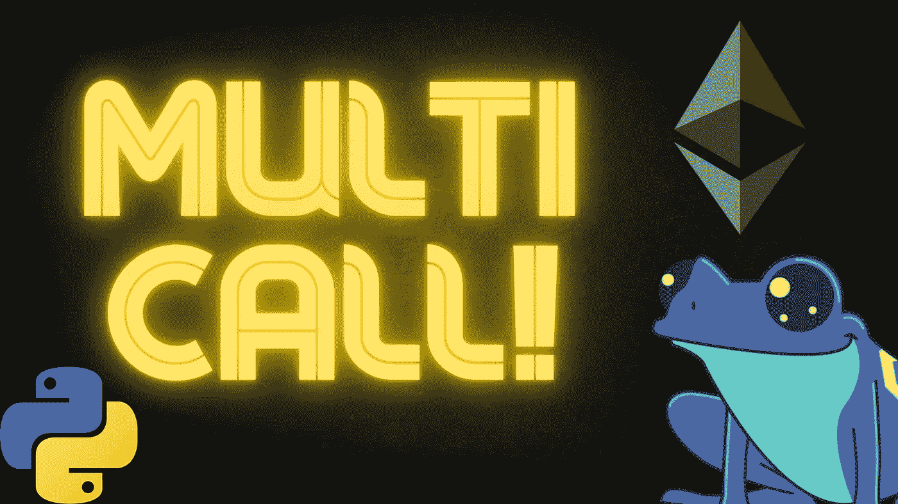
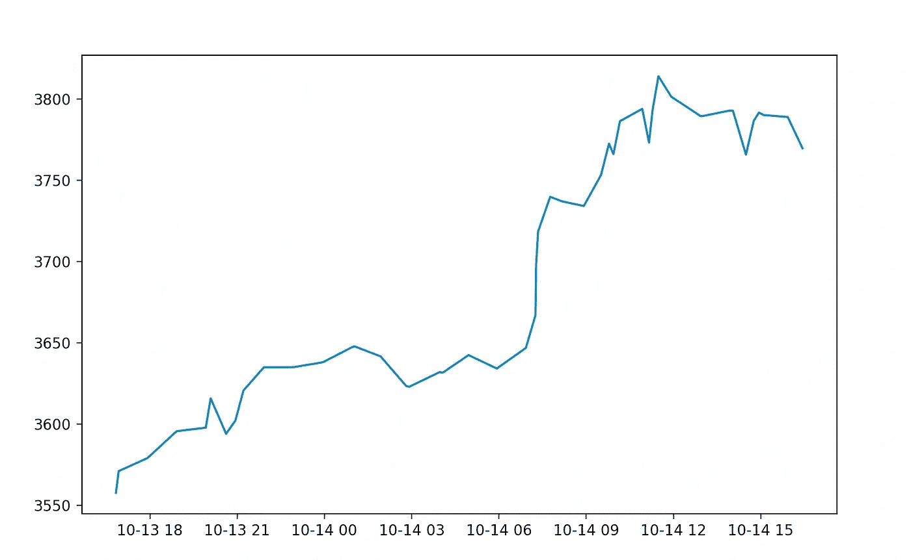

# 使用 Multicall 将大量 API 请求保存到您的区块链节点

> 原文：<https://betterprogramming.pub/use-multicall-to-save-tons-of-api-requests-to-your-blockchain-node-f759d09a8ef5>

## 对 Alchemy、Infura 和其他节点进行更快、有效和免费的 API 调用



作者图片

要使用区块链做任何事情，你必须向区块链节点或服务发送请求，如 [Alchemy](https://www.alchemy.com/) 和 [Infura](https://infura.io/) 。

如果你在运行你自己的节点，你可以想做多少就做多少。但是，如果你使用第三方节点，你很快就会受到速率限制，或者你必须提高你的订阅。

例如，如果我想获得 50 个不同视图函数调用的值，我必须进行 50 次 API 调用，这不是很有效率，也不符合财务要求。这 50 个 API 调用可能就像一个卷曲:

```
curl --request POST --url https://mainnet.infura.io/v3/PROJECT_ID --header 'Content-Type: application/json' --data '[{"jsonrpc": "2.0", "id": 1, "method": "eth_blockNumber", "params": []},]
```

或者，通过像 Javascript 或 Python 这样的编程语言

```
price = price_feed_contract.get_latest_price()
```

那么，让我们来学习一下如何在一次通话中用 multicall 实现更多的功能。

# 批量请求与多呼叫

现在，在我们进入多呼叫之前，我们需要讨论一下批处理请求。对区块链节点的批处理请求是在我们向区块链节点发送数据输入列表的时候。

在幕后，这将看起来像这样:

```
curl --request POST --url https://mainnet.infura.io/v3/PROJECT_ID --header 'Content-Type: application/json' --data '[
{"jsonrpc": "2.0", "id": 1, "method": "eth_blockNumber", "params": []},
{"jsonrpc": "2.0", "id": 2, "method": "eth_blockNumber", "params": []},
{"jsonrpc": "2.0", "id": 3, "method": "eth_blockNumber", "params": []},
{"jsonrpc": "2.0", "id": 4, "method": "eth_blockNumber", "params": []},]'
```

其中每个`eth_blockNumber`调用是在同一请求中进行的。这显然是一个伪示例，因为呼叫的块号是相同的。当我们使用像`web3.py`、`web3.js`和`ethers.js`这样的包时，这可能在幕后发生。

现在批处理请求有一些问题。很多节点都没有很好地处理它们，有些服务甚至不支持它们。如果您发出太多的批处理请求，您可能会无限期地挂起，没有返回数据，或者阻塞您的 Linux 虚拟机。

这就是多呼叫发挥作用的地方。

我们调用链上契约的一个函数，这个函数接受无限的参数，我们定义我们希望契约调用的函数，而不是像这种大批量的请求。这意味着我们回到打一个电话。

```
curl --request POST --url https://mainnet.infura.io/v3/PROJECT_ID --header 'Content-Type: application/json' --data '[{"jsonrpc": "2.0", "id": 1, "method": "eth_blockNumber", "params": []},]
```

不同之处在于，链上函数的返回才是我们真正要寻找的。

# 多呼叫

使用 multicall 的最流行的合同之一是 Uniswap multicall 合同。

这个契约有像`tryAggregate`这样的函数，它允许我们传入一系列编码函数和函数输入来调用区块链上的任何其他函数。

```
function tryAggregate(bool requireSuccess, Call[] memory calls) public returns (Result[] memory returnData) {
        returnData = new Result[](calls.length);
        for(uint256 i = 0; i < calls.length; i++) {
            (bool success, bytes memory ret) = calls[i].target.call(calls[i].callData);if (requireSuccess) {
                require(success, "Multicall2 aggregate: call failed");
            }returnData[i] = Result(success, ret);
        }
    }
```

它接受一个数组`Call`作为输入，该数组有一个编码地址、函数选择器和输入参数。然后`tryAggregate`简单地遍历这个列表，调用每个契约。

嘣！我们现在基本上将一系列函数调用打包成一个函数调用，减少了 API 调用，为我们节省了一大笔钱！

# Brownie 和 JavaScript 中的多调用

`Brownie`(一个流行的 Pythonic 智能契约开发框架)内置了我们可以使用的多调用功能。JavaScript 也有一些不错的包。我们有一个[布朗尼示例](https://github.com/PatrickAlphaC/multicall)和 [JavaScript 示例](https://github.com/PatrickAlphaC/multicall-js)供您自己探索和尝试！

例如，如果我们想要获得一个 [Chainlink 数据馈送](https://docs.chain.link/docs/historical-price-data/)的最后 50 个回合，在没有 multicall 的情况下，我们可能必须这样做:

```
rounds = []
for round_id in range(latest_round, latest_round - 50, -1):
  round_data = price_feed.getRoundData(round_id)
  rounds.append(round_data)
```

每次我们调用`price_feed.getRoundData`都是一个 API 调用。

为了用`brownie`做到这一点，我们只需要添加 2 行代码！

```
brownie.multicall(address="0x5BA1e12693Dc8F9c48aAD8770482f4739bEeD696")
with brownie.multicall:
  for round_id in range(latest_round, latest_round - 50, -1):
    round_data = price_feed.getRoundData(round_id)
    rounds.append(round_data)
```

我们只需要选择 multicall 契约地址(在本例中，我们使用 Uniswap V3 版本)，然后在我们的`with brownie.multicall`中添加我们想要进行的所有 API 调用。

然后嘣！我们现在可以做一些很棒的事情，比如用一个对区块链的 API 调用来绘制最后 50 轮的链接数据。



使用 [matplotlib](https://matplotlib.org/) 绘制 ETH / USD 图

就是这样！现在你在智能合同世界里更聪明了一步，希望这能为你省下一些钱，并为你打开许多扇门！

创建多呼叫请求的完整源代码可以在这个 [GitHub 资源库](https://github.com/PatrickAlphaC/multicall)中找到。

你也可以观看这个概念的视频:

多呼叫

感谢阅读。