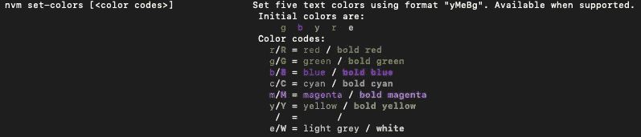
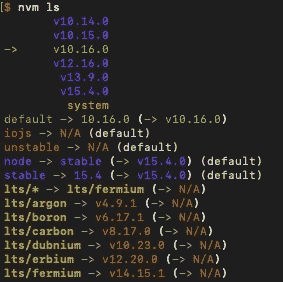
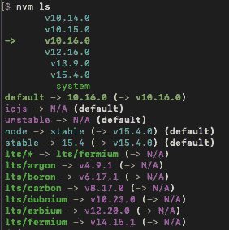

# 使用 NVM 管理 Node.js 和 NPM 版本

> 原文：<https://betterprogramming.pub/use-nvm-to-manage-node-js-and-npm-versions-2bd0d0875f9f>

## NVM 实用指南


[莫卡龙](https://unsplash.com/@mockaroon?utm_source=medium&utm_medium=referral)在 [Unsplash](https://unsplash.com?utm_source=medium&utm_medium=referral) 上拍照

> 本文为 nvm `0.37.2`、 [node.js 15](https://medium.com/better-programming/whats-new-in-node-js-15-fc24e87e2590) 、 [npm 7](https://medium.com/better-programming/the-step-by-step-guide-to-understanding-and-adopting-npm-7-914504f7090f) 发布。本文中的所有概念仍然有效。但是，您可以查看以下文章中的更新示例:
> 
> [如何使用 NVM 管理 Node.js 17 和 NPM 8](/how-to-use-nvm-to-manage-node-js-17-and-npm-8-2da8bf3ca5e9)
> 
> [如何使用 NVM 管理 Node.js 19 和 NPM 9](/how-to-use-nvm-to-manage-node-js-19-and-npm-9-bc5656d52d5f)

[Node.js 15](https://nodejs.org/en/blog/release/v15.0.0/) 发布于 2020 年 10 月 20 日。它带有 npm 7 和许多新功能。你准备好尝试了吗？

但是等一下:node.js 15 和 npm 7 带来了突破性的变化。升级会打乱你现有的项目吗？

是的，有可能。

幸运的是，我们有 [NVM(节点版本管理器)](https://github.com/nvm-sh/nvm)，可以帮助我们减轻风险。让我们来演练一下`nvm`，有足够的信心升级 node.js 和 npm 版本。

# 安装 NVM

`nvm`管理 node.js 和 npm 版本。它被设计为按用户安装，按 shell 调用。`nvm`可以在任何 POSIX 兼容的 shell (sh、dash、ksh、zsh、bash)上工作，特别是在这些平台上:unix、macOS 和 windows WSL。

`nvm`可以通过 curl 或 wget 命令安装:

```
$ curl -o- [https://raw.githubusercontent.com/nvm-sh/nvm/v0.37.2/install.sh](https://raw.githubusercontent.com/nvm-sh/nvm/v0.37.2/install.sh) | bash$ wget -qO- [https://raw.githubusercontent.com/nvm-sh/nvm/v0.37.2/install.sh](https://raw.githubusercontent.com/nvm-sh/nvm/v0.37.2/install.sh) | bash
```

脚本`install.sh`将 nvm 存储库克隆到`~/.nvm`，并尝试将下面代码片段中的源代码行添加到正确的概要文件(`~/.bash_profile`、`~/.zshrc`、`~/.profile`或`~/.bashrc`)。

```
export NVM_DIR="$([ -z "${XDG_CONFIG_HOME-}" ] && printf %s "${HOME}/.nvm" || printf %s "${XDG_CONFIG_HOME}/nvm")"
[ -s "$NVM_DIR/nvm.sh" ] && \. "$NVM_DIR/nvm.sh" # This loads nvm
```

在概要文件中，例如`~/.bash_profile`，我们看到添加了以下几行:

```
export NVM_DIR="/Users/fuje/.nvm"
[ -s "$NVM_DIR/nvm.sh" ] && . "$NVM_DIR/nvm.sh"  # This loads nvm
[ -s "$NVM_DIR/bash_completion" ] && \. "$NVM_DIR/bash_completion"  # This loads nvm bash_completion
```

# 使用 NVM

安装 nvm 后，我们可以使用下面的命令来安装 node.js 的最新版本:

```
$ nvm install node
Downloading and installing node v15.4.0...
Downloading [https://nodejs.org/dist/v15.4.0/node-v15.4.0-darwin-x64.tar.xz](https://nodejs.org/dist/v15.4.0/node-v15.4.0-darwin-x64.tar.xz)...
######################################################################## 100.0%
Computing checksum with shasum -a 256
Checksums matched!
Now using node v15.4.0 (npm v7.0.15)
```

上面的输出表明 npm `7.0.15`与 node.js `15.4.0`一起使用。这一点可以得到证实:

```
$node -v
v15.4.0
$ npm -v
7.0.15
```

我们还可以指定要安装的确切版本。语义版本格式由 [SemVer](https://semver.org/) 定义:

```
$ nvm install 10.14.0
Downloading and installing node v10.14.0...
Downloading [https://nodejs.org/dist/v10.14.0/node-v10.14.0-darwin-x64.tar.xz](https://nodejs.org/dist/v10.14.0/node-v10.14.0-darwin-x64.tar.xz)...
######################################################################## 100.0%
Computing checksum with shasum -a 256
Checksums matched!
Now using node v10.14.0 (npm v6.4.1)
```

如果已经安装了特定版本，则不会重新安装:

```
$ nvm install 10.14.0
v10.14.0 is already installed.
Now using node v10.14.0 (npm v6.4.1)
```

我们可以列出所有已安装的版本:

```
$ nvm ls
->     v10.14.0
       v10.15.0
       v10.16.0
       v12.16.0
        v13.9.0
        v15.4.0
         system
default -> 12.16.0 (-> v12.16.0)
node -> stable (-> v15.4.0) (default)
stable -> 15.4 (-> v15.4.0) (default)
iojs -> N/A (default)
unstable -> N/A (default)
lts/* -> lts/fermium (-> N/A)
lts/argon -> v4.9.1 (-> N/A)
lts/boron -> v6.17.1 (-> N/A)
lts/carbon -> v8.17.0 (-> N/A)
lts/dubnium -> v10.23.0 (-> N/A)
lts/erbium -> v12.20.0 (-> N/A)
lts/fermium -> v14.15.1 (-> N/A)
```

上面输出中的箭头显示 node.js 的当前版本是`10.14.0`。它还显示了`default` ( `12.16.0`)、`node` ( `15.4.0`)和`stable` ( `15.4.0`)的值。

`nvm use`修改当前版本:

```
$ nvm use 12.16.0
Now using node v12.16.0 (npm v6.14.8)
$ nvm use 10.16.0
Now using node v10.16.0 (npm v6.14.5)
$ nvm use 13.9.0
Now using node v13.9.0 (npm v6.13.7)
$ nvm use default
Now using node v12.16.0 (npm v6.14.8)
$ nvm use node
Now using node v15.4.0 (npm v7.0.15)
$ nvm use stable
Now using node v15.4.0 (npm v7.0.15)
```

你可能想知道`v10.16.0`如何使用比`v13.9.0`更高版本的 npm。这可以通过以下命令实现:

```
$ nvm use 10.16.0
$ npm install -g npm@6.14.5
```

以下命令将获取当前节点版本上支持的最新 npm 版本:

```
$ nvm install-latest-npm
```

`nvm use`为当前外壳设置特定版本。如果启动新的 shell，新设置的 node.js 版本将会丢失。

如何才能让一个特定的节点版本持久化？

默认版本适用于所有 shells。`nvm alias`可以设置默认版本。

```
$ nvm alias default 10.16.0
```

为了方便，可以创建一个`.nvmrc`文件，它采用 SemVer 格式，或者`node`，或者`default`。之后，`nvm use`、`nvm install`、`nvm exec`、`nvm run`和`nvm which`将使用`.nvmrc`文件中指定的版本，如果命令行上没有提供版本。

```
$ cat .nvmrc
15.4.0
$ nvm use
Found '/Users/fuje/.nvmrc' with version <15.4.0>
Now using node v15.4.0 (npm v7.0.15)
```

我们可以使用以下命令检查当前版本:

```
$nvm current
v15.4.0
```

列出了所有可用的版本，但是要准备好一个很长的列表。

```
$ nvm ls-remote
```

更具体地说，提供部分版本可以缩小可用列表的范围。

```
$ nvm ls-remote 15
        v15.0.0
        v15.0.1
        v15.1.0
        v15.2.0
        v15.2.1
        v15.3.0
->      v15.4.0
```

`nvm which`显示可执行文件的安装路径。我们已经安装了`10.14.0`、`10.15.0`、`10.16.0`的 node.js。下面是`nvm which` 的结果:

```
$ nvm which 10.14.0
/Users/fuje/.nvm/versions/node/v10.14.0/bin/node
$ nvm which 10.15.0
/Users/fuje/.nvm/versions/node/v10.15.0/bin/node
$ nvm which 10.16.0
/Users/fuje/.nvm/versions/node/v10.16.0/bin/node
$ nvm which 10.15
/Users/fuje/.nvm/versions/node/v10.15.0/bin/node
$ nvm which 10.12
N/A: version "v10.12" is not yet installed.
You need to run "nvm install 10.12" to install it before using it.
$ nvm which 10
/Users/fuje/.nvm/versions/node/v10.16.0/bin/node
```

特定的节点版本可以直接用于运行应用程序:

```
$ nvm run 10.15.0 app.js
```

或者，下面的命令运行`node app.js`，路径指向节点`10.15.0`。

```
$ nvm exec 10.15.0 node app.js
```

如果您想找到更多 nvm 命令，请运行帮助命令:

```
$ nvm --help
```

# 升级 NVM

我们可以用`nvm`来升级 node.js 和 npm。如何才能升级`nvm`本身？

让我们试试。

在升级之前，我们有`nvm` `0.34.0`。

```
$ nvm --version
0.34.0
```

我们将其升级到版本 0.37.2。

```
$ curl -o- [https://raw.githubusercontent.com/nvm-sh/nvm/v0.37.2/install.sh](https://raw.githubusercontent.com/nvm-sh/nvm/v0.37.2/install.sh) | bash
  % Total    % Received % Xferd  Average Speed   Time    Time     Time  Current
                                 Dload  Upload   Total   Spent    Left  Speed
100 13527  100 13527    0     0  23046      0 --:--:-- --:--:-- --:--:-- 23083
=> nvm is already installed in /Users/fuje/.nvm, trying to update using git
=> => Compressing and cleaning up git repository=> nvm source string already in /Users/fuje/.bash_profile
=> bash_completion source string already in /Users/fuje/.bash_profile
=> Close and reopen your terminal to start using nvm or run the following to use it now:export NVM_DIR="$HOME/.nvm"
[ -s "$NVM_DIR/nvm.sh" ] && \. "$NVM_DIR/nvm.sh"  # This loads nvm
[ -s "$NVM_DIR/bash_completion" ] && \. "$NVM_DIR/bash_completion"  # This loads nvm bash_completion
```

正如输出所述，我们需要关闭并重新打开终端来使用新版本:

```
$ nvm --version
0.37.2
```

与版本`0.34.0`相比，版本`0.37.2`增加了控制台输出的`nvm set-colors`功能。



默认情况下，`nvm ls`显示以下颜色:



设置为新颜色:

```
$ nvm set-colors cgYmW
```

`nvm ls`用新颜色显示输出:



# 结论

`nvm`方便管理 node.js 和 npm 版本。按照本文中的说明，您可以升级到 node.js 15 和 npm 7，或者任何其他版本。

*   [node . js 18 的 5 大特色](/5-major-features-of-node-js-18-5f4a164cc9fc)
*   [node . js 17 的 3 大特色](/3-major-features-of-node-js-17-4bee7135df02)
*   [快速浏览 Node.js 16 特性](/a-quick-look-at-the-node-js-16-features-d616e8b2f29)
*   [node . js 15 的新功能](https://medium.com/better-programming/whats-new-in-node-js-15-fc24e87e2590)
*   [探索 npm 9 的新特性](https://medium.com/p/bea4631a96d6)
*   [快速浏览 npm 8 特性和对 npm 9 的预测](/what-might-be-coming-in-npm-9-6985cf2678a6)
*   [理解和采用 npm 7 的分步指南](https://medium.com/better-programming/the-step-by-step-guide-to-understanding-and-adopting-npm-7-914504f7090f)

感谢阅读。

```
**Want to Connect?**If you are interested, check out [my directory of web development articles](https://jenniferfubook.medium.com/jennifer-fus-web-development-publications-1a887e4454af).
```