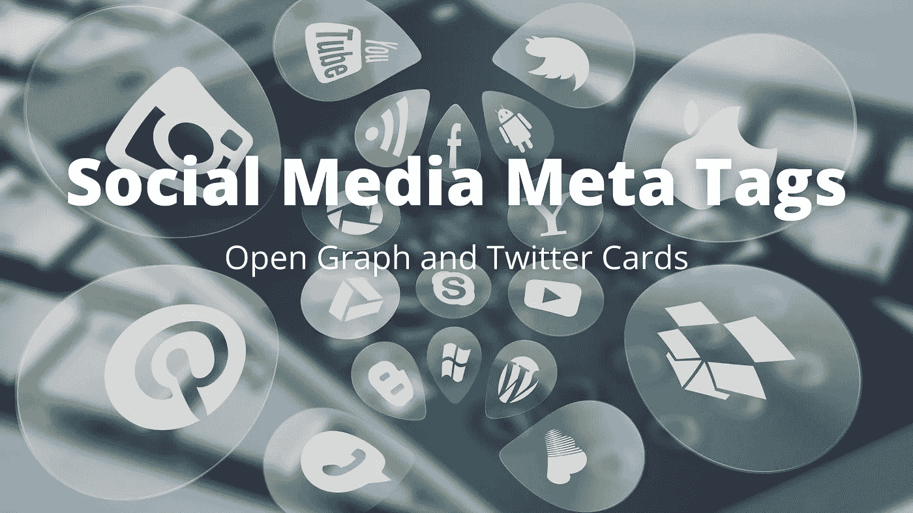
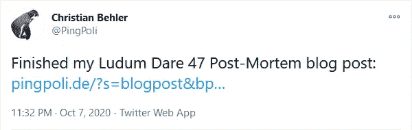
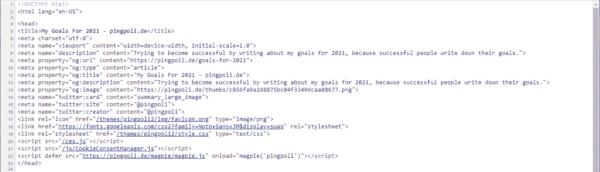

# 使用 Open Graph 和 Twitter Card Meta 标签来增加网站的社交媒体参与度

> 原文：<https://betterprogramming.pub/use-open-graph-and-twitter-card-meta-tags-to-increase-your-websites-social-media-engagement-466cb4829ca5>

## 提高搜索引擎优化和 HTML 元标签的参与度



背景图片由 [geralt](https://pixabay.com/photos/social-media-social-keyboard-icon-4140959/) 在 [Pixabay](https://pixabay.com/) 上生成。

带有图片的推文转发量增加了 150%，点赞量增加了 89%，点击量增加了 18%。在其他社交媒体平台上也是类似的情况。

如果你在社交媒体上分享一个指向你的网站或博客的链接，而没有任何特殊的元标签，它只会显示为一个简单的纯文本链接，如下所示:



Twitter 上没有任何元标签的博客文章链接。作者照片。

这是因为 Twitter 和其他社交媒体平台不知道如何解读你的内容。幸运的是，有一种方法可以通过 meta 标签提供额外的信息，告诉平台如何解析你的网站。他们可以自动创建一个不错的预览，并将其嵌入到你的文章中。有了这些元标签，你的内容分享看起来会像这样:


Twitter 上带有社交媒体元标签的博客文章链接。Twitter 会自动创建一个带有图片、标题和描述的预览。

# 打开图表和 Twitter 卡片

社交媒体元标签有两个重要的类别:开放图协议和推特卡。开放图形协议是脸书在 2010 年引入的，作为一种丰富用户共享的外部内容的方式。2012 年，Twitter 扩展了这个想法，增加了额外的 Twitter 专用标签。

最重要的社交媒体元标签是`title`、`description`和`image`。如果你熟悉 SEO，你可能知道普通的`title`和`description`标签的重要性。Open Graph 和 Twitter Card 版本扮演相同的角色，您通常可以从 SEO 标签中复制值。然而，搜索引擎不使用社交媒体标签进行排名，所以你需要两者。

如上所述，与没有图片的帖子相比，包含图片和其他多媒体资产的社交媒体帖子在每个类别中都表现得更好。因此，图像标签可能是三者中最重要的。当你写一篇博文时，你可能会创建一个标题图像，你的网站至少会有一个标志。所以你总是有一张图片可以用于社交媒体图片标签，你绝对应该这样做。

# 添加社交媒体标签

添加社交媒体元标签非常简单，只需几分钟。大多数内容管理系统支持它们，要么是本地的，要么是通过插件，如果你喜欢开发自己的网站，添加它们也同样容易。它们与其他 meta 标签非常相似，可以在源代码的 head 部分中插入它们的旁边。



网站中最重要的 Open Graph 和 Twitter Card meta 标签。

# 常见标签

Open Graph 协议和 Twitter Cards 包含了许多不同用途的元标签。然而，大多数都不是必需的，你通常只需要几个(完整的列表可以在 [Open Graph 协议的网站](https://ogp.me/)和 [Twitter 开发者文档](https://developer.twitter.com/en/docs/twitter-for-websites/cards/overview/markup)中找到)。以下是你应该放在网站上的最重要的标签:

## og:标题

您可以使用`og:title`标签来指定网站或帖子的标题。通常，这将是相同的网站的主要标题标签。

```
<meta property=”og:title” content=”How To Earn 1 Million Dollars | website.com”>
```

## og:图像

`og:image`标签可用于指定社交媒体内容预览中包含的图像。因为多媒体资产增加了帖子的参与度，这将产生最大的不同。推荐尺寸为 1，200 x 630 像素(1.91:1 宽高比)，但不同平台使用的尺寸可能略有不同。

```
<meta property=”og:image” content=”https://website.com/img/1_million_dollars.png">
```

## og:描述

`og:description`标签类似于普通的 SEO 描述标签，它用 1-2 句话概括了你页面上的内容。

```
<meta property=”og:description” content=”Let me tell you about the 100% guaranteed way to earn 1 million dollars in just 3 months!”>
```

## og:类型

`og:type`标签告诉社交媒体解析器你网站上的内容类型。常见的值有`website`、`article`、`video.movie`或`music.song`(所有类型都列在[开放图形协议的网站](https://ogp.me/#types)上)。

```
<meta property=”og:type” content=”article”>
```

## og:url

为了正确引用内容的原始来源，您还可以使用`og:url`标签指定规范的 URL。

```
<meta property=”og:url” content=”https://website.com/1-million-dollars">
```

# 推特卡片

除了许多不同网站使用的 Open Graph 标签之外，Twitter 还添加了自己的自定义 meta 标签。幸运的是，Twitter 使用 Open Graph 标签作为后备，所以我们不需要添加它们两次。例如，如果没有找到`twitter:title`标签，Twitter 将使用`og:title`标签。

## 推特:卡片

`twitter:card`标签描述了 tweet 中的内容是如何格式化的。有四个可接受的值:`summary`、`summary_large_image`、`player`和`app`。对于大多数网页内容，如网站、文章、帖子等，推荐使用`summary_large_image`或`summary`。`player`用于视频等多媒体内容，`app`可用于直接链接到应用程序。

```
<meta name=”twitter:card” content=”summary_large_image”>
```

## twitter:创建者

`twitter:creator`标签是引用作者的 Twitter 账户的一种方式。

```
<meta name=”twitter:creator” content=”@pingpoli”>
```

## 推特:网站

类似于 creator 标签，`twitter:site`标签可以用来引用网站的 Twitter 帐户。

```
<meta name=”twitter:site” content=”@websitecom”>
```

# 结论

如今，社交媒体分享占据了网站或博客流量的很大一部分。为了在发布内容时最大化参与度，你应该利用 Open Graph 和 Twitter 卡片标签。它们是一小组 HTML 元标签，告诉社交媒体解析器如何解释网站，以便自动创建格式良好的预览。

只需要几分钟就可以把它们添加到你的网站上，当你创建 SEO 标题、描述和一个漂亮的标题图片时，你也可以把这些值用于社交媒体标签。

当你或其他人经常在社交媒体上分享你的网站或博客时，如果你还没有添加元标签，你应该考虑添加元标签。

# 资源

*   [开放图形协议](https://ogp.me/)
*   [推特卡片](https://developer.twitter.com/en/docs/twitter-for-websites/cards/overview/abouts-cards)