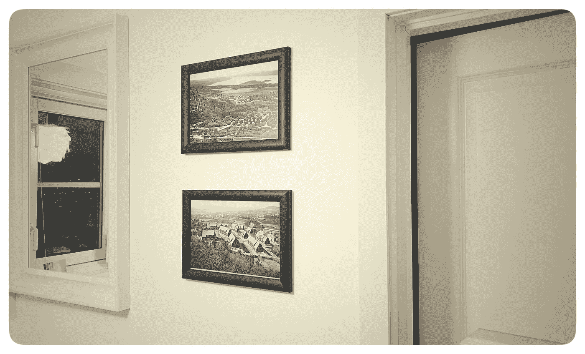
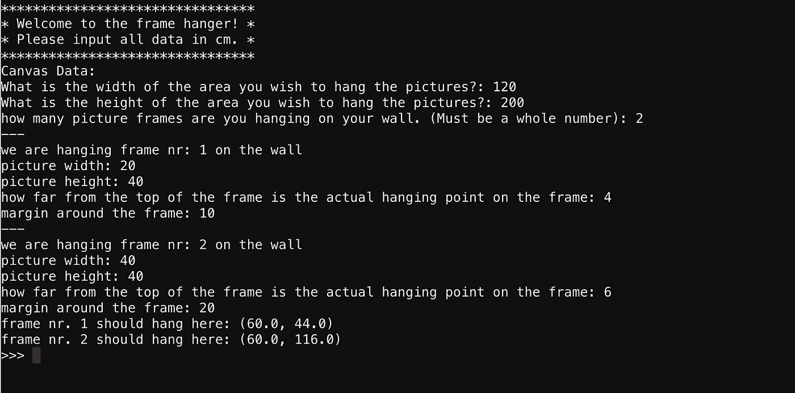
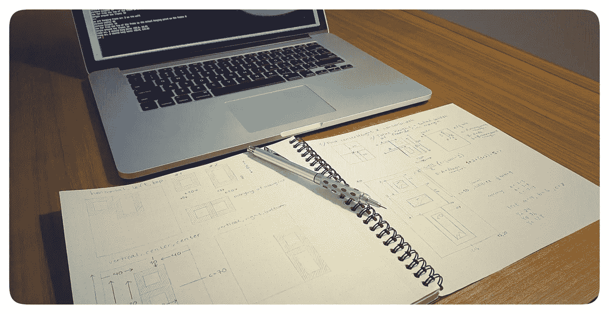
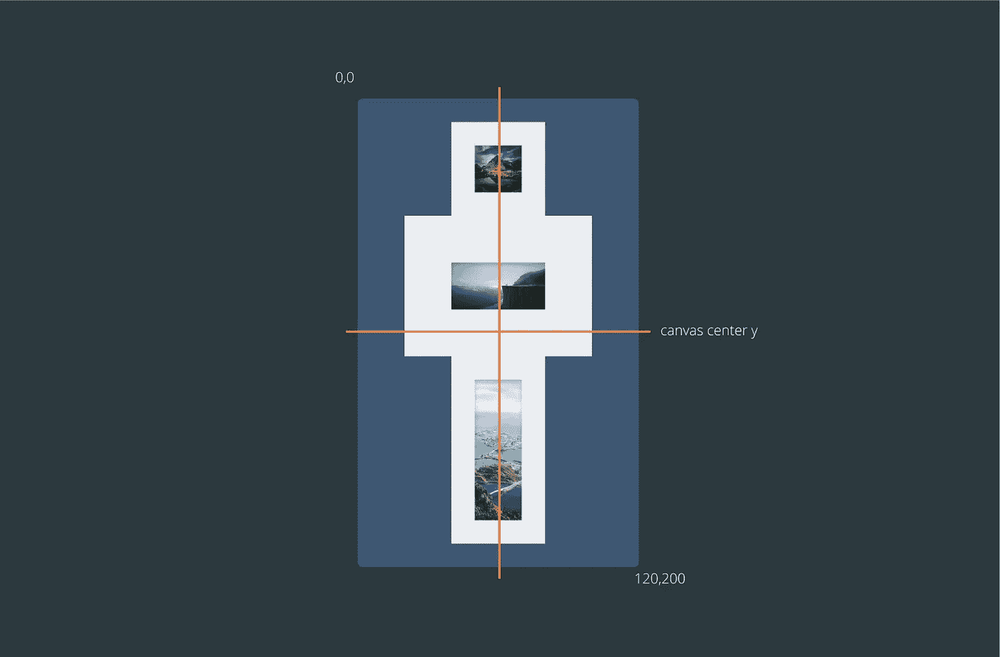
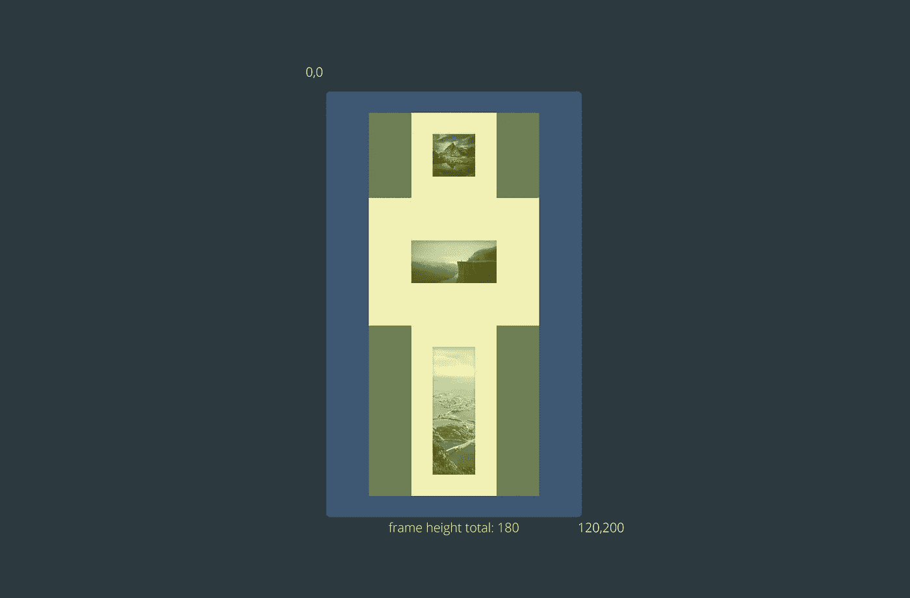
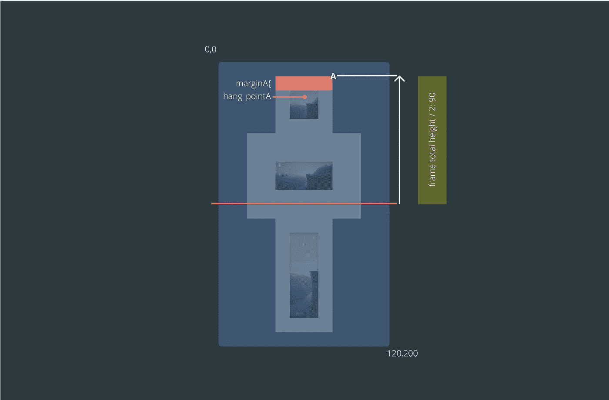
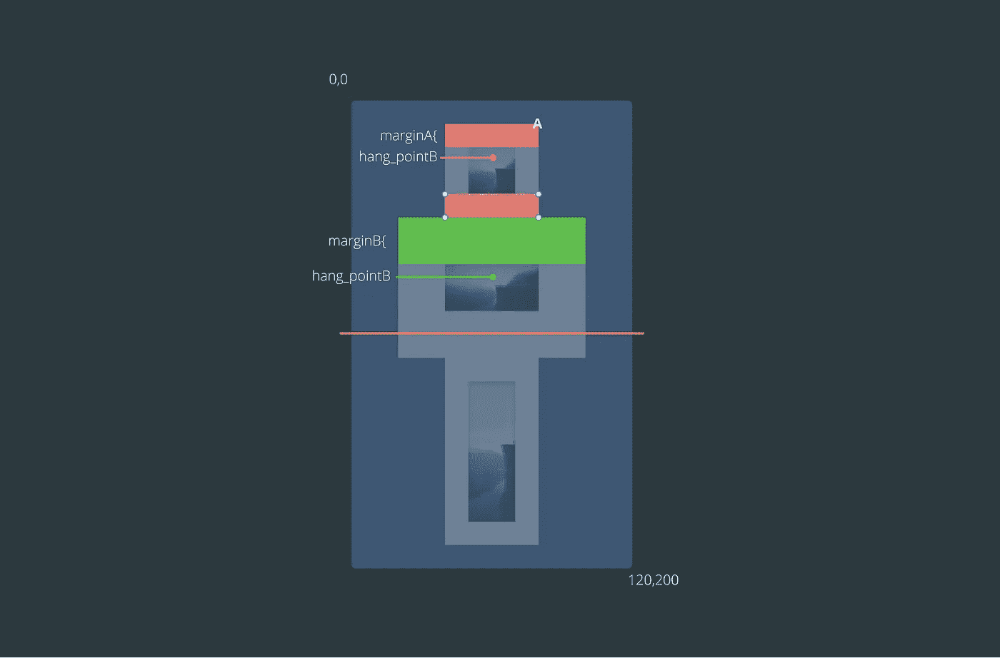
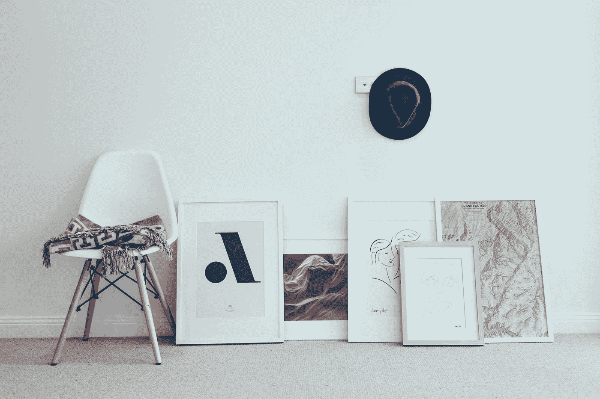
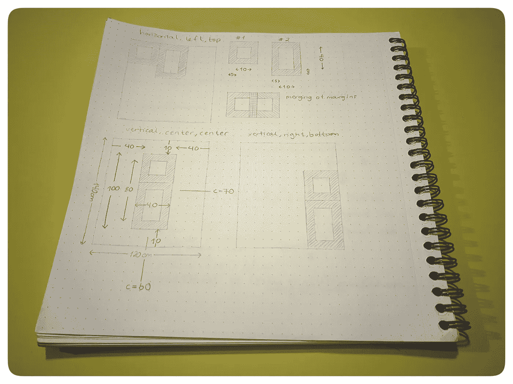

# 使用 Python 将您的相框挂在墙上

> 原文：<https://betterprogramming.pub/use-python-to-hang-your-picture-frames-on-your-wall-469123becd5b>

## 当你的编程技能比你的测量技能更好的时候



启动整个项目的相框。

有人递给你几个相框，然后让你把它们挂在墙上，你有过这样的经历吗？大概…

你有没有想过，“如果我有一个 python 程序，它会告诉我在钉子上钻孔或锤击的确切位置，那该多好？”

没有吗？嗯，我做了，我决定为它写一个程序。毕竟，我的编程技能超过了我的测量技能。

和往常一样，我会给你大部分的逻辑和代码，留下一些让你自己解决。

> 如果我有一个 python 程序能告诉我在哪里钻孔就好了…

# 定义问题和范围

我们唯一的元素是挂照片的墙壁/画布，以及我们想挂在墙上的实际照片。最初，我认为我们需要两个类和主程序来运行代码。保持面向对象是一个好习惯，所以我会这样做。

# 逻辑

让我们从最重要的部分开始——逻辑。

我想让用户定义画布的大小，并告诉程序他们想在墙上挂多少帧。在这幅作品中，我将关注中心/中心布局，这意味着这些图片将悬挂在画布的中心，并且彼此之间也处于中心位置。对齐将是垂直的。

所有的交互都将发生在具有各种输入功能的终端中。我们还将基于这个输入构建所有需要的类和计算。

这就是我们所寻求的互动:



用户和程序之间的交互。

创建这样一个程序的大部分工作都是搞清楚它背后的逻辑，而不是代码本身。



逻辑是大部分的工作。编码只是文本…

因为我们只在垂直和中心工作，我们不需要担心宽度。所有帧都将挂在画布中心 x。下面是代码前的逻辑概述:

*   求画布高度。
*   找出所有框架的总高度，包括页边距。
*   检查画布上是否有足够的空间放置框架。
*   将帧高度一分为二，找出第一帧的起点需要多高。
*   请记住，框架不是悬挂在顶部框架的切线上，而是悬挂在距离框架顶部`n`个单位(在我们的例子中是厘米)的地方。通常是一个洞或一根线。
*   由于边距的原因，第一帧的逻辑是否与其余帧不同？

在开始任何计算之前，我们定义画布中心:



在这里，您还可以看到坐标从左上角(0，0)开始，一直到右下角(120，200)。当你开始钻孔时，记住这一点很重要！

然后，我们找到所有帧的组合高度(包括边距),用于计算起始位置:



当我们有了高度，我们可以继续寻找第一帧的顶部`A`，和`hang_pointA`，你要为帧`A`钻孔的点:



第一帧有点特殊，因为我们只需要用上边距来找`hang_pointA`。接下来的帧将需要使用`A`帧的下边距和它自己的上边距:



当我们想通了这一点，我们就有了所有的逻辑来在垂直中心找到我们想要的所有框架。

# 类别画布

对于画布，我认为我们需要宽度和高度。能够得到中心坐标和面积是很方便的。画布可以容纳菜单，或者您可以在 main 方法中构建它们。以下是`canvas.py`的代码:

菜单列表部分现在没有在程序中使用，但是如果我们想使用它们，它可以为用户提供菜单支持。它在主 Python 文件`main.py`中被提示，但被注释掉了。我把它放在那里，是为了让你了解悬挂相框的不同方式。

```
self._arrangement = ['horizontal' , 'vertical' , 'grid']
self._alignment = ['left' , 'center' , 'right']
self._position = ['top' , 'center' , 'bottom']
```

菜单可以打印成这样:

```
def arrangement_menu(self):
    '''
    method printing arrangement options
    '''
    print (f'Choose the arrangement of your frames (type the index number): ')
    for index, style in enumerate(self._arrangement):
        print(f'{index} = {style}')
```

在`main`中，是这样触发的(其中`wall`是画布):

```
wall.arrangement_menu()
arrangement_input = input('how do you wish to arrange the frames? (type the index number):')
```

# 定义挂起 _ 帧(自身)

这里最重要的是`hang_frames`方法:

1.  得到画布中心`x`和`y`(虽然我们在这个例子中只需要`y`。)
2.  找出所有图片的总高度。
3.  上图中的起点 A 是变量 starting_point
4.  我们循环浏览这些框架，找出它们应该挂在哪里。查看上面的图形，看看这在现实生活中是如何工作的。我们在循环之前设置一个起始点来寻找第一帧。然后，因为起点在循环的底部更新，我们可以控制每帧的起点，并根据我们正在处理的帧更新起点，而无需任何自定义代码。

# def print_hang_data()

向用户打印出在哪里悬挂框架的信息。

# 班级画框

对于画框，我们需要`width`、`height`、`margin`和`hang_point`。悬挂点是实际悬挂机构距离框架边缘有多远。页边空白可以让框架之间有喘息的空间。以下是`picture_frame`的代码:

`picture_frame.py`中的大部分代码都是不言自明的。列表`self._hang`可以用几种方法解决。你可以看到方法`add_canvas_hang_data(self, x , y)`只是在列表中添加了两个值。然后我们使用这个列表来获得 x 和 y 坐标。这可以用很多方法解决——例如元组或字典。我刚刚为这个程序选择了列表。

就是这样！非常简单的设置。让我们开始吧。



克里斯托弗·伯恩斯在 [Unsplash](https://unsplash.com?utm_source=medium&utm_medium=referral) 上拍摄的照片

# main.py

`main()`处理用户和程序之间的交互。它还创建画布、框架并处理它们之间的连接。

帧的计算在`canvas`类内部处理，但从`main`开始执行。代码如下:

# 定义为数字(检查输入)

这个函数只是检查输入是 int 还是 float 来验证它。当用户输入画布数据时使用它。

# 菜单

main 打印了一个简单的菜单，欢迎用户并告诉他/她关于 cm 单位的要求(虽然这不是真的，因为只要一致，任何单位都可以工作。如果你喜欢，可以用英寸。)

# 输入检查

每当请求用户输入时，代码都会检查有效数据。如果不是`float`或`int`，它会一直询问，直到用户键入正确的值类型。

# 创建画布

```
wall = Canvas(float(canvas_width),float(canvas_height))
```

这将基于用户输入创建画布。

# 创建图片框架

在循环内部，为每次迭代创建一个图片框并将其添加到画布中:

```
picture_frame = Pictureframe(float(frame_width), float(frame_height),float(frame_margin),float(frame_hang_point))wall.add_frames_to_canvas(picture_frame)
```

## 检查是否有足够的空间放所有的照片

通过将画布区域与框架的组合区域进行比较，我们可以很快看到是否有足够的空间来放置这些框架。

此代码累加总框架面积:

```
total_frame_area = 0
for frame in wall.get_frames_in_canvas():
    get_area = frame.find_area() 
    total_frame_area += get_area
```

当它对照画布区域进行检查时:

```
if total_frame_area > wall.find_area():
    print (f'WARNING: The total of picture frames including margins exceeds the total area of the wall.')
    print (f'Total area of the wall: {wall.find_area()} , total area of the frames(incl. margins): {total_frame_area}')        
    print (f'Please remove a frame/frames or start over')
```

请注意注释:

```
#add function to remove frames on restart
```

这将是很好的编写程序，使用户可以删除帧，为选定的图片或重启腾出空间。这是另一个版本的程序。我只是想把它留在那里，以表明它会去哪里。

这也适用于在框架位置上执行画布菜单的注释掉的代码。在这种设置中，我们重点介绍了垂直和中心版本，但以不同方式悬挂框架的功能将是一个很好的补充。

帧的合并也可以是要考虑的功能。



以下是一些关于扩展该计划的想法

# 调用所有方法！

我们要做的最后一件事是计算帧，并让用户知道在哪里钻孔。这两个人会帮我们搞定的。

```
wall.hang_frames()        
wall.print_hang_data()
```

# 结论

这是一个如何使用 python 解决实际问题的例子。这不是一个虚构的现实生活中的问题，这是一个*实际的*现实生活中的问题情况。

下次你在墙上挂画的时候，请随意使用这个程序，这样你就不会为错过 3 厘米的钉子而后悔了！

感谢阅读！