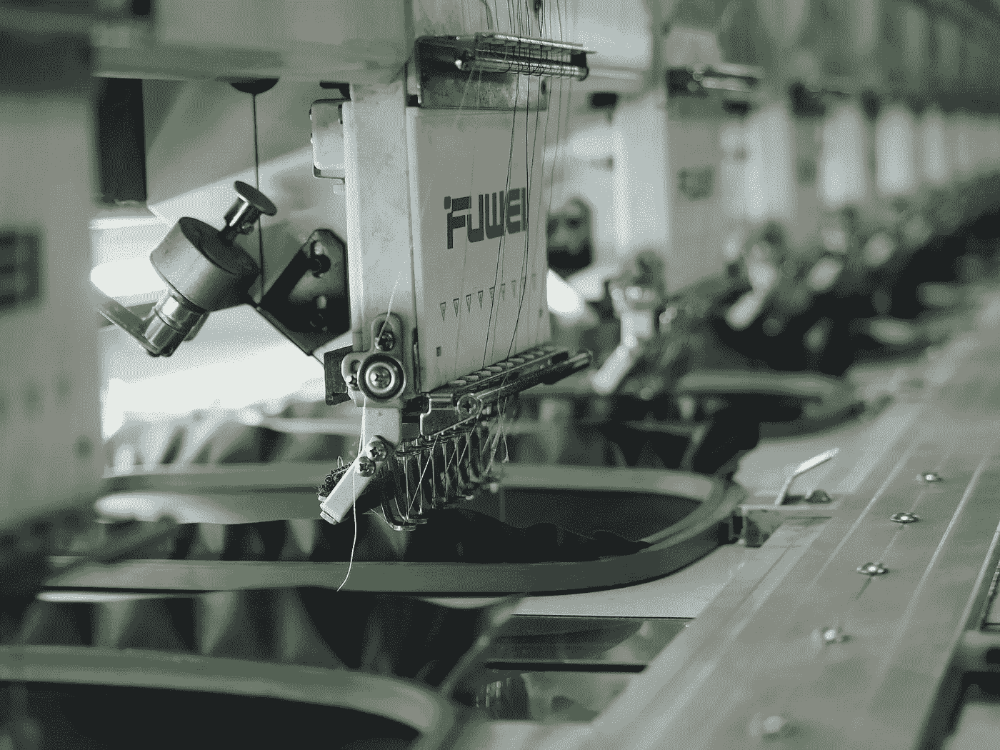
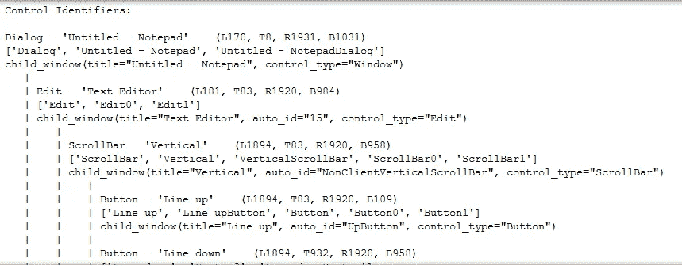

# 使用 pywinauto 自动化 Windows 中的程序

> 原文：<https://betterprogramming.pub/use-pywinauto-to-automate-programs-in-windows-7d4a7eb082a5>

## 让您的操作系统为您服务



照片由 [Agto Nugroho](https://unsplash.com/@agto?utm_source=unsplash&utm_medium=referral&utm_content=creditCopyText) 在 [Unsplash](https://unsplash.com/s/photos/factory?utm_source=unsplash&utm_medium=referral&utm_content=creditCopyText) 上拍摄

本文将教你在 Windows 中使用一个叫做`pywinauto`的 Python 模块来自动化一个程序。根据官方文档， [pywinauto](https://pywinauto.readthedocs.io/en/latest/) 是:

> *…一组用于自动化 Microsoft Windows GUI 的 python 模块。最简单的是，它允许你发送鼠标和键盘动作到窗口对话框和控件，但是它支持更复杂的动作，比如获取文本数据。*
> 
> *幕后支持的技术:Win32 API(*`*backend="win32"*`*)；默认使用)，MS UI 自动化(* `*backend="uia"*` *)。用户输入仿真模块* `*mouse*` *和* `*keyboard*` *在 Windows 和 Linux 上都可以工作。*

本文分为五个部分:

1.  设置
2.  基本用法
3.  键盘和鼠标
4.  捕捉图像
5.  结论

# 1.设置

我们可以通过`pip install`轻松安装这个模块。它将自动安装模块和所需的依赖项。强烈建议您在继续之前创建一个新的虚拟环境。

```
pip install -U pywinauto
```

完成后，通过以下命令检查是否安装了以下模块和依赖项:

```
pip list
```

您应该具有以下依赖关系:

*   pywinauto
*   pyWin32
*   comtypes
*   六
*   枕头(此模块是可选的，只有在您打算截图时才需要)

让我们继续下一节，开始写一些 Python 代码。

# 2.基本用法

## 术语和定义

在我们继续之前，让我们看一下本模块的一些术语和定义。

*   包含按钮、编辑框等其他 GUI 元素/控件的窗口。对话框不一定是主窗口。主窗体顶部的消息框也是一个对话框。pywinauto 也认为主窗体是一个对话框。
*   `Control` —层次结构中任何级别的 GUI 元素。这个定义包括窗口、按钮、编辑框、网格、网格单元、栏等。

## 后端

后端是指应用程序或程序背后的可访问性技术。在撰写本文时，该模块仅向我们提供了以下后端:

*   nowMFC、VB6、VCL、简单的 WinForms 控件和大多数旧的遗留应用程序的默认后端。
*   `MS UI Automation (backend=”uia”)` — WinForms、WPF、商店应用、Qt5、浏览器。Chrome 启动前需要`force-renderer-accessibility` cmd 标志。由于 comtypes Python 库的限制，不支持自定义属性和控件。

## 导入

第一部分是在脚本中导入必要的模块。让我们从导入`pywinauto`模块的`Application`类开始。`Application`是你每个自动化过程的起点。我将使用记事本作为这篇文章的用例。

```
from pywinauto.application import Application
```

如果您打算调用基本的用户输入功能，如鼠标和键盘，您还需要导入以下代码:

```
import pywinauto.mouse as mouse
import pywinauto.keyboard as keyboard
```

## 启动并连接

您需要将`Application`实例连接到一个流程，以便自动化它。有两种方法可以做到:

*   `start()` —当应用程序没有运行而您需要启动它时使用。它接受一个字符串，可以包含命令行参数和一个`timeout`参数。只有当程序启动时间过长时，才需要`timeout`参数。以下是启动记事本的示例:

```
app = Application().start(r"c:\windows\system32\notepad.exe")
```

*   `connect()` —当您试图自动化正在运行的过程时使用。您可以传入程序的进程 id、句柄或路径。强烈建议使用绝对路径，当您重新启动程序时，进程 id 和句柄可能会改变。你必须确保程序完全启动并运行，否则就会出错。

```
app = Application().connect(path=r"c:\windows\system32\notepad.exe")
```

## 对话

您可以通过项目或属性访问来访问该对话框。您需要确定流程的可用窗口:

```
app.windows()
```

您应该会看到以下结果。这意味着此流程有一个活动窗口:

```
[<uiawrapper.UIAWrapper - 'Untitled - Notepad', Dialog, 3713031533299862531>]
```

您可以通过以下方法分配它:

```
dlg = app['Untitled - Notepad']
```

密钥必须与窗口的名称匹配。在这种情况下，名称为`Untitled — Notepad`。

如果窗口的名称太长，您可以使用 regex 来捕获它:

```
app.window(title_re=".*Notepad.*")
```

## 控制

下一步是通过运行以下代码来识别所有可用的控件。

```
dlg.print_control_identifiers()
```

我得到了以下输出:



作者图片

默认情况下使用的是`win32`后端，如果你在获取控件时遇到困难，可以考虑将后端改为`uia`。

```
app = Application(backend="uia").start(r"c:\windows\system32\notepad.exe")
```

如果你的程序非常复杂，你可能无法加载所有的控件。可以通过以下方法捕获控件:

```
app.dlg.control #first methodapp['dlg']['control'] #second method is preferred as it is more robust for unicode strings
```

有不同类型控制可以自动化。最常用的控件有`Button`、`Edit`和`MenuItem`。每一个控件都有它们各自的函数调用。更多信息请参考[文件](https://pywinauto.readthedocs.io/en/latest/controls_overview.html)。

让我们自动选择菜单。我将切换位于`View`菜单下的状态栏。

```
dlg.menu_select("View -> Status Bar")
```

当您运行上面的代码时，您将会看到状态栏的状态将会改变，这取决于初始状态。您可以对其他功能执行相同的操作，例如保存文件。

```
dlg.menu_select("File -> Save as")
```

您可以继续链接自动化过程。以下示例打开并关闭“替换”窗口。

```
dlg.menu_select("Edit -> Replace")
dlg.Replace.Cancel.click()
```

您可以在编辑控件中键入一些文本。下面的例子说明了这样做的方法。

```
dlg.Edit.type_keys('Welcome to Medium')
```

当您运行它时，您会注意到出现在记事本上的最终文本是`WelcometoMedium`，两个空格都从原始文本中消失了。这是正常的，因为这个模块是基于键盘输入的。您可以通过在字符串中添加适当的键码来轻松解决这个问题。查看此[页面](https://pywinauto.readthedocs.io/en/latest/code/pywinauto.keyboard.html)了解更多信息。

```
dlg.Edit.type_keys('Welcome{SPACE}to{SPACE}Medium')
```

如果您正在构建一个自动化解决方案，您可能希望在将输入字符串传递给函数之前对其进行预处理。让我们创建一个简单的函数来实现这一点:

```
def replace_space(text):
    return text.replace(' ', '{SPACE}')
```

最新版本还带有内置参数来为您映射字符串。您可以简单地将`with_spaces`参数设置为`True`。参数的完整列表如下:

```
type_keys(*keys*, *pause=None*, *with_spaces=False*, *with_tabs=False*, *with_newlines=False*, *turn_off_numlock=True*, *set_foreground=True*, *vk_packet=True*)
```

请记住，如果您的字符串中存在不属于键码的花括号，您很可能会遇到错误。

# 3.键盘和鼠标

如果您无法捕获控件，您可以使用键盘和鼠标模块来实现自动化。在继续之前，您需要将焦点设置到应用程序上。使用内置的`send_keys`开始向你的程序写文本。请不要把这个功能和我上面提到的`type_keys`混淆。`Type_keys`只是一个调用底层`send_keys`函数的包装器。

```
dlg.set_focus()
keyboard.send_keys('Hello')
```

假设您在通过点击应用程序右上角的关闭按钮来自动关闭程序时遇到了问题。您可以通过手动自动化鼠标点击来轻松解决这个问题。在此之前，让我们看看之前使用`print_control_identifiers`打印出来的控件。你会注意到这样的东西:

```
TitleBar - ''    (L157, T45, R1872, B87)
```

最后一部分指的是窗口左、上、右、下的坐标。你可以用它来定位和移动鼠标到特定的位置。既然关闭按钮和标题栏在一条线上，那我们就在右上角位置点击鼠标吧。我把位置移动了一点来补偿偏移。

```
dlg.set_focus()
mouse.click(coords=(1850, 60))
```

您应该会看到一个提示，要求您保存或不保存就退出。

# 4.捕捉图像

您可以使用`capture_as_image`功能捕捉窗口或程序的图像。您可以将它用于调试目的。在出现异常的情况下，您可以触发这个函数，并将生成的 PIL 图像保存到一个目录中。让我们来看看您是如何做到这一点的。确保您已经在脚本所在的目录中创建了一个`log`文件夹:

```
import datetime;dlg.set_focus()
debug_image = dlg.capture_as_image()
debug_image.save('log/' + str(int(datetime.datetime.now().timestamp())) + '.png')
```

请记住，这段代码将把应用程序带到前台，并根据进度的位置和矩形捕获图像。它可能包含其他不需要的部分，并且前面的任何其他程序也将被捕获。

# 5.结论

让我们回顾一下今天所学的内容。我们开始通过`pip install`安装`pywinauto`模块。

然后，我们深入探讨了该模块的基本用法。我们了解了可用的后端，以及其中使用的术语。我们还编写了一些代码来自动化简单的操作，比如菜单选择和按钮点击。

接下来，我们使用内置的键盘和鼠标模块尝试了手动自动化，与通常的方法相比，它提供了更多的灵活性。为了调试的目的，我们甚至捕获了程序的图像。

感谢你阅读这篇文章，我希望再次见到你！

# 参考

1.  pywinauto 的文档
2.  [pywinauto 的 Github 页面](https://github.com/pywinauto/pywinauto)