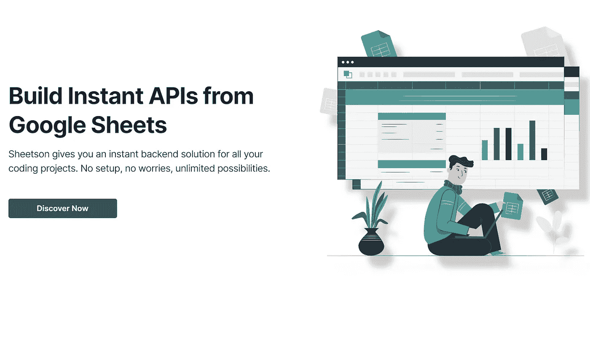
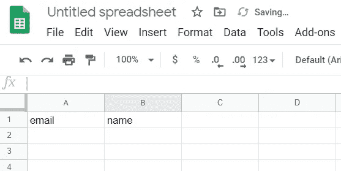
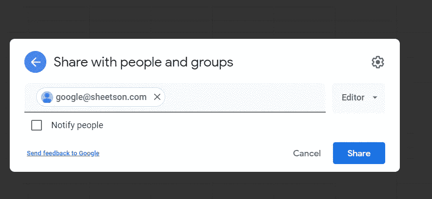
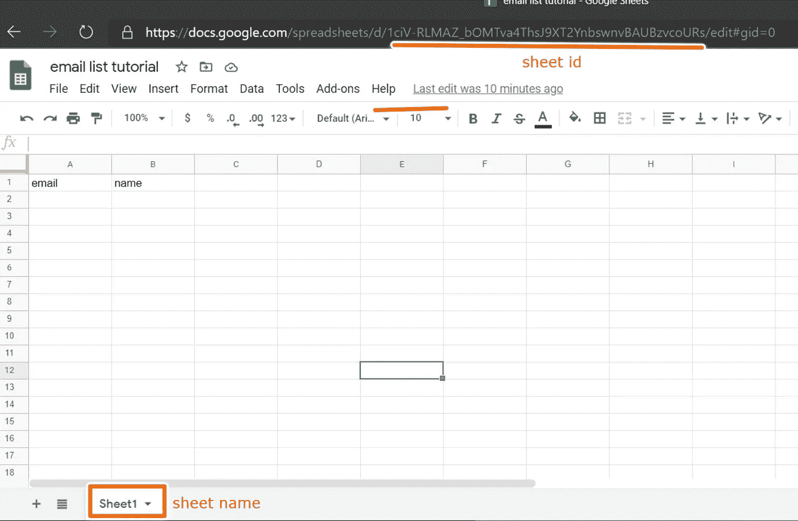

# 使用 Sheetson 建立一个由 Google Sheets 支持的免费电子邮件列表

> 原文：<https://betterprogramming.pub/use-sheetson-to-build-a-free-email-list-powered-by-google-sheets-8a7398631e29>

## 当你刚刚起步时，没有必要在 MailChimp 上挥霍

由[内斯利汉·古奈丁](https://unsplash.com/@neslihangunaydin?utm_source=unsplash&utm_medium=referral&utm_content=creditCopyText)在 [Unsplash](https://unsplash.com/s/photos/dirt?utm_source=unsplash&utm_medium=referral&utm_content=creditCopyText) 上拍摄的照片。

为你的产品建立初始 MVP 时，避免不必要的花费是明智的。

为你的初创公司创建一个电子邮件列表对于促进关系是必要的，尤其是与你的早期客户。

MailChimp 的免费版本最多只支持 2000 个[联系人](https://mailchimp.com/pricing/)(在撰写本文时)，而 Google Sheets 可以免费存储无限量的邮件。

到本文结束时，您将能够将网站上的表单连接到 Google Sheets。

# 要求

你需要基本的 JavaScript 和 HTML 知识。

# 1.创建您的 HTML 表单

我们将使用传统的 HTML 和 JavaScript 来保持简单:

嵌入由作者通过 carbon.now.sh 提供。

移植到 React、Vue 或 Angular 应该是一个简单的过程。

# 2.介绍 Sheetson

Sheetson 将为我们提供一个简单的 Rest API 来与我们的 Google Sheets 通信。

截图由作者提供。

注册(这是免费的)并前往控制台页面。复制 API 密钥。我们将在下一步中使用它。

# 3.创建一个新的 Google 工作表页面

前往谷歌工作表，并创建一个工作表。要准备好与 Sheetson 一起使用，请根据要发送的字段标记第一行的每一列。这里有一个例子:

图片由作者提供。

上面的电子表格的第一行列标有“电子邮件”和“姓名”这些列名区分大小写。

接下来，以编辑的身份与 google@sheetson.com**分享该表。**

****

**使用文件>共享访问共享菜单。**

**最后，获取工作表的名称和 ID:**

****

# **4.连接表单**

**用 Sheetson 创建新行很容易。只需向[https://api.sheetson.com/v2/sheets/{SHEET_NAME}](https://api.sheetson.com/v2/sheets/{SHEET_NAME})发送一个带有`Authorization`和`X-Spreadsheet-Id`头值的 post 请求。post 请求主体应该是表单值的字符串化 JSON 对象，以相应的列名作为键。**

**像这样:**

**连接表单值如下所示:**

# **结论**

**至此，您已经成功创建了一个连接到 Google Sheets 的简单表单。**

**与 Google Sheets 相比，MailChimp 和 ConvertKit 等平台提供了更多的功能，如分段，但这个解决方案可能刚刚好开始。**

**感谢阅读！**

# **资源**

*   **[简单邮件列表(codepen.io)](https://codepen.io/sim04ful/pen/QWNqMag?editors=1100)**
*   **[邮件列表谷歌表单](https://docs.google.com/spreadsheets/d/1ciV-RLMAZ_bOMTva4ThsJ9XT2YnbswnvBAUBzvcoURs/edit?usp=sharing)**