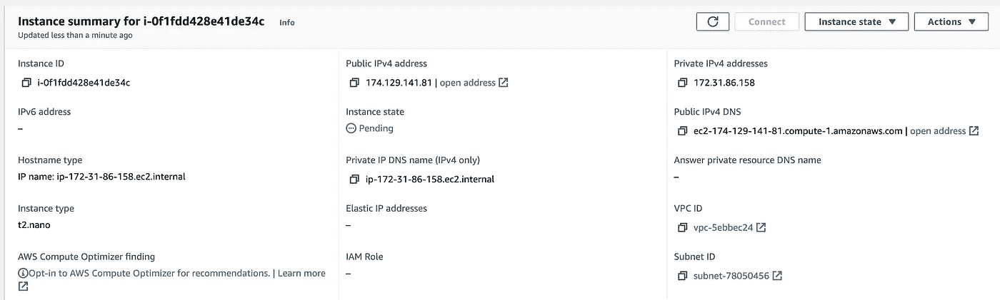
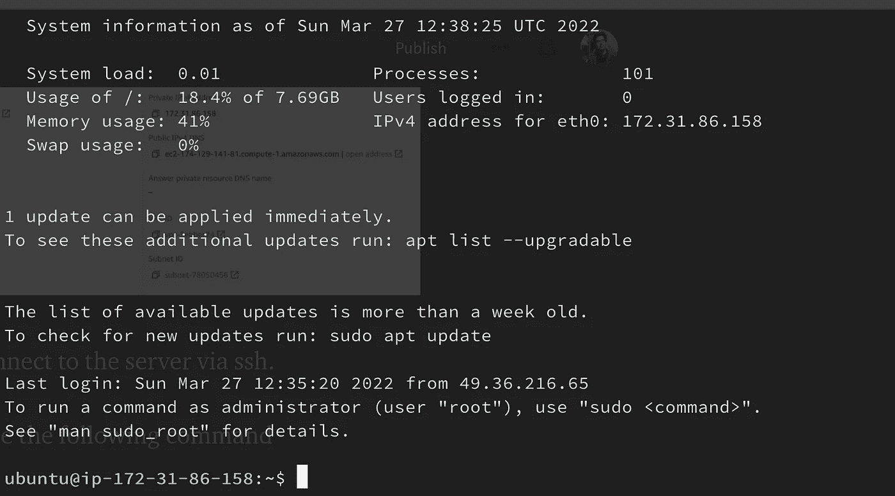
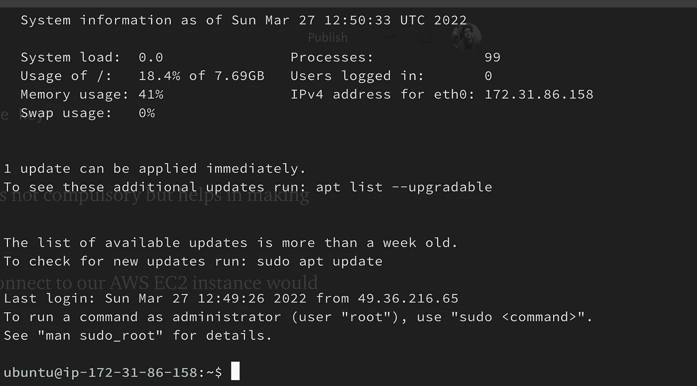

# 如何使用 SSH 配置文件来提高您的生产力

> 原文：<https://betterprogramming.pub/use-ssh-config-file-to-boost-your-productivity-b3867ce8cbfe>

## 轻松跟踪您的服务器的 IP 地址


照片由[克里斯蒂娜@ wocintechchat.com](https://unsplash.com/@wocintechchat)在 [Unsplash](https://unsplash.com/?utm_source=medium&utm_medium=referral) 上拍摄

在当今的云计算时代，每个软件开发人员都必须与各种远程服务器打交道，以部署、管理和调试他的代码。

当远程连接的数量开始增加时，记住这些不同服务器的 IP 地址、端口和凭证位置变得非常困难。

这就是 ssh 配置文件的用处。

# 通过 ssh 连接的传统方式

假设您运行了以下 AWS EC2 实例，并提供了以下详细信息



我们有`.pem`扩展文件通过 ssh 连接到服务器。

现在，要连接到服务器，我们可以使用以下命令

```
ssh -i t3_nano_ssh_aws_keys.pem ubuntu@174.129.141.81
```

我们将看到如下所示的服务器连接



现在，上述方法的问题是，当要管理的服务器数量增加时，我们必须跟踪每台服务器的 IP 地址以及权限文件。

这就是 ssh 配置文件的用处。

# 通过 SSH 配置文件连接

默认情况下，ssh 配置文件位于`~/.ssh`目录中。

如果该文件不存在，您可以使用以下命令创建一个:

```
touch ~/.ssh/config
```

现在，在配置文件中编写远程主机配置的格式如下:

```
Host <server-alias>
  HostName <server IP or url>
  User <username>
  IdentityFile <location of private key>
```

第二行提供的空间不是必需的，但有助于使文件更具可读性。

对于我们的用例，连接到 AWS EC2 实例的配置如下:

```
Host nano-server
  HostName 174.129.141.81
  User ubuntu
  IdentityFile ~/t3_nano_ssh_aws_keys.pem
```

保存以下配置后，我们现在可以直接使用上面提供的主机名进行 ssh。

```
ssh nano-server
```

运行上面的命令让我们直接连接到 EC2 实例。



# SSH 配置文件语法

一个 ssh 配置文件可以有多个 ssh 配置。例如:

```
Host HOST_NAME_1
  HostName IP_1
  User USER_1
  IdentityFile LOCATION_1Host HOST_NAME_2
  HostName IP_1Host HOST_NAME_3
  HostName IP_1
```

如上所述，像`User` `IdentityFile`这样的参数不是强制性的，它们的存在可以根据配置的不同而不同。

可以在[这里](https://www.ssh.com/academy/ssh/config#:~:text=that%20contain%20spaces.-,Listing%20of%20client%20configuration%20options,-The%20following%20keywords)找到完整的参数列表

除了拥有多种配置，我们还可以在创建配置文件时使用大量通配符

*   (*)可用作一个或多个字符的替代。例如，如果所有开发服务器都有一个通用的`IdentityFile`，我们可以在配置文件中添加下面一行:

```
Host dev-*
  IdentityFile <location to identity file>
```

*   ( ?)可以作为单个字符的替代。例如，如果我们想要为所有服务器编写配置，我们可以使用相同的前缀编写:

```
Host ????-server
  HostName 174.129.141.81
  User ubuntu
```

我们可以通过命令`ssh nano-server` `tall-server` `omni-server`连接到这个服务器，但不能通过`dev-server`连接，因为`dev`只包含 3 个字符。

*   ( !)可以用来否定它后面的表达式的匹配

```
Host !prod-server
  User low-priority-user
```

上面的配置文件意味着在主机为`prod-server`之前，将用户字段的值设置为`low-priority-user`

基于这些通配符，我们可以编写如下示例配置文件:

```
Host prod-server
  HostName xxx.xxx.xxx.xx
  User ubuntu
  IdentityFile ~/prod.pemHost stag-server
  HostName xxx.xxx.xxx.xx
  User ubuntu
  IdentityFile ~/stag.pemHost dev-server
  HostName xxx.xxx.xxx.xxHost !prod-server
  LogLevel DEBUGHost *-server
  IdentityFile ~/low-security.pem
```

在上面的文件中，我们已经为`prod-server`和`stag-server`定义了单独的配置，它们有单独的标识文件。而对于`dev-server`和任何其他可能的服务器，有一个默认的`pem`文件。

此外，对于除`prod-server`之外的所有服务器，日志级别设置为`DEBUG`:

# 结论

配置文件可以用来提高软件开发人员的工作效率。这些文件甚至可以跨系统使用，以实现与远程服务器的安全、可靠和快速的连接，而无需记住与每个单独连接相关的所有元数据。

# 参考

[https://linuxize.com/post/using-the-ssh-config-file](https://linuxize.com/post/using-the-ssh-config-file/)

 [## SSH 配置文件语法和如何配置 OpenSSH 客户端

### 这个页面是关于 OpenSSH 客户端配置的。关于 OpenSSH 服务器配置，请参见 sshd_config。对于塔蒂亚宋承宪…

www.ssh.com](https://www.ssh.com/academy/ssh/config)  [## SSH 配置通配符和每个客户端多个 Postgres 服务器

### 由格雷格萨比努 Mullane 年 1 月 7 日 SSH 配置文件有一些不错的功能，帮助我保持我的理智在…

www.endpointdev.com](https://www.endpointdev.com/blog/2011/01/ssh-config-wildcards-and-multiple/)