# 如何在您的应用程序中使用 Apple 的新 SF 符号

> 原文：<https://betterprogramming.pub/use-the-new-apple-sf-symbols-in-your-applications-6feb75ef294b>

## 在 iOS 13 及以下版本上

在 [WWDC 2019](https://developer.apple.com/videos/wwdc2019/) 期间，苹果推出了一套免费的超过[1500 个符号](https://developer.apple.com/videos/play/wwdc2019/206/)，供开发者在其应用中使用。

在这里，我将解释如何在你的应用程序中使用苹果新的 [SF 符号](https://developer.apple.com/design/human-interface-guidelines/sf-symbols/)。在任何情况下，即使它们是免费的，你也必须考虑到苹果公司的许可协议:

> “所有 SF 符号应被视为 Xcode 和 [*Apple SDKs 许可协议*](https://developer.apple.com/terms/) 中定义的系统提供的图像，并受其中规定的条款和条件约束。
> 
> 您不得在您的应用程序图标、徽标或任何其他与商标相关的用途中使用 SF 符号，或实质上相似或容易混淆的字形。
> 
> 苹果公司保留审查并自行决定要求修改或停止使用违反上述限制的任何符号的权利，并且您同意立即遵守任何此类要求。"

# 什么是 SF 符号

正如我们已经说过的，SF Symbols 是一组超过 1500 个图标，集成在旧金山文本字体中，可配置为所有类型的大小和重量。

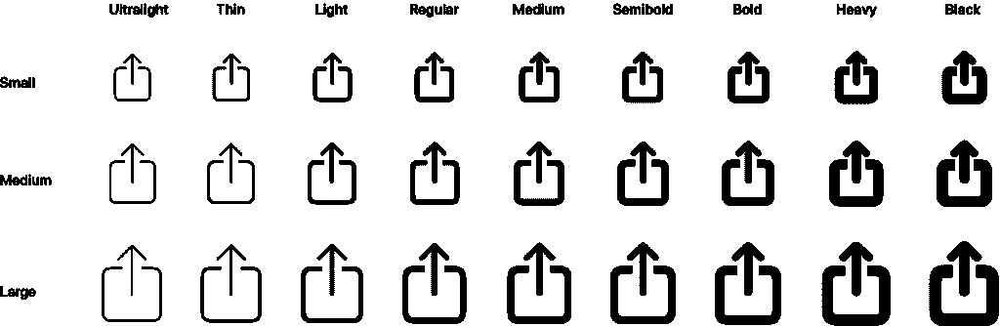

为了知道有哪些图标，我们可以下载一个[苹果应用](https://developer.apple.com/design/downloads/SF-Symbols.dmg)。此应用适用于 macOS 10.14 及更高版本。

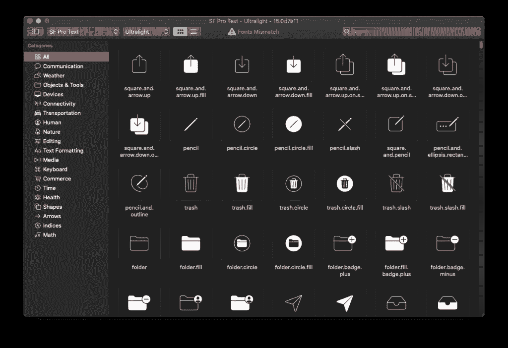

有了这个应用程序，我们可以通过重量(在前面的图片中显示了超轻重量的图标)或主题来显示图标。

因此，如果我们在左栏中选择*天气*，我们将看到与该主题相关的所有图标。


# 支持

SF 符号可用于以下平台:

*   iOS 13 及更高版本。
*   watchOS 6 及更高版本。
*   tvOS 13 及更高版本。

# 导出、修改和验证 SF 符号

SF 符号也可以从应用程序中导出，只需选择您想要导出的符号，并从顶部菜单中选择*文件>导出自定义符号模板* …或输入⌘E.。这样，我们将获得 SVG 格式的图标。

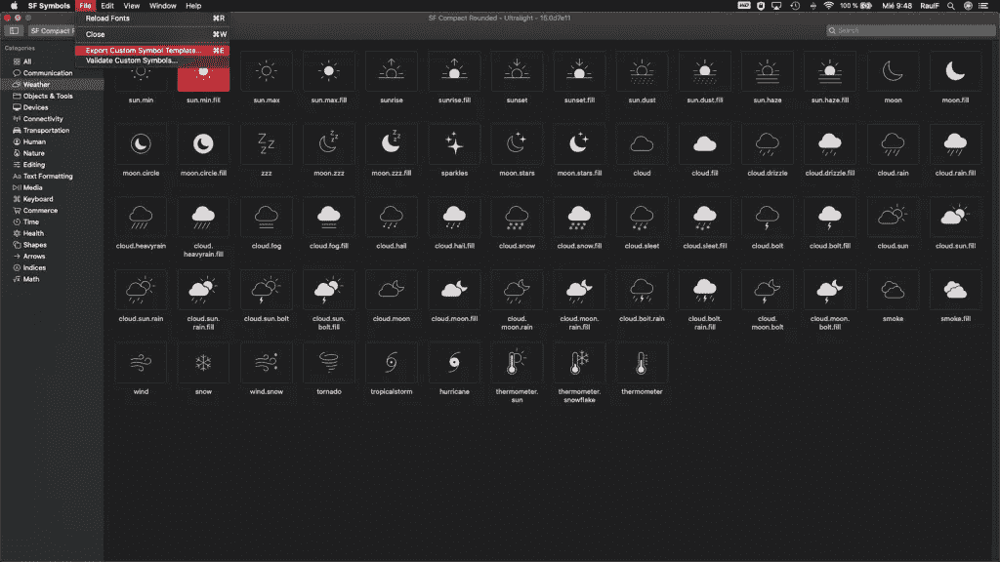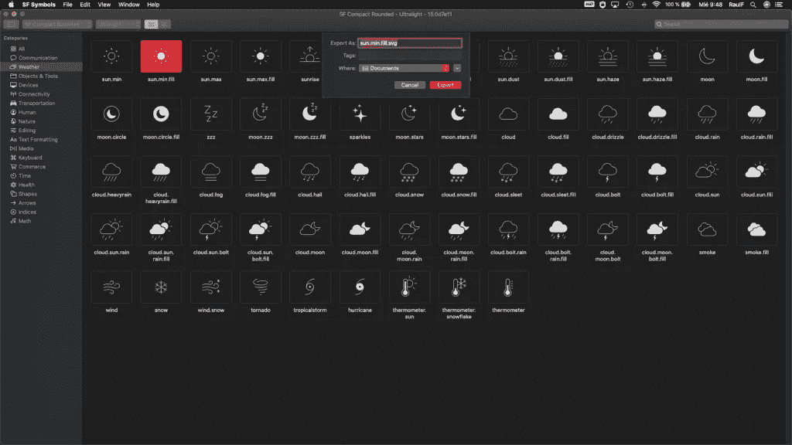

一旦我们导出了图标，我们可以通过另一个程序修改它，在这种情况下，我们将改变图标的颜色从黑色到黄色。

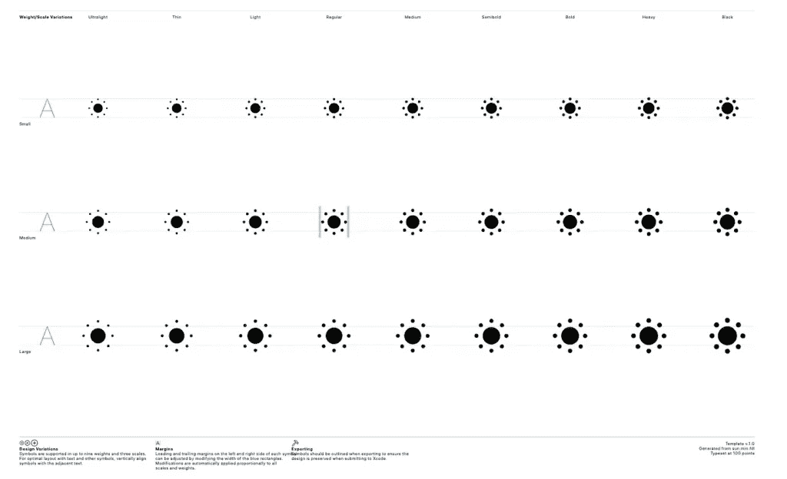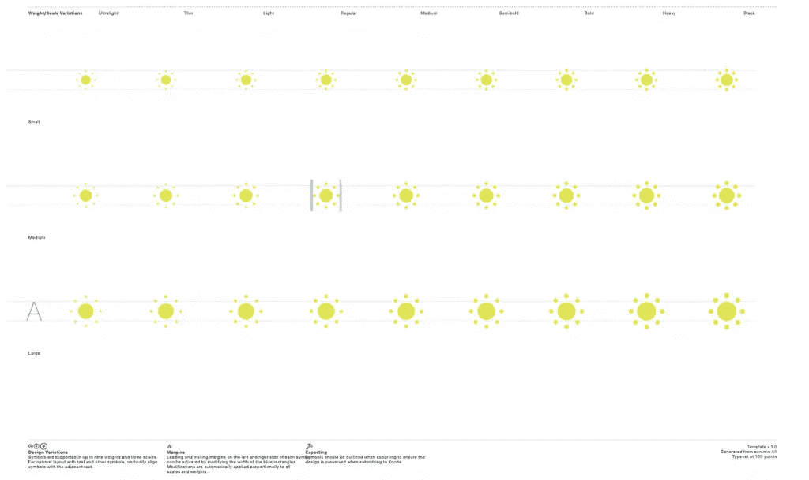

接下来，我们必须检查所做的修改是否有效。为此，我们从SF 符号应用程序转到*文件>验证自定义符号* …，选择。svg 文件并验证它。

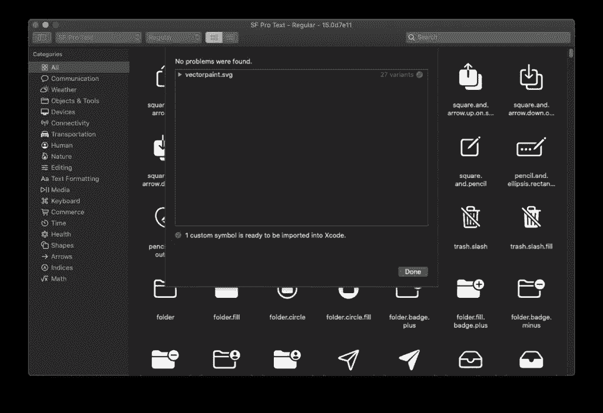

完成后，我们可以转到 Xcode 项目，选择 *Assets* 文件夹并拖动。svg 文件在里面。现在我们可以用它了。

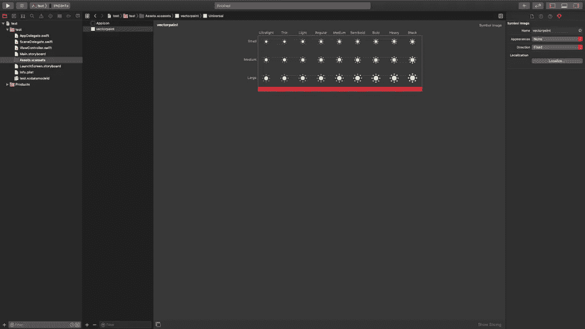

# 如何在我们的项目中使用 SF 符号

## 在 iOS 12 中使用 SF 符号

SF 符号只能在 iOS 13 中原生使用。那么，在 iOS 12 这样的之前版本中，我们该如何使用它们呢？

如果我们想在 iOS 13 之前的版本中使用任何这些符号，我们必须做的是导出该符号(如我们之前所见)，并使用图形工具将其转换为 PNG 格式(例如),并将其导入到项目的`Assets.xcassets`目录中。

## 在 iOS 13 和 SwiftUI 中使用 SF 符号

在 SwiftUI 中使用 SF 符号非常简单，我们只需添加一个带有我们想要显示的符号名称的`Image`组件:

```
Image(systemName: "sun.min.fill")
```

一旦我们有了符号，我们可以用不同的方式修改它的大小和颜色，例如:

```
Image (systemName: "sun.min.fill")
     // resize
     .font (.system (size: 40.0))

     // Change in size and weight
     .font (.system (size: 40.0, weight: .light))

     // Change in size, weight and style
     .font (.system (size: 40.0, weight: .light, design: .monospaced))

     // Resize based on text style
     .font (.system (.headline))

     // Change in size and weight depending on the style of the text
     .font (.system (.headline) .bold ())

     // Change the icon scale
     .imageScale (.samll)

     // Change the icon color
     .foregroundColor (.yellow)

     // Change the accent color of the icon
     .accentColor (.orange)
```

## 在 iOS 13 和 UIKit 中使用 SF 符号

如果我们想在 iOS 13 的项目中使用 SF 符号，但使用 UIKit 而不是 SwiftUI，我们有两个选择:用代码或在故事板中创建它。

**代号**

要在 Swift 中使用这些符号，使用`systemName` 参数而不是`named`在`UIImage`组件中调用它们:

```
let symbol = UIImage(systemName: "sun.min.fill")
```

现在，如果我们想像 SwiftUI 那样配置它的外观，我们必须使用`UIImage`的`SymbolConfiguration`类:

```
let configuration = UIImage.SymbolConfiguration(pointSize: 40.0)
let symbol = UIImage(systemName: "sun.min.fill", withConfiguration: configuration)
```

如果我们输入代码来生成配置，我们会看到有大量的初始化器。

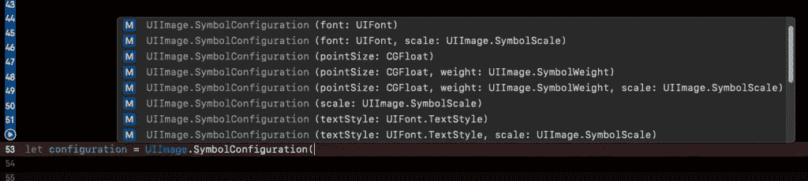

这样，我们可以配置符号外观的不同参数，例如:

```
// Size
let configuration = UIImage.SymbolConfiguration (pointSize: 40.0)

// Size and weight
let configuration = UIImage.SymbolConfiguration (pointSize: 40.0, weight: .light)

// Weight
let configuration = UIImage.SymbolConfiguration (weight: .light)

// Font and scale
let configuration = UIImage.SymbolConfiguration (font: .systemFont (ofSize: 40.0), scale: .medium)

// Source
let configuration = UIImage.SymbolConfiguration (font: .systemFont (ofSize: 40.0))

// Text style
let symbconfigurationolConfig3 = UIImage.SymbolConfiguration (textStyle: .headline)
```

故事板或。xib 文件

在使用故事板或`.xib`文件的情况下，SF 符号的使用很简单:

*   我们将一个`UIImageView`组件拖到视图上:

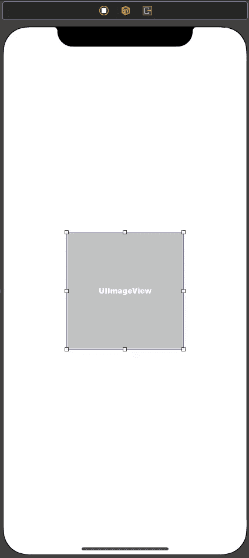

*   接下来，在*属性检查器*中，我们选择想要显示的符号(出现一个带有可用符号的菜单):

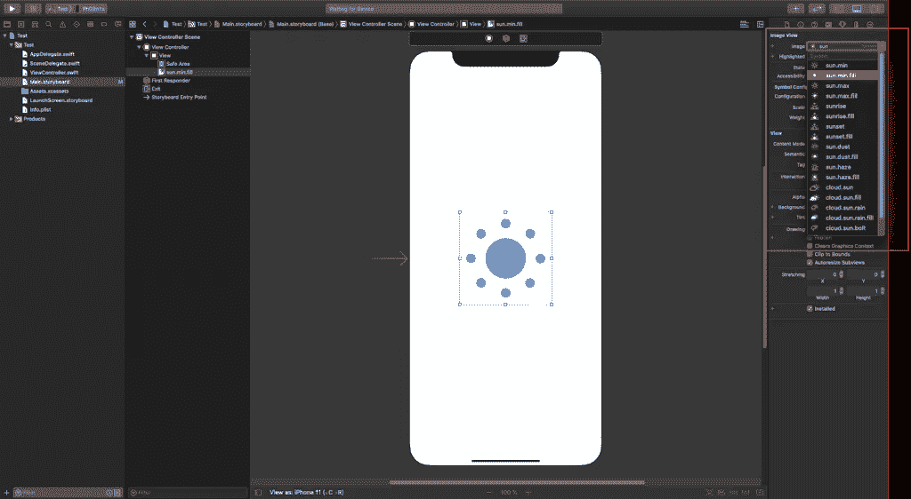

*   最后，我们修改符号的属性(大小、重量、比例、颜色…):

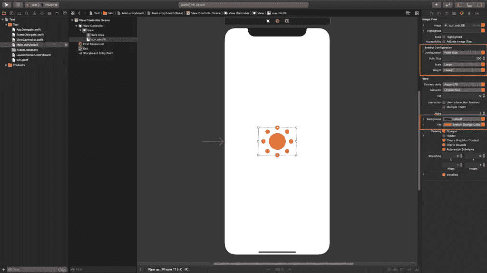

## iOS 12 中的具体案例:UIImageView 和 UIButton

除了在创建`UIImage`元素时添加一个符号设置之外，还有两种新的情况可以应用这个设置:`UIImageView`和`UIButton`。

这可以通过这些元素呈现的一个新属性来实现:在`UIImageView`的情况下是`[preferredSymbolConfiguration](https://developer.apple.com/documentation/uikit/uiimageview/3295948-preferredsymbolconfiguration)`，在`UIButton`的情况下是`[setPreferredSymbolConfiguration(_: forImageIn:)](https://developer.apple.com/documentation/uikit/uibutton/3295915-setpreferredsymbolconfiguration)`。

例如，这些属性允许我们配置一个图像，使其与周围的文本相似。

```
// UIImageView
let symbol = UIImage(systemName: "sun.min.fill")
let imageView = UIImageView(image: symbol)
let configuration = UIImage.SymbolConfiguration(weight: .light)
imageView.preferredSymbolConfiguration = updatedConfiguration

// UIButton
let symbol = UIImage(systemName: "sun.min.fill")
let button = UIButton()
button.setImage(symbol, for: .normal)
let configuration = UIImage.SymbolConfiguration(weight: .light)
button.setPreferredSymbolConfiguration(configuration, forImageIn: .normal)
```

# 结论

多亏了苹果在 2019 年[WWDC](https://developer.apple.com/videos/wwdc2019/)大会上展示的超过 [1500 个符号](https://developer.apple.com/videos/play/wwdc2019/206/)，我们可以免费使用，我们可以更快地开发应用程序，并实现专业的完成。