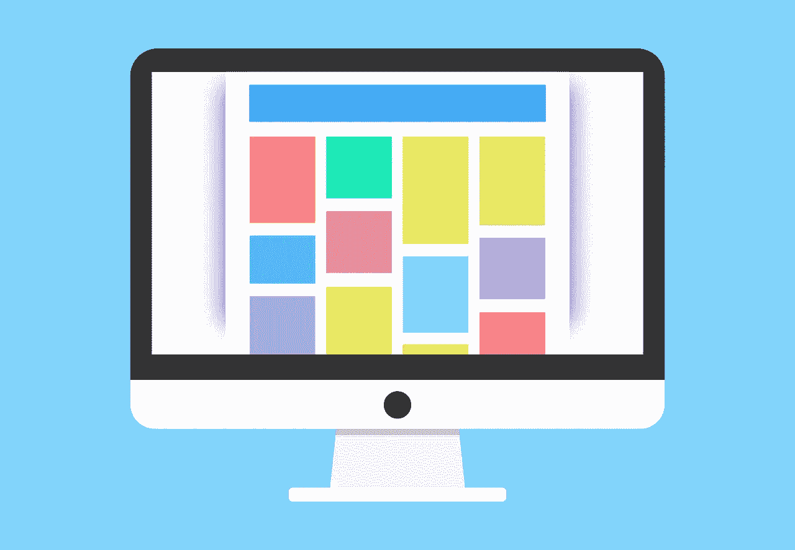
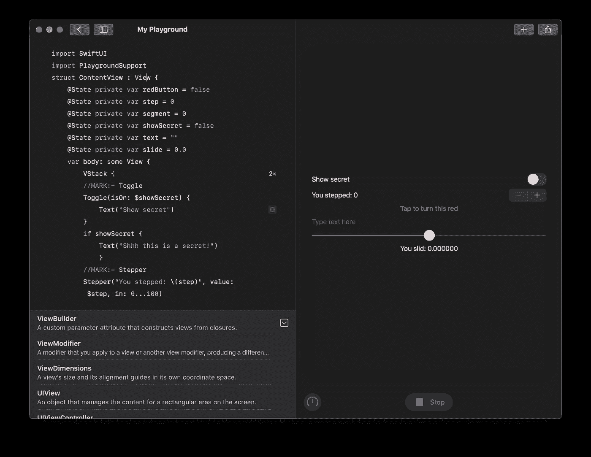
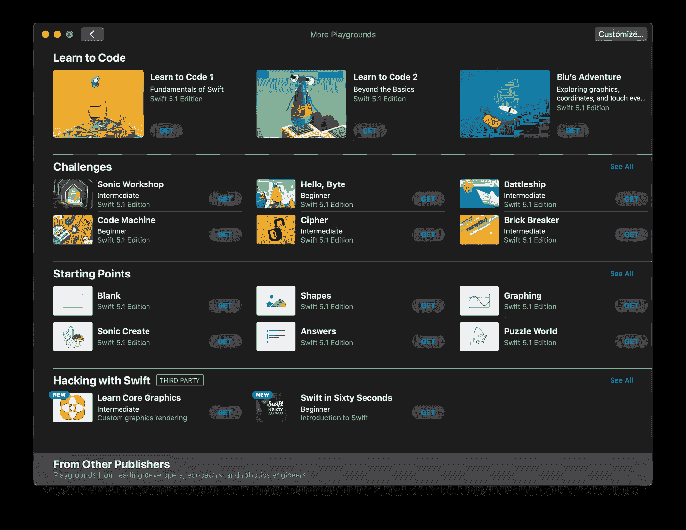

# 使用 macOS 的新 Playgrounds 应用程序编写和预览 SwiftUI

> 原文：<https://betterprogramming.pub/use-the-new-playgrounds-app-for-macos-to-write-and-preview-swiftui-7c61388b5e20>

## 你不再需要 Xcode 来编写 Swift 或者用 SwiftUI 开发动态的、跨平台的界面——苹果的轻量级代码编辑器就在这里

图片由 [200 度](https://pixabay.com/users/200degrees-2051452/?utm_source=link-attribution&utm_medium=referral&utm_campaign=image&utm_content=1684591)发自 [Pixabay](https://pixabay.com/?utm_source=link-attribution&utm_medium=referral&utm_campaign=image&utm_content=1684591)

当我听说 Playgrounds 已经为 MacOS 发布时，我很困惑。Playgrounds 自 2014 年以来一直存在，当时它们与 Swift 编程语言一起推出。对于那些从未以这种形式使用过它的人来说，它本质上是一个读取-评估-打印-循环(REPL)环境，用于快速构建小代码片段的原型。如果你不知道什么是 REPL，你可以把它想象成一种分析每一行代码的方法，在代码的最后显示结果。有一个计数器可以计算一个循环运行的次数，点击任何一个变量都可以让你添加一个`Viewer`,这个变量的值在代码执行的整个过程中都会显示在屏幕上。

使用该工具也可以制作更复杂的项目，但你不能在 iOS 设备或模拟器上构建它们，也不能在 App Store 上发布它们。

Swift Playgrounds iPad 应用于 2016 年推出，但它与 Xcode 工具不一样。当然，有相似之处，但它更侧重于教育。该应用程序附带了一些有趣的课程，允许您的代码帮助卡通人物 alien Byte 绕过迷宫，或者学习 Blu's Adventure 中的绘画。这个想法是让可能无法使用 MAC 但经常可以使用 iPads 的儿童开始使用 Swift 编码。

教育编码课程从未在 MacOS 上出现过。直到现在！

iOS 开发中最令人兴奋的新事物，SwiftUI 是一个新的声明式框架，用于为 iOS、MacOS、tvOS 和 WatchOS 创建动态和响应界面。有两种方法可以使用它来制作 MacOS 应用程序——传统方法，通过创建 MacOS 项目并选择 SwiftUI 作为用户界面，或者通过创建带有 SwiftUI 的 iOS 项目并选择 Mac 作为目标平台之一。现在可以使用名为 Catalyst 的框架为 iPhone、iPad 和 Mac 创建 iOS 项目。

为什么我要提催化剂？因为苹果现在已经用它把 iPad 版的 Playgrounds 带到了 MacOS 上。Xcode 版本仍然存在，但我们现在也有了教育编码类。当从 Mac 应用商店下载时，Swift Playgrounds 仅占用 155 MB 的空间，相比之下 Xcode 接近 10 GB。当我意识到你可以在操场上写 SwiftUI 时，我意识到实时视图有时比 Xcode 的画布预览效果更好。

以下是您将在本教程中制作的内容:

您将创建一个不使用 Xcode 的基本接口

这是一个非常基本的 SwiftUI 应用程序，只是为了让您看到如何使用该工具快速原型化控件。一旦你可以制作基本的控件，你就可以定制它们的外观，直到你乐意将它们复制到 iOS 项目中。Playgrounds 的另一个用途是向 WWDC 学生奖学金计划提交申请，因为完整的 iOS 应用程序不被接受。

操场可以展示你的编程天赋，而不需要在设备上安装任何东西。我认为苹果公司向这个方向发展是因为所有提交的文件都比较小！

# 我们开始吧

首先，从 Mac 应用商店下载免费的 Swift Playgrounds 应用[。在 MacOS 上有多个创建新项目的选项。你可以简单地进入文件>新建空白操场，一个使用 PlaygroundBook 格式的文件将被创建。如果你不打算在 Xcode 的 Playground 上使用你的文件，这没问题，但是有另一种格式可以两者都用。在屏幕的顶部，你会看到你之前在 iPad 上制作的任何游乐场。在底部，有一个写着“更多游乐场”的栏，右端有一个蓝色按钮，写着“查看全部”。](https://apps.apple.com/gb/app/swift-playgrounds/id1496833156?mt=12)

所有你在 Xcode 的游乐场里得不到的东西！

在这里你会看到我提到的所有教育教程，以及作为模板的各种起点。在“起点”上选择“查看全部”，然后选择“Xcode 游乐场”这些文件可能不具备 PlaygroundBook 所具备的所有功能，但它拥有我们在本教程中所需的一切。当你以后想要访问你的代码时，如果你使用 Xcode，而你的 Playgrounds 要求你在 Playgrounds 应用中打开它，这可能会令人沮丧。

现在，您将能够在没有 Xcode 的情况下开始编写 SwiftUI！

SwiftUI Playground 所需的绝对基础是导入两个库。`SwiftUI`是一个显而易见的例子，但是你还需要`PlaygroundSupport`，它可以让你访问`PlaygroundPage`。通过访问当前的`PlaygroundPage`实例，您可以设置实时视图，如果您想与代码一起预览界面，这是必不可少的。与 Xcode 中的预览画布不同，游乐场中的实时视图始终可以进行交互，并且永远不会暂停。它可能要求您再次运行它，但是您也可以选择它自动运行，稍后我将向您展示。

这是一个基本的初学者视图，您可以从中构建教程中的所有内容

这就是开始使用 SwiftUI 所需的全部内容。在右下角你会看到一个蓝色的按钮，上面写着“运行我的代码”点击这个应该会给你一个分割视图，显示你传递给文本的字符串。默认情况下，文本是居中的，将其放在 VStack 中允许我们添加多达十个垂直布局的子视图。如果我们有很多控件，也许我们会使用一个`List`或 `Form`，当内容对屏幕来说太大时，它们会自动滚动。

# 添加属性

我们需要一些属性来存储控件的状态。这意味着它们需要被标记为`State`，这意味着一个可以改变并随后导致整个视图被重绘的属性。毕竟，我们希望我们的用户界面在我们改变事物时做出反应，而不仅仅是保持不变。我们的每个属性都与一个控件相关，我们将在最后创建这个控件。这些属性需要在你的结构中，但是在声明返回“一些视图”的主体属性之前“某些视图”基本上是要求变量返回任何符合视图协议的具体类型。

这是我们需要存储的所有数据

`redButton` bool 将存储在蓝色和红色文本之间切换的`Button`的状态。不出所料，`step`整数是针对`Stepper`的。我们将使用`Toggle`和`showSecret`隐藏和显示秘密消息。您在`TextField`中输入的任何内容都将存储在`text`字符串中，最后，`Slider`的值将存储在`slide`中。如果您不知道绑定在 SwiftUI 中是如何工作的，我们就不会编写代码来在闭包中设置这些值。

相反，属性将以这样的方式绑定到控件，即更改控件将会更改相应的属性，反之亦然。例如，如果`Toggle`打开，您可以完全确定这反映了底层数据的实际状态。这使得用户界面更容易告诉我们到底发生了什么。它还减少了当我们忘记根据 UI 状态设置属性时出现错误的可能性！

# 添加控件

希望所有这些控件现在正在做什么是显而易见的。因为它们被绑定到状态属性，所以这些控件能够动态地改变用户界面。如果您再次单击“运行我的代码”，您将能够与所有控件进行交互，并亲自查看更改。

# 后续步骤

有很多高质量的资源供你学习。每当你对如何声明一个内置控件感到困惑时，我推荐你用 Swift 在 [Hacking 上搜索那个控件。当你对自己的 SwiftUI 技能更有信心，并想尝试更多高级功能时，请前往](https://www.hackingwithswift.com) [SwiftUI 实验室](https://swiftui-lab.com)。

SwiftUI 很可能会在 2020 年 6 月的 WWDC 大会上发生重大变化，因此在获得更多功能之前，尽可能对其当前的形式充满信心是一个好主意！