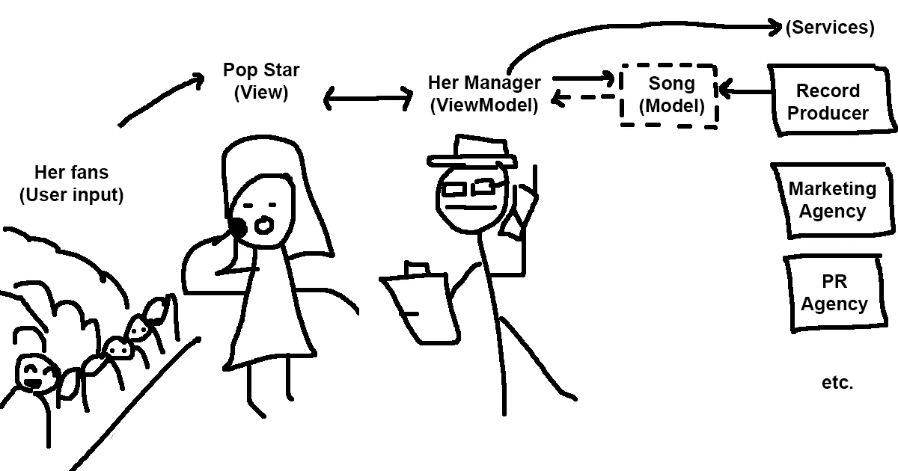
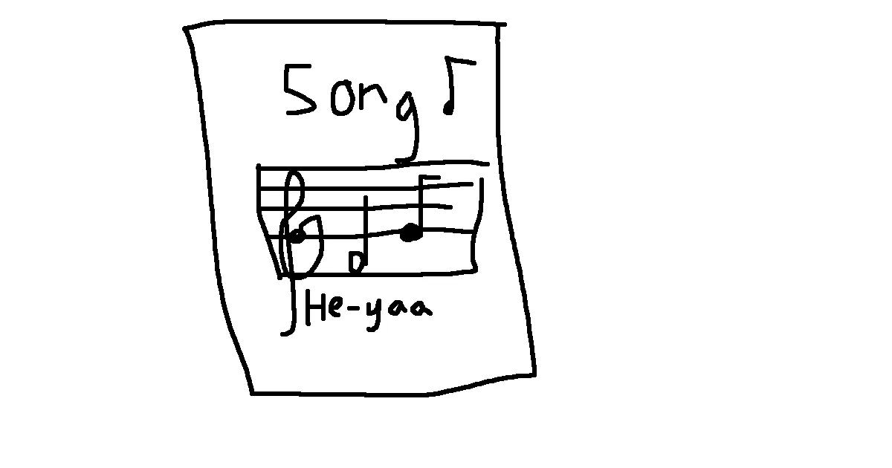
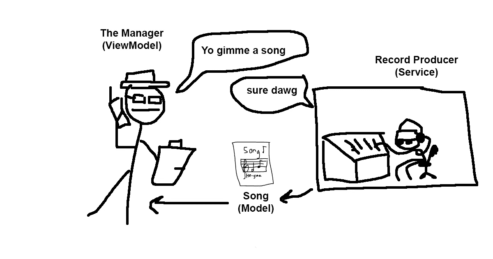
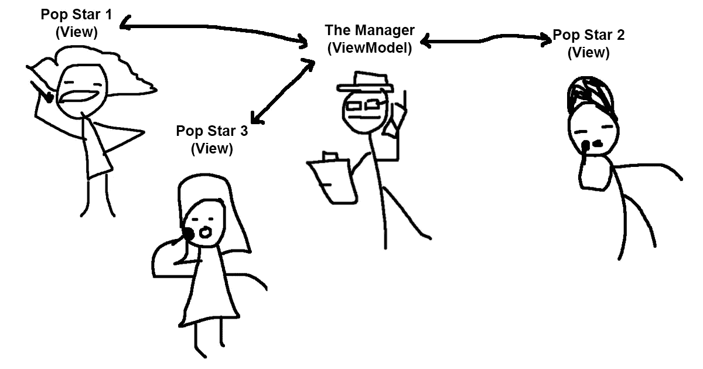

# 这里有一个流行明星的类比来推断 MVVM 的建筑

> 原文：<https://betterprogramming.pub/use-the-pop-star-analogy-to-deduce-mvvm-architectures-7c73a5dfa67b>

## 通过插图解释

[梁杰森](https://unsplash.com/@ninjason?utm_source=medium&utm_medium=referral)在 [Unsplash](https://unsplash.com?utm_source=medium&utm_medium=referral) 上的照片

作为一个 MVC(模型视图控制器)背景的人，我很难理解 MVVM 的架构模式(模型视图视图模型)。每个视图应该有哪些职责？视图模型的目的是什么？所有的业务逻辑都去哪里了？

我将向您展示帮助我更好地将 MVVM 模式应用到我的项目中的类比。

# 流行歌星的类比

这个类比发生在娱乐圈。

## 流行歌星(视图)

她的责任是走出去。她是整个行动的代言人。她需要看起来最漂亮，她需要与她的粉丝互动，她需要上演一场精彩的演出。

**职责**:

*   上演一场精彩的演出，让她的粉丝觉得自己是最漂亮的
*   唱**歌**
*   与粉丝互动(处理用户输入)

## 她的粉丝(用户输入)

在他们看来，**流行歌星**是唯一存在的东西；他们不知道也不关心行动背后发生了什么。当她唱一首好歌时，他们尖叫，有些人甚至给她写粉丝信。

**职责:**

*   听到一首好歌就尖叫，给流行歌星写粉丝信。

## 她的经理(视图-模型)

他有很多事情要做，即使他很少被看到，他也必须不断地告诉这位流行歌星下一次巡演的时间和地点，她会穿什么，她应该如何回答某些采访问题，以及唱什么歌。

很多这种信息不是由经理自己提供的，他通过与外界(营销机构、公关机构、唱片制作人等)沟通来授权。)，并在收到反馈信息时，与流行歌星交谈，以便她可以得到最新信息的通知。

经理非常关注球迷的任何反馈。如果歌迷不高兴，他总是确切地知道流行歌星应该如何回应。

**职责:**

*   向流行歌星提供所有需要的信息(穿什么，唱什么歌，如何回应采访)
*   接收粉丝的反馈，并告诉这位流行歌星如何回应
*   委派超出他能力范围的职责(营销代理、公关代理、唱片制作等)。)

## **宋(模特)**

这位流行歌星从她的经纪人那里得到要演唱的歌曲，而她的经纪人从唱片制作人那里得到歌曲。

**职责:**

*   是一首歌(包括标题、歌词、注释等。)

## **唱片制作人(服务)**

他们创作歌曲。它们包含了经理不需要的所有业务逻辑。

他们不是专门为流行歌星写歌，他们可以为任何人创作歌曲。他们只需要某些参数就可以准确地知道歌曲应该在什么样的背景下产生。

经理找到这些人，让他们唱一首欢快的流行歌曲。

**职责:**

*   创作歌曲

# **需要考虑的事情**

*   一个经理(视图模型)可以管理多个流行歌星(视图)
*   一个流行歌星(视图)只有一个经理(视图-模型)
*   唱片制作人(服务)是完全独立的。

感谢阅读。我希望这个类比有所帮助。