# 使用 Truffle Suite for Easy web 3——赢取 POAP 贡献证明

> 原文：<https://betterprogramming.pub/use-the-truffle-suite-for-easy-web3-and-earn-your-proof-of-contribution-poap-90a9b6732c98>

## 今天就提升你的社交证明


照片由[陈细洁·威迪特](https://unsplash.com/@abbiew?utm_source=medium&utm_medium=referral)在 [Unsplash](https://unsplash.com?utm_source=medium&utm_medium=referral) 上拍摄

# 介绍

Web3 的承诺之一是应用层的开放性、可组合性和互操作性。一种范例，其中开源软件和工具使其他人能够为他们认为有价值的项目做出贡献，而项目通过公开托管他们的代码库来提供透明度。另一个 Web3 倡议提供了贡献的链上证明——证明你能做到你所说的。

体现这些 Web3 原则的一家公司是 Truffle。不仅它的大部分工具是开源的，所以任何人都可以贡献，而且他们还为那些做贡献的人提供 POAPs。

本文将探索 Truffle 的开源工具套件，什么是 POAPs，并教你如何做出第一份贡献来证明你是 Truffle 的 Web3 构建者。

# 什么是松露？

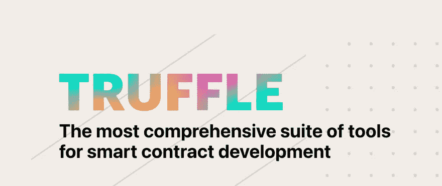

如上图所示，Truffle 是一套智能合同开发工具。此外，它是为以太坊创建的第一批 devnets 之一。从编写到部署以及其间的一切，Truffle 套件使这一过程更加简单和安全。最棒的是。大多数工具都是开源的。因此，您可以修改这些工具以更好地满足您的需求，并与更广泛的 Web3 社区共享您的更改。

[松露套件](https://github.com/trufflesuite)包括以下内容:

*   [松露](https://github.com/trufflesuite/truffle)
*   [加纳切](https://github.com/trufflesuite/ganache)
*   [用于 VS 代码扩展的块菌](https://github.com/trufflesuite/vscode-ext)
*   [松露仪表盘](https://trufflesuite.com/docs/truffle/how-to/use-the-truffle-dashboard/)
*   [松露盒](https://trufflesuite.com/boxes/)

让我们来看看这些工具，以便更好地理解它们。

# 松露

[Truffle](https://github.com/trufflesuite/truffle) 是该套件中的旗舰工具，它是一个开发环境，使构建智能合约项目变得更加容易。这个工具包括自动化测试、可配置的构建管道、可脚本化的部署、内置的网络管理等等。

松露入门很简单。在您的终端中键入以下命令来安装该工具，然后初始化一个新项目:

```
$ npm install -g truffle
$ truffle init
```

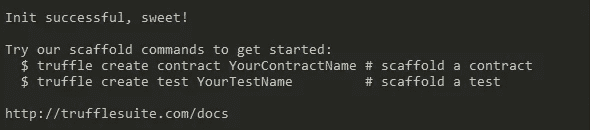

`truffle init`命令创建一个包含所需文件夹结构和配置文件的空白项目，这样您就可以快速开始构建了。

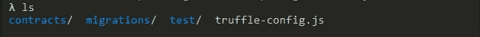

# 加纳切

一旦你有了一个智能合同，你需要在区块链上测试它。这就是[加纳切](https://github.com/trufflesuite/ganache)的用武之地。Ganache 是一个本地托管的区块链，在您的机器上模拟以太坊。它允许你在 solidity，fork mainnet(或任何其他以太网)中使用`console.log`，设置挖掘选项，模拟真实账户，等等。

Ganache 对于测试智能契约以了解它们在部署到 testnet 或 mainnet 时的行为是必不可少的。

安装 Ganache，然后使用以下命令运行它:

```
$ npm install ganache --global
$ ganache
```

**注意**:您可以使用以下格式[用各种选项](https://github.com/trufflesuite/ganache#startup-options)启动 Ganache:

```
$ ganache --namespace.option="value"
```

此外，您可以在浏览器中运行 Ganache，方法是在 HTML 代码中包含以下内容，用您安装的 Ganache 版本替换`{VERSION}`:

```
<script src="https://cdn.jsdelivr.net/npm/ganache@{VERSION}/dist/web/ganache.min.js"></scrip
```

# VS 代码的松露

如果 Visual Studio 代码是您选择的编辑器， [Truffle 有一个有用的扩展](https://github.com/trufflesuite/vscode-ext)，它使您能够在不离开编辑器的情况下创建、构建、调试和部署您的项目。它还包括与您的 Infura 帐户的直接集成，因此您可以使用定制的 RPC 端点和 Infura 提供的所有可观察性来轻松部署您的项目。

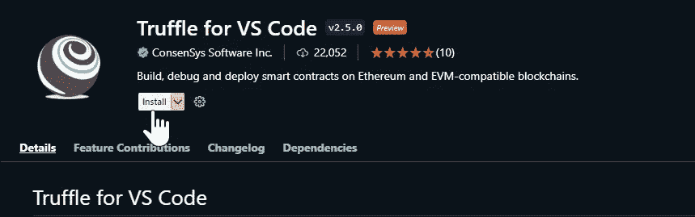

安装了用于 VS 代码扩展的 Truffle 之后，你可以用`ctrl + shift + P`打开命令面板，输入`truffle`，开始一个新的项目或者运行其他命令。

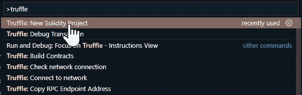

# 块菌仪表板

开发智能合约项目最危险的一个方面是意外暴露您钱包的私钥或助记短语。[Truffle Dashboard](https://trufflesuite.com/docs/truffle/how-to/use-the-truffle-dashboard/)通过对流程的这一部分进行抽象，同时提供一个 GUI 来与之交互，从而消除了这种风险。

安装了最新版本的 Truffle 之后，你所要做的就是配置你的`truffle-config.js`文件，在`networks`对象中包含以下内容:

```
networks: {
    dashboard: {
        port: 24012,
    }
  },
```

然后使用命令`truffle dashboard`启动仪表板，将在浏览器中的`[http://localhost:24012/rpcs](http://localhost:24012/rpcs)`处显示 GUI。从那里，您可以连接您的[元掩码](https://metamask.io/)钱包，并选择您希望部署到的网络。当您准备好部署 smart contract 时，键入以下命令以启动到连接网络的部署:

```
$ truffle migrate --network dashboard
```

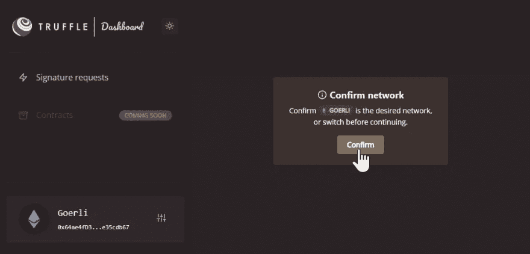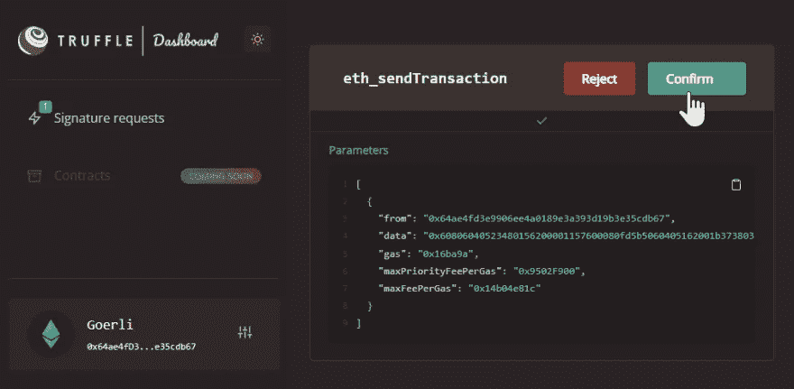

# 块菌盒

[松露盒子](https://github.com/truffle-box)是样板文件或启动文件，为你的项目设定一个特定的方向。它们由代码组成，可以让你快速前进，所以你不必每次都重新发明轮子。一些有用的框包括 [nft-box](https://github.com/truffle-box/nft-box) 、[乐观](https://github.com/truffle-box/optimism-box)、[仲裁](https://github.com/truffle-box/arbitrum-box)、[反应](https://github.com/truffle-box/react-box)和[多边形](https://github.com/truffle-box/polygon-box)。你甚至可以[创造你的松露盒子](https://trufflesuite.com/docs/truffle/how-to/create-a-truffle-box/)！

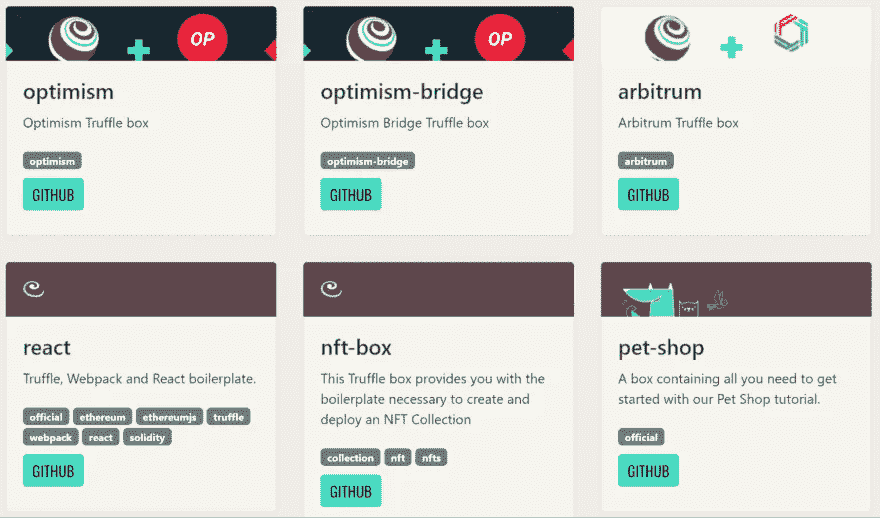

从[可用块菌盒列表](https://trufflesuite.com/boxes)中选择一个盒子，并运行命令:

```
$ truffle unbox <box_name>
```

这将创建一个新的 Truffle 项目，包含所选 Truffle 框中的所有样板文件。

# 对松露有贡献

现在你已经熟悉了 Truffle 工具套件，让我们学习如何为他们的文档做出贡献并获得 POAP 奖。

## 什么是 POAP？

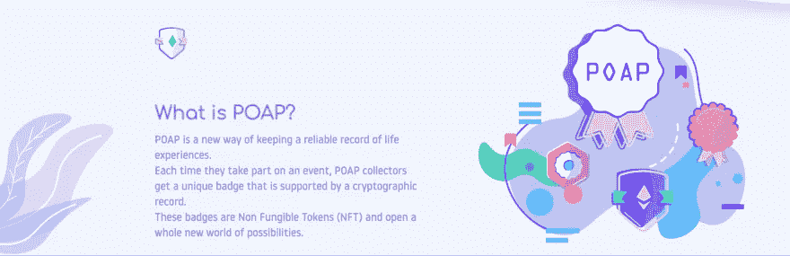

出席证明协议(POAP)是 Web3 中的一个平台和基础设施，用于发布令牌来证明某人做了某事。那可能是参加一个活动，在一个社区投票，或者为一个项目做贡献。POAPs 是根据出席证明协议智能合同制作的 NFT，是由收集者持有的数字记录，通常用于证明他们参加了虚拟或物理活动。在我们的案例中，我们将因对 Truffle 的文档做出贡献而获得 POAP 奖。

# 你的第一篇文献贡献

在本文的下一部分，我们将逐步赢得年度贡献者 POAP，并成为 2022 年松露贡献者。Truffle 正与 GitPOAP 合作向贡献者发布 POAP。GitPOAP 是一个贡献者认可平台，可以轻松地将 POAP 发行集成到 GitHub 中。一旦我们对 Truffle 的文档做出了有意义的贡献，我们可以向 Truffle 的存储库(repo)提交一个 pull 请求(PR)来合并我们的贡献。之后，我们可以通过 GitHub 登录 GitPOAP，认领我们的 POAP，并在我们的个人资料页面查看收藏品。

# 如何提交您的投稿

打开一个新标签，前往松露的 [GitHub 页面](https://github.com/trufflesuite/truffle)。

我们将查看文档，看看我们能做些什么。我立刻看到了我们可能有用的地方。Truffle 的自述文件中的第一句话概括了 Truffle 软件的三个不同的价值主张。然而，它缺少了一些语法上的关键来强调:可爱的牛津逗号。牛津逗号允许数组中的每一项都有一个名称空间。虽然它们是文体上的(比如你在杂志和报纸上看到的 AP 风格的写作)，但它们在技术文档中完全有用。

Truffle 的开篇是这样写的:“Truffle 是以太坊的开发环境、测试框架和资产管道，旨在让以太坊开发者的生活更轻松。”在我看来，这句话如果说“Truffle 是以太坊的开发环境、测试框架和资产管道，旨在使以太坊开发者的生活更加轻松”会更好读。测试框架和资产管道是不同的产品，所以逗号将有助于增加一定程度的分离。让我们向松露的团队提交一份 PR。不管你的操作系统是什么，这个过程都是一样的。

先来“叉”一下松露在 GitHub 上的回购。fork 是一个独立但完全相同的块菌回购版本，我们可以用它来提交我们的 PR。我们可以在不影响主回购的情况下在这个分叉中工作。

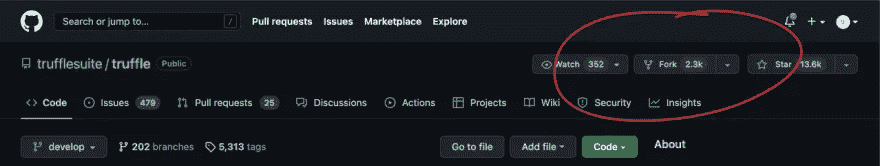

从这里，我们可以制作我们的松露餐叉。我已经做了一个，如下图所示:

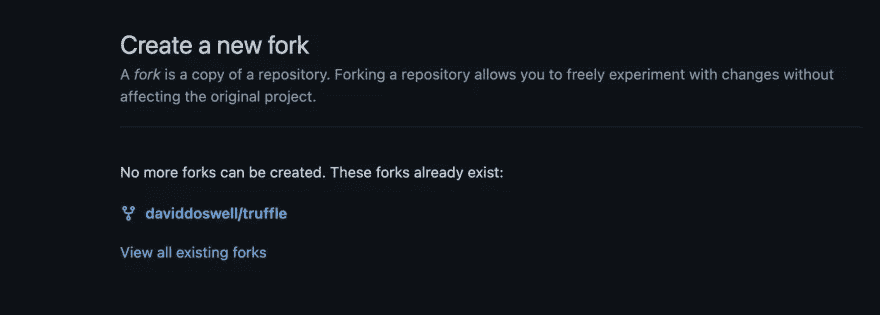

接下来，我们可以将新的回购“克隆”到我们自己的机器上。这将允许我们在我们选择的 IDE 中处理回购，对我来说这将是 VS 代码。确保我们在正确的(我们自己的)存储库分支中，让我们复制 URL，比如`git@github.com:daviddoswell/truffle.git`，并将其粘贴到我们的终端窗口中。

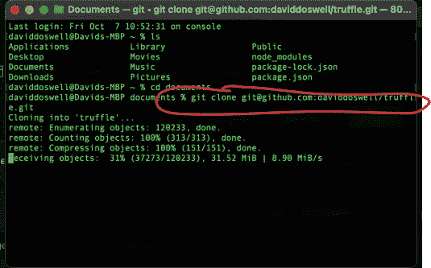

一旦我们这样做了，我们就可以在我们选择的 IDE 中打开项目。

在 VS 代码内部，我转到 README.md 文件，找到我要更新的第一句话。我更改它，然后将更改从我的本地拷贝推送到我的远程(上游)拷贝。你可以在第 11 行看到我的牛津逗号:

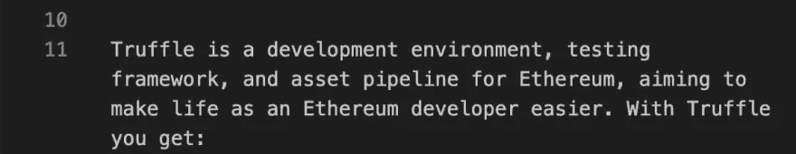

让我们推动这些变化:

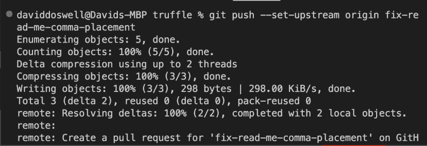

软件现在告诉我们创建一个拉取请求(PR)。我们可以导航回我们的 repo 并检查更改。有时候你可以提前联系回购维护者，让他们知道你正在做这个项目，尤其是如果它是开源的。在我们的案例中，一个松露维护者立即看到了我们的 PR 并批准了它。

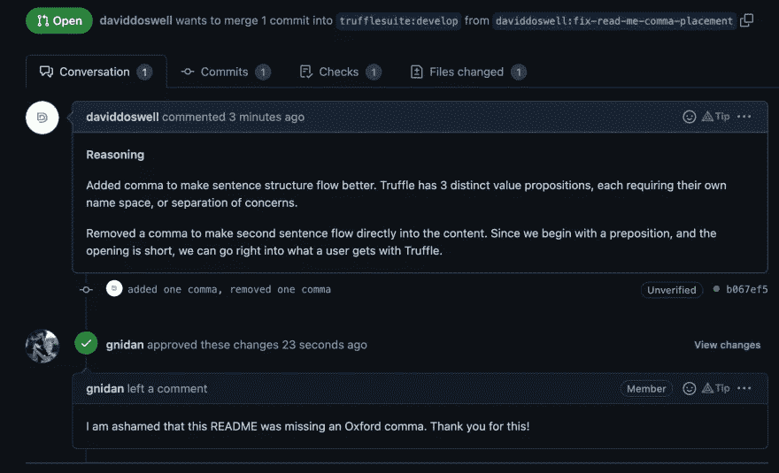

大多数项目需要两个或更多的批准才能问责。别担心。我们也收到了。

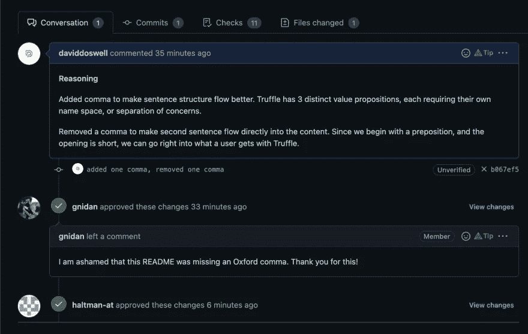

经过一些检查，以确保我的回购通过所有的安全，编程和其他保证，他们可以合并我的公关。对于大型项目，这通常需要大约两个小时，但也可能是迟早的事。


现在，我们可以去 GitPOAP 看看松露是否因为我们的贡献而授予我们 POAP 奖。首先，我们需要连接 MetaMask 钱包。单击登录按钮，然后选择元掩码。

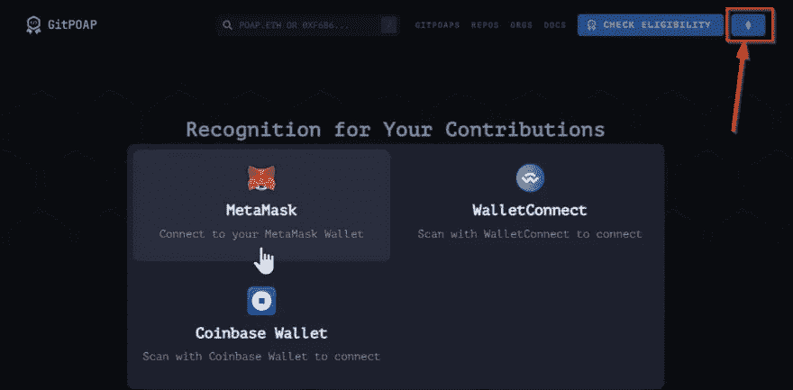

接下来，我们可以选择连接我们的 Github 帐户。

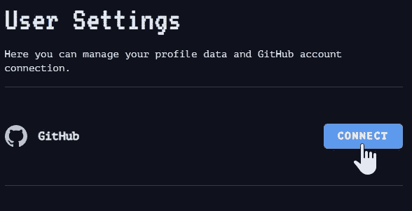

不幸的是，我们还不能铸造任何东西。我们必须首先向 GitPOAP 投稿。那么，让我们开始入职流程。

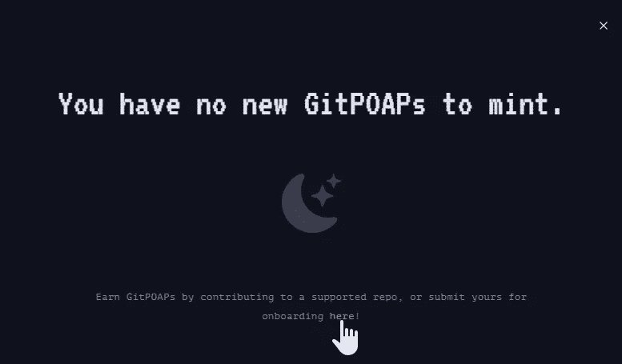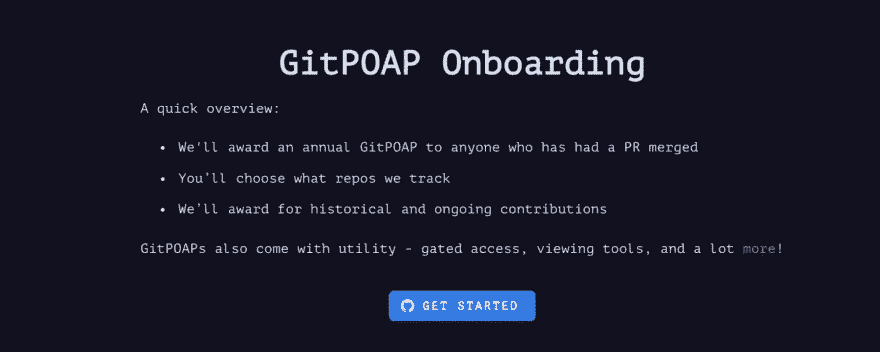

按照提示成功提交投稿。

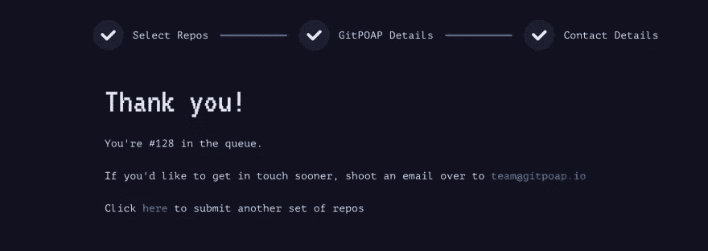

现在，我们等着。

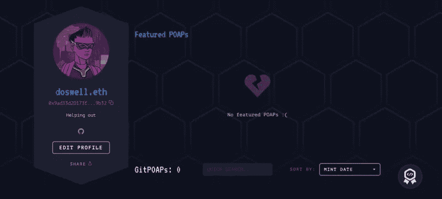

一旦我们的 POAP 出现，我们可以铸造它。嘣！

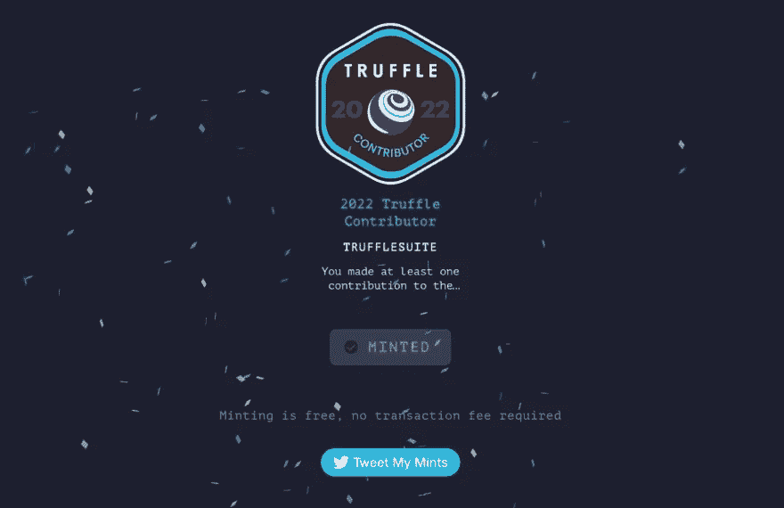

现在，我们可以回到我们在 GitPOAP 网站上的个人资料，查看我们是否是正式的 POAP 持有者。

我们是！

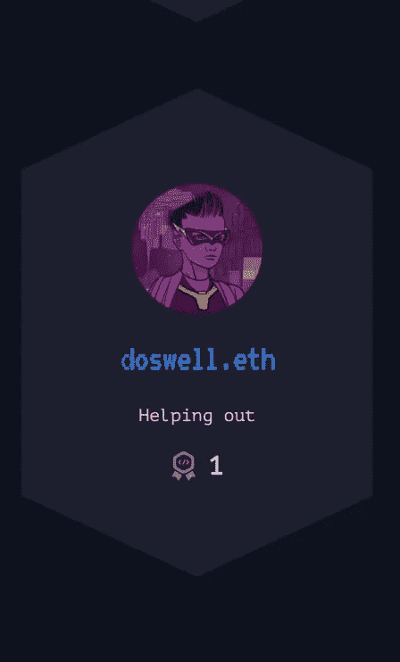

# 结论

在本文中，您了解了 Truffle 工具套件，什么是 POAP，以及如何通过为 Truffle 文档做贡献来获得一个。如你所见，通过 POAP 获得贡献证明对证明你的能力很有用。

此外，像 ConsenSys 这样的公司正在帮助创建一个建立在信任和开放基础上的生态系统，这些公司将他们的一些工具开源，并奖励做出贡献的参与者。尽管 Web3 仍处于起步阶段，但它的发展方向对开发者和用户来说都很有前途。

要了解更多关于 Truffle 套件的信息或开始使用他们的工具进行构建，[查看他们的文档](https://trufflesuite.com/docs/)或 [GitHub repo](https://github.com/trufflesuite) 。