# 如何使用析构和箭头函数来改进您的 JavaScript 代码

> 原文：<https://betterprogramming.pub/use-these-javascript-features-to-make-your-code-more-readable-ec3930827226>

照片由 [Fabian Grohs](https://unsplash.com/@grohsfabian?utm_source=medium&utm_medium=referral) 在 [Unsplash](https://unsplash.com?utm_source=medium&utm_medium=referral) 上拍摄

这里有一些日常小技巧，可以让你的 JavaScript 代码可读性更好。

# 解构

以这个(有意)深度嵌套的对象为例。阅读哺乳动物的`age`会让我们看到非常长且重复的代码。

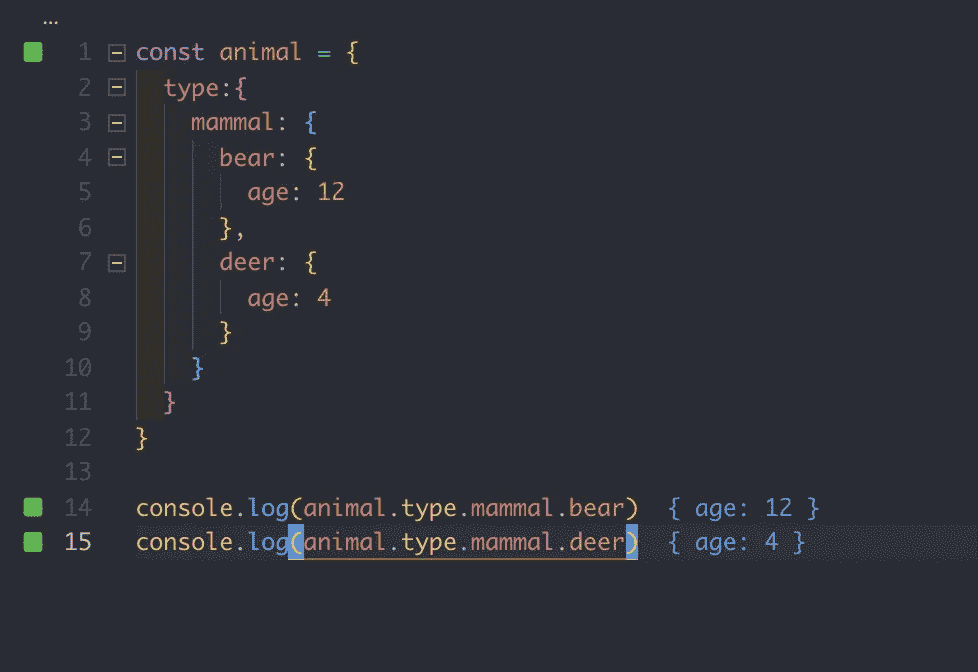

相反，我们可以通过对象析构来大幅缩短代码。

# 对象析构

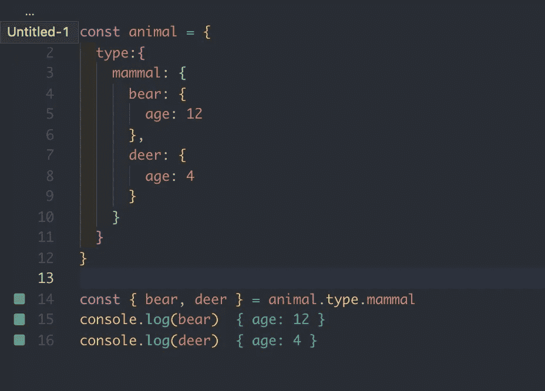

毁灭熊和鹿

好多了，没那么罗嗦。注意，我们使用常数，因为我们不想改变年龄。但是想想看；年龄不是一个常数，事实上，年龄每年都会增加一次。

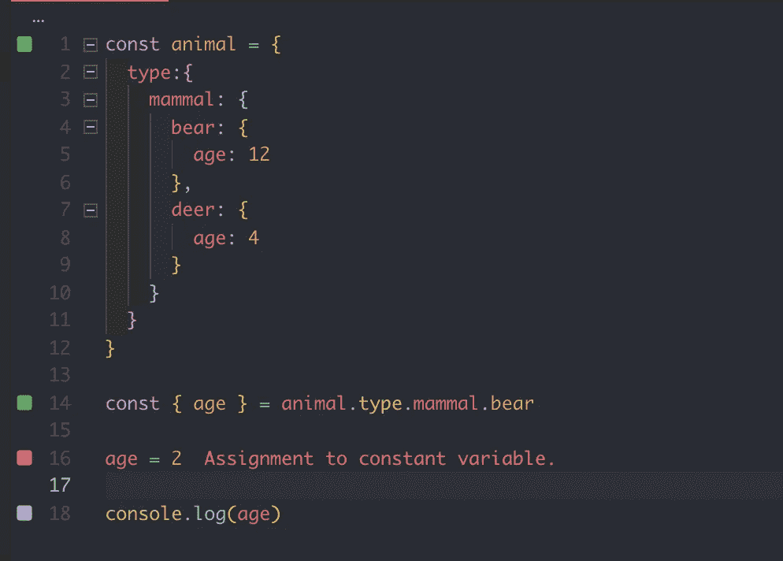

如果我们把它声明为一个常量，然后试图改变它，我们会得到一个错误。这就是常数的意义——它是不可改变的。

为了绕开这个(故意的)限制，我们可以使用`let`关键字(可变的)来代替。

太好了，有用。让我们试着用`let`和`const`两个关键词来解构一下。给熊和鹿起个名字。现在，通常，一个人的名字不会改变太频繁，如果有的话，因此我们可以把它视为不可改变的。

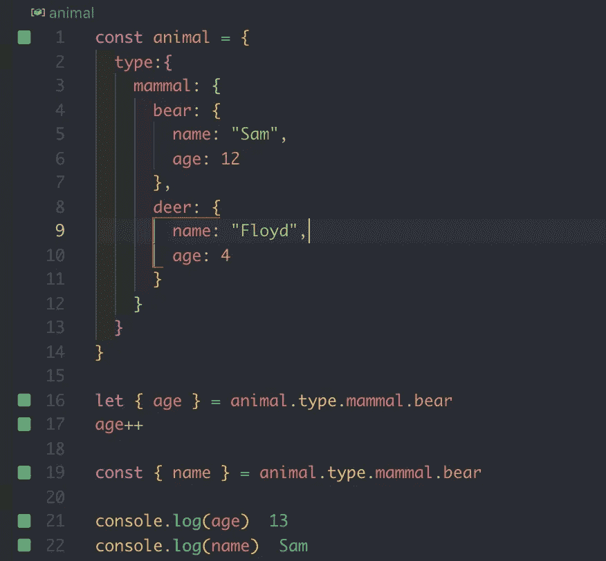

我们也可以对数组应用解构，就像这样:

# 数组解构

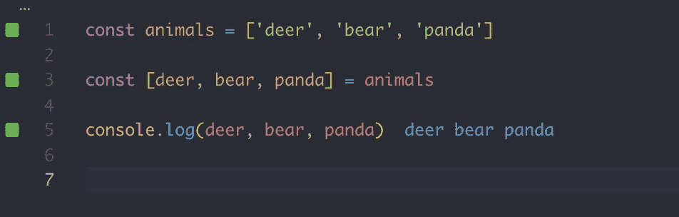

很酷，但是还有更多！

我推荐多看一些解构的酸甜苦辣。下面你会发现一个关于析构的详细章节。

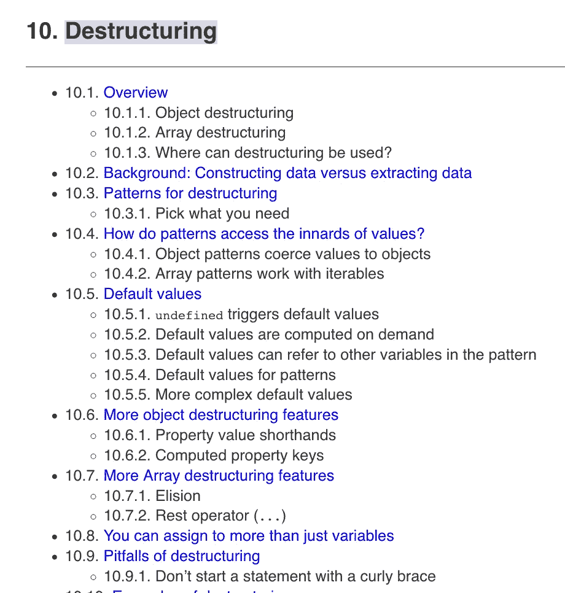

[http://exploringjs.com/es6/ch_destructuring.html](http://exploringjs.com/es6/ch_destructuring.html)

# 箭头功能

箭头函数是缩短代码的一种很酷的方式。它们与传统功能不太一样。箭头函数是词汇范围的。我们一会儿会谈到这一点。

以我们之前的动物为例。你将如何循环每个动物，以及`console.log`每个动物？

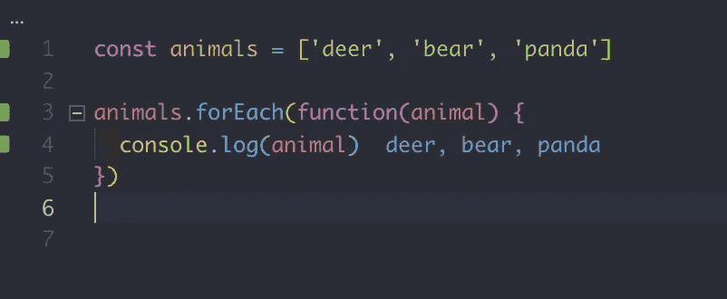

没什么太特别的，传统的`forEach`循环。对于每一只动物，我们都要登记。让我们重构我们的`forEach`循环来使用箭头函数。

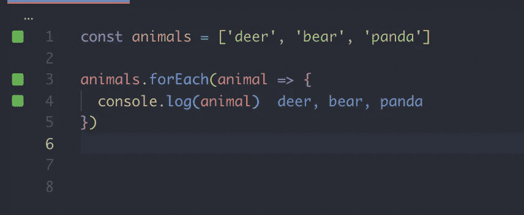

干净多了，不罗嗦了。我们需要编写的代码越少，将来需要维护的代码就越少。一个好的经验法则是少写代码，但是不要写过于复杂的代码。

这里有一个更复杂的例子:

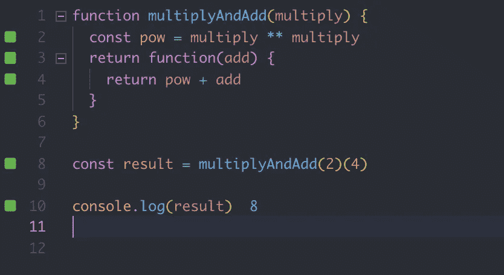

这种模式被称为 currying。我们在函数中返回一个函数。使用 currying 的最著名的例子是来自 [Redux](https://redux.js.org/introduction/getting-started) 的`connect()()`函数。

注意，`**`是取幂运算符，它相当于`Math.pow`。

`multiplyAndAdd`功能说明:

*   `multiplyAndAdd`取一个数，将`base`返回到`exponent`的幂(乘法)。
*   将一个数字加到指数上。

`multiplyAndAdd(2)(4)`和`2x2 + 4`一样。

让我们使用箭头函数编写相同的功能。

肯定不那么罗嗦了——但是我们可以做得更多。

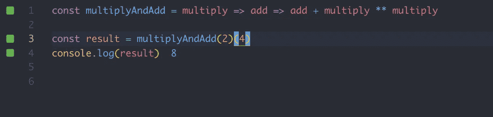

太好了，我们从六行代码减少到只有一行代码！

## **注意事项 1**

请注意，这里没有 return 语句。通常情况下，需要使用`return`语句从函数中返回值。箭头函数隐式调用`return`，只要没有大括号。如果我们使用带括号的箭头函数，我们必须显式地调用返回。

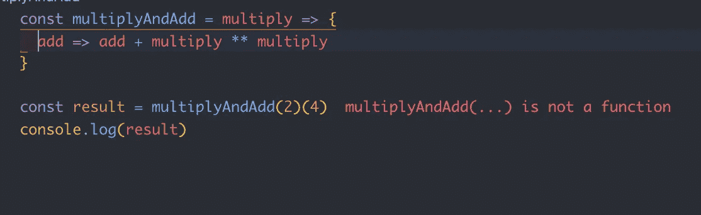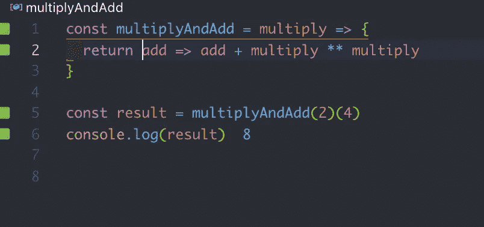

如果这对你来说是新的，看看这篇关于退货规则的文章。

## **注意事项 2**

`this`关键字与箭头函数的工作方式不同。

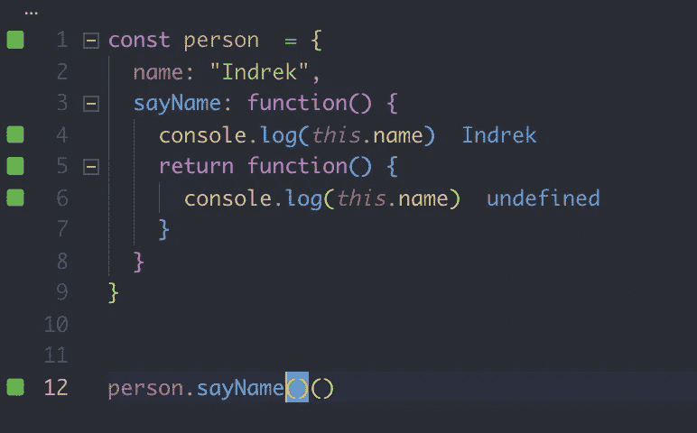

举个例子:

我们有一个`person`对象。在对象内部，我们有两个属性；人的`name`，以及一个返回`person`名称的函数。

如果我们调用`sayName`方法，第一个`this`指向 person 对象，但是第二个`this`是`undefined`。

注意，第二个`this`实际上指向窗口对象，但是因为我们使用的是 [Quokka](https://quokkajs.com/docs/index.html) ，所以没有窗口对象。

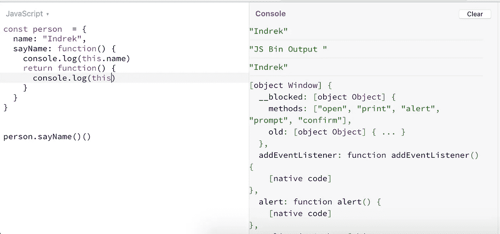

第二，这指向窗户

为什么会这样？这其实也是一个很常见的面试问题。回答这个问题表明你对语言机制有很好的理解。[查看这个 StackOverflow 答案，获得深入的答案](https://stackoverflow.com/a/3127440/5073961)。

下面是使用常规函数解决这一问题的常见方法。

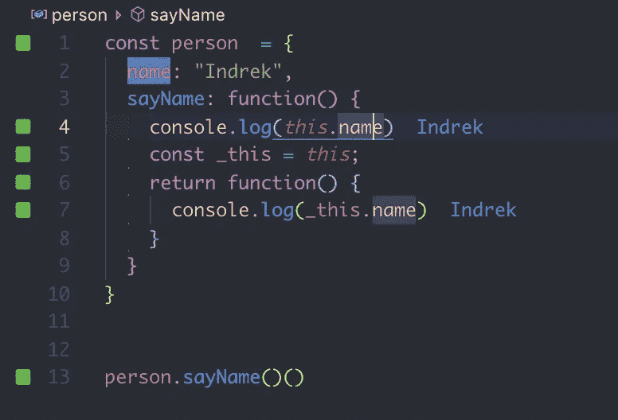

Arrow 函数是词汇范围的，它在 arrow 函数中的值是由周围的范围决定的，因此它们不需要这种变通方法。

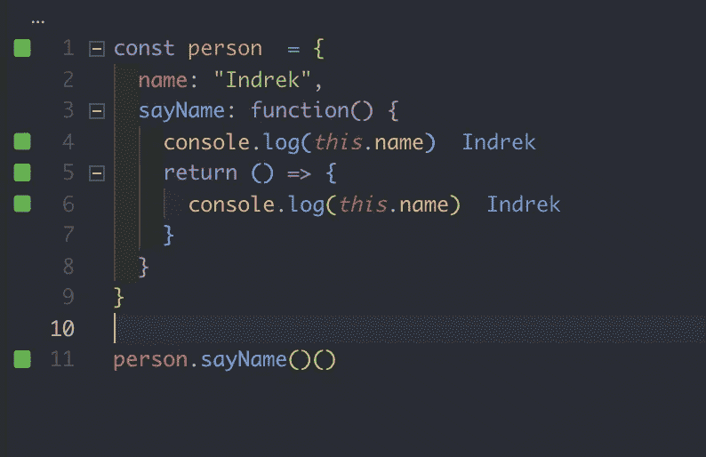

如果你想让你的 JavaScript 更上一层楼，我建议阅读“[雄辩的 JavaScript](https://amzn.to/2yoybJd) ”这本书。

感谢阅读，保持敬畏！❤