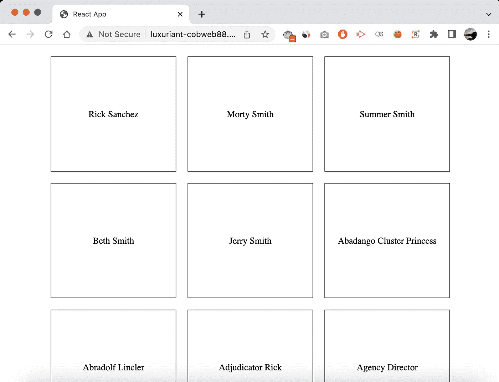

# 用计时思维加速你的发展

> 原文：<https://betterprogramming.pub/use-timeboxing-mindset-to-speed-up-your-development-e0aa48c9e27f>

## 在更短的时间内取得成效

在 [Unsplash](https://unsplash.com?utm_source=medium&utm_medium=referral) 上由 [Aron 视觉](https://unsplash.com/@aronvisuals?utm_source=medium&utm_medium=referral)拍摄的照片

时间框是一种技术，在这种技术中，您可以为计划好的活动分配一个固定的时间段。但我不打算在这篇文章中谈论与 timeboxing 相关的工具。我只是喜欢时间拳击背后的思维模式，因为它推动我们在更短的时间内达到目标。

如果你是一个有几年经验的开发人员，你想用更短的时间完成更多的工作，因为你以前做过很多类似的工作。你知道需要做什么…但是你能比以前更快地完成它吗？

## 我们将比较未优化的工作流和优化的工作流。

我们想制作一个简单的页面，如下所示:

演示:[http://flurry-cobweb 88 . surge . sh](http://luxuriant-cobweb88.surge.sh/)

调用 API 来呈现 3 列响应布局。桌面上 3 列，移动上 1 列。

如果你以前做过这件事，你应该问自己“我能多快做完”。我知道对于任何有经验的开发人员来说，完成这项任务都很容易，这是我们在互联网上随处可见的东西。

我自己做了一个实验，在 codesandbox 中编写代码，用了 8 分钟来手工输入所有内容。

视频没有显示一个完成的结果，因为我的屏幕录制软件的限制是 5 分钟的免费版本。我只想说明一点:一个没有优化的工作流程是在浪费时间。

我们在 5 分钟内完成怎么样？

我没有徒手做这个页面，而是利用了我现有的工具，结果如下:

我使用的 VS 代码的两个片段扩展:

*   [https://marketplace.visualstudio.com/...](https://www.youtube.com/redirect?event=video_description&redir_token=QUFFLUhqbWE1bS11WnpISXFUZEpOZGhjUWVRRHdEVlRxQXxBQ3Jtc0tsN2xNaTFKQnNaOHBSMkhkOFZKTDRuaXRpWVZ5M25STjQ5VlFSYURIcDV3NnExaUdGRGlBRVlUbXFrN0JKS0YzNFlkRUpIZ0ZNNDZEX3lhVTdDYTItekxnRXN4MEw1N3lmbWx3UFpZN3Fpc1lPVXhxZw&q=https%3A%2F%2Fmarketplace.visualstudio.com%2Fitems%3FitemName%3Dburkeholland.simple-react-snippets)
*   [https://marketplace.visualstudio.com/...](https://www.youtube.com/redirect?event=video_description&redir_token=QUFFLUhqbGlkLWl2T1pabE1OV0tkTG01M0JQTTBza2ZaQXxBQ3Jtc0ttOVhxZVRWR2pUbEoxNFlXOXYwUUtfWEU5N0ZqWXNQOXNkb1RlMWxlN3Fid0FvMW1pUmhnNGpiNUtiNndTcmR2d3ZIZk96R1EwNUlzM1E5Z0NPX0phZ2R6NFFPQzhzNnRCbVJYVk96QVRDWjBBOXdCZw&q=https%3A%2F%2Fmarketplace.visualstudio.com%2Fitems%3FitemName%3Dinu1255.easy-snippet)

以及 CSS 布局的要点。结果呢？我完成的速度快了两倍。

# 这不是关于片段和要点，而是关于心态和习惯

如果你意识到你可以变得更有效率，你可以以一种更有成效的方式创新你的工作方式。您可以编写定制的 bash 脚本，创建`zsh`别名，使用备忘单，使用[扑通](https://plopjs.com)生成样板文件，或者简单地询问您的同事他们使用什么工具来更好地完成工作。

这个想法总是想办法更快地产生结果，尤其是在你熟悉的事情上。

想要更多例子吗？一个初级开发人员会在谷歌上搜索一个“如何”的问题，然后他们会找到一些教程，试图了解每个部分是如何组合在一起的。但是为什么一个中级开发人员在工作中谷歌多年后还会使用同样的方法呢？说你想要一个用于电子邮件验证的正则表达式，你的谷歌查询应该是“gist email validation regex”，点击第一个结果，你就会得到你想要的。看到了吗？甚至你的谷歌查询也可以优化。