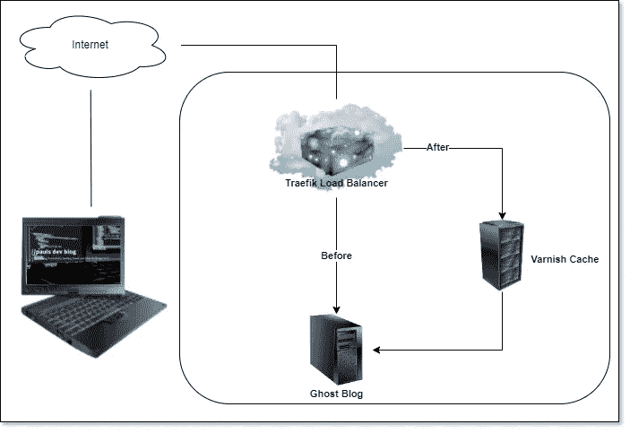

# 使用 Varnish HTTP 缓存和 Docker 来提高网站速度

> 原文：<https://betterprogramming.pub/use-varnish-http-cache-and-docker-to-boost-website-speed-4902a3377d1a>

## 将你的网站性能提升 20%


Julian Hochgesang 在 [Unsplash](https://unsplash.com/s/photos/speed?utm_source=unsplash&utm_medium=referral&utm_content=creditCopyText) 上拍摄的照片

为了提升[保罗的开发博客](https://www.paulsblog.dev)的性能，改善所有访问者的用户体验，我决定寻找机会将 HTTP 缓存集成到我的 Docker Swarm 环境中。

在研究了很长时间并且[询问了 Reddit 上的其他人](https://www.reddit.com/r/selfhosted/comments/wy2q0n/howto_integrate_nginx_as_caching_web_server_into/)(不幸的是，没有人能帮助我)之后，我找到了一个符合我期望的解决方案。

在研究过程中，我了解到 [Varnish](https://varnish-cache.org/index.html) 是一个 web 应用程序加速器，也称为缓存 HTTP 反向代理。它可以安装在任何使用 HTTP 缓存内容的服务器前面。它真的非常非常快，通常可以将交付速度提高 300-1000 倍，减少加载时间，并可以处理流量高峰。

在此视频中可以看到清漆功能的高级概述:

什么是清漆缓存？解说视频！

# 设置

我的新设置包括在我的 Docker Swarm 环境中使用 Docker 部署的 Varnish HTTP 缓存服务器。它位于我的 Traefik 代理和我的 Ghost 博客之间。在这个设置中，Varnish 用于缓存页面上的各种静态内容，比如 JavaScript、CSS、图像和文本文件。



在使用 Varnish HTTP 缓存之前和之后使用 Traefik 的 Ghost 博客服务

# 标杆管理

为了对我的网站进行基准测试，我使用了谷歌、[、giftofspeed.com](https://www.giftofspeed.com)和[tools.pingdom.com](https://tools.pingdom.com)的 [Lighthouse 扩展。所有测试站点加载整个站点，就像我们在浏览器中一样。我在不同的国家运行了不同的测试，分别启用和不启用清漆。在测试时，我发现性能提高了大约 20%。](https://chrome.google.com/webstore/detail/lighthouse/blipmdconlkpinefehnmjammfjpmpbjk?hl=en)

例如，在 giftofspeed.com 上，我在启用和不启用 Varnish HTTP Cache 的情况下测试了同一个 URL 几次，得到了以下结果:

## 无清漆 HTTP 缓存


## 带清漆 HTTP 缓存


# 你自己设置吧

首先，确保您安装了 docker 和 docker-compose。另外，你需要一个 Traefik 负载均衡器[来转发请求到我的 Ghost 博客。撰写文件中的所有规则(标签)都将基于我的个人 Traefik 安装。](https://www.paulsblog.dev/how-to-setup-traefik-with-automatic-letsencrypt-certificate-resolver/)

现在，为了在我的 Ghost 博客和 Traefik 代理之间建立一个 Varnish HTTP 缓存，我扩展了这个博客的撰写文件([在这里阅读我是如何建立它的](https://www.paulsblog.dev/how-to-self-host-ghost-blogging-platform-on-docker-docker-swarm/))，首先添加一个`varnish`部分，然后将所有标签从我的`ghost`服务移动到`varnish`服务。然后，我将负载平衡器服务器端口从 2368 (Ghost 端口)更改为 80 (varnish 端口)。

另一个必要的改变是，`ghost`服务的`networks`改变为只有`default`，而`varnish`服务有`default`和`traefik-public`。最后一个变化是向包含 Varnish 配置的合成文件添加一个配置。

合成文件的结果部分将如下所示:

在`ghost`服务中，我们定义了一个指向`default.vcl`的配置，如下所示:

在这个文件中，我为 Varnish HTTP 缓存声明了一些特殊的规则:

*   将`backend`设置为`ghost:2368`，因为在内部默认网络中，可以通过`ghost:2368`访问 ghost。
*   从缓存中删除`/ghost/...`、`/p/...`和`/admin/...`，因为管理菜单不应被缓存。
*   删除这个博客的根 URL，这样就不会有因为缓存而过期的文章列表。
*   添加一个 URL ( `/testclear`)来手动清除缓存。

我在 docker-compose 所在的文件夹中创建了 Varnish 配置文件。

现在，我可以使用以下命令部署您可以在 GitHub Gist 上下载的[完整合成文件:](https://gist.github.com/paulknulst/51cbba76197a23d4ffaeed2933d9cc63?file=docker-compose.yml)

```
$ docker stack deploy -c docker-compose.yml blog
```

如果你想使用它，请更新主机、数据库(MySQL)和邮件设置。

# 错误处理

## 调整清漆配置

如果我想改变 Varnish 配置，有必要改变配置名，因为你不能在 Docker 环境中改变配置。您可以很容易地在 Compose 文件中将它更改为一个新名称，部署它，然后删除旧密钥以在两个配置名称之间进行更改。

之后，您必须重新加载配置，因为它不会自动应用。为此，我切换到部署我的 Varnish 容器的服务器，并使用`docker exec`来重新加载 Varnish 配置:

```
$ docker exec YOUR_VARNISH_CONTAINER varnishreload
```

# 下载的文件不工作

如果您盲目地在 GitHub Gist 中下载文件，如果没有为 Mail、MySQL 和 Host 设置所需的变量，它将无法工作。看看[这个教程解释了用 Docker](https://www.paulsblog.dev/how-to-self-host-ghost-blogging-platform-on-docker-docker-swarm/) 设置 Ghost。此外，调整 MySQL 设置，因为 Ghost 的教程是在切换到 Mysql 之前创建的，这一部分缺失。但是，我正在研究一个简单的方法，将在几周内出版。

# 结束语

如果你遵循了我的方法，恭喜你，你已经用 Varnish HTTP 缓存安装了自己的 Ghost 博客，这将提高性能！

完整的合成文件可以在我为本文创建的 GitHub Gist 中找到[。如果你还有关于建立一个幽灵博客的问题，你可以](https://gist.github.com/paulknulst/51cbba76197a23d4ffaeed2933d9cc63)[按照我的教程在 Docker Swarm](https://www.paulsblog.dev/how-to-self-host-ghost-blogging-platform-on-docker-docker-swarm/) 中做这件事。

本教程到此结束。希望您现在能够设置您的安装。如果你喜欢读这篇文章，考虑在评论区发表你的宝贵意见。我很想听听你对 Varnish HTTP Cache 的反馈。此外，与其他博主分享这篇文章，帮助他们提高博客的性能！

```
**Want to Connect?**You can find me on [my Personal Blog](https://www.knulst.de), [LinkedIn](https://www.linkedin.com/in/paulknulst/), [Twitter](https://twitter.com/paulknulst), and [GitHub](https://github.com/paulknulst).
```

*本文最初发表在我的博客上*[*https://www . paulsblog . dev/how-to-use-varnish-as-http-cache-for-your-blog/*](https://www.paulsblog.dev/how-to-use-varnish-as-http-cache-for-your-blog/)