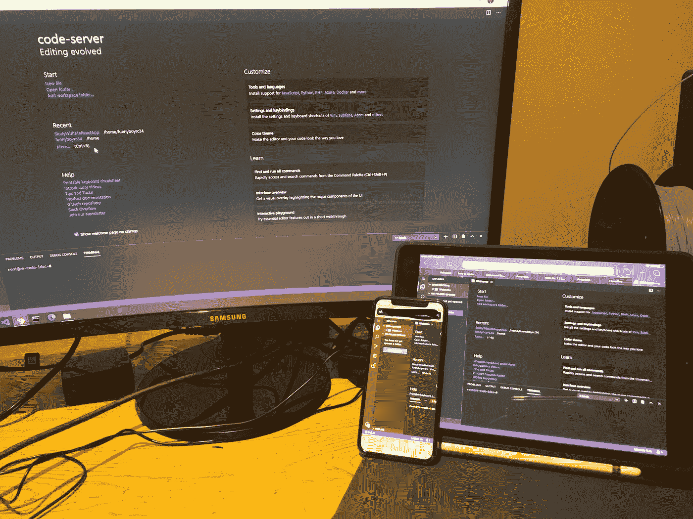
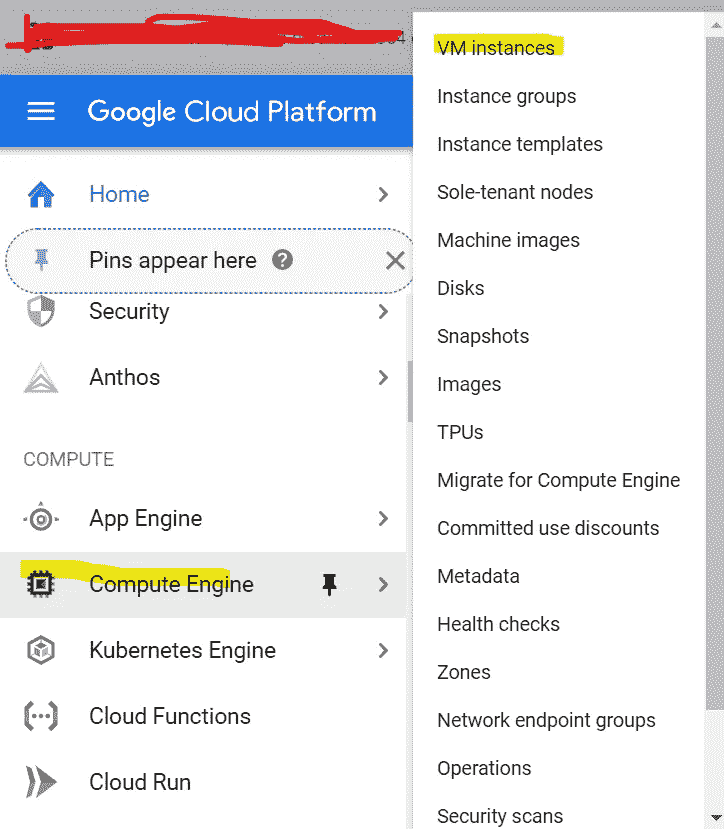
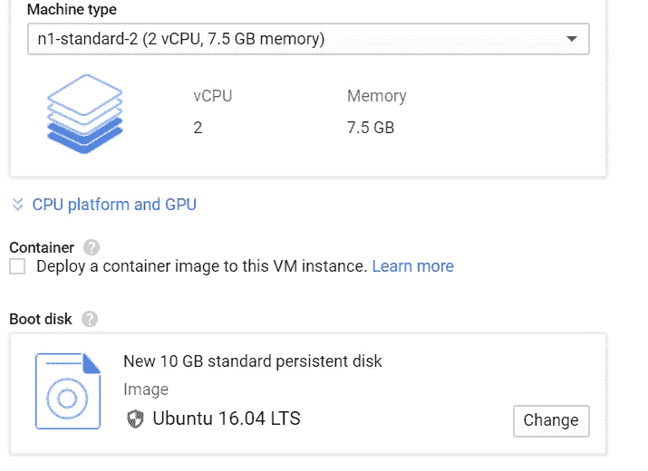
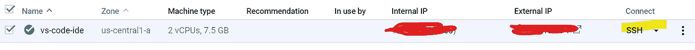

# 在任何地方的任何设备上使用 Visual Studio 代码

> 原文：<https://betterprogramming.pub/use-visual-studio-code-on-any-device-anywhere-79387de95296>

## 创建一个可以在任何地方访问的虚拟机



3 种不同的设备访问 Visual Studio 代码。图片作者。

在当今世界，数字化和便携是有好处的。开发人员需要在任何地方和任何设备上创建和维护代码。这是我在任何地方任何设备上开发的设置。我有一个高端的台式机来处理我的大部分程序，我也有一个 iPad，它很轻，很小，很便宜。我知道你在想什么，你不可能在 iPad 上编程。它不够强大，也没有一个好的 IDE 或文本编辑器。但这就是你错的地方。在我的配置中，我在所有设备上使用 Visual Studio 代码，在我的 iPad 上，我使用蓝牙键盘，这让它感觉像是我的桌面。

这是一个概念:在云中的虚拟机上运行 Visual Studio 代码，因此您可以在任何地方访问它。

# 让它发挥作用的步骤

1.在谷歌云平台(GCP)上创建(或登录)一个帐户。目前，有一个 12 个月免费试用的促销活动，可以用 300 美元的信用来支付您的虚拟机。



如何导航至虚拟机计算

2.通过转至计算引擎>虚拟机实例>创建，在 GCP 上创建虚拟机，这将在云上虚拟地创建一台计算机。



虚拟机配置

3.配置您的虚拟机。你的配置需要至少有两个 CPU，7.5GB 的内存，运行最新版本的 Ubuntu(对我来说是 16.04 LTS)。



SSH 导航

4.通过单击外部 IP 右侧的 SSH 按钮连接到虚拟机。

5.从 [Coders Github](https://github.com/cdr/code-server) 下载 Visual Studio 代码 3.3.1-Linux。Coder 是一家帮助人们节省时间配置和保护开发者环境的公司。这就是我们将要安装 Visual Studio 代码的工作。复制这个链接并粘贴到您的终端开始下载编码器(这个链接不是 Visual Studio 代码的最新版本，但它应该仍然完美地为我们将需要它的工作)。

```
wget https://github.com/cdr/codeserver/releases/download/v3.3.1/code-server-3.3.1-linux-x86_64.tar.gz
```

6.用这个`tar`命令提取文件:

```
 – tar -vzfx  code-server-3.3.1-linux-x86_64.tar.gz
```

7.要访问编码器，请记住通过键入以下内容来更改目录:

```
cd code-server-3.3.1-linux-x86_64 
```

8.通过键入以下内容启动 Visual Studio 代码。

```
sudo ./code-server 
```

一旦你输入了这个命令，它应该输出一个端口和一个密码

提示:可以通过添加:`*– – auth none*` *来禁用密码。*

要更改端口，您可以添加:`*– – port {any port number}*` *。*

9.访问 Visual Studio 代码。若要访问 Visual Studio 代码，您需要首先找到您的外部 IP。要找到它，去 [GCP 网站](https://console.cloud.google.com/home)并导航到计算引擎>虚拟机实例，在那里你会找到你的外部 IP 地址。之后，转到任何本地托管的浏览器，并在浏览器中键入以下命令:

```
http://{external IP}:{port number} 
```

提示:如果您想重新运行 Visual Studio 代码(如果您已经关闭了应用程序)，并且您已经完成了编码器的安装，只需打开您的终端并跳到第七步。

现在你可以在海滩、公园、甚至飞机上用 Visual Studio 代码编程，你可以在任何可以访问互联网的地方编程。