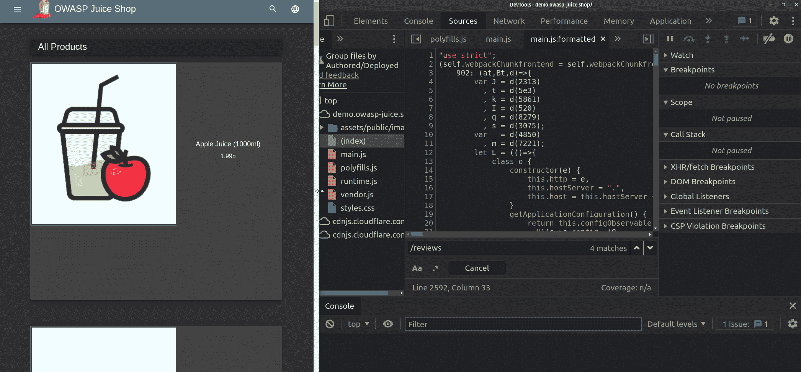
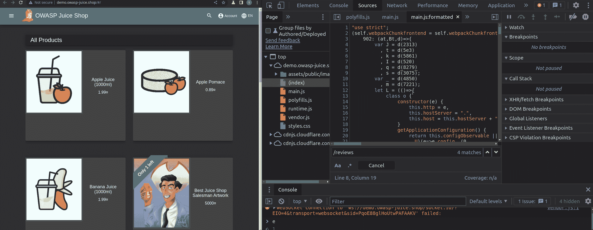
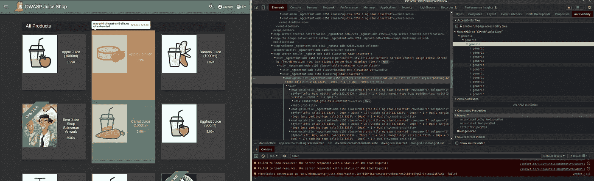
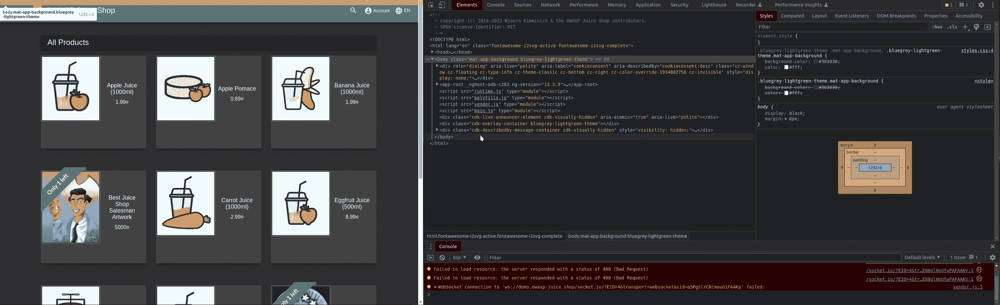
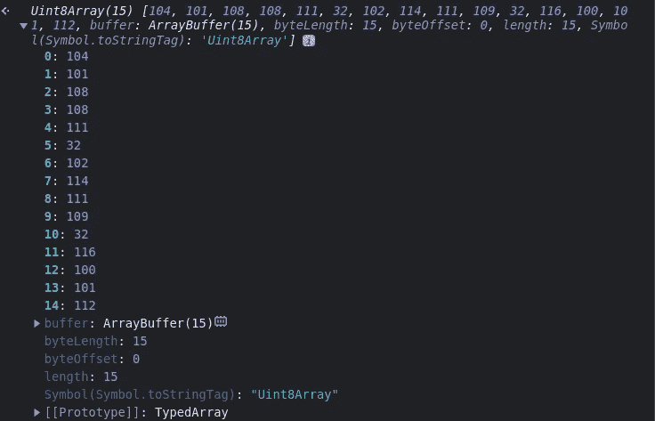
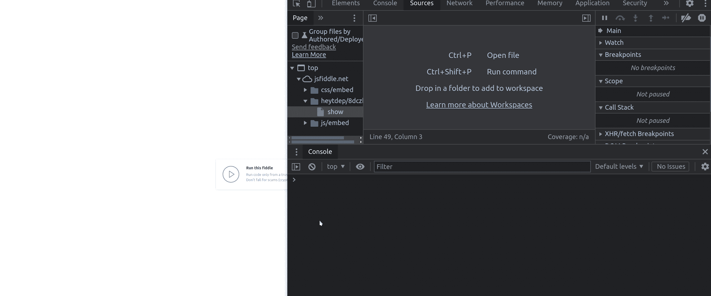

# 有用的 Chrome 开发工具特性可以简化你的调试

> 原文：<https://betterprogramming.pub/useful-chrome-dev-tools-features-to-ease-your-debugging-642a611fcd4>

## ***chrome 开发工具是一座金矿，它的一些最好的特性有时会被忽视***


由[弗勒](https://unsplash.com/@yer_a_wizard?utm_source=medium&utm_medium=referral)在 [Unsplash](https://unsplash.com?utm_source=medium&utm_medium=referral) 上拍摄的照片

大约一周前，我发表了一篇关于我在 JS 开发中使用的一些我最喜欢的工具的文章。在这个列表中，我包括了一些开发工具特性，比如断点、条件断点，以及使用 network 选项卡来理解应用程序及其技术。

我也承诺过我会更深入地探讨这个话题，所以我写了这篇文章:

```
Table of Contents[A  general overview about why I deem dev tools useful](#4974)
[Breakpoints](#7353)
  [Conditional breakpoints](#10e9)
[Accessibility Trees](#6daa)
[Memory Inspector](#5a08)
[Useful Network Tab Insight](#6396)
```

# 为什么要使用开发者工具？

我发现开发人员工具对于两个用例非常有用:

*   调试我的应用程序
*   在我的应用程序上实现其他网站的功能

这些都是重要的实践，它们将成倍地增长您的知识，并帮助您构建更好的产品。所以，没有进一步的介绍，让我向你展示我最喜欢的 chrome 开发者工具的特性。

# 断点

当您调试一个不能按预期工作的特性时，问题很可能出在该特性所使用的数据上，尤其是当您使用 API、请求或简单地使用函数来修改/整形现有数据时(或者如果您没有使用 ts)。

断点允许您在特定行(和方法)暂停 JS 代码，并访问所选行/方法范围内的所有变量。

例如，打开[http://demo.owasp-juice.shop/](http://demo.owasp-juice.shop/#/)，打开左侧栏>顶部>demo . owasp-juice . shop>main . js 上的>开发工具【源】选项卡

这将调出`main.js`最小化的 js 文件，点击编辑器左下方的括号来格式化文件并使其可读。

一旦这样做了，就转到第`2592`行，该行简单地调用演示应用程序的 API 来获取某个产品的评论(由`e`变量标识为数字 id，该变量作为参数从`get(e)`函数中提供)。

如果您单击该行的编号，将设置一个断点，因此代码将在该行暂停，您将能够访问该行的所有局部变量。例如，如果你现在重新加载页面并点击商店中的一件商品，应用程序将暂停，你将能够从控制台访问`e`(商品的 id)。做起来比说起来容易，看看这个:



来自作者的 GIF

## 条件断点

有时，仅在满足特定条件时暂停代码可能是有用的。由于有条件断点，这很容易实现。再次找到第`2592`行后，点击删除现有断点(你会注意到行号不再是蓝色的)，然后右键点击行号>添加条件断点。

它会要求一个条件，我用过`e == 1`。这意味着代码只会在`e==1`时暂停，所以当被点击的项目的 ID 为`1`时:



# 可访问性树

当您打开应用程序时，开发工具会概述标记是如何构建的，但这总是一件痛苦的事情。充满类名和属性的大型嵌套 div。然而 chrome 开发工具发布了一个特性来帮助开发者:可访问性树。

使用可访问性树，获得页面(或元素)树的可读概览很简单:在 elements 选项卡上，选择一个元素，然后在右侧您将看到一个可访问性选项卡(总是在 elements 选项卡内)，单击它，您将获得该元素树的概览，如下所示:



您可能还想看到整个页面的树，为此您必须单击`Enable full-page accessibility tree`标志，并重新加载开发工具:



# 内存检查器

当您调试使用类型化数组(或 Wasm 内存和 DataView)的代码时，您将很难调试数组实际上在说什么。如果你不明白我的意思，这就是 TypedArray 的样子:



在这个阵列中没有多大意义，不是吗？如果我们能把它看做一个字符串来知道到底是什么传入了 JS 代码，那就好得多了。这就是内存检查器变得有用的地方:



如您所见，我设置了一个断点来暂停代码并访问类型化数组(`uint8array`)。然后将数组发送到 memory inspector 选项卡，在那里对其字节进行解码，我们获得了字符串:`"hello from tdep"`。

# 网络选项卡—有用的见解

当我启动开发工具时，我首先打开的是网络选项卡。我主要将它用于以下两个任务:

*   了解一个 app 的结构和使用的技术→通过过滤页面所有的外发请求，可以了解它的 API 是什么样子的，如果使用 WebSockets 或者 WebAssembly 之类的技术，它会集成什么。
*   知道哪段代码做了某个特性→通过点击每个请求，开发工具告诉我哪个函数启动了它。这有助于我轻松理解代码的哪些部分对应于应用程序的功能，而不必阅读整个代码。

这是一个很长的阅读。希望你学到了一些新的有趣的东西。

感谢您的阅读！