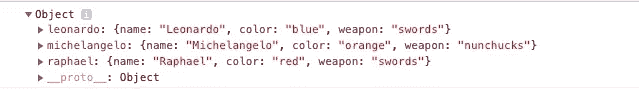
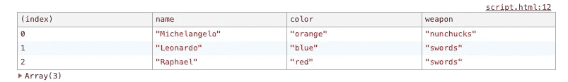
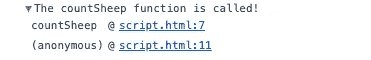

# 有用的 JavaScript 技巧

> 原文：<https://betterprogramming.pub/useful-javascript-tricks-3a682ec7d9ce>

## 我作为一名 JavaScript 开发人员学到的一些技巧和诀窍


约翰·贝克在 [Unsplash](https://unsplash.com/s/photos/rocket?utm_source=unsplash&utm_medium=referral&utm_content=creditCopyText) 上拍摄的照片

# 对象析构

假设我们有一个描述国家的 JavaScript 对象。我们还有一个`explain(country)`功能，将一些关于国家的有趣信息打印到控制台。

这可以工作并打印出以下消息。

```
People from the Netherlands 🇳🇱 are 1.82cm tall on average and they really like cheese!
```

然而，我们在这段代码中多次重复了单词`country`。

我们可以把的**国家参数分解成`name`、`averageHeight`和`favoriteFood`这样:**

或者您可以保留`country`参数，并在函数本身中析构变量，如下所示:

# 使用控制台日志记录的力量

使用控制台日志记录可以做一些非常酷的事情。

我在记录多个对象时经常使用的一个简单技巧是将它们放在一个`console.log()`函数中。

这样，我可以很容易地识别控制台中每个记录的对象。



另一个日志功能是`console.table()`功能。这是一个真正神奇的功能。如果你给它传递一个数组，它会把数组打印成表格。

上面的代码将打印下表。



另一个很棒的功能是`console.trace()`功能。这显示了日志函数的堆栈跟踪。这样，您就可以确切地知道函数是从哪里被访问的。

现在，您可以在控制台中看到堆栈跟踪。



# 短路评估

假设我们有下面这段代码。

这种模式经常发生，在对一个对象做一些事情之前，您需要检查它是否为空。

一个巧妙的小技巧是使用**短路评估**。当使用`&&`操作符比较多个值时，JavaScript 将在遇到第一个`false`值时停止。

所以我们可以重写代码如下。

如果`user`对象是`null`，那么`user.isAdmin`的求值永远不会完成。

类似地，当使用`||`操作符比较多个值时，JavaScript 将在遇到第一个`true`值时停止。

正因为如此，我们可以编写下面的代码来检查用户是否没有得到的授权。

# 传播算子

假设您有两个想要合并的对象。在这种情况下，您可以使用`...` spread 操作符很容易地做到这一点，就像这样。

在这个例子中，`mergedSheep`对象将包含`name`、`likes`和`dislikes`属性。

```
mergedSheep = {
  name: "Betty 🐑",
  likes: "Grass",
  dislikes: "Barbecues",
}
```

就是这样！希望这些简单的 JavaScript 技巧可以帮助你编写下一个应用程序。