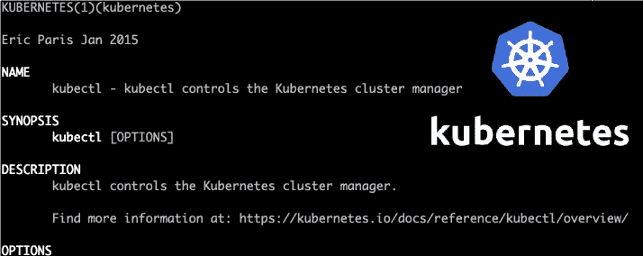
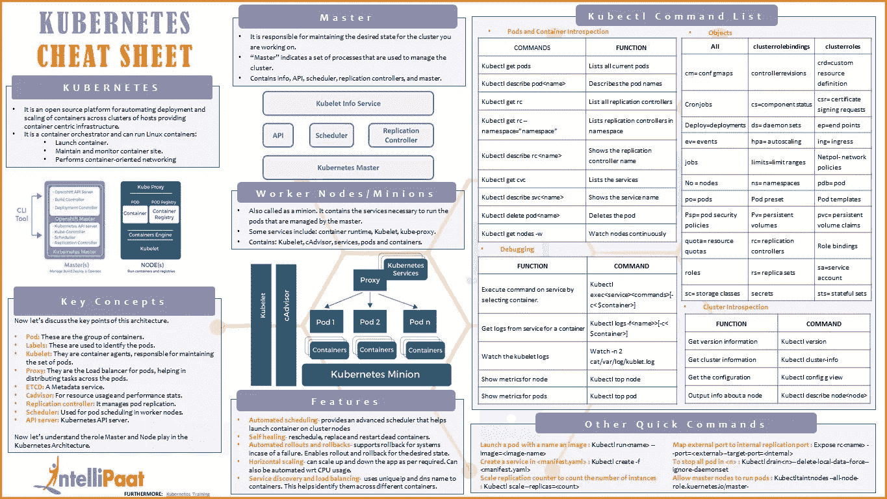

# 有用的 Kubectl 别名将加速你的编码

> 原文：<https://betterprogramming.pub/useful-kubectl-aliases-that-will-speed-up-your-coding-54960185d10>

## 使用 kubectl 命令时，减少输入完整长度命令的时间，并防止令人讨厌的输入错误



作者照片。

如果您正在使用命令行与您的 [Kubernetes](https://kubernetes.io/) 集群进行交互，您可能对`kubectl`命令很熟悉。

有许多[备忘单](https://github.com/dennyzhang/cheatsheet-kubernetes-A4)可供`kubectl`使用，试图涵盖其所有可用的命令。虽然这个命令非常强大，但是对于您日常使用的一些操作来说可能有点麻烦。例如，下面的命令列表只包含了`kubectl`可用命令的一小部分:



来源: [IntelliPaat 博客](https://intellipaat.com/blog/tutorial/devops-tutorial/kubernetes-cheat-sheet/)

在本文中，我将与您分享我创建的一些别名，它们显著加快了我与 K8s 的交互。

*注意:我使用的是*[*fish shell*](https://fishshell.com)*，但是下面的别名可以很容易地修改以使用任何其他 shell。*

使用您最喜欢的 vi 编辑器打开您的`config.fish`，让乐趣开始吧。

# K8s 上下文

如果您正在使用 K8s，您可能有多个上下文，您可以在一天中在这些上下文之间切换。拥有以下缩写会让你的生活轻松很多:

# 连接到您最喜欢的 Pod

让我们面对它，你有一个最喜欢的豆荚，你偶尔会得到它的外壳并连接到它。但是，如果您通过 K8s 部署来管理 pod，它的 ID 将会改变。为了避免必须列出所有 pod(`kubectl get pods`)然后执行到所需的 pod，您可以使用:

# 删除 Pod

悲伤，但它发生了:

# 监控舱

# 显示部署的图像

我最常用的命令之一。有时，您想知道集群中当前部署了哪个映像。轻松点。

*注意:您可以为所需的部署传递一个参数，如下所示:*

```
current_image my-deployment-2
```

# 端口转发 Pod

让我们假设您有一个运行 RMQ 的 pod。要对其进行端口转发:

# 刷新数据库

我在调试开发集群时使用的一个有用的命令是清除 DB。例如，要刷新所有 Redis 键，您可以使用类似以下的命令:

# 更多别名

您可以有一些更常用的别名。我将与你分享我的一些，但你可以随时添加你自己的:

# 摘要

想想您最常用的命令。如果您发现自己输入太多或者必须搜索一些命令，那么别名可能是一个很好的选择。给你的别名一个机会也是很重要的——你可能会忘记使用它们，但是继续访问你的初始化脚本并试着记住你的别名。

感谢阅读！