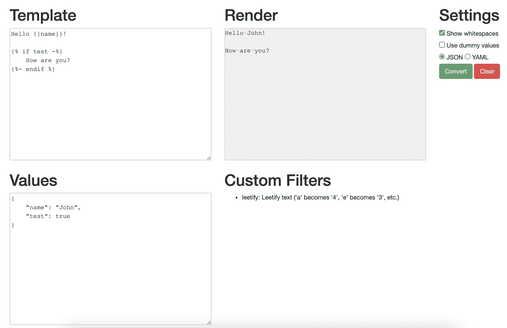
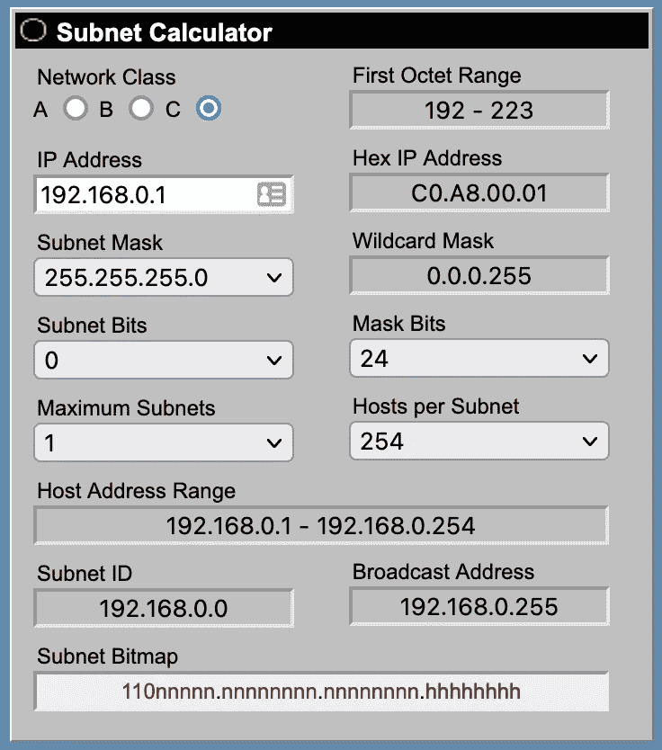
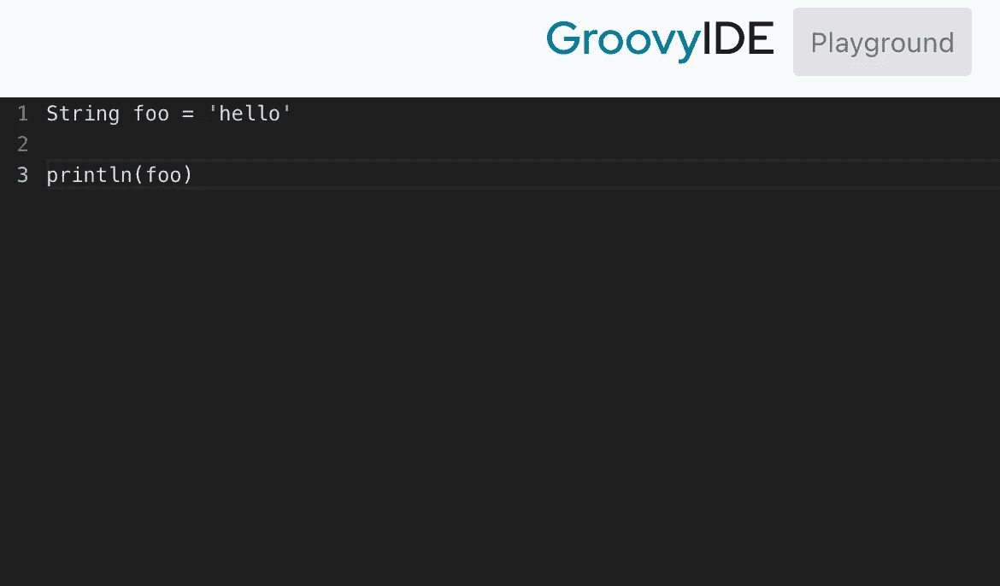
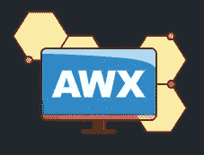
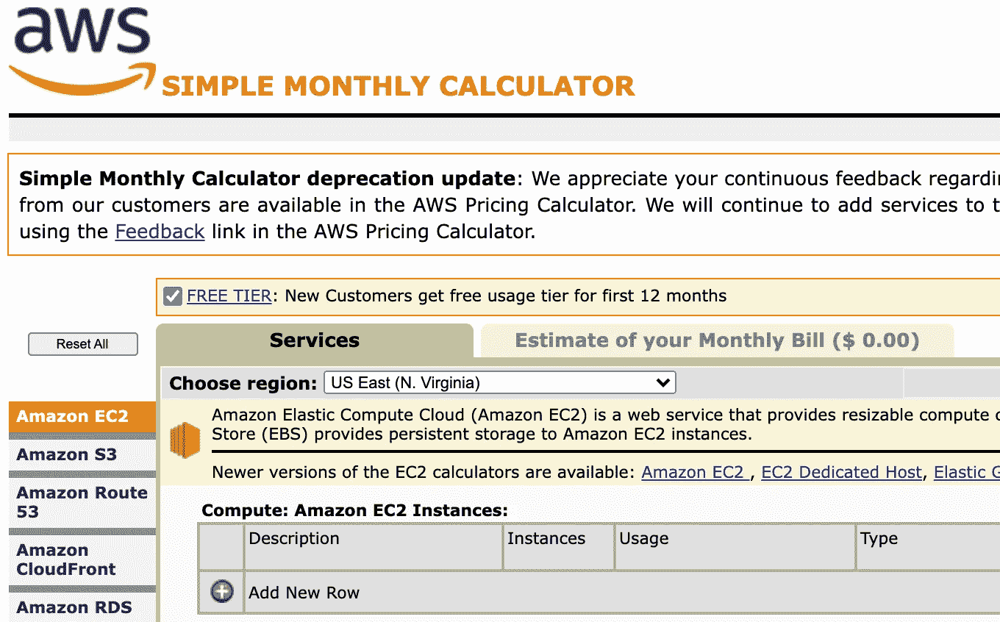
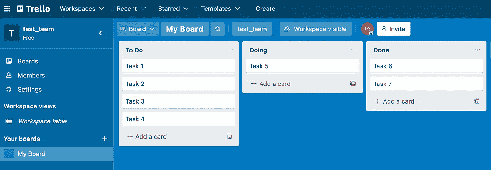
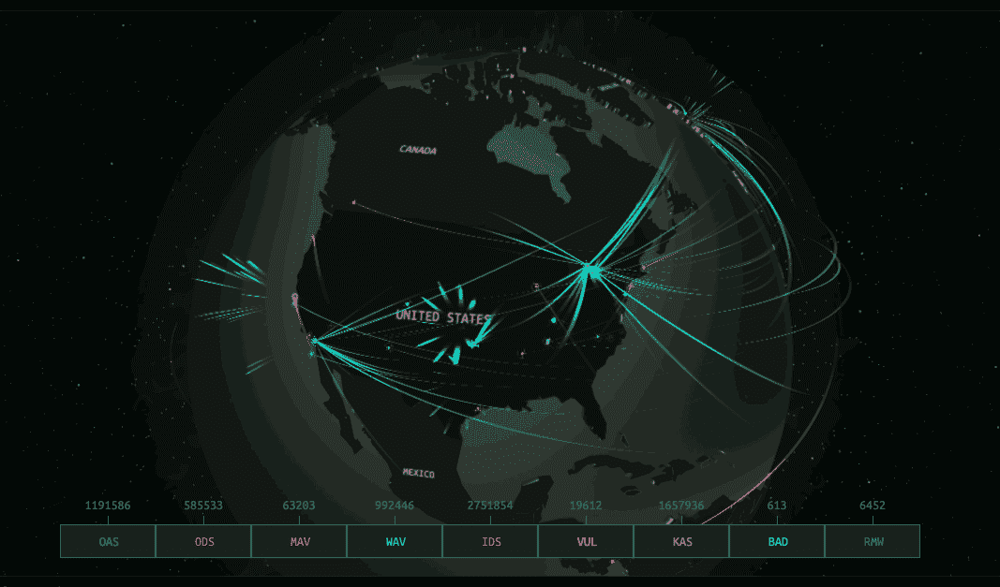

# DevOps 工程师的 7 个有用的 Web 应用

> 原文：<https://betterprogramming.pub/useful-web-apps-for-devops-engineers-fb596ad98d20>

## 方便，简单，他们甚至可以为您节省一些钱


Alex Kotliarskyi 在 [Unsplash](https://unsplash.com/s/photos/hacker?utm_source=unsplash&utm_medium=referral&utm_content=creditCopyText) 上的照片

构建软件本身就已经足够具有挑战性了。部署软件可能是完全不同的事情。将这两者结合起来，你就可以享受一次狂野之旅了。作为一名 DevOps 工程师，需要记住的信息太多了，因此拥有一套坚如磐石的参考工具至关重要。

你自己几乎不可能记住所有的事情。这就是为什么在这篇文章中，我们将深入一些最好的网络应用程序，让工程师们释放他们疲惫的大脑的压力。无论是测试代码片段还是定价一个闪亮的新虚拟机，这些资源都可以减轻负担。

## [Jinja2 Live 解析器](https://cryptic-cliffs-32040.herokuapp.com/)

到目前为止，这是测试 [Jinja2](https://en.wikipedia.org/wiki/Jinja_(template_engine)) 模板最方便的工具之一。如果你正在编写大量的角色和剧本，这是一个游戏改变者。测试 Ansible 模板并不总是容易的。这个应用程序使得测试格式、循环和其他 Jinja2 特性变得简单快捷。



Jinja Live Parser web 应用程序。[来源](https://cryptic-cliffs-32040.herokuapp.com/)。

最好的部分是你甚至不需要运行任何可翻译的代码。您只需插入它，就可以立即看到生成的输出。

有很多这样的应用程序。如果上面链接的那个刚好离线，那就看看 TTL255 主持的[这个替代方案吧。](https://j2live.ttl255.com/)

## [子网计算器](https://www.subnet-calculator.com/)

需要一点帮助来划分一个复杂的 IP 地址空间并不丢人。有时咖啡不够了，你只想弄清楚主机应该生活在哪个网络上。

我发现的最好的工具之一是 Clive Porter 的子网计算器。



子网计算器。[来源](https://www.subnet-calculator.com/)。

这个工具已经存在很长时间了，是任何网络工程师工具箱中的必备工具。如果你喜欢在脑子里做一堆数学运算，那也没问题，但是这个计算器肯定会节省你一些时间。

MX Toolbox 也有一个很棒的计算器,它有一个更新的用户界面。

## [超棒的游乐场](https://groovyide.com/playground)

啊，是的。太棒了。不管你喜不喜欢，在某些时候你可能会被要求写一些很棒的代码。如果你经常和 Jenkins 一起工作，那么你和这种有趣的语言互动的机会就很高。Jenkins 将 Groovy 用于共享库和其他一些底层特性。



Groovy 游乐场网络应用程序。[来源](https://groovyide.com/playground)。

虽然它是基于 Java 的，但是这种独特的语言还是有一些细微的差别。拥有一个沙箱来测试一些语法是非常有用的。

如果您正在纠结一些 Groovy 格式规则，这个 NPM 模块对于林挺您的 Groovy 代码非常有用:

[](https://www.npmjs.com/package/npm-groovy-lint) [## npm-groovy-lint

### Lint，格式化并自动修复你的 Groovy / Jenkinsfile / Gradle 文件。最新版本:9.4.1，最后发布时间:20 天前…

www.npmjs.com](https://www.npmjs.com/package/npm-groovy-lint) 

## [AWX](https://github.com/ansible/awx)

作为有史以来最受欢迎的配置管理工具之一，Ansible 已经在 DevOps 领域站稳了脚跟。虽然你可以用 Ansible 做任何你想做的事情，但是从用户体验的角度来看，这是一个挑战。如果您希望将行动手册作为自助服务选项提供给其他部门或团队，这一点尤为重要。

为了满足对图形用户界面的需求， [Ansible Tower](https://www.ansible.com/products/controller) (现在称为“*自动化控制器*”)应运而生。它为 Ansible 提供了一个奇妙且易于使用的用户界面。只有一个问题。这不是最划算的选择。即使是最基本的许可证订阅也要花费数千美元。对于试图保持精简和吝啬的小公司来说，这不是一个选择。



[来源](https://github.com/ansible/awx)。

不用担心，因为支撑 Ansible Tower 的免费开源平台可供任何人部署。这个平台叫做 AWX:

[](https://github.com/ansible/awx) [## GitHub - ansible/awx: AWX 项目

### AWX 提供了一个基于 web 的用户界面、REST API 和构建在 Ansible 之上的任务引擎。它是上游之一…

github.com](https://github.com/ansible/awx) 

引擎盖下的 AWX 是与塔相同的引擎，但没有一些最新的功能，用户界面波兰和技术支持。只需一点点努力，您就可以构建自己的 AWX 服务，并为您现有的 Ansible 基础设施提供一个非常实用的门户。

## [AWS 简易计算器](https://calculator.s3.amazonaws.com/index.html)

如果你在 AWS 上运行服务，那么估算你的账单(即使是粗略的估算)是绝对必要的。你不会想随意增加新的服务，然后在月底被巨额账单困住。

尽管亚马逊确实提供了他们自己的成本估算工具，但它远没有这个工具好用。



AWS 简单每月计算器。[来源](https://calculator.s3.amazonaws.com/index.html)。

当然，这不是看起来最漂亮的东西，但是当你需要知道的是你将要创建的新实例是否会让你的整个公司破产时，谁会在乎呢？

## 看板:[特雷罗](https://trello.com/)

如果没有辉煌的[看板](https://en.wikipedia.org/wiki/Kanban_(development))板，我们会怎样？你是否相信它们的有效性还有待商榷，但即使你只是把它作为一个任务清单，它仍然非常有用。



特雷罗董事会。

由于 Trello 也是 Atlassian 产品系列的一部分，您可以轻松地与吉拉等其他票务系统集成。

Asana 还在一个面向项目管理的大型产品中提供看板功能。如果您正在寻找一体化管理方法，这是一个绝佳的选择。

## [卡巴斯基网络威胁地图](https://cybermap.kaspersky.com/)

这一个只是为了好玩，但是拜托，谁不喜欢感觉自己是在现实版的战争游戏里。卡巴斯基网络威胁实时地图显示了一个令人敬畏的动画地球，展示了实时发生的实际网络攻击。



卡巴斯基网络威胁地图动画。[来源](https://cybermap.kaspersky.com/)。

在你工作的地方，把它全屏显示在电视上，感觉(看起来)比以前更有效率。

感谢您的阅读！你最喜欢的基于 web 的 DevOps 应用有哪些？

```
**Want to Connect?**[Reach out on Twitter](https://twitter.com/Tate_Galbraith)
```