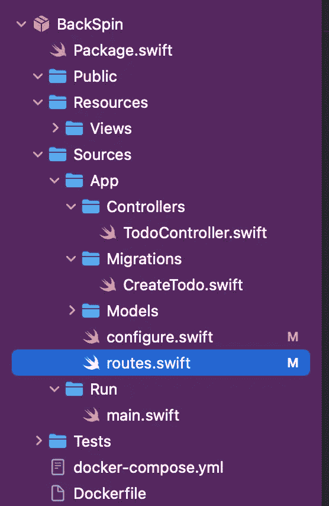

# 带有 Vapor 和 Postgres 的服务器端 Swift

> 原文：<https://betterprogramming.pub/user-authentication-server-side-swift-with-vapor-2c9b0149268>

## 在本教程中，我们将解释如何创建一个小型的**数据库**和**服务器**来执行认证功能。


为此，您需要安装以下程序:

自制软件:[下载自制软件](https://brew.sh/index_it)

蒸汽:

帖子:[下载帖子](https://eggerapps.at/postico/)

邮递员:[下载邮递员](https://www.postman.com/downloads/)

# 数据库创建

首先，我们需要创建一个数据库来存储我们的数据。为了创建我们的数据库，我们将使用`Postgres`。然后我们必须通过`HomeBrew`安装它，创建一个用户，设置一个密码，最后为该用户创建一个数据库。

为了更快更有效地管理新创建的数据库，我们使用了`Postico`，一个提供图形界面来管理数据库的软件。

# 服务器端实现

我们实现了一个简单的客户端-服务器通信，以便创建一个帐户，然后注册和登录，并更改您的密码。

在服务器端，我们创建了一些函数，允许通过各种 HTTP 方法( **GET、POST、PUT** )对之前创建的 Postgres 数据库执行这些操作。

这些操作应该在文件`routes.swift`中完成:



要执行简单的身份验证，我们需要遵循以下步骤:

1.  首先我们测试服务器，对我们输入的姓名进行简单的控制台打印，为此我们使用 GET 方法:

2.现在，我们实现函数记录，在数据库中插入数据，正确解码，并返回我们，编码，新注册的用户:

3.此时，我们可以实现登录功能，使用输入的数据搜索数据库，如果存在，则返回用户:

**4。**最后，`update`函数负责修改您选择的值，在我们的例子中是密码，我们使用与登录函数相同的逻辑来理解哪个用户可以更改密码:

# 服务器测试

为了测试我们的服务器，我们使用了`PostMan`。PostMan 是一个用于 API 测试的应用程序。它是一个 HTTP 客户端，利用一个图形用户界面来测试 HTTP 请求，通过这个界面我们可以获得不同类型的响应，这些响应需要随后进行验证。

跟随本视频教程学习如何测试您的服务器。

# 并发

该代码没有使用并发性，这有助于提高多线程的效率和管理。更多信息，可以[阅读这篇文章](https://medium.com/@dabrosca.nicola/recover-data-via-concurrent-process-410ffa980040)。

# 结论

因此，在本文中，我们讨论了如何从零开始创建服务器，如何创建数据库，以及如何在 Swift 中实现它们。

完整的代码可以从 GitHub 的以下链接获得: [GitHub](https://github.com/KekkoDM/Server-Side-BackSpin)

```
**Want to Connect?**For any additional information you can contact us on Discord and Linkedin:**Simona Ettari**: simonaettari26#8320 [https://www.linkedin.com/in/simona-ettari-109998187/](https://www.linkedin.com/in/simona-ettari-109998187/)**Nicola D’Abrosca**: Nicola D’Abrosca#9860 [https://www.linkedin.com/in/nicola-d-abrosca-b08338233/](https://www.linkedin.com/in/nicola-d-abrosca-b08338233/)**Francesco De Marco**: PerCoca#3022 [https://www.linkedin.com/in/francesco-de-marco-9a24891b6/](https://www.linkedin.com/in/francesco-de-marco-9a24891b6/)
```