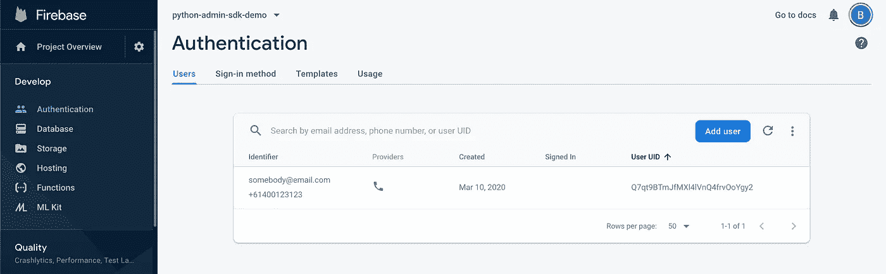

# 使用 Firebase 和 Python 进行用户管理

> 原文：<https://betterprogramming.pub/user-management-with-firebase-and-python-749a7a87b2b6>

## 通过使用 Firebase 来处理用户管理，加快应用程序的开发


在 [Unsplash](https://unsplash.com?utm_source=medium&utm_medium=referral) 上 [NeONBRAND](https://unsplash.com/@neonbrand?utm_source=medium&utm_medium=referral) 拍摄的照片

# 介绍

Firebase 是一个方便的工具，它提供了开箱即用的用户管理功能。它允许我们创建新用户，更新他们的详细信息，管理他们的密码，通过他们的电子邮件和密码验证他们，删除他们，等等。

如果您正在考虑构建一个移动应用程序(或者任何应用程序)，并且需要快速启动和运行，那么 Firebase 绝对是一个值得考虑的用户管理组件选项。

Firebase 提供了一个 Firebase 管理 Python SDK。我们将讨论如何使用 Firebase Admin SDK 进行应用程序的用户管理，具体目的如下:

*   创造用户
*   更新用户详细信息(包括电子邮件、手机号码和显示名称)
*   设置用户密码
*   使用电子邮件和密码验证用户
*   删除用户

TL；DR:克隆这个 GitHub [repo](https://github.com/billydh/python-firebase-admin-sdk-demo) 。

更新:关于如何验证用户电子邮件地址的新文章已经发布。点击查看 'localId': '12345',
'refreshToken': 'AEu1MO5oY4sySR4bqDwsqJPpk_nObnYzIJlt1vAKACd0O7jSfpqHAS4DljKA5SaA05WsmpbLSmj5JhyNGBnWpgjv88zGphcWGlKjLmWPgjF4Y4f2R5fIRYzFGV4EYjHTeDtV1yOdW9r1Li0b1IUGqFpUODGQ3jE3cOtITNcVeTwYVdh55f4V6wl7M-Lg4pKAoDiuWVyhDDddU8yj8ALOQPC1NbMHd8ttXwor7J8DIxLws7TZcKCPwzdMPiJI0pHfv4UXtXHWzfJ_',
'registered': True}

我们走吧！我们可以看到 Firebase 为设置了密码的用户返回 ID 和刷新令牌。换句话说，我们已经通过 Firebase Auth REST API 验证了用户。太棒了。

# 删除用户

我们要做的最后一件事是删除一个用户。这种场景发生在现实世界中——例如，当用户决定离开我们的应用程序和/或平台时。

所以让我们创建一个新的 Python 文件，并将其命名为`delete_user.py`。

delete_user.py

现在，让我们删除之前创建的一个用户，让另一个用户来验证脚本是否真的工作。

```
~/demo/python-admin-sdk-demo ❯ python delete_user.py --user-id 12345
Firebase has deleted user with user id - 12345
```

要确认删除，我们可以转到 Firebase Console > Authentication，查看用户是否仍然存在。



删除后经过身份验证的用户

没有。该用户不再在我们的 Firebase 用户列表中。这意味着我们的脚本按预期工作。干得好！

# 包扎

我们已经使用 Firebase Admin SDK 和 Firebase Auth REST API 介绍了应用程序用户管理的一些基本和重要的内容。两者都提供了很多有用的 API，这将节省我们很多工作——特别是当我们想要快速启动并运行时。

我希望这篇文章已经为您提供了使用 Firebase APIs 进行用户管理的基础知识。现在继续深入探索 API，并构建您自己的应用程序！

奖励:[使用 Firebase](https://medium.com/@billydharmawan/verify-user-email-address-with-firebase-and-python-adda433ff48d?source=friends_link&sk=86198e8020406ca7b2e06b1f6238b2f9) 验证你的用户电子邮件地址。我最近发表了那篇文章，是对用户管理的补充。我们希望验证用户注册时使用的电子邮件地址，以便保护他们免受恶意用户的攻击。

# 参考

[Firebase 项目设置](https://firebase.google.com/docs/admin/setup)

[Firebase Admin SDK](https://firebase.google.com/docs/auth/admin/manage-users?authuser=0)

[Firebase Auth REST API](https://firebase.google.com/docs/reference/rest/auth)

[GitHub 回购](https://github.com/billydh/python-firebase-admin-sdk-demo)