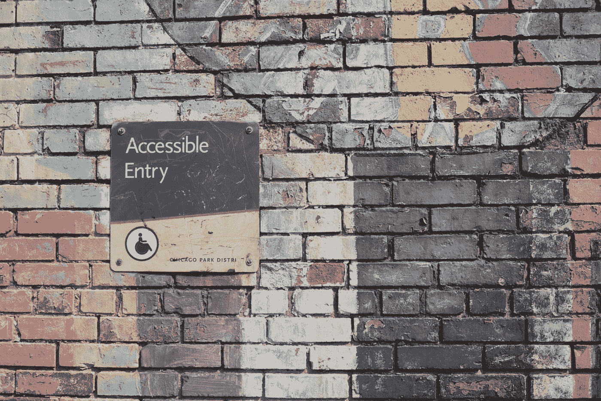
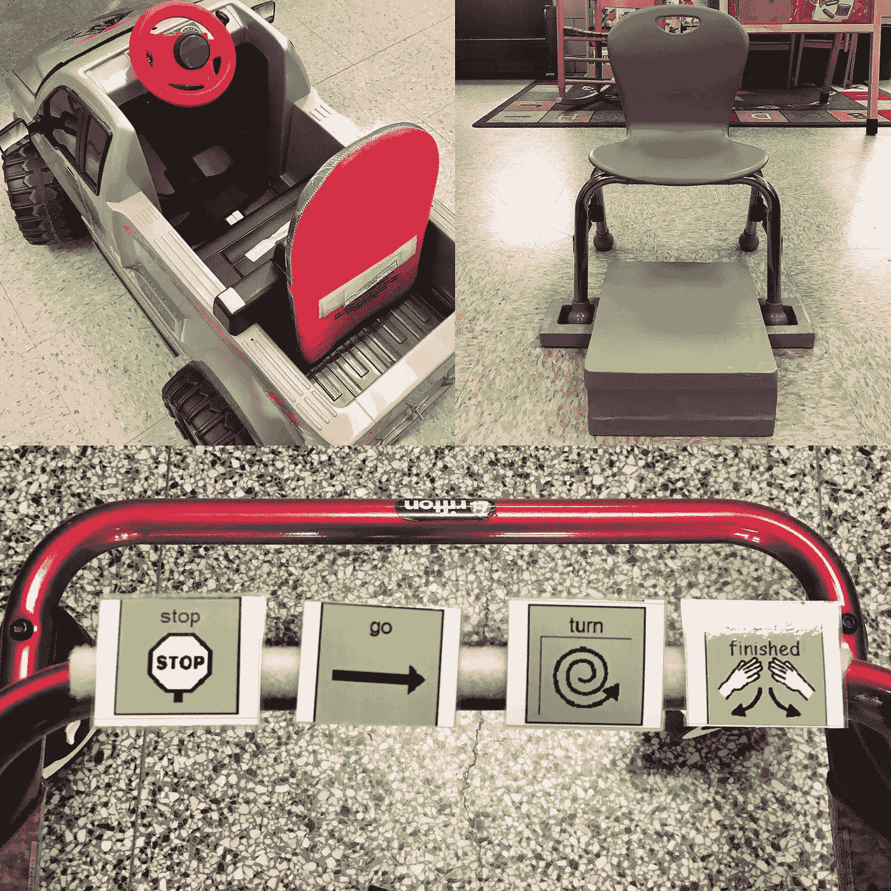

# 残疾用户不是边缘案例

> 原文：<https://betterprogramming.pub/users-with-disabilities-are-not-edge-cases-71bac1dd7c3c>

## 软件工程师可访问性资源综述

丹尼尔·阿里在 [Unsplash](https://unsplash.com?utm_source=medium&utm_medium=referral) 上的照片。

今年夏天是美国残疾人法案(ADA)颁布 30 周年，然而就在去年，达美乐披萨打了一场[的网络无障碍诉讼](https://slate.com/technology/2019/09/supreme-court-dominos-web-accessibility-visually-impaired.html)，因为他们的在线点餐流程无法通过屏幕阅读器为视障用户所用。

据估计，全世界有 10 亿人，美国有 26%的成年人患有某种形式的残疾。在物理空间的 ADA 合规性方面仍有许多需要改进的地方([2020 年只有 25%的纽约地铁站可访问](https://gothamist.com/news/infographic-how-much-nyc-subway-accessible))，但网络可访问性的状况甚至更糟糕，98.1%的主页存在可访问性错误。

当我们构建不可访问的 web 应用程序时，我们可能会失去多达 10 亿的潜在用户。残疾人不是边缘案例。

# 更新科技产业

科技行业[需要更多的残疾人](http://tcrn.ch/2efBz1z)参与到产品开发的各个层面——从软件工程到 UX/UI 到商业团队。然而，身体健康的开发人员也有责任充分了解他们的用户的可访问性需求。

作为软件工程师，我们需要确保每个人都有平等的机会使用我们开发的产品。了解网页可访问性标准并加入 a11y(简称“可访问性”)社区是确保我们满足所有用户需求的第一步。

# 残疾的社会模型

长期以来，工程无障碍解决方案一直是我生活的一部分。在成为软件工程师之前，我做过几年儿科物理治疗师。在那段时间里，我与孩子们、家长、教育者和其他治疗师一起工作，创造更容易接近的环境，推广残疾的社会模式。

残疾的社会模式认为，残疾是由无障碍障碍而不是身体损伤造成的。

例如，有视觉障碍的人可以使用屏幕阅读器访问手机上的所有应用程序。如果用户能够通过屏幕阅读器与每个应用程序充分互动，他们的视觉障碍不会限制他们访问这些应用程序提供的所有商品和服务。

残疾会影响视觉、听觉、行动和/或认知，因此需要考虑各种因素，以确保 web 应用程序对所有用户都是可访问的。在开发过程的早期，工程师应该考虑关键的可访问性特性，比如颜色对比、表单标签、语义 HTML、图像描述和键盘导航。

虽然有许多自动化工具可以用来开始错误测试，但是对 web 可访问性标准和手动测试的深入理解也是至关重要的。

我以前作为儿科物理治疗师的职业生涯中的辅助工具(从左上顺时针方向):一辆为开关访问而改装的玩具车，一个我在纽约的[适应性设计协会](https://www.adaptivedesign.org/)制作的定制纸板脚凳，以及一个附有治疗会议通信卡的步态训练器(照片由 Taylor Riley Du 拍摄)。

当我从物理治疗过渡到软件工程时，我就知道我想加入开源 web accessibility 社区。今年，我和一个开发小组共同创建了命令行测试工具 [equa11y](https://medium.com/better-programming/introducing-equa11y-a-command-line-testing-tool-for-web-accessibility-aa29205eed55) ，他们和我一样热衷于让网络成为一个更容易访问的地方。

在构建这个工具时，我深入研究了可访问性测试和 a11y 社区。如果你是一名软件工程师，正在构建更易访问的产品，我已经编辑了一个资源列表来帮助你开始。

# 构建易访问产品的资源

## ****(常读作“wuh-cag”)和** [**第 508 节**](https://www.section508.gov/)**

**W3C 开发的 WCAG 是 web 上可访问性文档的主要来源。WCAG 2.1 是网页可访问性标准的真实来源，应该成为你的首选参考。同样，第 508 节也有专门针对美国政府网站的可访问性文档。**

## **[**A11y 项目**](https://www.a11yproject.com/)**

**“A11y”代表“可访问性”这是一个数字，因为在“A”和“Y”之间有 11 个字母(发音为“A-one-one-Y”)。A11y 项目是一个开源社区，为可访问性审计提供资源。社区成员可以写帖子、共享资源和提交/修复问题。**

## **[**德奎**](https://www.deque.com/)**

**Deque 创建了开源的自动化可访问性测试工具，包括他们的 axe Chrome 扩展。他们还通过德克大学为网络无障碍专家提供在线课程和认证。**

## **[**可知**](https://knowbility.org/)**

**Knowbility 进行可访问性测试审计，每年秋天还举办一场名为[可访问性互联网拉力赛](https://www.air-rallies.org/) (AIR)的年度竞赛。Knowbility 的网站是一个高度可访问的网页设计的很好的例子，它也是现代的和视觉上吸引人的。**

## **[**玛西萨顿的网站**](https://marcysutton.com/)**

**Marcy Sutton 的个人网站/作品集是一个惊人的资源——尤其是视频内容。在前端工程师的可访问性测试方面，Marcy 拥有丰富的知识。网站上我个人最喜欢的资源是她的 React 和 Angular 的 [live accessibility 审计](https://marcysutton.com/talks/)。**

## **[Meetup](https://www.meetup.com/topics/a11y/)**

**Zoom meetups 是找到其他志同道合的软件工程师并加入 a11y 社区的好方法。您可以搜索本地团体，与您所在地区的其他开发人员会面，或者参加虚拟活动，向世界各地的辅助功能专业人员学习。**

## **[**全球无障碍宣传日**](https://globalaccessibilityawarenessday.org/)**【GAAD】****

**在五月的第三个星期四，我们庆祝全球无障碍意识日！GAAD 包括世界各地各种各样的研讨会和活动，重点是 web 可访问性，2020 年共有 207 场活动。**

# **最后的想法**

**在产品开发中，可访问性通常是事后才想到的，这可能会导致在 web 可访问性诉讼之后花费大量时间来重新设计和重构。理想情况下，所有团队都应该包括在开发过程的每个阶段工作的残疾人，但是我们现在可以通过熟悉 web 可访问性指南、实施自动化测试工具以及加入 a11y 社区来了解更多信息，从而使我们的产品更易于访问。**

**当我们在开发的每个阶段都考虑可访问性时，我们构建的产品会满足所有用户的需求。**