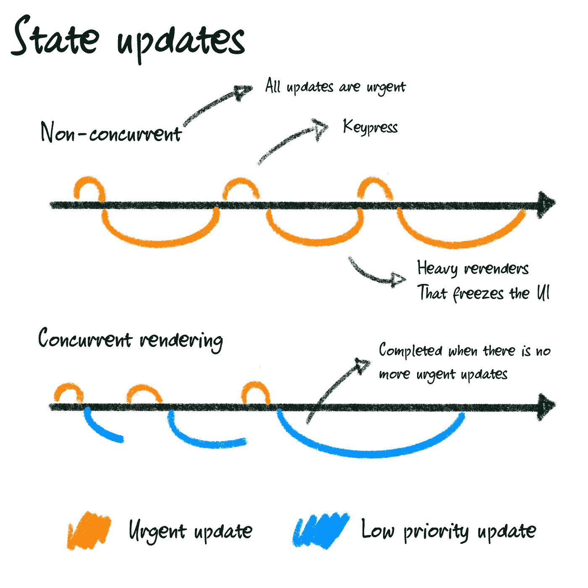

# React 18 中的 useTransition()与 useDeferredValue()

> 原文：<https://betterprogramming.pub/usetransition-vs-usedeferredvalue-3024f98e5443>

## 它们做什么以及何时使用它们，并有具体的例子

照片由[乔舒亚·柯尔曼](https://unsplash.com/es/@joshstyle?utm_source=medium&utm_medium=referral)在 [Unsplash](https://unsplash.com?utm_source=medium&utm_medium=referral) 拍摄

# React 18 和并发渲染

React 18 于 2022 年 3 月发布，并附带了许多新工具，以帮助开发人员构建性能更高、响应更快的应用。

其中一个显著的变化是渲染引擎采用了一个新的关键概念:并发渲染。

并发使 React 能够同时准备应用程序 UI 的多个版本。更好的是，它可以开始渲染更新，中间暂停，稍后再回来…甚至放弃它。

在本文中，我们将仔细研究两个新的钩子:`useTransition()`和`useDeferredValue()`。

这两个钩子赋予了您决定状态更新优先级的强大能力，或者更确切地说，指定一个更新是否不如其他更新重要，并将其放在一边以支持更紧急的更新。

## 什么更新可以算紧急更新，什么可以算琐碎更新？

*   **紧急更新:**反映直接交互，比如打字、点击、按压等等。所以，本质上来说，用户在与什么东西互动。当您在输入中键入文本时，您希望立即看到您键入的文本。不然会觉得拖沓。这就是我们要优先考虑的。
*   **琐碎的更新:**可能是 UI 从一个视图到另一个视图的转换。用户知道视图需要改变或更新。即使有一个小的延迟，这可以被视为预期，它不会被认为是应用程序的缓慢。

至此，让我们更深入地研究这两个新挂钩，解释它们何时可以使用，并查看如何实现它们的具体示例。

# useTransition()和 startTransition

在 React 18 之前，所有状态更新都被标记为“紧急”这意味着所有状态更新都被同等对待，具有相同的优先级。

使用`useTransition()`，你现在可以将一些状态更新标记为不紧急。

## 何时使用它

一个例子是带有过滤选项的产品列表。

当使用复选框来选择衣服的尺寸或颜色时，您希望复选框立即显示选中或未选中状态。就像你按下一个按钮。

但是，需要用匹配产品更新的产品列表可以是一个单独的、不太紧急的转换。

## 如何使用它

# useDeferredValue()

`useDeferredValue()`与`useTransition()`非常相似，它允许我们实现的是推迟非紧急状态更新，但这次应用于树的一部分。

它与我们经常使用的延迟更新的现有方法类似，如去抖动或节流，其优点是 React 将在其他紧急更新完成后立即处理更新，而不是等待任意长的时间。

## 何时使用它

使用`useTransition()`，您可以自己决定何时将特定的状态更新标记为不太紧急。但有时，您无法访问这段代码，因为状态更新来自于第三方库。

这时候就可以考虑用`useDeferredValue()`了。

使用`useDeferredValue()`，您可以包装一个值，并将其更改标记为不太重要，从而推迟它们触发的重新呈现。

只要有更紧急的更新需要完成，就会返回以前的值，并使用更新后的值来呈现树。

## 如何使用它

# 结论

我们，开发人员，在构建应用程序时，应该始终把用户放在心上。

这两个新的挂钩使开发人员能够通过优先考虑对用户体验至关重要的更新并将其他一些更新标记为不太重要的更新，来尽可能地保持他们的界面响应速度，即使是在有大量重新呈现程序的复杂应用程序中。

这并不意味着你应该用这些钩子把所有的状态都包起来。如果你的应用程序或组件不能通过其他方式(延迟加载、be 分页、web workers 等)进行优化，那么它们应该作为最后的手段。).