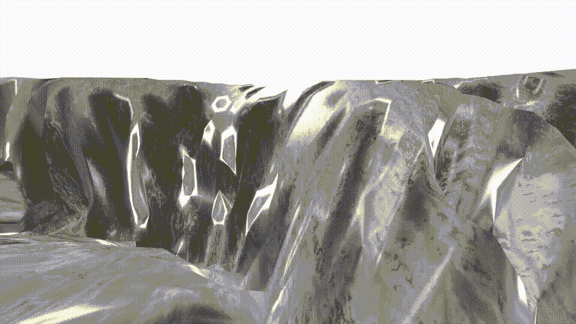
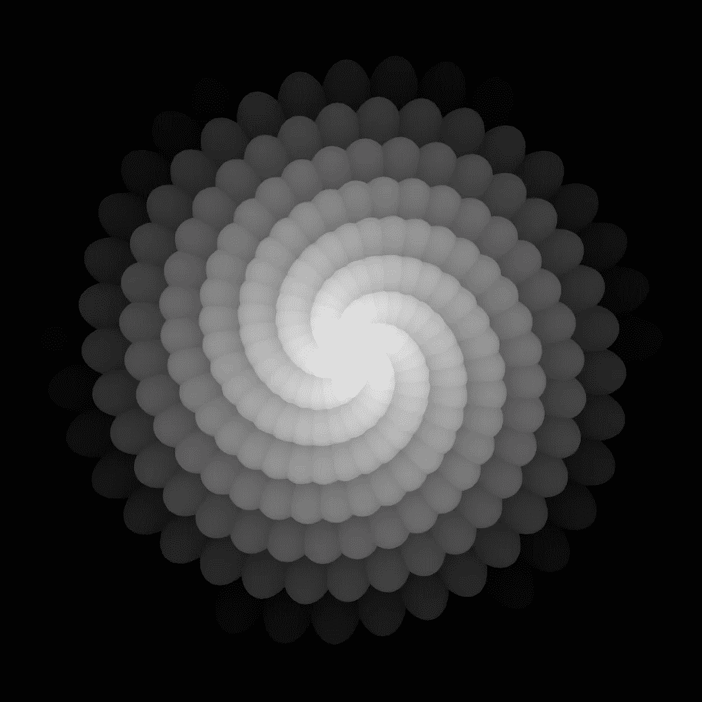

# 如何在 SwiftUI 下使用位移贴图用 SceneKit 构建场景

> 原文：<https://betterprogramming.pub/using-a-displacement-map-to-build-a-scene-with-scenekit-under-swiftui-3a74ba00b195>

## 继续探索 SceneKit 功能

SceneKit 中的置换贴图

大约在他们制作《异形》电影的同时，第二部科幻电影正在制作中，这部电影将成为迪士尼最近重启的 100 亿美元的特许经营权。那部电影于 1977 年上映，名叫《星球大战》。

在一家公司的支持下，这家公司将继续改变电脑在电影中的使用方式，这家公司位于加利福尼亚州范奈斯的一个仓库里，自称为 ILM 或工业光魔。

OpenEXR 多通道光栅文件格式是业界沿用至今的开源图形标准背后的一家公司。这是苹果于 2017 年在 SceneKit 中部分采用的标准。

请和我一起阅读这篇文章，了解更多关于它的知识——以及如何使用它为你的游戏和类似的游戏创建人工和真实世界的网格。

在关于这个主题的前一篇文章中，我开始纯粹用 SceneKit 构建一个网格。然后我用了一些苹果的[预建的形状](/creating-custom-geometry-with-standard-shapes-in-scenekit-under-swiftui-48f38743454f)来让这个过程快一点。虽然，如你所知，没有什么是永远不够快；因此，加入学习如何在工业基础上做到这一点，甚至更快。

# 该理论

好的。然后，我们从 wwdc 2017 scene kit 演示文稿中唯一提到位移图上的任何物质开始。

视频开始大约 19 分钟后，主持人 Amaury 提到了位移图，解释说它们是一种存储光栅图像中某个点的高度或高程的图像。

然后他提到了地形渲染，对你我来说这是一个网格。在他的下一张幻灯片中，他向我们展示了一个平面，它在屏幕上显示为一个巨大的多边形集合，然后他告诉我们应该对其进行镶嵌。我们稍后会详细讨论这一点。

一个我们用高度图变形的镶嵌平面——你和我只用两行代码就能做到——我不这么认为。因此，在花了三分钟介绍新功能后，他开始谈论矢量地图，一种扩展，确信无疑他已经完全介绍了这个主题。

所以，要做好准备。我们有一段五年前制作的三分钟视频，可以给我们指出正确的方向。开始了。

和我一起踏上实现置换贴图的旅程。

# 旅程

我很兴奋；这似乎是前进的方向。让我的自定义几何图形更上一层楼的机会。我开始创建一个多边形的多边形——看起来像苹果幻灯片。

正如我在上一篇文章中所做的那样，这篇文章既是关于目的地，也是关于旅程。如果你现在只想知道答案，快进到代码。

下面是我添加了苹果幻灯片上显示的两行神奇代码的代码，并在 Xcode 模拟器上运行。可悲的是，结果是一个不起眼的失败。什么都没发生。我得到的只是一个定制多边形的正方形。

*没用。*

我重新看了视频。自定义形状中的多边形数量和地图分辨率之间有联系吗？我建立了一个有更多顶点的多边形，和我的像素一样多[大约 256 x 256]，然后再试一次。

*没用。*

在我内心深处，这似乎有点疯狂。我又下载了一些地图，再次尝试，增加了多边形的数量。当然，我是用 1024x1024 像素的地图死在水里的。我现在需要一个一百万多边形的自定义几何形状。

*它不起作用，开始崩溃，我也是如此。*

我带着狗去散步，再次回到 rewatch Amaury talk，并在 Stack Overflow 中做了一些更多的搜索，我可能应该在前面提到过。

苹果几乎没有提到这项功能。要么是其他人已经很容易地得到了它，而我是愚蠢的，要么是它被如此糟糕地记录下来，大多数人从未尝试过。

在过去的五年里，我发现在关于这个主题的两三个问题中有一个提到了镶嵌。天啊。我需要添加镶嵌。我又想了想——如果 SceneKit 将我的节点分割成多边形，我为什么还需要自定义几何体呢？

我对多边形代码进行了注释，并创建了一个简单的节点，在其中添加了镶嵌。以下代码是结果:

运行代码。

*没用。*

我查阅了苹果公司关于这方面的文档——希望可能有线索，并从 WWDC2017 下载了演示代码——但都没有帮助。我查找了一篇我写的关于分析图像资产的文章，并在我的“置换地图”上运行它它包含数据，虽然显然不是正确的味道。我又看了一遍视频，并在 LinkedIn 上向 Amaury 发出了连接请求。这是一个绝望的措施。

当我重新看的时候，我意识到他也叫位移图，高度图，所以我谷歌了一些。它们看起来和我的地图不一样。我还发现他提到高度图是黑白的——我的地图不是——当然它有一些奇怪的颜色，但不是黑白的。我看着狗，它给了我一个“我告诉过你”的眼神。我找到了一张高度图并重新运行了一遍。

*没用。*

在这一点上，我开始发疯了。我回到 Stack Overflow，阅读了所有我能找到的关于这个主题的帖子的评论。

大约一个小时前，我需要满足我的客户，我正在调查这个问题，我找到了答案。SceneKit 使用 Metal 框架来完成这项工作，要使用它，您需要在实际设备上运行您的代码。我在一个真实的设备上运行了我的代码，嗯…

成功了！就像他们说的，被铃声救了。

所以，在这里，你有完整的代码来做位移地图——你应该在谷歌上寻找高度地图。这些地图应该看起来像黑白污迹或非常微弱的白色污迹的大部分。

最后，如果你读到这篇文章的结尾，给你一个奖励。一分钟的山谷跑步视频，配有合适的背景音乐。一个山谷，事实上，是一个颠倒的高度图。用两行以上代码构建的地图。

一张位移图，我把它反转了，以创建一个我飞过的山谷。

当然，我还没有完全完成，因为虽然这很好，但我可能想建立我自己的场景和我从地球上传的风景。为此，我参考了我写的这篇关于图像处理的[文章](/handling-core-image-filter-processing-with-concurrency-in-swift-a016396c3a07),并添加了创建 SceneKit 可以理解的高度图的公式。然后我做了一个演示——一座人造山，使用了所有 255 种可能的高度值。

您需要使用的公式在代码的第 34 行:

这是我制作的灰度图像的代码，用来制作我给你看的视频。

用于创建山地视频的高度图图像，大约 255 灰度值

# 结论

如你所见，这不是一场轻松的胜利。以下是调查结果的摘要:

*   使用真实设备。这在模拟器上不起作用。
*   请确保您使用的是黑白污迹中的高度/exr 图像贴图。
*   忘记自定义几何；这是一个红鲱鱼。镶嵌是这个游戏的名字。
*   并非所有贴图都是相等的——使用强度场进行调整。
*   如果您使用 exr 图像，请小心使用`mappingChannel`；它们可以包含多组数据[这是有意的]。
*   如果你计划构建自己的地图，并且需要开始使用 UInt32s，那么在使用乘法和除法时要非常小心。当然，后者可能不会像你想象的那样运行。
*   注意:高度地图只能显示高度差不超过 256 的区域。如果你的数据有更大的变化，你将需要做更多的处理/想出一些创造性的代码。

所有这些都让我想到了这篇文章的结尾。

我希望你喜欢读它，就像我喜欢写它一样。

请继续关注 SceneKit 和它的近亲 ARKit 的更多旅程。