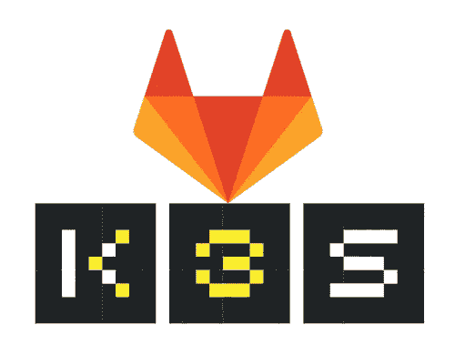
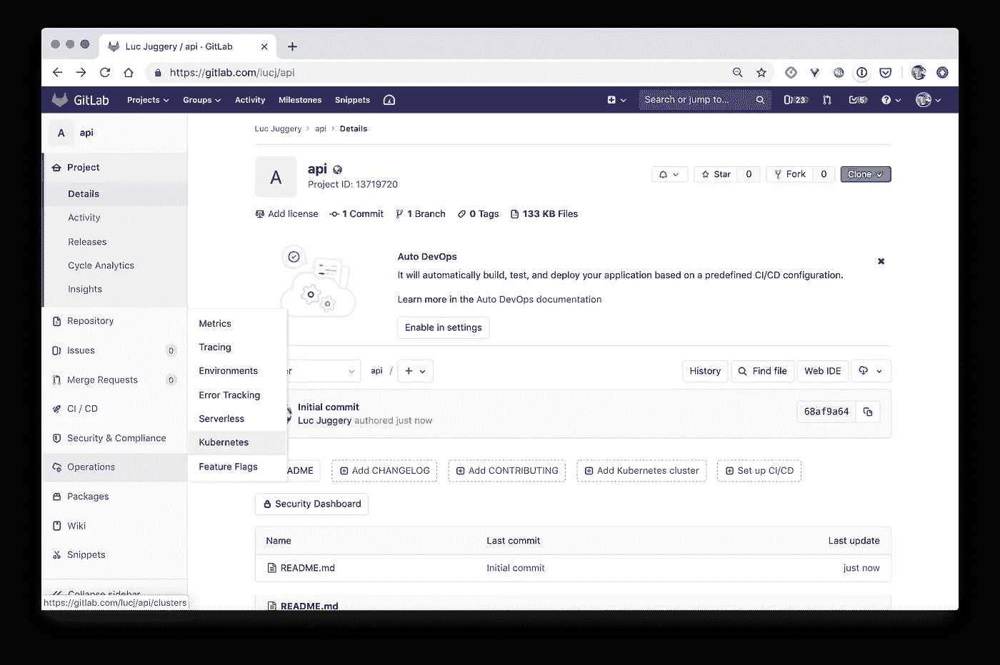
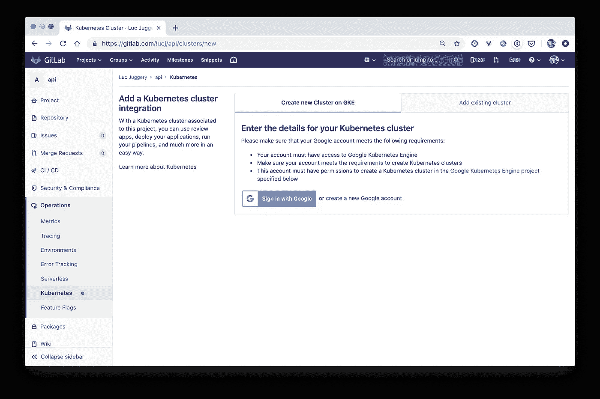
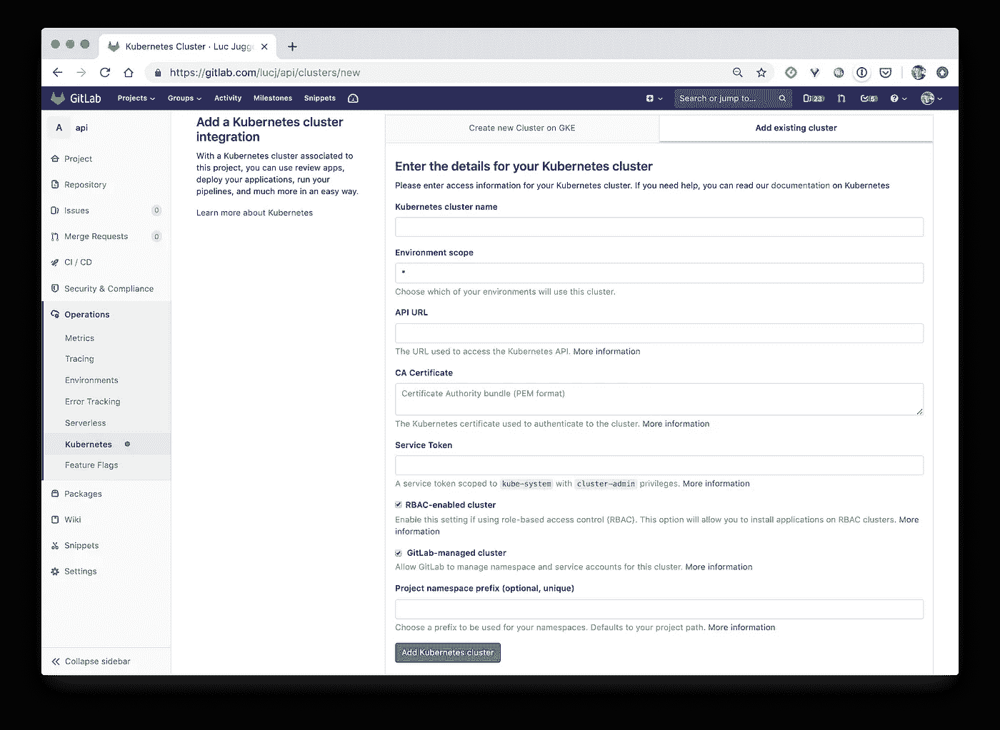
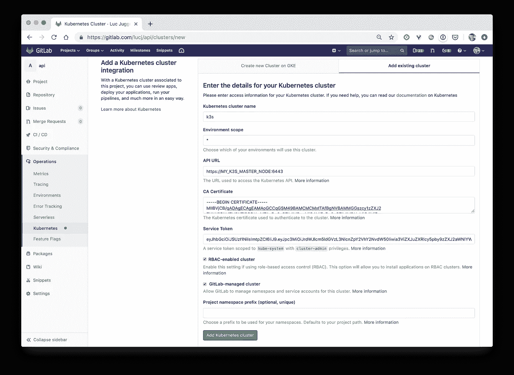
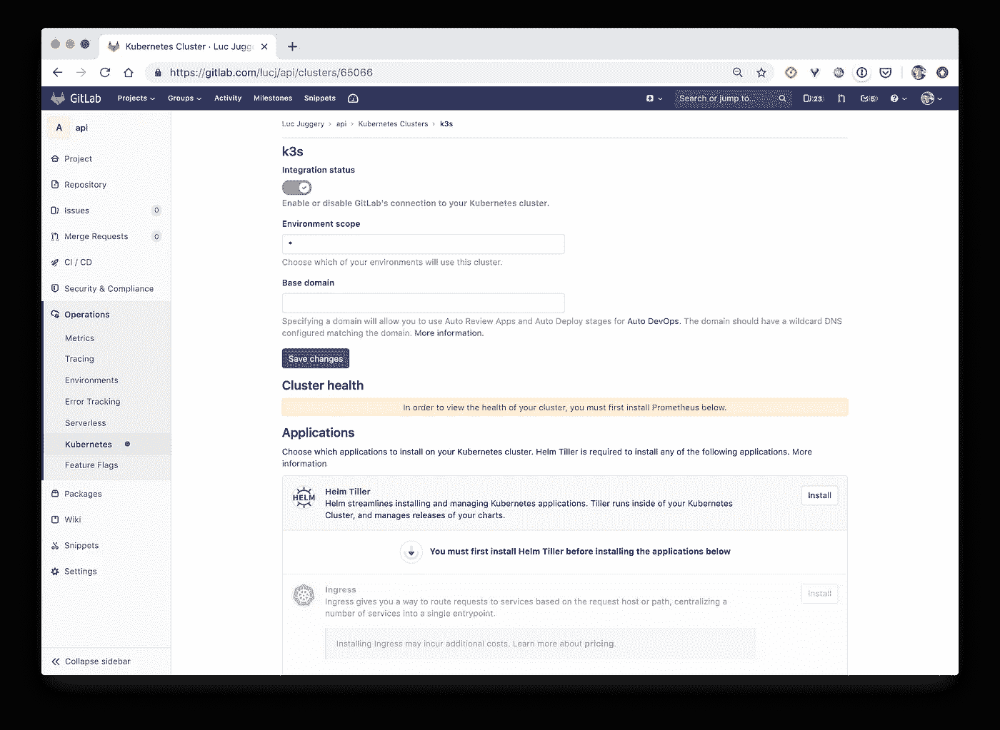
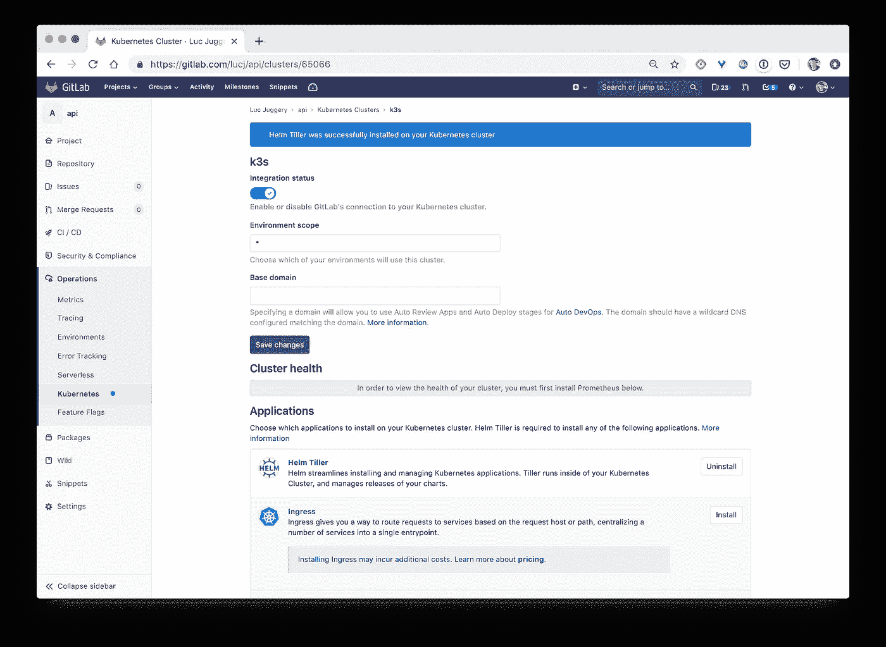
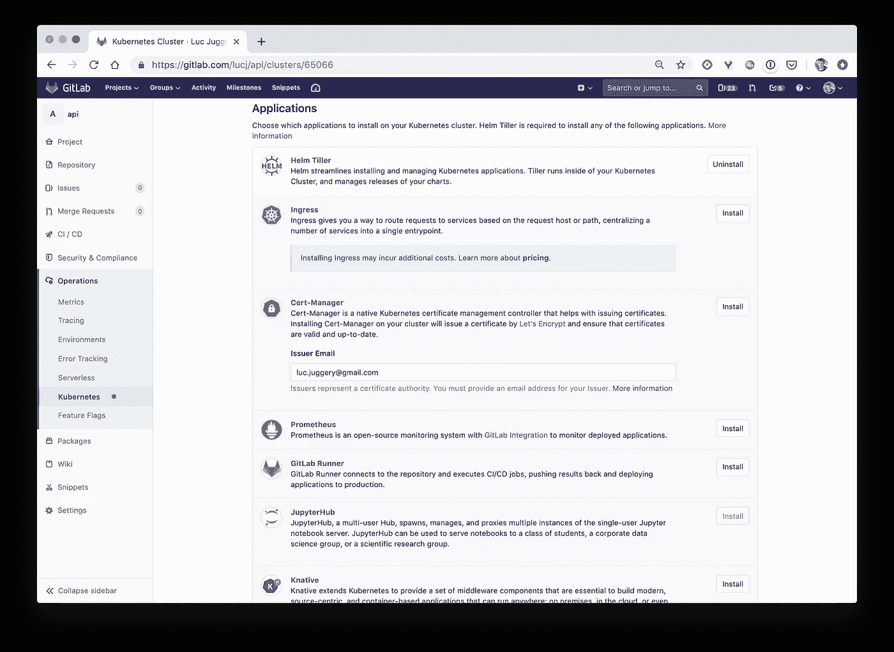

# 为您的 GitLab 项目使用 k3s Kubernetes 集群

> 原文：<https://betterprogramming.pub/using-a-k3s-kubernetes-cluster-for-your-gitlab-project-b0b035c291a9>

## 创建 k3s 集群，并将其轻松集成到您的 GitLab 项目中



# TL；速度三角形定位法(dead reckoning)

k3s 是一个轻量级的 Kubernetes 发行版(小于 40 MB)，非常容易安装，并且只需要 512 MB 的 RAM。它是物联网设备和边缘计算以及运行 CI 作业的完美候选。在本文中，我们将创建一个 k3s 集群，并展示如何将其集成到 GitLab 项目中。

# 关于 k3s

[k3s](https://k3s.io/) 是由 [Rancher Labs](https://rancher.com/) 制造的轻量级 Kubernetes 发行版。

这是经过认证的 Kubernetes 发行版，具有最低的系统要求:

*   Linux 3.10 以上
*   每台服务器 512 MB 内存
*   每个节点 75 MB 内存
*   200 MB 磁盘空间
*   x86_64、ARMv7、ARM64

这使得 k3s 非常适合物联网相关的东西。

# 在 GitLab 中创建项目

在安装 k3s 之前，我们在 Gitlab 上创建一个新项目，我们称之为 *api* 。


创建完成后，我们进入*操作> Kubernetes* 菜单。



从那里我们有两个选择:

*   我们可以在 GKE 上创建一个 Kubernetes 集群(Google Kubernetes 引擎)。
*   我们可以导入现有 Kubernetes 集群的配置(不管它是在哪里创建的)。

**注意**:在 GitLab 的当前版本中，新集群的创建仅限于 GKE。GitLab ，是否有计划允许其他 Kubernetes 提供商(AK、EKS、DOKS……)这样做？:)



我们选择*添加现有集群*选项卡。



在那里，我们需要填写几个字段，以提供我们需要集成的集群的配置。让我们打开这个选项卡，首先创建一个全新的 Kubernetes 集群。

# 创建 k3s 集群

我们现在将启动一个基于 k3s 的 Kubernetes。为什么是 k3s？因为我想展示设置这个有多简单。:)为了简单起见，我们将只设置一个单节点集群。

我已经提供了一个名为 *node1* 的 Ubuntu 18.04 服务器。一旦我们在那个主机上获得了一个 shell，我们只需要运行下面的命令来安装 k3s，一个经过认证的 Kubernetes 集群。真的！

```
root@node1:~ $ curl -sfL [https://get.k3s.io](https://get.k3s.io) | sh -
```

上面的命令类似于快速 Docker 安装使用的命令:`curl [https://get.docker.com](https://get.docker.com) | sh`

一旦安装完毕(速度快得令人难以置信)，连接到集群的配置文件可以在/etc/rancher/k3s/k3s.yaml 中找到。

```
**root@node1:~ $ cat /etc/rancher/k3s/k3s.yaml** apiVersion: v1
clusters:
- cluster:
    certificate-authority-data: LS0tL...tCg==
    server: https://localhost:6443
  name: default
contexts:
- context:
    cluster: default
    user: default
  name: default
current-context: default
kind: Config
preferences: {}
users:
- name: default
  user:
    password: 48f4b...4b4e7
    username: admin
```

本地 kubectl 被自动配置为使用这个配置。

```
**$ kubectl get nodes**
NAME    STATUS ROLES  AGE VERSION
node1   Ready  master 3m  v1.14.5-k3s.1
```

注意:添加额外的节点非常容易，正如我们在[快速启动](https://k3s.io/)的结尾所看到的。它基本上只从主服务器上的*/var/lib/rancher/k3s/server/node-token*获取一个令牌，并使用以下命令加入一些其他节点:

```
$ curl -sfL [https://get.k3s.io](https://get.k3s.io) | K3S_URL=https://myserver:6443 K3S_TOKEN=XXX sh -
```

# Gitlab 中的集成

现在，让我们获取在 Gitlab 项目中集成全新 k3s 集群所需的所有信息。

*   集群名称

姑且称之为 *k3s* 。

*   API 服务器的 URL

在配置文件中，API 服务器被指定为 https://localhost:6443。要从外部访问它，我们需要提供 *node1* 的外部 IP 地址。

*   群集的 CA 证书

为了向 Gitlab 提供集群 CA 证书，我们需要对配置中指定的证书进行解码(因为它在 base 64 中)。

```
$ kubectl config view --raw \
-o=jsonpath='{.clusters[0].cluster.certificate-authority-data}' \
| base64 --decode
```

*   服务令牌

获取标识令牌的过程包括几个步骤。我们首先需要创建一个`ServiceAccount`并为其提供`cluster-admin`角色。这可以通过以下命令完成:

```
**$ cat <<EOF | kubectl apply -f -**
apiVersion: v1
kind: ServiceAccount
metadata:
  name: gitlab-admin
  namespace: kube-system
---
apiVersion: rbac.authorization.k8s.io/v1beta1
kind: ClusterRoleBinding
metadata:
  name: gitlab-admin
roleRef:
  apiGroup: rbac.authorization.k8s.io
  kind: ClusterRole
  name: cluster-admin
subjects:
- kind: ServiceAccount
  name: gitlab-admin
  namespace: kube-system
**EOF**
```

一旦创建了服务帐户，我们就检索关联的类型为`secret` 的资源:

```
$ SECRET=$(kubectl -n kube-system get secret | grep gitlab-admin | awk '{print $1}')
```

下一步是提取与秘密相关联的 JWT 令牌:

```
$ TOKEN=$(kubectl -n kube-system get secret $SECRET -o jsonpath='{.data.token}' | base64 --decode)
$ echo $TOKEN
```

我们都准备好了。现在让我们使用所有信息并填写 GitLab 的*添加现有集群*表单的字段:



一旦集群被集成，我们可以直接从 web 界面安装 helm (Kubernetes 包管理器)。



我们现在可以从命令行检查`tiller`守护进程(helm 的服务器端组件)是否正在运行。

```
**$ kubectl get deploy --all-namespaces | grep tiller**
NAMESPACE           NAME          READY UP-TO-DATE AVAILABLE AGE
gitlab-managed-apps tiller-deploy 1/1   1          1         67s
```

集群现在可以使用了。除此之外，GitLab 的 web 界面允许一键安装附加组件:

*   入口控制器公开集群中运行的服务
*   证书管理器管理 TLS 证书，让我们加密
*   Prometheus 监控集群中运行的应用程序
*   部署无服务器工作负载的技巧
*   等等。



# 摘要

在本文中，我们看到了如何创建 k3s 集群并将其集成到 GitLab 项目中。当然，同样的过程可以用于任何 Kubernetes 集群。

我们现在可以向项目添加资源:

*   源代码
*   Dockerfile 指定如何从代码创建 Docker 映像
*   Kubernetes 资源，如部署、服务等
*   答*。gitlab-ci.yaml* 文件定义了 ci 管道以及如何针对相关的 Kubernetes 集群部署和测试应用程序

你可能会发现这篇[前一篇文章](https://medium.com/better-programming/even-the-smallest-side-project-deserves-its-k8s-cluster-3fc6f8a65e13)很有用。它提供了有关如何设置 CI/CD 管道的附加信息。

你在 GitLab 项目中使用 Kubernetes 集成吗？