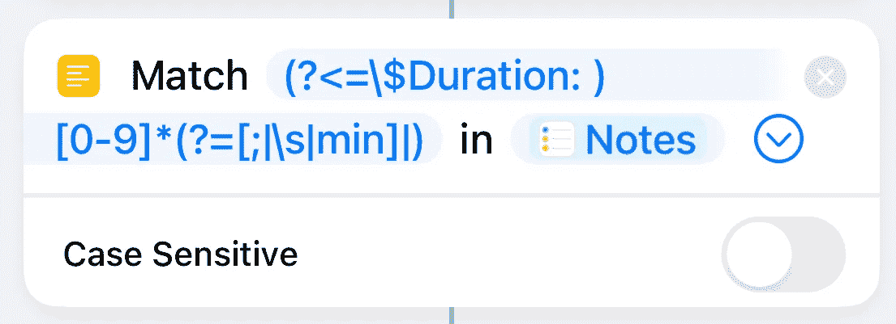

# 对快捷方式中的每个循环使用正则表达式的匹配文本操作与重复操作

> 原文：<https://betterprogramming.pub/using-a-match-text-action-with-regex-versus-repeat-with-a-each-loop-in-shortcuts-709a3ee6f51>

## 简化字符串处理



作者截图

# 背景

一段时间以来，我一直在我的提醒和联系人中使用可变数据，以允许 Shortcuts 应用程序根据这个特定提醒或联系人的值进行处理。

可变数据的例子有:

## **提醒示例**

```
$Duration: 5
$Duration: 10 min
```

## **联系示例**

```
$Automation: { “HolidaysToGreet”: [“Easter”, “Mother’s Day”, “Thanksgiving Day”, “Christmas”], “OpeningText”: [“Hi”, “Hey”, “Hello”]}
```

提醒示例用于将我计划阅读的文章提醒从最短到最长排序，或者为我的家务创建一个日历事件，从所需的开始时间开始，以适当的长度规划我的一天并划分任务。

联系人示例处理日历中的全天事件，将向适当的联系人发送问候。是的，假日可以被包含在`Find Reminders`动作的过滤器中，但是`OpeningText`不能(目前)被轻易拉出。

# 代码示例

以前，获取所需数据的方法基本如下(我将重点关注提醒用例，因为这是我最近使用的用例):

```
If "Reminder.Notes" contains "$Duration" {
Get "Notes" from "Reminder"
    Split "Notes" by "New Lines"
    Repeat with each item in "Split Text" {
        if "Repeat Item" begins with "$Duration" {
            Split "Repeat Item" by "Custom" ": "
            Get "Last Item" from "Split Text"
            Number "Item From List"
            // … further processing that doesn’t get changed …
        }
    }
}
```

这不仅是丑陋的，它是非常多圈，嵌套很深。它还可能执行额外的循环(并减慢处理速度)，因为在提取所需的行和值时没有转义。

通过使用带有正则表达式`(?<=\$Duration: )[0–9]*(?=[;|\s| ?min])`的`Match Text`动作，我可以将上面的动作改为:

```
If "Reminder.Notes" contains "$Duration" {
    Get "Notes" from "Reminder"
    Match "(?<=\$Duration: )[0–9]*(?=[;|\s| ?min])" (Case Sensitive set to "Off")
    Number "Matches"
    // … further processing that wasn’t changed
}
```

这种变化更加清晰，因为快捷方式不需要循环和查找变量数据。但是 RegEx 字符串匹配的是什么并不是一目了然的。

这个正则表达式特定于这个用例。它不适用于 contact 示例，也不适用于所用变量名称的更改(在这个示例中—文章提醒排序，阅读时间来自文章文本的网页，并通过单独的快捷方式添加为注释)。

# 正则表达式解释

这个 RegEx 字符串使用几个特性来只提取数字持续时间值。

```
(?<=\$Duration: )[0–9]*(?=[;|\s| ?min])
```

分解字符串，有 3 个重要部分。
1。`(?<=\$Duration: )`
2。`[0–9]*`
3。`(?=[;|\s| ?min])`

## 第一部分(`(<?≤\$Duration: )`)

这是“积极的回顾”文本必须出现在所需值之前。这可以根据用例进行更改，变得更加灵活。当我考虑如何存储更复杂的数据时，我会将它作为一个独特的字符串(可能是`<$?>`或类似的字符串)来充当“开始标签”

## 第二部分(`[0–9]*`)

这将只查找开始序列和结束序列之间的数字。为了使它更通用，我将把`[0–9]*`改为`.*`,这种改变将接受开始和结束标记之间的任何字符串。

对这部分正则表达式字符串的另一个考虑是确保它跨多行工作，因为整齐地打印复杂数据有助于确保准确性。我会用一个“从输入中获取字典”动作来跟踪复杂的数据结构，以使快捷方式的其他部分更容易访问

## 第三部分(`(?=[;|\s|min]`

这是一种“积极的前瞻”或者之前提到的“结束标签”。在这种情况下，它寻找分号(`;`)、任何空格或`min` ute 中的“min”。这种样式逻辑的一个好处是`6min`和`6 min`都将返回`6`作为匹配的文本。为了与之前可能出现的开始标记保持一致，我将使用类似于`</$?>`的东西来与< abbr title= "标准通用标记语言"> SGML < /abbr >结构保持一致。

# 包裹

在小地方使用正则表达式有助于在自动化过程中简化查找所需值的过程。Regex 非常灵活，非常强大。但这也带来了搜索内容某种程度的不透明。

我用来帮助开发正则表达式字符串的工具是 [regex101](https://regex101.com/) 。该站点可以帮助开发过程和学习过程，因为它解释了正则表达式解析器所经历的步骤，各种控制字符的含义，并显示了解析器检查示例文本的结果。

[](https://regex101.com/) [## regex101:构建、测试和调试 regex

### 正则表达式测试器，语法高亮，解释，PHP/PCRE，Python，GO，JavaScript 的备忘单…

regex101.com](https://regex101.com/) 

希望本文已经介绍并帮助解释了对您的处理的一种可能的增强。我认为这应该不仅仅适用于苹果生态系统中的快捷方式应用程序。给你一个新的工具来缩短甚至简化你的处理过程。