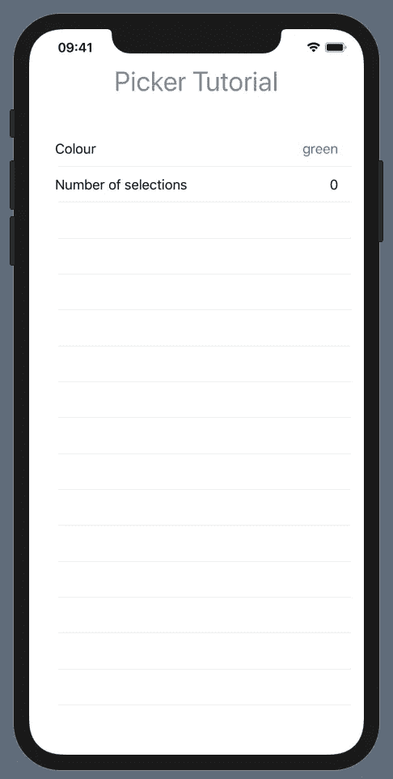
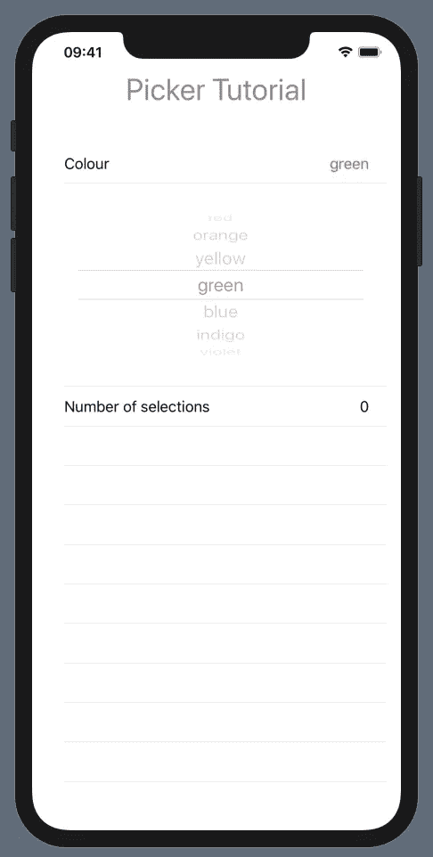
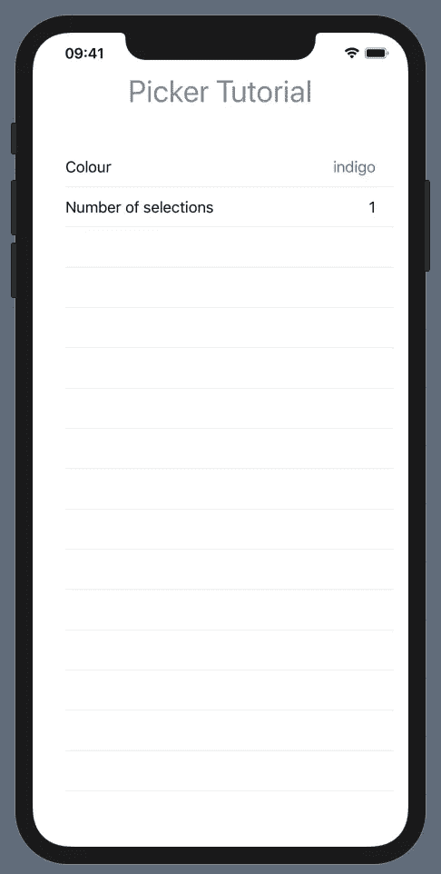
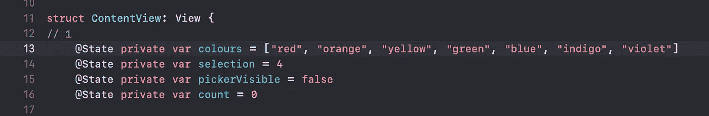
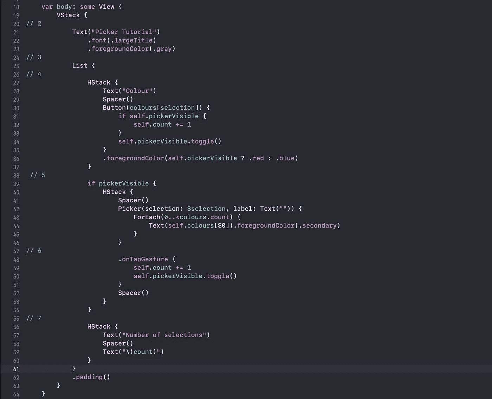

# 在 SwiftUI 列表中使用选择器

> 原文：<https://betterprogramming.pub/using-a-picker-in-a-swiftui-list-ff33b2ce979a>

## 一个能节省你时间的例子

格伦·卡斯滕斯-彼得斯在 [Unsplash](https://unsplash.com/s/photos/to-do?utm_source=unsplash&utm_medium=referral&utm_content=creditCopyText) 上拍摄的照片

我成为苹果注册开发者已经有十年了，在这段时间里我使用了几个版本的[界面生成器](https://developer.apple.com/xcode/interface-builder/) (IB)。当唯一的设备是 iPhone 时，这曾经是非常简单的。在其他设备开始出现的那一刻，生活开始变得艰难，限制开始积累。视图控制器成了编码和测试的噩梦。大约一年前，我发现了用更好的东西取代 MVC 架构的 Clean Swift T7，并开始用它开发新的应用。起初，这是一个很大的进步，但后来…

# 背景

我看了一些 WWDC19 [SwiftUI](https://developer.apple.com/xcode/swiftui/) 视频，心想:终于不再有庞大的视图控制器了。我被迷住了，所以我下载了最新的 XCode 测试版，并开始尝试学习 SwiftUI。目前，我使用的是 [Xcode 版本 11.2 beta](https://developer.apple.com/news/releases/?id=10022019e) 。不用说，它包含 bug，文档仍然严重不足，视图编译需要一些时间来适应，尤其是有这么多通用代码的时候。WWDC 的视频和样本代码是一个很好的资源，大量的教程已经开始出现在网上。SwiftUI 实验室[和 SwiftUI 的 udemy.com 课程](https://swiftui-lab.com/welcome/)[是一些很好的资源。](https://www.udemy.com/course/swiftui-declarative-interfaces-for-any-apple-device/)

我在开头提到，我开始使用 Clean Swift 构建一个新的应用程序。我现在正在将我到目前为止所做的工作转换到 SwiftUI，这将我带到本教程的目的。我在 Clean Swift 版本中构建的一个对话使用了一个*选择器*作为表格的一部分，其方式与 iCal 中的事件对话完全相同。我喜欢日期选择器直到需要时才占用屏幕空间，尤其是在 iPhone 上。使用 IB 和控制器复制这一点并不容易。在 SwiftUI 中简单了很多，但仍然不简单。

# 例子

我写了一些示例代码来演示我使用的技术。它使用一个选择器从可见光谱中选择一种颜色。当前选择的颜色显示在两行列表中。在屏幕截图中，颜色“绿色”当前被选中，其名称显示为蓝色。下面是颜色被选择的次数。

点击颜色名称(上面显示为“绿色”),提货人会出现在它下面的行中，按下显示计数的行。颜色名称现在显示为红色。

选一种颜色，比如说，“靛蓝。”点击拾色器或红色显示的颜色名称会导致拾色器消失，显示新的颜色，并且计数增加 1。

# 代码

那么这一切是怎么做到的呢？首先是变量:

有四个状态变量:

*   `colours`:用于填充选取器的字符串数组
*   `selection`:用作选取器选择的整数
*   `pickerVisible`:当选取器可见时，布尔值设置为“真”
*   `count`:拾取器选择次数的计数。

下面是`ContentView`主体的代码:

这由两个元素的 VStack 组成:显示标题的文本视图和包含颜色、Picker 和计数行的列表视图。

列表的第一行是一个`HStack`，由行描述和按钮视图组成。按钮的闭合有两个作用:

1.  测试机械臂是否可见，如果可见，则增加`count`。
2.  切换`pickerVisible`布尔值。

点击按钮，执行关闭并重建`ContentView`。

在`HStack`之后，有一个条件语句测试`pickerVisible`的值。如果它的值为`true`，*，*，则包含一个`HStack`，它包含了提货人。选取器的第一个参数是绑定变量`selection`，第二个是标签(此处为空)，第三个是遍历`colours`数组的闭包，为每个元素创建文本视图。值得指出的是，很容易将`ForEach`与数组方法`forEach`混淆。这里`ForEach`生成视图；事实上，在 SwiftUI 中，视图无处不在。

Picker 视图附加了修饰符`onTapGesture` (修饰符实际上是属于视图的函数)。这有一个增加`count`和切换`pickerVisible`的闭包。当视图再次重建时，选取器消失。

最后，还有另一个包含显示`count`的行的`HStack`。

就是这样。我希望这个小例子可以节省一些人的时间。