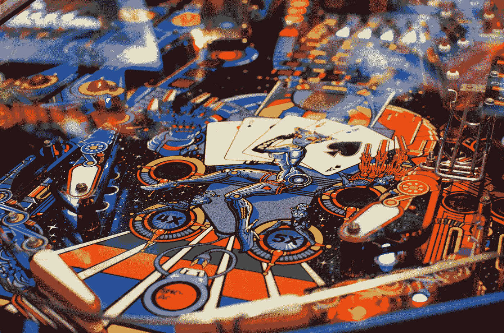

# 使用计算机视觉自动化弹球机

> 原文：<https://betterprogramming.pub/using-ai-to-automate-a-pinball-machine-ef5721141f03>

## 用人工智能玩弹球



希瑟·麦肯在 [Unsplash](https://unsplash.com?utm_source=medium&utm_medium=referral) 上拍摄的照片

在我们高中的最后一年，我和我的同学们试图自动化坐在物理老师教室里的一台古董弹球机。

以前曾使用过一种简单的方法，用激光探测球，并根据需要发射脚蹼。然而，我们想在人工智能的帮助下更上一层楼。考虑到这一点，有两个主要的挑战需要解决:能够检测弹球和基于弹球检测做出决策。

# 可视化表格


弹球桌计算机视觉设置图

我们使用安装在弹球桌顶部的摄像机以每秒 60 帧的速度拍摄整个操场。这有一些问题——很难将捕捉视野限制在桌子本身，相机的轻微移动会移动帧中的整个操场，桌子是倾斜的，这捕捉了一个非矩形的操场。

我们选择通过软件来解决所有这些问题，而不是为相机装备创建一个更强大的硬件解决方案。

# 检测和裁剪运动场


左图:用绿色圆圈突出显示我们添加的磁带的原始帧。右:已处理的帧

借助 OpenCV 的强大功能，我们可以随心所欲地操纵摄像机捕捉的内容。

我们想出了在操场的四个角落放置对比色胶带的主意，用作剪切摄像机捕捉的锚。

对于每一帧，我们在对磁带的蓝色和黄色应用 HSV 颜色阈值遮罩后运行 OpenCV 的轮廓检测。从返回的轮廓中，我们过滤出具有四条边(矩形)和一个指定间隔内的区域的形状。我们用 OpenCV 检测这些角点的实现如下:

将原始捕捉转换和裁剪为仅具有矩形运动场的帧

有了这个，我们就有了检测弹球的基础，而没有桌子周围的所有视觉噪声，并且更少依赖于相机的位置。如果四个角带片段在帧中，运动场将被处理以占据整个帧。

这对于项目的决策部分尤其重要，因为决策模型将依赖于来自检测算法的球的位置。如果没有锚点，当摄像机移动时，球的位置将来自不同的参考点。训练决策模型将依赖于来自相同参考点的所有位置数据。

在本系列的下一部分，我将介绍我们如何在如此丰富多彩和嘈杂的环境中检测弹球。

# 弹球检测的头脑风暴法

我们首先想到的是尝试一种机器学习策略，通过卷积神经网络运行每一帧来检测弹球的位置；然而，在尝试这种方法时，我们意识到了两个问题——计算成本很高，我们需要大量的劳动来标记数据以训练模型。

相反，我们开始研究一种非机器学习的方法。幸运的是，OpenCV 实现了非常强大的计算机视觉算法，比机器学习算法的计算效率更高。在做了图像预处理(模糊、HSV 阈值处理和转换成二进制图像)后，我们使用 OpenCV 的`cv2.findContours(...)`函数。这个函数使用铃木智和安倍昭惠在论文中提出的算法，可以在这里找到。


1)高斯模糊帧 2) HSV 阈值帧，3)检测到的轮廓 4)红色球轮廓

在检测到的许多轮廓中，我们根据面积间隔、最大周长和最大边数对它们进行过滤。有了这个，我们可以在没有任何东西阻挡摄像机视线的情况下很好地探测到球。

我们得到球的`x`和`y`坐标的最后一步是得到我们轮廓的“质心”。这非常简单，这要感谢 OpenCV 对`cv2.moments(...)`的实现。你可以用下面的代码得到`x`和`y`质心坐标:

```
m = cv2.moments(c)  # given that c is the contour of the ball

x = int(m['m10'] / m['m00'])                
y = int(m['m01'] / m['m00'])
```

# GitHub 知识库

[](https://github.com/automation-club/autonomous-pinball-backend) [## GitHub-automation-club/autonomy-pinball-back end:后端解决方案的代码库…

### 此时您不能执行该操作。您已使用另一个标签页或窗口登录。您已在另一个选项卡中注销，或者…

github.com](https://github.com/automation-club/autonomous-pinball-backend)