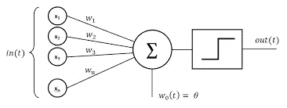
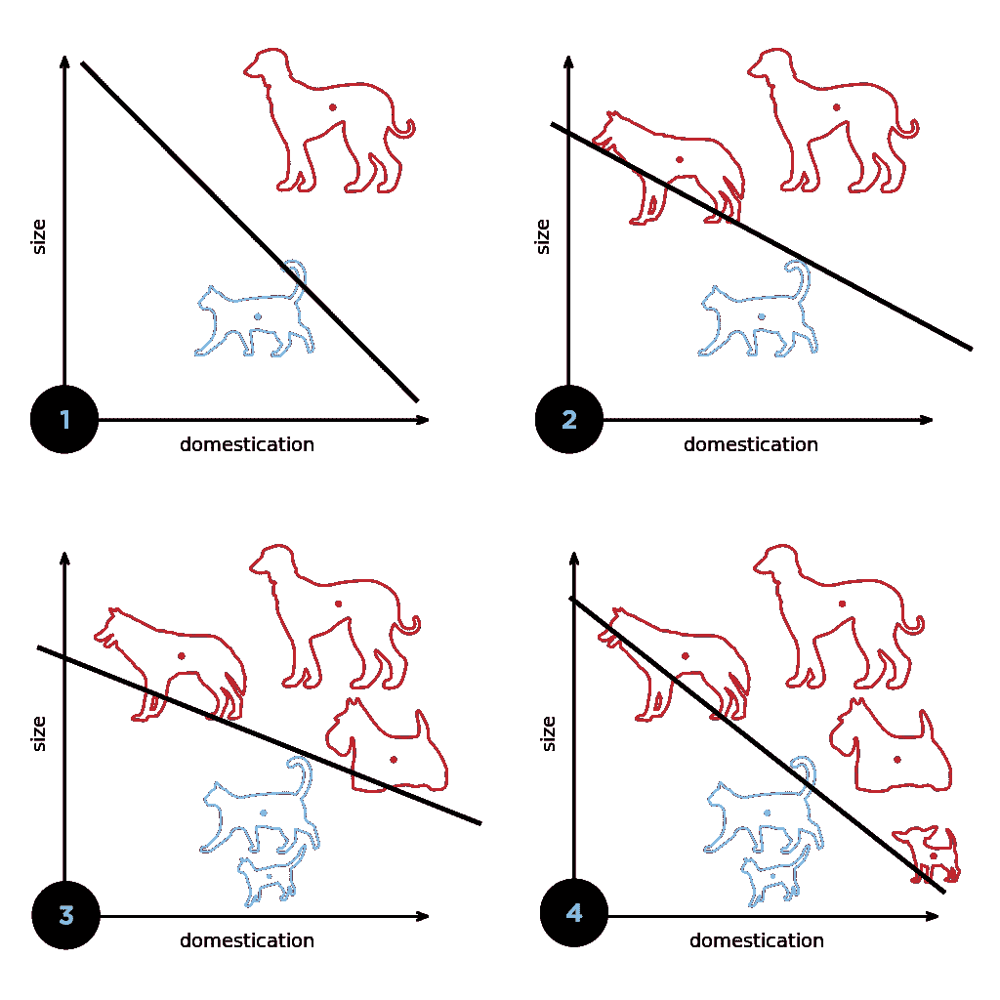
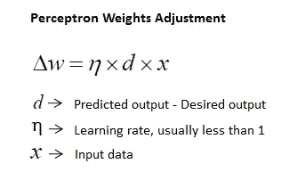
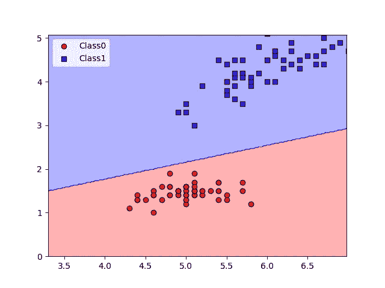

# 使用 Python 对鸢尾花进行检测和分类

> 原文：<https://betterprogramming.pub/using-artificial-intelligence-to-detect-iris-flowers-6d503b1420ff>

## 感知器的创建及其在网络安全中的应用

照片由 [Towfiqu barbhuiya](https://unsplash.com/@towfiqu999999?utm_source=medium&utm_medium=referral) 在 [Unsplash](https://unsplash.com?utm_source=medium&utm_medium=referral) 上拍摄

最近，我被要求开始探索人工智能及其对云安全的影响。我决定花时间探索 PyTorch 和 AI 的基础知识。在本文中，我们将探索最基本的人工智能算法，感知器，并实现它来根据花瓣和萼片的长度对花朵进行分类。之后，我们将讨论人工智能对网络安全的潜在影响。

# 罗森布拉特的感知机是什么

来源:[https://commons . wikimedia . org/wiki/File:Perceptron _ moj . png #/media/File:Perceptron _ moj . png](https://commons.wikimedia.org/wiki/File:Perceptron_moj.png#/media/File:Perceptron_moj.png)

罗森布拉特的感知机是第一个以编程方式描述的神经元模型。感知器通过获取一系列输入(`x_1`到`x_n`)来工作，每个输入代表不同对象的属性，将它们乘以随机分配的权重，并执行求和。

基于所有加权属性的总和，将对象分类为属于或不属于某一类别(输出`1`表示属于或`0`表示不属于)，之后计算误差幅度，并相应地调整权重。对于每个示例(从`X_1`到`X_n`的一行属性)，每个变量的权重都会更新，并且它会移动两个类别之间的分界线，如下图所示:

来源:[https://upload . wikimedia . org/Wikipedia/commons/thumb/8/8a/Perceptron _ example . SVG/1024 px-Perceptron _ example . SVG . png](https://upload.wikimedia.org/wikipedia/commons/thumb/8/8a/Perceptron_example.svg/1024px-Perceptron_example.svg.png)

每次迭代后，每个变量的权重和偏差(y 轴截距)计算如下:

资料来源:https://www.saedsayad.com/images/Perceptron_weight.png

对于每个变量，权重变化被分类为预测和期望结果乘以学习率(权重的乘数)和 var 本身之间的差异。然后将这个增量加到相关变量的权重上，如果它是负的，可以随后增加或减少它。在下一次迭代之前，对偏差进行同样的处理。

因为感知器基本上是基于线性方程的，所以对于感知器来说，两个类别之间必须存在清晰的线性边界，以便它能够很好地运行，因为它会用训练中使用的每个项目来更新其边界。然而，在某些情况下，如果不存在“清晰的分界线”，这种感知可能会陷入无限循环。

创建感知器非常简单，只需要三个函数:

1.  `Fit` —根据数据集进行训练，并根据每个示例调整权重。
2.  `Net Input` —计算所有输入的加权和。
3.  `Predict` —可以用来预测一个对象经过训练后的类别。

# 鸢尾花分类

为了使用感知器对鸢尾花进行分类，我们将从一个具有鸢尾测量数据集的网站获取前 100 个数据点(第 9-11 行)。在第 14-18 行，前 100 个例子从数据集中提取，然后我们将属性(花瓣和萼片长度)拆分到数组`X`中，将标签拆分到数组`y`中。在第 22–23 行，我们将启动感知器，并给它 0.1 和 10 个历元的学习率，这意味着它将遍历数据十次，每个误差乘以 0.1 会影响权重。我们将使用函数`plot_decision_regions`来绘制我们的决策边界，并查看数据是如何分类的。

# 结果

上面的代码生成了下图。正如我们下面的代码生成的图像所示，数据被精确地绘制出来，在边界线的每一侧有两种不同类型的鸢尾花。

该项目的完整代码可以在这里找到:

[AleksaZatezalo/iris classification(github.com)](https://github.com/AleksaZatezalo/IrisClassification)

# 前进:人工智能和网络安全

虽然我有很多东西要探索，但我发现感知器非常直观。我想探索它与网络安全的交叉。通过我所做的许多不同的阅读，人工智能对网络安全有许多潜在的影响，特别是在云中。

在基础设施由第三方管理的环境中部署软件，可以部署人工智能和机器学习算法，以便在软件仍然可以行使控制权的边缘分析和执行安全策略。虽然到处散布机器学习很有诱惑力(这是一个时髦的话题)，但知道这项技术在哪里可以得到最大的效用是很重要的。某些例子如下:

# 检测敌对输入

机器学习模型可以部署在 AWS 中，以检测上传和共享到云的文件中的敌对输入。这在识别恶意数据、木马病毒软件和保护数据完整性方面具有强大的潜在应用。下面链接了一个教程:

 [## 使用亚马逊 SageMaker 模型监视器和亚马逊 SageMaker 调试器检测敌对输入|…

### 过去几年的研究表明，机器学习(ML)模型容易受到敌对输入的影响…

aws.amazon.com](https://aws.amazon.com/blogs/machine-learning/detect-adversarial-inputs-using-amazon-sagemaker-model-monitor-and-amazon-sagemaker-debugger/) 

***尚可* *警告*** *:上面的教程漏洞百出，实现起来很棘手。*

# 检测网络异常

在适当的情况下，网络流量的异常可以作为攻击的有力指标。按照下面的教程，随机切割森林算法可以部署到 AWS，并用于识别网络流量的不规则性。如果正确链接到您的 SIEM，则可以开出一张罚单，并启动一个程序。

 [## 使用内置的 Amazon SageMaker 随机切割森林算法进行异常检测| Amazon Web…

### 今天，我们将推出对随机砍伐森林(RCF)的支持，作为亚马逊 SageMaker 的最新内置算法。RCF…

aws.amazon.com](https://aws.amazon.com/blogs/machine-learning/use-the-built-in-amazon-sagemaker-random-cut-forest-algorithm-for-anomaly-detection/) 

# 在零信任环境中计算信任分数

人工智能是许多零信任安全系统的强大组件。通过我所做的许多不同的阅读，人工智能对网络安全有许多潜在的影响，特别是在云中。零信任环境结合了用户的信任分数(由 AI 计算)，该分数考虑了他们之前的所有操作和网络策略，以确定他们是否可以执行某个操作。关于这个话题的一篇有趣的文章可以在下面找到:

 [## 机器学习如何推动零信任革命

### 零信任正在安全领域掀起风暴。这是一种新的模式，有巨大的潜力来改善…

towardsdatascience.com](https://towardsdatascience.com/how-machine-learning-powers-the-zero-trust-revolution-6953bfc0c14c) 

感谢您的阅读。

敬请关注更多内容！