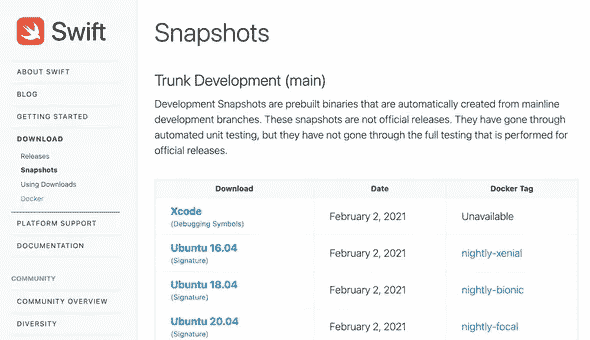
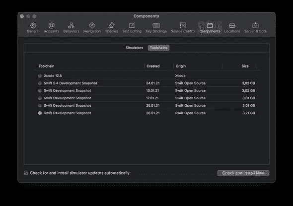

# 在 SwiftUI 中使用 async/await

> 原文：<https://betterprogramming.pub/using-async-await-in-swiftui-dfc5e08b03f7>

## 快速进化

## 并发变得简单多了


作者图片

我们编写的许多代码都必须处理异步行为。从磁盘获取数据、向远程 API 发送请求或下载图像——所有这些操作都需要时间，即使在超高速、低延迟的在家工作网络上也是如此。

处理这种情况的一个简单方法是等待，直到一个呼叫结束，我们请求的数据到达。这种方法的问题是你的应用程序的用户界面在等待的时候会冻结。我们都使用过在某些任务上似乎完全冻结的应用程序——这是一种糟糕的用户体验。

那么如何才能做得更好呢？

一种方法是在后台线程上执行长时间运行的任务，并在结果到达后回调主应用程序。有许多方法可以实现这一点。作为 iOS 开发人员，我们对委托很熟悉:您调用一个方法，过一会儿您将收到一个委托方法的结果。这样做效果很好，但是产生的代码分散在各处，很难阅读。

闭包提供了一种稍微更优雅的方式来编写异步代码。让我们看一些真实例子的伪代码:在餐馆点餐。

```
chatWithFriends()
placeOrder(theOrder) { meal in
  eat(meal)
}
```

这里重要的是，你可以在等待你的订单到达的同时继续和你的朋友聊天。调用`placeOrder`后花括号中的代码被称为*尾随闭包*，只有当饭菜准备好并送到您的住处时，才会调用它。

这与同步代码非常不同，在同步代码中，计算机按顺序执行一个又一个语句。下面的伪代码更类似于我们对这种情况的理解:

```
placeOrder(theOrder)
chatWithFriends()
meal = receiveMeal()
eat(meal)
```

1.  我们下订单。
2.  然后，当我们等待饭菜端上来的时候，我们和朋友聊天。
3.  过了一会儿，饭菜来了，我们可以享用了。

使用闭包和回调来处理异步代码现在很常见，许多 iOS SDKs，如 Alamofire、AWS Amplify、Firebase，甚至苹果自己的`URLSession`都使用了它。

然而，一旦您试图协调几个异步调用，这种代码很快就会变得难以阅读，更糟糕的是，很难正确处理。如果我们能够以类似于第二段代码的方式编写异步代码，那不是很好吗？

好消息是，我们可以做到:Swift 团队已经提议在 Swift 语言中增加一项功能，让我们可以做到这一点。该提案被命名为 [SE-0296](https://github.com/apple/swift-evolution/blob/main/proposals/0296-async-await.md) ，可在 Swift 编译器工具链的开发快照中获得。它为 Swift 添加了对 async/await 的支持，这将允许我们在不使用回调的情况下进行异步调用。

在本文中，我将向您展示如何安装编译器工具链，激活这个新特性，并重写基于回调的代码片段以利用 async/await。

观看此视频，了解这一点

# 安装实验编译器工具链

为了试验这一特性，我们首先需要从 Swift 网站上的[下载页面](https://swift.org/download/)下载 Swift 编译器工具链。向下滚动到“主干开发(主)”部分，并点击 Xcode 链接。链接标题有点误导——该下载实际上并不包含 Xcode 的副本。它实际上只是编译器工具链。



下载完成后，我们可以通过双击软件包来安装它。

要激活编译器工具链，我们需要启动 Xcode 并选择工具链。进入首选项>组件>工具链并选择 Swift 开发快照。在这个对话框中，你还会看到官方的工具链——它的标签是 Xcode 12.5。当你回到你的工作项目时，不要忘记切换回这个原始的工具链。



一旦工具链被激活，Xcode 将在状态区域显示一个蓝色的链图标:


注意:值得记住的是，这是一个实验性的特性，从现在到发布时，情况可能会有所变化。最重要的是，不可能使用实验工具链将构建版本发布到 App Store。你也不能在真实设备上运行，只能在模拟器上运行。所以不要在你的产品代码中使用它。

# 启用对并发的实验性支持

在使用 async/await 之前，我们需要在项目的构建设置中启用实验性并发。

为此，我们需要打开构建设置，找到其他 Swift 标志，并添加`-Xfrontend -enable-experimental-concurrency`。

注意: [PR 35784](https://github.com/apple/swift/pull/35784) 默认情况下启用 async/await，所以一旦它推出，您就可以使用这个特性，而不必启用实验支持——安装工具链就足够了。

尝试启动应用程序时，您可能会看到一条错误消息，提示“无法启动(应用程序名称)— LLDB 未提供错误字符串”。如果发生这种情况，请关闭应用程序目标的调试:选择您的目标，然后选择编辑方案…>运行并取消选择“调试可执行文件”复选框。


# 查看示例项目

如果您想继续学习，可以从[GitHub repo](https://github.com/peterfriese/Swift-Async-Await-Experiments)下载本文的示例项目，切换到 [starter](https://github.com/peterfriese/Swift-Async-Await-Experiments/tree/blog/article_analyser/starter) 分支，然后打开 ArticleAnalyser 项目。

该示例项目包含一些我从目前正在进行的另一个项目中获得的功能:用户可以添加他们希望稍后阅读的文章的链接，应用程序将分析网页并提取信息，如标题、英雄图像和其他元信息。此外，它将使用一些自然语言 API 来为文本计算有意义的标签。例如，如果你粘贴一个链接到这篇文章，它应该建议标签*并发*和*迅捷*。

获取网页文本是一项异步任务，执行分析也可能需要一点时间——尤其是如果我们要使用任何基于云的 API。目前，代码使用苹果的`NLTagger`API，但在未来，我们可能会决定使用[谷歌的云自然语言 API](https://cloud.google.com/natural-language)。

由于这是一个多步骤的过程，我定义了一个界面来帮助我们保持事物整洁有序:

该协议中的所有方法都使用尾随闭包，其中一些被标记为`@escaping`，这意味着在执行从方法返回后，将有代码保留闭包。这是异步代码的一个迹象。

到目前为止，一切顺利。现在让我们看看控制整个过程的代码。请记住，我们首先需要下载组成网页的文本，然后提取所有信息，运行我们的自然语言处理等。

你准备好了吗？看起来不太好。

我想我们都同意这真的很难读懂。事实上，当我把这个给我的一个同事看的时候，他说“我不知道在整个星系中有那么多闭合花括号！”

最重要的是，错误处理甚至不是很好。

# 异步/等待

让我们看看如何通过使用 async/await 来改进这段代码。

第一步是摆脱所有的回调。相反，我们将告诉编译器，这些函数的结果将异步交付，它们可能会抛出错误。最后，我们指定返回类型。

这看起来已经简单多了。当我们对其中一种方法进行之前/之后比较时，对比更加明显:

新的方法签名看起来更干净，更容易看出输入参数和返回类型是什么。

下一步，让我们更新驱动下载和分析网站的整个过程的代码。

去掉回调处理程序允许我们以更简洁的方式编写代码。首先，我们可以将`process`方法标记为异步。然后我们会告诉编译器这个方法可能会抛出一个错误，返回类型是一个`Article`。

要调用标记为`async`的方法，我们需要在调用前加上`await`关键字。这告诉编译器它需要等待调用返回。好消息是 Xcode 会告诉我们`await`关键字是否丢失，甚至会主动为我们修复代码。

就这样，我们消除了以前回调驱动实现中必须使用的深度嵌套回调结构。代码变得更加简洁明了，看起来像线性程序。

# 重构基于回调的代码

当然，我们需要转换现有的代码来获取网页并提取所有的元数据。

让我们从采用我们之前定义的协议开始。

为了了解将现有的基于回调的代码转换为 async/await 所需的工作量有多大，让我们粘贴现有的代码，然后对其进行适当的修改。

下面是获取网页的代码:

当我们将它粘贴到我们的新方法中时，您会注意到的第一件事是，我们不再有一个可以用来与调用者通信的`completion`处理程序。有多种方法可以处理这个问题，对于初始的`guard`语句，如果 URL 无效，我们可以抛出一个错误:

为了包装现有代码，async/await 建议为我们提供了一些助手函数，比如`withUnsafeThrowingContinuation`。这些助手函数使用一个带有`continuation`参数的闭包，当代码完成时可以调用这个闭包。

它是这样工作的:

*   首先，我们将现有代码包装在对`withUnsafeThrowingContinuation`的调用中。
*   然后，无论何时您想要与呼叫者通信，您都可以调用`continuation`来代替。
*   `UnsafeThrowingContinuation`有几个重载的`resume`方法，允许你返回一个`Result`类型和一个正常的返回值，或者甚至抛出一个错误。

这允许我们在下载失败时抛出一个错误。如果下载成功，我们可以返回网页的文本。

这些是将代码从使用回调转为使用 async/await 所需要做的唯一更改。

现在，您已经掌握了转换剩余函数的所有技术。我将把这作为一个练习留给你，但是如果你卡住了，检查一下项目回购中的 [final](https://github.com/peterfriese/Swift-Async-Await-Experiments/tree/blog/article_analyser/final) 分支。

# 连接用户界面

最后，让我们将 UI 连接到我们的新代码。在这个示例应用程序中，我们使用`ArticlesViewModel`作为事实的来源——它有一个名为`articles`的已发布属性，包含主列表视图将显示的所有文章的列表。

目前，当用户添加一个要分析的新 URL 时，UI 将调用`addNewArticle`，提供`url`作为输入参数。这个方法将调用`performAddNewArticle`，后者使用基于回调的`AnalyserService`来下载和分析文章，并将其添加到`articles`数组中。

相反，我们想使用我们的新`AsyncArticleAnalyserService`。我们可以从制作一个`performAddNewArticle`的副本开始，并做一些调整，以便它能与我们新的异步代码一起工作。

我们已经知道，我们需要给异步函数的调用加上前缀`async`，由于方法可以抛出，我们还需要将调用封装在一个`do / try / catch`块中。我们还可以去掉结尾的闭包，并将结果赋给一个名为`article`的局部变量。

但是 Xcode 似乎并不高兴，显示了一个错误:`'async' in a function that does not support concurrency`。这是因为我们试图从一个不包含在异步上下文中的地方调用。我们可以遵循 Xcode 的建议，使用`@asyncHandler`标记`performAddNewArticleAsync`，而不是自己建立一个异步上下文:

这样，我们现在可以再次运行该应用程序，并查看我们全新的 async/await 实现的运行情况！

# 关闭；-)

我认为 async/await 是对 Swift 语言的一个很好的补充。许多其他语言，如 C#、JavaScript 或 TypeScript，都有类似的语言功能，在 Swift 中添加 async/await 将使来自这些语言的人更容易使用。

使用 async/await 将使您的代码更具可读性，并且正如我们刚刚看到的，重构现有代码相对简单。

在您自己的代码中使用 async/await 的最强有力的论据之一是，这允许您显式地表示代码的某些部分异步运行。这对用户来说是一个强烈的信号，有助于他们更好地理解 API 的哪些部分是异步的，可能只是在短暂的停顿后才返回。更好的是，如果开发人员试图以非异步方式调用您的 API，Swift 编译器现在会发出警告和错误。这对于回调和尾随闭包来说是不可能的。

我还认为这对任何构建 API 的人来说都是一个好消息，有望减少他们花在支持上的时间。有趣的事实:“Firebase APIs 是异步的…”是我在回答堆栈溢出问题时最常用的句子之一。

我迫不及待地想在 Swift 的下一个版本中加入这一特性。你呢？在本文资源库的[讨论论坛](https://github.com/peterfriese/Swift-Async-Await-Experiments/discussions)上联系我。