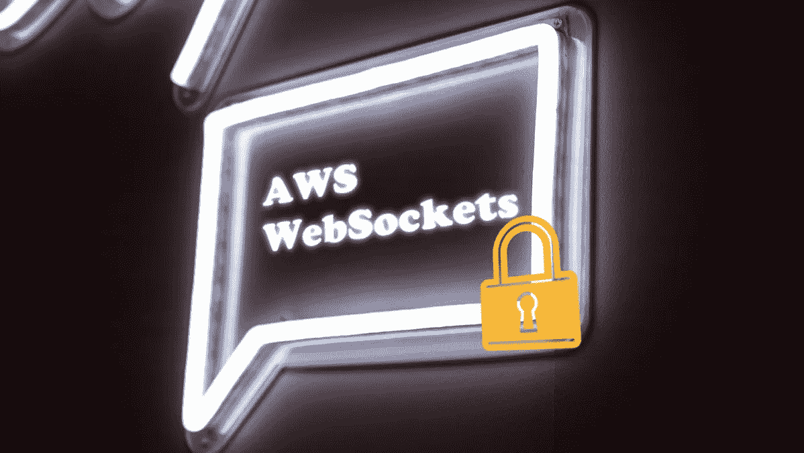
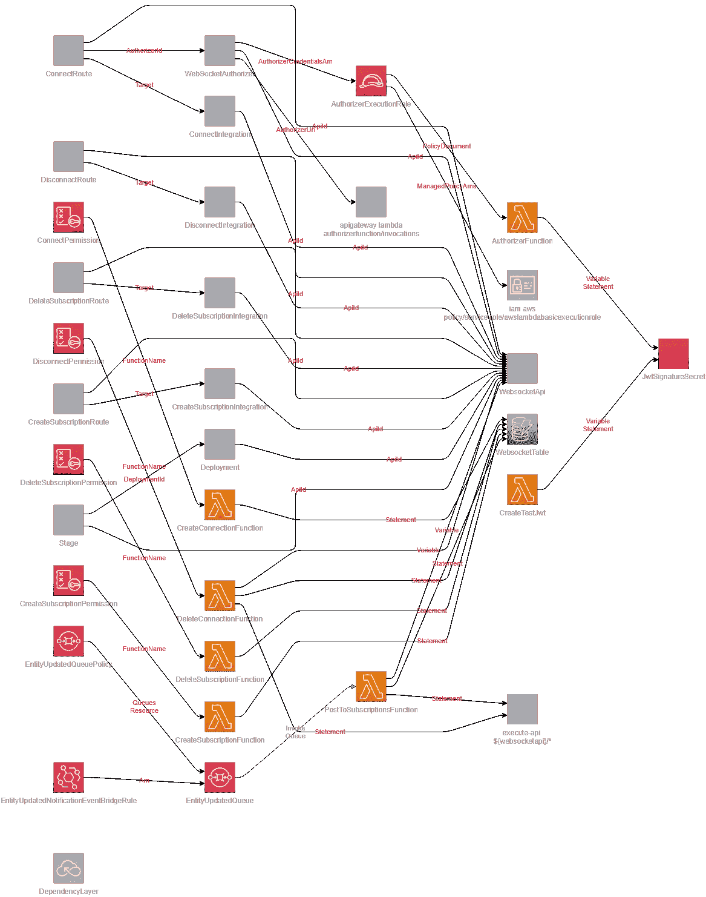
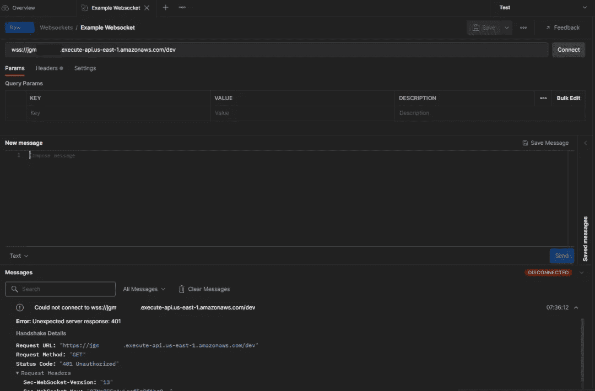
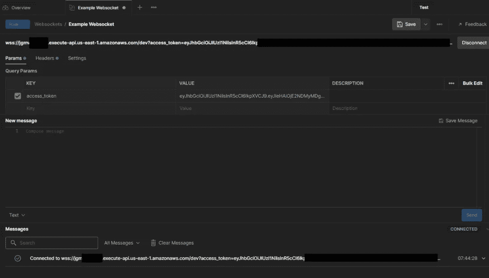
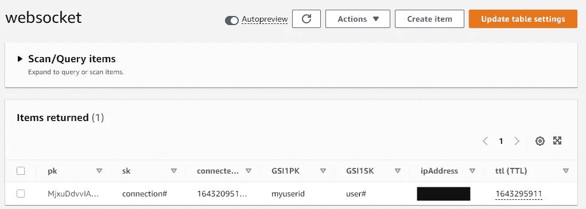

# 将 Lambda 授权器与 AWS Websockets 一起使用

> 原文：<https://betterprogramming.pub/using-authoriser-for-aws-websockets-caf7a0441c8e>

## 了解 Auth 如何工作以及如何部署它



[梁杰森](https://unsplash.com/@ninjason?utm_source=unsplash&utm_medium=referral&utm_content=creditCopyText)在 [Unsplash](https://unsplash.com/s/photos/chat?utm_source=unsplash&utm_medium=referral&utm_content=creditCopyText) 上的照片

在我的上一篇文章中，我们学习了如何在 AWS 中创建一个 WebSocket API。我们建立了一个功能 API，我们可以连接到它并从中发送消息。但这只是谜题的一部分。

现在我们从 WebSockets 开始，我们必须谈谈安全性。真的，我们应该从安全问题开始，但是事情已经过去了。我们不希望恶意用户连接到我们的 API，并试图通过 [DDoS](https://www.cloudflare.com/learning/ddos/what-is-a-ddos-attack/) 或注入攻击来搞垮我们。

今天，我们将利用上周创建的内容，为其添加一个 [lambda 授权器](https://docs.aws.amazon.com/apigateway/latest/developerguide/apigateway-use-lambda-authorizer.html)，以确保每个连接的人都是系统的有效用户。

# 了解 WebSocket 身份验证

你可能会想，“为什么这篇文章会成为一件事？我知道如何[给 API 添加 lambda 授权器](https://levelup.gitconnected.com/build-auth-once-with-a-shared-lambda-authorizer-9936dc7e7897)。”

虽然这可能是真的，但是您需要知道一些特定于 WebSockets 的问题。大多数连接到 WebSockets 的前端 JavaScript 库并不真正支持标准头文件。

WebSocket API [在建立连接时只支持 Sec-WebSocket-Protocol 头](https://html.spec.whatwg.org/multipage/web-sockets.html#network)。像 [Postman](https://www.postman.com) 这样的工具允许你在建立连接时传入其他头(这是好事！)，但当你开始在你的应用程序中编写前端代码时，你会立即停下来。

要解决这一问题，同时仍然为我们提供安全连接的方法，我们有两种选择:

*   在`Sec-WebSocket-Protocol`标题中提供分隔值
*   在一个`access_token`查询字符串参数中提供身份验证令牌

这两种方法各有利弊，最终决定权在你。我们在 AWS 客户中部署的解决方案支持这两种方法。我推荐使用[查询字符串参数方法](https://faqs.ably.com/is-it-secure-to-send-the-access_token-as-part-of-the-websocket-url-query-params)，因为它简单明了，不会改变`Sec-WebSocket-Protocol`头的用途。

因此，在建立新连接时，我们将传入一个名为`access_token`的查询字符串参数，其中包含我们的 [jwt](https://jwt.io/) ，而不是标准的`Authorization`头。

关于 WebSocket auth 还有一点需要注意——您只需要在 *$connect* 上进行身份验证。每个后续调用都使用同一个经过身份验证的连接。那就简单了！

如果您按照本系列的第一部分进行了操作，那么您已经在 AWS 帐户中部署了一个基本的 WebSocket。它能够添加和删除连接，以及添加和删除对特定实体的订阅。今天，我们将在回购中使用一个分支来增强我们所拥有的。

如果您不熟悉检查存储库中的非主分支，您可以在 [VS Code](https://code.visualstudio.com/) 的终端中运行下面的命令来本地检查它。

```
git fetch git 
checkout part-two
```

一旦本地有了源代码，就可以像以前一样进行部署:使用`sam deploy`命令。在运行之前，还需要对`samconfig.toml`文件进行一次更新。

在我们的 lambda authorizer 中，我们验证所提供的 jwt(也称为 auth token)来自可信来源。为了做到这一点，我们验证 jwt 是用我们的*密钥*签名的。秘钥可以是您喜欢的任何东西，只是在生产场景中这样做时，请确保不要与其他人共享它。

我推荐使用`sam deploy --guided`命令来重新实例化这个栈的参数。完成后，立即部署！

# 我刚刚部署了什么？

首先感谢大家的信任。其次，您部署了与上次相同的设置，并添加了一些新特性。

*   一个新的 lambda 授权器
*   更新了存储用户信息的 *$connect* lambda(稍后将详细介绍)
*   使用您在部署时提供的秘密测试生成 jwt 的 lambda
*   [Secrets Manager](https://aws.amazon.com/secrets-manager/) secret 安全存储 jwt 秘密

存储库中包含从`template.yaml`文件生成的完整基础设施图。如果你还没有把它作为一个惯例，我[强烈推荐生成图](/how-and-why-you-should-start-generating-your-serverless-infrastructure-diagrams-49cfd4568935)。他们不费吹灰之力就提供了巨大的价值。下面是部署到 AWS 中用于构建安全 WebSocket API 的全套资源。



*安全 WebSocket 架构的基础架构图*

# 连接到安全的 WebSocket

部署好一切之后，是时候连接到我们的 WebSocket 了！首先，我们需要验证连接是否安全。因此，我们将像在本系列的第一部分中所做的那样尝试连接到它。

1.  打开[桌面应用](https://www.postman.com/downloads/)
2.  选择新建-> WebSocket 请求
3.  在地址栏中输入 SAM 部署输出的路由(使用`WebsocketUri`输出值)
4.  点击`Headers`选项卡，添加值为`websocket`的`Sec-WebSocket-Protocol`标题
5.  点击**连接**

如果一切按计划进行，我们应该会收到一个 **401** ，因为我们没有提供 auth 令牌。



*401 无认证令牌连接时的响应*

现在让我们得到一个令牌并建立一个连接。

```
aws lambda invoke --function-name CreateTestJwt response.json
```

1.  打开生成的`response.json`文件，复制 *authToken* 属性中的值
2.  在 Postman 中，向名为`access_token`的 url 添加一个查询字符串参数，并粘贴 *authToken* 值
3.  点击**连接**



*连接成功！！*

现在我们已经连接好了，我们可以向 WebSocket 发送和接收消息，而不需要额外的 auth。

# 我们现在能做什么？

既然我们的 WebSocket 是安全的，我们就不必担心恶意用户会破坏我们的系统。所以我们能做的第一件事就是*放松*。

第二，我们能够在特定于用户的级别上发送通知。Lambda 授权器返回一个包含数据丰富的`context`对象，供您在代码中使用。在我们的示例授权器中，我们已经解码了 jwt 中的`userId`、`firstName`、`lastName`和`sub`，并将其传递给 *$connect* 函数。

这些信息存储在 Dynamo 的连接记录中，因此我们可以用它向用户发送推送通知。



*来自 lambda 授权者的用户信息*

用户 id 存储为`GSI1PK`，因此我们可以查找用户的连接信息，并在需要时向他们发送推送消息。这个功能没有在本演练中实现，但是我们将在本系列的下一篇文章中对此进行扩展。

# 下一步是什么？

在异步的[年](/and-the-2022-word-of-the-year-for-programmers-is-3605dc1bd698)，我们一头扎进了 WebSocket 池。该系列中即将发布的帖子是关于如何使用[异步 API 规范](https://www.asyncapi.com/)记录 WebSocket API，添加基于用户的推送通知，以及从同步端点迁移到异步端点而不遗漏任何一个节拍。

尝试本教程中的堆栈，熟悉组件，并进行一些更改！编码快乐！