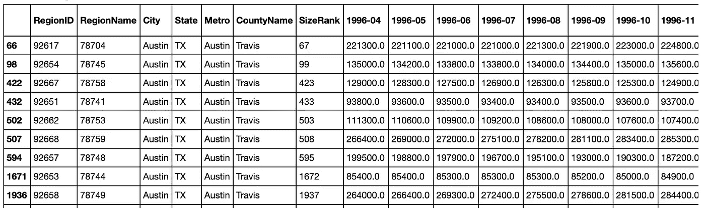
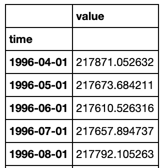
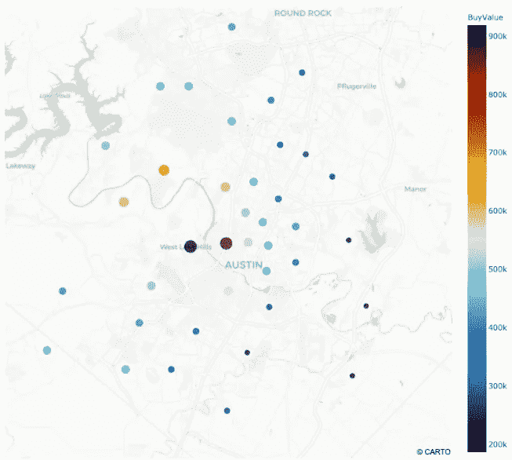
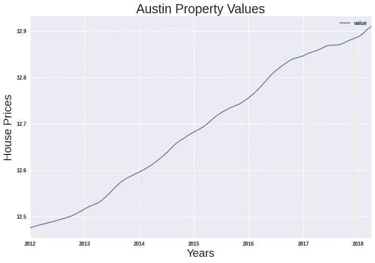
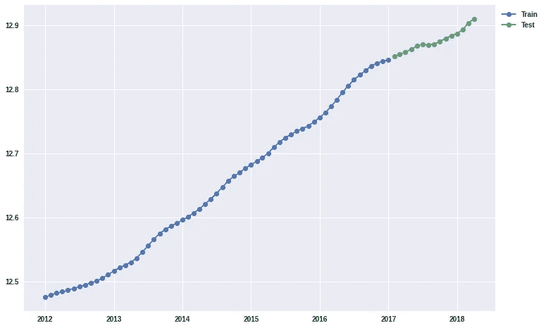
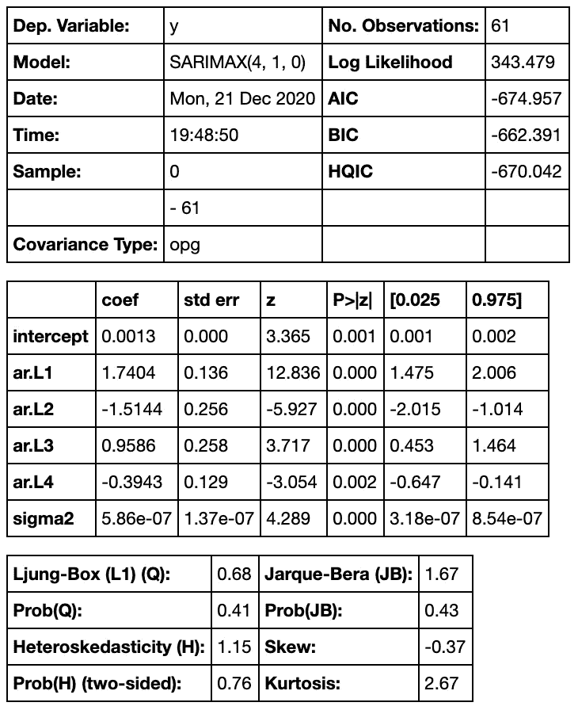
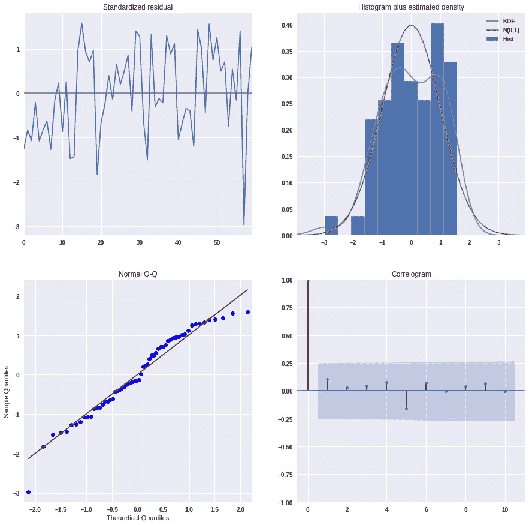
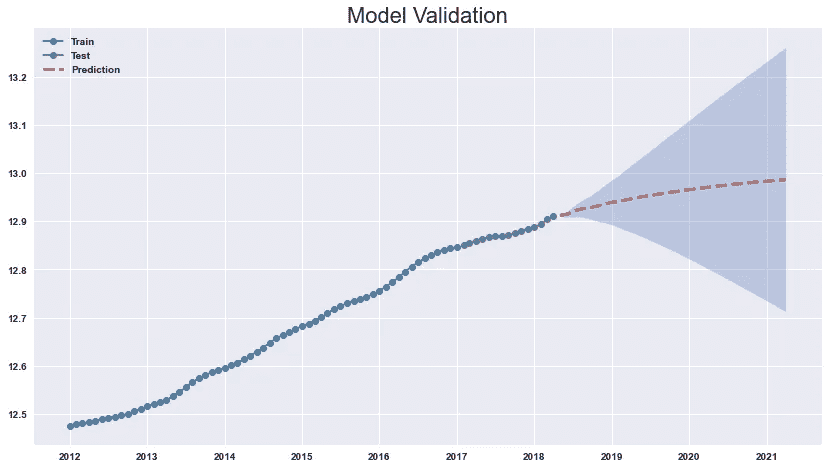

# 使用 Auto Arima 和 Python 进行时间序列建模

> 原文：<https://betterprogramming.pub/using-auto-arima-with-python-e482e322f430>

## auto_arima 简介


由 [Sieuwert Otterloo](https://unsplash.com/@sieuwert?utm_source=medium&utm_medium=referral) 在 [Unsplash](https://unsplash.com?utm_source=medium&utm_medium=referral) 上拍摄的照片

[Pmdarima](https://pypi.org/project/pmdarima/) (金字塔-arima)统计库是为 Python 时间序列分析而设计的。`auto_arima`是本库的自动 arima 函数，创建该函数是为了根据确定的标准(如 AIC、BIC 等)找到最佳订单和最佳季节性订单。，并在指定的参数限制内，使最佳模型适合单变量(单变量)时间序列。

Pmdarima 需要特定的 Python 包。

```
!pip install pmdarima
from pmdarima.arima import auto_arima
```

*   [Numpy](https://github.com/numpy/numpy) ( > =1.17.3)
*   [SciPy](https://github.com/scipy/scipy) ( > =1.3.2)
*   [Scikit-learn](https://github.com/scikit-learn/scikit-learn)(>= 0.22)
*   [熊猫](https://github.com/pandas-dev/pandas) ( > =0.19)
*   [统计模型](https://github.com/statsmodels/statsmodels) ( > =0.11)

模型结果高度依赖于参数设置，这可以在[文档](https://alkaline-ml.com/pmdarima/0.9.0/modules/generated/pyramid.arima.auto_arima.html)中详细查看。在本教程中，我们使用`auto_arima`检查时间序列建模的机制，因为参数设置会根据数据集和预测预期而变化。

# 概观

在本教程中，我们对 2012 年至 2018 年间的时间序列进行建模，以预测德克萨斯州奥斯汀未来 36 个月的房地产价值。

首先，我们开始熟悉我们的 [Zillow](https://github.com/ulkuguneysu/Time_Series_Analysis/tree/master/CSV_Files) 数据集，它提供了 14，733 个条目的 RegionID，RegionName(邮政编码)，City，State，Metro，County Name，SizeRank 和每月销售价格的信息。

为了更好地理解，我们将数据集分成子集，并将邮政编码限制在德克萨斯州的奥斯汀地区。然后，我们使用 [pandas](https://pandas.pydata.org/) 数据框架进行探索性数据分析。



38 行 x 272 列

对于时间序列建模，我们需要将 pandas 数据框架转换为单变量时间序列。



265 行 x 1 列

# 建模

我们选取 2012 年至 2018 年的时间序列进行建模。



德克萨斯州奥斯汀市 Plotly Express 散点图

## 平稳性检查

为了更好地理解如何设置`auto_arima`参数限值，我们检查了时间序列的趋势、季节性、分解、残差、自相关和偏自相关。

1.  使用滚动统计和 Dickey-Fuller 测试检查平稳性

滚动统计提供了直观的支持，而 Dickey-Fuller 测试计算测试统计、p 值、临界值、滞后数和使用的观察值。Dickey-Fuller 检验的零假设是时间序列不是平稳的。如果检验统计量小于临界值，p 值小于α(通常为 0.05)，我们拒绝零假设，称序列是平稳的。

如果时间序列不是平稳的，可以采用不同的方法来处理这个问题:对数变换、差分、减去滚动平均值、求平方根等。

2.使用来自`statsmodels.tsa.seasonal`的`seasonal_decomposition()`进行分解，以可视化趋势、季节性和残差。我们继续对残差进行平稳性检查，看看在趋势和季节性被去除后我们的时间序列是否平稳。

3.绘制自相关和偏自相关图。这些图提供了关于(p，d，q)的信息，这是建模的基本顺序。

关于平稳性检查，我们确认我们的数据不是平稳的。我们在开始建模之前应用对数变换。



德克萨斯州奥斯汀 2012-2018 年房地产价值

## 列车测试分离

训练测试分割可能因时间序列的大小而异。我们设定了 0.8/0.2 的火车测试尺寸。



## Auto_arima 模型

我们使用`auto_arima`功能拟合模型来训练集合。

```
model = auto_arima(train, start_p=0, start_q=0)
model.summary()
```



`summary`属性提供了关于我们模型的所有信息。我们看到我们的模型使用(4，1，0)进行(p，d，q)排序。我们看到系数、p 值、AIC 和 BIC，它们提供了模型是否良好的信息。

使用`plot_diagnostics()`绘制标准化残差的诊断图。这将提供以下信息:

*   一段时间内的标准化残差
*   直方图加上标准化残差的估计密度，以及标绘的正常(0，1)密度以供参考
*   正常 Q-Q 图，带正常参考线
*   相关图

```
model.plot_diagnostics()
```



## 模型预测

使用`get_forecast()`和`conf_int()`内置方法来预测我们的模型。`forecast_to_df`函数将`model`和`steps`作为输入，并返回一个带有预测的数据帧，以列的形式显示置信下限和置信上限。

```
# Returns a dataframe
pred_df = forecast_to_df(model, steps = len(test))
```

## 模型验证

对于模型验证，我们使用均方误差(MSE 是可选选项)。根据 MSE 值，我们可以看到我们的模型拟合得有多好。

```
pred = pred_df['pred'] *# Calculate MSE* 
mse = mean_squared_error(pred, test) 
```

绘制带有预测和置信区间的训练测试数据，以可视化我们的预测有多好。


自动 Arima 模型验证

## 未来预测

对于未来的预测，将上面的模型与我们的时间序列进行拟合。

得到`summary()`和`plot_diagnostics()`用于模型的统计和标准化残差。使用上面给定的`forecast_to_df`函数进行未来预测。(根据我们希望预测的未来几个月来确定`steps`参数。)使用`plot_train_test_pred **function**` 以置信区间可视化 36 个月未来预测的训练测试分割。



36 个月期间的自动 Arima 预测

上图显示了对数变换时间序列的未来预测。应用`numpy.exp`以获得真实值。

# 来源

*   [https://github.com/ulkuguneysu/Time_Series_Analysis](https://github.com/ulkuguneysu/Time_Series_Analysis)
*   [https://alkaline-ml.com/pmdarima/about.html](https://alkaline-ml.com/pmdarima/about.html)
*   [熨斗学校](https://learn.co/)
*   【https://pypi.org/project/pmdarima/】
*   [https://www . stats models . org/stable/user-guide . html #时序分析](https://www.statsmodels.org/stable/user-guide.html#time-series-analysis)