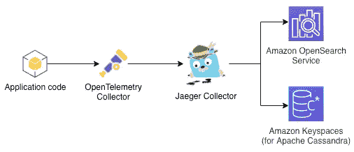
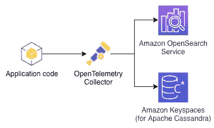
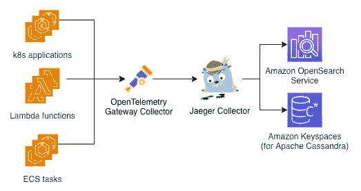
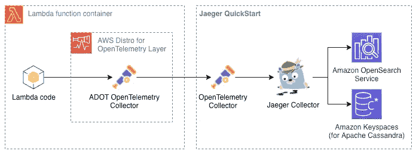
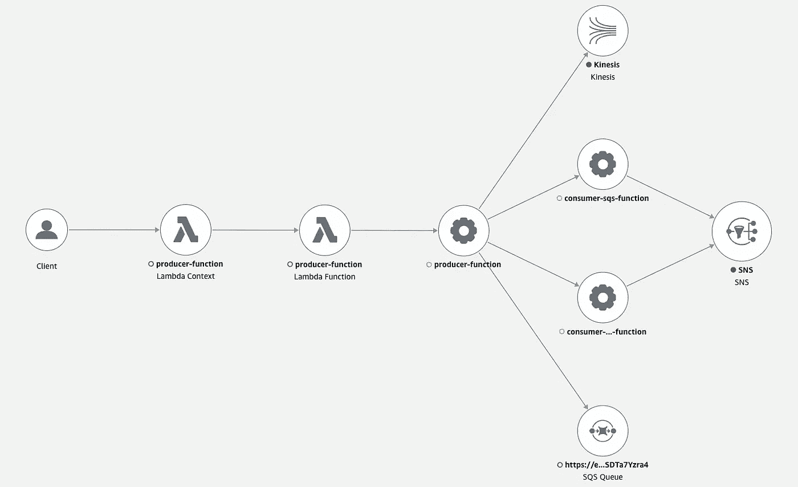
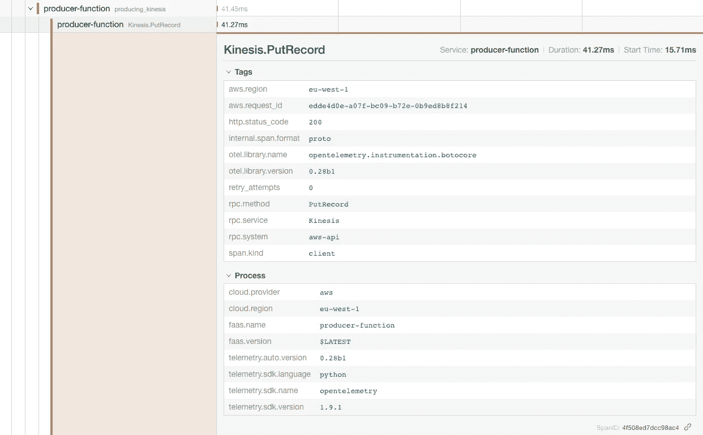
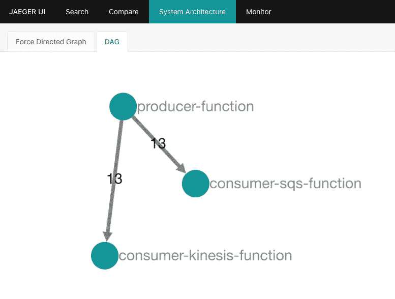

# 将 AWS 发行版用于 Jaeger 的 OpenTelemetry

> 原文：<https://betterprogramming.pub/using-aws-distro-for-opentelemetry-with-jaeger-acf4df3a8e37>

## [寻踪思考](https://medium.com/@dmitrykolomiets/list/musings-on-tracing-3d7bd0d2093c)

## 两个收藏家的故事

AWS 发行版 for OpenTelemetry 和 Jaeger 注定是绝配！

# 摘要

到目前为止，我一直在谈论[在分布式架构中运行 open telemetry](/trace-context-propagation-with-opentelemetry-b8816f2f065e)的不同方面，并介绍了 [Jaeger Quick Start](/introducing-jaeger-quick-start-deploying-on-aws-f0ee5d398e8a) 来简化这个跟踪平台在 AWS 环境中的部署。现在是时候把所有东西放在一起，展示一个完整的使用 [AWS 发行版 OpenTelemetry](https://aws.amazon.com/otel/?otel-blogs.sort-by=item.additionalFields.createdDate&otel-blogs.sort-order=desc) (ADOT)和 [Jaeger](https://www.jaegertracing.io/) 作为追踪后端的例子了。

# 这个系列的目标是

早就应该清楚地陈述这个[系列帖子](https://medium.com/@dmitrykolomiets/list/musings-on-tracing-3d7bd0d2093c)的目标了。尽管迟做总比不做好。

我想劝你，寻踪是一个实用的、有价值的概念，而不仅仅是理论上的有趣。我是从基础设施部署和初始配置的角度来探讨这个问题的——在转向更有用的东西之前，我们需要解决这些无聊的话题。

特别是，我的目标受众是熟悉 AWS 环境并对[AWS X-Ray](https://aws.amazon.com/xray/)(AWS 的官方追踪产品)有一些经验的人。通过 [OpenTelemetry](https://opentelemetry.io/) 和其他开源产品，如 [Jaeger](https://www.jaegertracing.io/) ，我展示了您可以选择评估不同的追踪平台。我认为，通过采用 OpenTelemetry，您甚至可以并排运行多个跟踪平台*，检查它们并有意识地决定什么最适合您的组织。*

# *OpenTelemetry +耶格= ❤️*

*在我们继续下一步之前，快速提醒一下 OpenTelemetry 收集器架构(关于深入讨论，请参见*(轨迹、度量、日志)被**[*输出*](https://opentelemetry.io/docs/collector/configuration/#exporters) 的主要部件。作为 OpenTelemetry 用户，您负责收集器[管道](https://opentelemetry.io/docs/collector/configuration/#service)——您可以从可用接收器、处理器和导出器的[注册表](https://opentelemetry.io/registry/)中挑选，以构建您需要的精确管道。****

> **OpenTelemetry 定义了一个[推荐处理器](https://github.com/open-telemetry/opentelemetry-collector/tree/main/processor#recommended-processors)的列表——值得一看。**

**耶格架构也是围绕*收集器*打造的。相似的名字在这里并不是巧合——Jaeger 创始人 [Yuri Shkuro](https://www.shkuro.com/) 也是 OpenTelemetry 的联合创始人和社区的活跃成员。 *Jaeger Collector* 可以接收[各种格式](https://www.jaegertracing.io/docs/1.33/deployment/#collector)的轨迹跨度，并使用[支持的存储后端](https://www.jaegertracing.io/docs/1.33/architecture/#collector)之一处理数据的有效存储——在撰写本文时，这些后端是 Elasticsearch、Cassandra 和 Kafka。**

**综上所述，当 OpenTelemetry 管道被配置为将跟踪导出到 Jaeger 平台时，跟踪流如下所示:**

****

**用 Jaeger 作为跟踪后端打开遥测跟踪流。**

**在这一点上，你可能会问一个合理的问题——为什么我们需要另一个收集器？回想一下，这在操作上是一件大事—考虑部署、扩展、修补、监控和故障排除。如果我们直接从 OpenTelemetry Collector 将轨迹导出到 Jaeger 存储后端不是更容易吗？**

****

**打开遥测跟踪流(假想),直接导出到 Jaeger 后端跟踪存储。**

> **耶格是在开启遥测技术之前**被创造出来的。这解释了为什么我们有 Jaeger Collector，但没有支持 Jaeger 存储后端的开放式遥测导出器。****

**事实上，这正是杰格团队[思考](https://github.com/jaegertracing/jaeger/issues/3500)的方向。然而，我们还没有到那一步，*两位*收藏家都必须到场。这看起来像是一个挫折，但是让我们更进一步去理解 AWS Distro for OpenTelemetry 是如何适应的。**

> **参考的 [GitHub 问题](https://github.com/jaegertracing/jaeger/issues/3500)是一个非常有趣的阅读，有助于更好地理解 OpenTelemetry 和 Jaeger 之间的关系以及它们之间的功能重叠。**

# **ADOT +耶格=？**

**如上所述，OpenTelemetry Collector 可以配置为使用 [Jaeger exporter 通过配置文件将轨迹导出到 Jaeger Collector。ADOT 能做到同样的事情吗？](https://github.com/open-telemetry/opentelemetry-collector-contrib/tree/main/exporter/jaegerexporter)**

**理论上，这应该是一回事——ADOT 只是一个为 AWS 环境量身定制的 [OpenTelemetry 发行版](https://opentelemetry.io/docs/concepts/distributions/)。对吗？..**

**不完全是。请记住，一个 OpenTelemetry 发行版既可以*添加*也可以*删除*某些 OpenTelemetry 组件，ADOT 也不例外。它*增加了* [AWS 特有的组件](https://github.com/aws-observability/aws-otel-collector#adot-collector-built-in-components)但是它也*从基础发行版中移除了*一些，主要是为了保持发行版的紧凑并减少测试面。今天帖子的重要内容—*AWS 发行版中没有用于 OpenTelemetry* 的 Jaeger 导出器。**

> **尽管**有**[Jaeger exporter for open telemetry](https://github.com/open-telemetry/opentelemetry-collector-contrib/tree/main/exporter/jaegerexporter)可用，但它不包括在 ADOT(还没有？)因此，没有内置的方法来配置基于 ADOT 的应用程序以将跨度导出到 Jaeger。**

**这意味着我们不能直接建造 ADOT ->耶格痕迹处理流水线。当你第一次遇到这种情况时，可能会感到失望，但我将在下面论证这其实不是一件(非常)糟糕的事情。**

**有多种方法可以解决这一障碍，并将 OpenTelemetry 轨迹从支持 ADOT 的应用程序导出到 Jaeger:**

*   **在耶格面前打开遥测收集器**
*   **积家出口商包装的定制 ADOT 收集器**

**本文主要关注第一种方法，因为它可以用于最新的 OTEL 采集器版本，包括来自[open telemetry-Collector-contrib](https://github.com/open-telemetry/opentelemetry-collector-contrib)资源库的所有处理器/导出器。我们将在以后的文章中介绍构建自定义 ADOT 收集器的过程。**

# **网关 OTEL 收集器架构**

**与其尝试直接从 ADOT 向 Jaeger 导出 spans，不如在 Jaeger 平台前引入另一个 OpenTelemetry 采集器:**

****

**使用 ADOT 收集器、网关收集器和 Jaeger 作为跟踪后端的跟踪流**

**上面的架构可能感觉不对——现在我们有*两个*开放式遥测采集器，似乎只是为了解决 ADOT 不包括耶格出口商的事实。如果您只有一个服务，情况可能确实如此——但是如果您有几十个或几百个服务呢？**

****

**具有网关收集器的大规模架构**

**突然间，将 OpenTelemetry Collector 部署为[网关](https://opentelemetry.io/docs/collector/getting-started/#gateway)的架构看起来更加明智了。网关收集器是一种标准化遥测处理管道的方法，而不是在每个服务中重复相同的配置。有了这个架构，ADOT 收集器就充当了“哑”[代理](https://opentelemetry.io/docs/collector/getting-started/#agent)，将遥测信号转发给网关收集器，网关收集器反过来执行主要处理。**

**以下是使用这种架构可以做的事情:**

*   **在您的分布式架构中实施高级采样策略，包括[基于尾部的采样](https://github.com/open-telemetry/opentelemetry-collector-contrib/tree/main/processor/tailsamplingprocessor)**
*   **[基于在您的服务中收集的跨度来捕获指标](https://github.com/open-telemetry/opentelemetry-collector-contrib/tree/main/processor/spanmetricsprocessor)。这尤其有价值，因为您可以根据采样规则将丢弃的跨度来捕获指标。**
*   **将遥测信号(以及秘密管理)集中导出到外部后端，如 Jaeger 或 DataDog**
*   **高效伸缩— ADOT 收集器运行在接近服务的位置，因此应该是非常轻量级的，以确保应用程序性能不受跟踪的影响。相比之下，gateway OpenTelemetry Collector 可以基于所有服务的总遥测量独立部署和扩展**
*   **网关收集器是一种加强组织范围的安全/网络控制以及将遥测*生产者*(通常是服务团队)与遥测*管理*(平台团队)分离的方法。**

**这种架构的明显缺点是，它增加了遥测管道的另一跳，使其更加复杂，特别是从操作角度来看。**

> **我认为分布式架构中的服务越多，带来的好处就越多。**

# **好消息— Jaeger 快速入门**

**我听到你深深的叹息和不情愿的事:**

> **好的。网关的事说得通。我会试试这个，把耶格和 X 射线进行比较。然而，感觉这需要大量的工作，我现在还没准备好投资这个。**

**在[的上一篇文章](https://medium.com/better-programming/introducing-jaeger-quick-start-deploying-on-aws-f0ee5d398e8a)中，我介绍了解决这个用例的 [Jaeger 快速启动](https://github.com/kolomiets/quickstart-jaeger)项目。快速启动通过合理的默认值自动执行 AWS 上的初始 Jaeger 部署和配置，因此您可以“快速启动”。出于这篇博文的目的，Jaeger Quick Start 提供了一个选项，不仅可以部署 Jaeger 本身，还可以在其前面部署一个预配置的 OpenTelemetry 收集器:**

****

**Jaeger 快速入门界面以及与 ADOT 收集器的集成**

**这实际上意味着，一旦在您的环境中部署了 Jaeger Quick Start，您就可以直接使用它——您的 ADOT 服务中不需要任何代码更改(耶！).所有需要做的就是调整 ADOT 收集器的配置，将踪迹转发到 Jaeger 前面的网关收集器。**

# **ADOT 收集器配置**

**对于本文的演示部分，我将使用一个简单的事件驱动架构，我们在[环境变量扩展](/trace-context-propagation-with-opentelemetry-b8816f2f065e#configuration-environment-variables)用于 OTLP 端点。这是一种保持收集器配置文件简单和静态的巧妙技术。扩展还允许您通过更新 JAEGER_OTLP_ENDPOINT 变量来重新配置端点，而无需更改配置文件和重新部署整个服务。**

# **我能看看痕迹吗？**

**是啊！**

**现在，所有的配置都已就绪，我们可以运行我们的演示应用程序(参见 GitHub repo 中的说明)并最终在 AWS X-Ray 和 Jaeger 中看到踪迹。先说 AWS X 射线:**

****

**AWS X 射线跟踪**

**这是我们在用 OpenTelemetry 检查[开放式遥测跨度属性](/trace-context-propagation-with-opentelemetry-b8816f2f065e#span-attributes)——跨度信息的主要来源。例如，这里是运动学的属性。腐败索跨度:**

****

**Jaeger 跨度属性**

**Jaeger 在*系统架构*选项卡中提供了类似 AWS X 射线服务地图的功能:**

****

**Jaeger —系统架构**

> **边缘上的数字显示了沿边缘捕获的轨迹总数**

**你可能会注意到，Jaeger 的系统架构与我们在 AWS X-Ray 中看到的不同。lambda 功能的节点是存在的，但是我们看不到 AWS 服务的节点:Lambda、SQS、Kinesis、SNS。看起来我们已经能够捕获 lambda 函数中显式创建的所有跨度，但是没有 AWS 服务发出的跨度。这是怎么回事？**

**答案在于 AWS 服务如何与 AWS X-Ray 集成。正如文档中提到的，一些服务(比如 AWS Lambda 或 Amazon API Gateway)向服务地图添加了额外的节点。换句话说，在某些 AWS 服务和 AWS X-Ray 之间有内置的集成，OpenTelemetry 无法在这些额外的范围内帮助我们。这就是为什么我们在 Jaeger 中看不到它们(因为 Jaeger 只接收 OpenTelemetry Collector 获得的跨度)。**

**这不是 AWS X 射线和 Jaeger 捕捉到的痕迹的唯一区别，但可能是最明显的区别。我想在这里暂停讨论，把进一步的分析推迟到下一篇文章——这本身就是一个大话题。**

# **结论**

**在我们结束之前，让我总结一下我们在这篇文章中提到的主要观点。**

**以[网关模式](https://opentelemetry.io/docs/collector/getting-started/#gateway)打开遥测收集器是一个值得考虑的好模式，特别是对于有大量服务的系统。这是标准化和丰富您的遥测处理管道的完美方式，减少了每个单独服务的遥测开销。**

**AWS Distro for OpenTelemetry 可以配置为不仅将轨迹导出到 AWS X-Ray(这是默认行为),还可以导出到其他后端。这使您能够并行运行多个跟踪后端——这对迁移、评估和 POC 非常重要。**

**[Jaeger Quick Start](https://github.com/kolomiets/quickstart-jaeger) 简化了您的 AWS 环境中 Jaeger 遥测平台的配置，随时可以插入您的 OpenTelemetry 管道。**

**ADOT 捕获并输出到耶格**的痕迹与你在 AWS X 射线中观察到的痕迹**不同。部分原因是某些 AWS 服务和 AWS X-Ray 之间的直接[集成](https://docs.aws.amazon.com/xray/latest/devguide/xray-services.html)。对这些差异的分析将在本系列的后续文章中讨论。**

**最后，主要的成就——在 [Jaeger 快速入门](https://github.com/kolomiets/quickstart-jaeger)和[演示应用](https://github.com/kolomiets/tracing-playground/)中涵盖并整理了所有的基础知识，我不再谈论部署和配置 Jaeger:)在接下来的帖子中，我们将讨论跟踪本身以及 OpenTelemetry 提供的好处。**

# **资源**

*   **[Jager 快速启动部署指南](https://kolomiets.github.io/quickstart-jaeger/)**
*   **[**kolomiets/Quick Start-Jaeger**](https://github.com/kolomiets/quickstart-jaeger)**—**Jaeger 快速启动项目**
*   **[**kolomiets/tracing-playground**](https://github.com/kolomiets/tracing-playground/blob/main/opentelemetry-with-jaeger/README.md)—我们讨论过的演示应用**