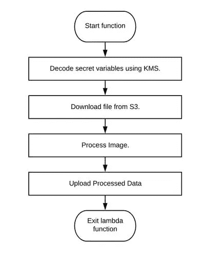
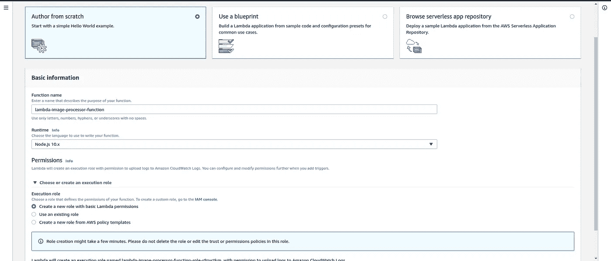
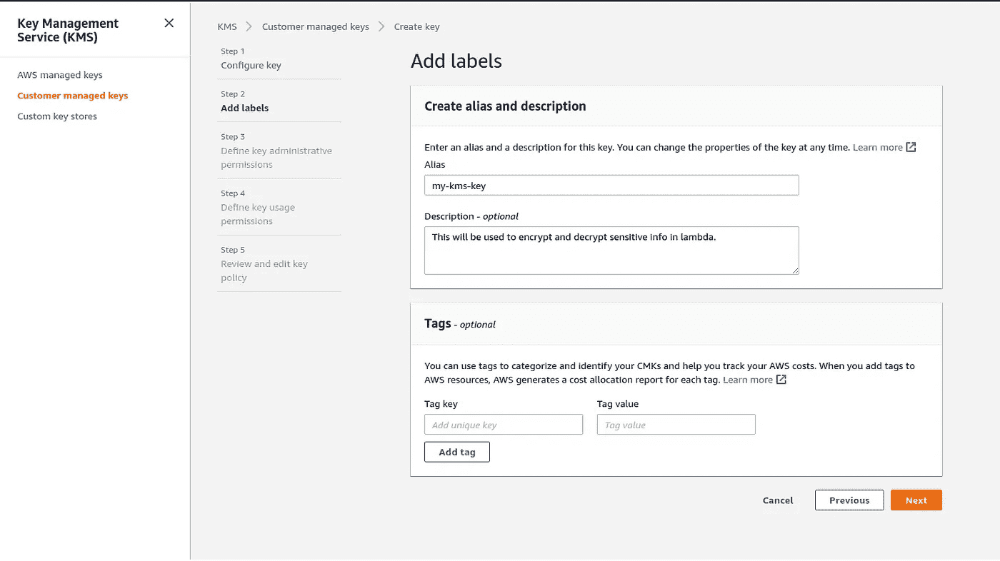
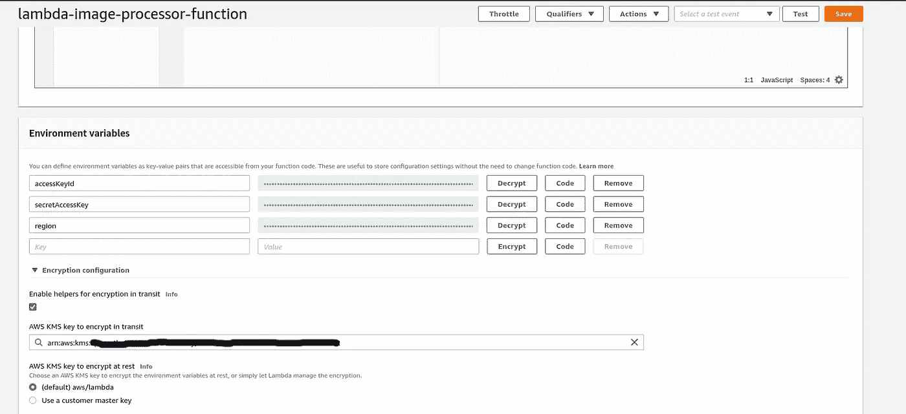
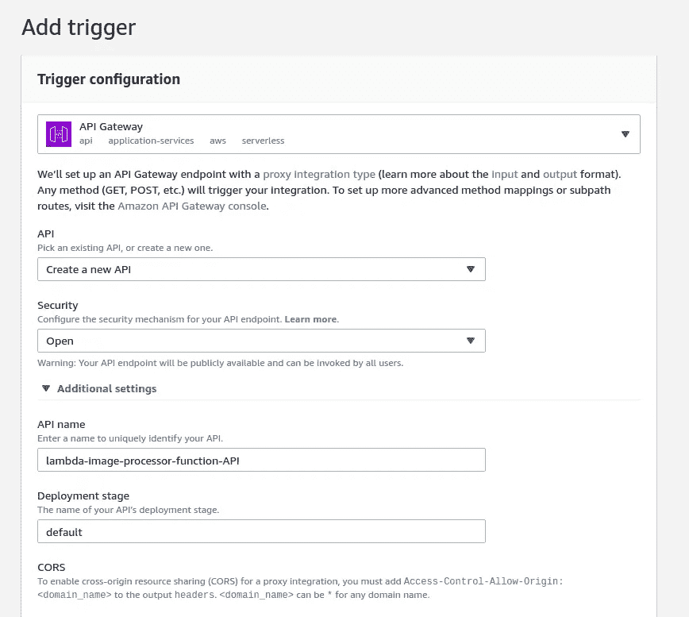
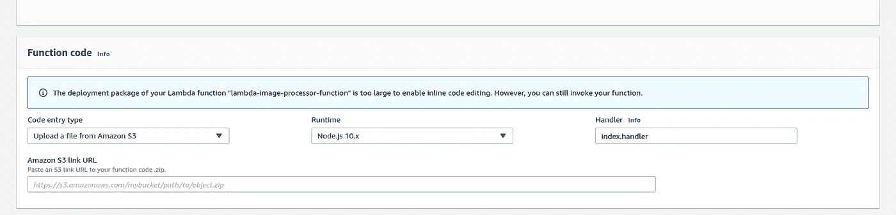

# 使用 AWS Lambda 缩放图像处理

> 原文：<https://betterprogramming.pub/using-aws-lambda-to-scale-image-processing-8a4b3a77031c>

## 拉姆达被解放了


氰化物和幸福原创漫画。上面是作者的混音版。

# 介绍

我最近遇到了一个用例，在这个用例中，我必须一天添加文本和调整多个图像的大小，并将它们从 JPEG 转换为 WebP 格式，以便它们可以更有效地在 web 上提供服务。

在这篇文章中，我将谈论我们如何使用 [AWS Lambda](https://aws.amazon.com/lambda/) 扩展这个过程。我们还将开发一个示例应用程序，它通过 Lambda 处理一张图像，并将其上传到 [S3](https://aws.amazon.com/s3/) 。

# 初始方法

作为最初的方法，我使用了一个简单的节点服务器(在一个 EC2 盒子里)，它使用 [sharp 库](https://github.com/lovell/sharp)(稍后会详细介绍)来处理图像。由于用例更多的是一次处理最多 5 到 10 张图像，这样做很好。

随着系统规模的扩大，我们遇到了需要同时处理一百多张图像的情况。这是我们的应用程序变得缓慢的时候，以编程方式将这些图像上传到 S3 (AWS 存储)会有额外的开销。

这是我们探索 AWS lambda 的时候。AWS Lambda 是一个事件驱动的无服务器计算平台，由 Amazon 作为 Amazon Web Services 的一部分提供。

# 自动气象站λ

Lambda 通常被称为无服务器架构，它允许您运行服务器端代码，而不依赖于像 EC2 这样的外部设备。代码执行一完成，运行代码的容器就退出。

这里的主要优势是，您只需为使用的计算能力和数据传输费用付费，而不像 EC2 那样按小时收费，不管系统是否被使用。

Lambda 还可以根据收到的请求数量自动扩展，无需外部负载平衡器。

Lambda 函数由某些事件触发，这些事件可能源自以下任何来源。

1.  kine sis——为批量数据传输提供流，尽管不是理想的候选，但它仍可用于触发 Lambda。
2.  SQS —消息队列服务。你可以通过 SQS 发送消息来触发 Lambda。
3.  API 网关——提供一个简单的端点，可以通过 HTTP 请求触发 Lambda 函数。
4.  S3——在桶中创建、更新或删除文件可以用来触发 Lambda。

关于其他可用的 Lambda 触发器的列表以及它们如何深入工作，请查看官方文档。

基本上是由你来选择如何触发你的 Lambda 函数。此外，Lambda 为每个函数和超时都提供了内存分配配置，因此如果一个函数崩溃，您不会被无限期地收费。

每个 Lambda 函数都在容器内部运行。每当一个函数执行时，它都在旋转一个容器来完成这个任务，底层环境是一个 Linux AMI，可以运行各种语言的代码。

我们将使用 Node.js(版本 10)来演示这一点。

# 我们的示例应用程序

让我们考虑一个简单的 Node 应用程序，它从 S3 下载一个图像，将其调整为 720px 的宽度，转换为 WebP，并作为处理后的文件上传到 S3。

示例应用程序将使用 sharp(一个基于 [libvips](https://github.com/libvips/libvips) 的库)进行图像处理。我们使用 sharp，因为它正在积极开发中，不像 Node 中的其他图像处理库。

夏普也拥有同行中最好的基准分数，参见[性能](https://sharp.pixelplumbing.com/performance)。

考虑下面的流程图。一旦通过 API 网关触发，我们的应用程序将经历以下流程。



我们可以将应用程序分成三部分:

1.  从 S3 下载图像。
2.  使用 sharp 处理图像。
3.  上传处理后的图像。

## 步骤 1:将图像下载到 Lambda 中的一个目录

这相当简单，我们使用 AWS 的 SDK 作为节点。

我们将文件下载到一个临时目录中。

## 步骤 2:处理图像

Sharp 将输入路径作为一个参数，它可以与调整大小等其他操作链接在一起。点击这里查看更多[可用选项的详细列表](https://sharp.pixelplumbing.com/api-constructor)。

## 步骤 3:将处理后的图像上传到 S3

对于这一步，我们将再次使用 AWS SDK。

要深入了解 AWS SDK 如何工作以及其中可用的 API，请查看本文档。

# 设置 Lambda

我们可以把这一部分分成四个步骤。

1.  创建我们的 Lambda 函数。
2.  创建用于加密的 KMS 密钥。
3.  添加触发器。
4.  将我们打包的代码链接到 Lambda。

现在我们已经准备好了应用程序，我们可以设置 Lambda 了。

为此，让我们使用一个 API 网关。触发器的选择取决于你。我们在本教程中使用 API，因为它更容易理解。在生产中开发应用程序时，我使用 AWS SQS 来触发我的 Lambda 函数。

让我们从创建 Lambda 函数开始。您可以通过登录 AWS 控制台并选择 AWS Lambda 来实现这一点。

确保您记住了创建 Lambda 函数的区域，因为我们将为 KMS(密钥管理服务)使用相同的区域。



创建 lambda 函数

因为我们将使用 Node，所以我选择 Node 10 作为运行时。记得选择创建新角色的选项，最初，这个角色将有权限将 stdout 日志写入 [CloudWatch](https://aws.amazon.com/cloudwatch/) 。

下一步是向创建的角色添加额外的权限，主要是 KMS，因为我们将使用它来加密和解密我们的密钥，因为我们遵循最佳实践。

KMS 是 AWS 提供的一项服务，我们可以在其中管理加密和解密敏感信息(如访问密钥 id)的密钥。

要创建密钥，我们将再次使用控制台，导航到可用服务中的 KMS 部分，并选择创建密钥的选项。



一旦基本信息填写完毕，您将必须定义密钥用法，我们将在这里选择 Lambda 的自定义角色，因为 Lambda 函数需要访问密钥。

现在我们已经创建了密钥，我们可以加密我们的数据，稍后可以在 Lambda 函数中将这些数据作为环境变量进行访问。



在您的 Lambda 仪表板中，在环境变量下，选中*启用助手*选项，并在 *KMS 密钥加密*输入框中搜索生成的 KMS 密钥。

现在，您可以开始添加应用程序所需的所有 env 变量，并且可以在函数中直接访问它们。在我们的演示中，我们需要加密访问密钥 ID、密钥和区域，因为这些信息将用于下载和上传图像到 S3。

下一步是为我们的应用程序添加触发器，为此我们将使用 API 网关。在 Lambda 仪表板中，选择*添加触发器*功能。



为了简单起见，我们没有给 API 网关增加任何安全性。但是，您可以添加安全性来限制特定 IAM 用户对 API 的访问。一旦生成了 API 端点，我们就可以用它来触发我们的应用程序。

我们的应用程序需要与本地机器上的所有依赖项打包在一起。运行以下命令:

```
npm install aws-sdk sharp
```

这将生成一个名为`node_modules`的文件夹，用我们的代码压缩它，并上传到 S3 的一个桶中。如下图所示，用 Lambda 提供这个文件的链接，并保存代码。



为了测试这个应用程序，让我们上传一个图像到一个有打开读取权限的 S3 桶。

修改上面的 JSON 数据以匹配您的 S3 数据。一旦 Lambda 函数执行，您将能够看到 WebP 格式的新文件出现在代码中指定的目标 bucket 中。

# 结论

Lambda 是一个令人惊叹的服务，它让你不费吹灰之力就能扩展，并帮助你用你选择的语言执行你的功能。它具有很大的灵活性，通常已经成为文件处理等操作的选择。

它还可以在设置服务器变得多余的情况下提供帮助，比如一个网站，它有一个通过电子邮件向企业所有者发送数据的简单表单。Lambda 中的 free 层有一百万个免费请求，这使得您的代码在大多数情况下都可以自由执行。

完整的代码可以在 [GitHub](https://github.com/puneeth8994/image-processing-lambda) 上找到。