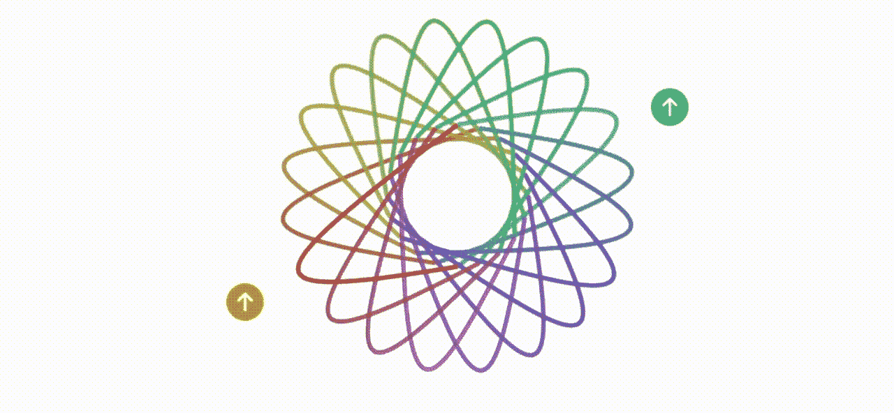
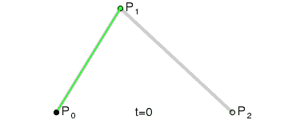
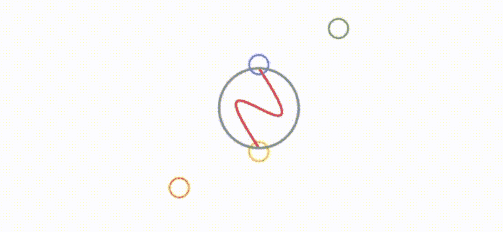
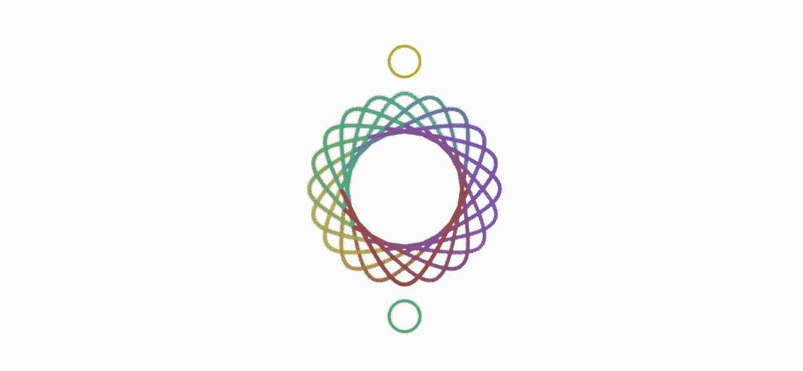

# 在 SwiftUI 中使用贝塞尔曲线

> 原文：<https://betterprogramming.pub/using-bezier-curves-in-swiftui-9d080657fb15>

## 让我们构建一个简单的应用程序来探索贝塞尔路径

使用不同的设置生成多条贝塞尔曲线(图片来源:作者)

你可能会惊讶地发现，贝塞尔没有发明以他的名字命名的曲线——他只是让它们出名了。它们所基于的代码是由 Paul de Casteljau 编写的，他是计算机科学家，创造了我们今天使用的递归方法，这些代码计算点，这些点加在一起，形成一条曲线，就像这里看到的红色。

一张取自维基百科的图片

用数学术语来说，贝塞尔曲线是由一组*控制点* P0 到 P *n* 定义的，其中 *n* 被称为它的阶次( *n* = 1 表示线性，2 表示二次，等等。).所使用的公式恐怕超出了大多数普通人的理解范围，但是这个动画 GIF 很好地说明了这一点。

要在 iOS 下的 SwiftUI 2.0 中使用它们，您必须创建一个名为 Shape 的对象，这个定义包含一个必需的方法。下面的代码演示了一条二次贝塞尔曲线，就像上面看到的那样。P0 用`path.move`表示。P1 是控制点，P2 是代码中的`to:`，也就是最终坐标。

你可以在这里看到关于这个主题的苹果文档。

更复杂的曲线可以通过调用构建三次贝塞尔曲线来构建，该曲线有两个控制点。注意，如果我在控制台上打印出 path 变量，我可以看到控制点的确切位置。它会产生一个像这样的图像。

一条用 SwiftUI 创建的贝塞尔曲线，似乎是阴阳符号

我开始画蓝色的圈，最后画黄色的圈。绿色圆圈是第一个控制点，橙色圆圈是第二个控制点。最终的结果是一种阴阳型的符号。我画这条曲线的框架的大小是 256 磅。构建它的代码如下所示。

显然，灰色圆圈不是贝塞尔曲线的一部分。为此，我使用了一个简单的`addArc`，所以这段代码:

但是等等——这个命令有很多我认为你通常看不到的内置功能。假设你有两个参数，它们有两个值，可以是两种状态之一，正的或负的。这是 16 种组合。再来看几个。

单独显示的多条贝塞尔曲线

现在，这是我画的一条线。例如，假设您开始使用旋转构建具有多条贝塞尔曲线的形状。我想起了孩子的玩具——肺活量描记器。不，是你在这篇短文开头看到的前导 GIF。为了帮助您更好地适应这个想法，我构建了一个简单的实用程序。在其中，您可以使用橙色和绿色圆圈来管理控制点的坐标。长按其中一个按钮会改变它的移动方向；轻敲一下就能移动它。这里有一个视频展示了它的运行(我通过绿色和橙色的手柄改变了控制值，这些改变重新配置了我们的肺活量)。

一个简单的应用程序去数字贝塞尔曲线设置

长按绿色或橙色会在控制台上打印出生成图案所需的设置值。以下是这一切背后的代码。

而主代码…

所有这些都让我想到了这篇文章的结尾。我希望你喜欢读它，就像我喜欢写它一样。

保持冷静，继续编码。