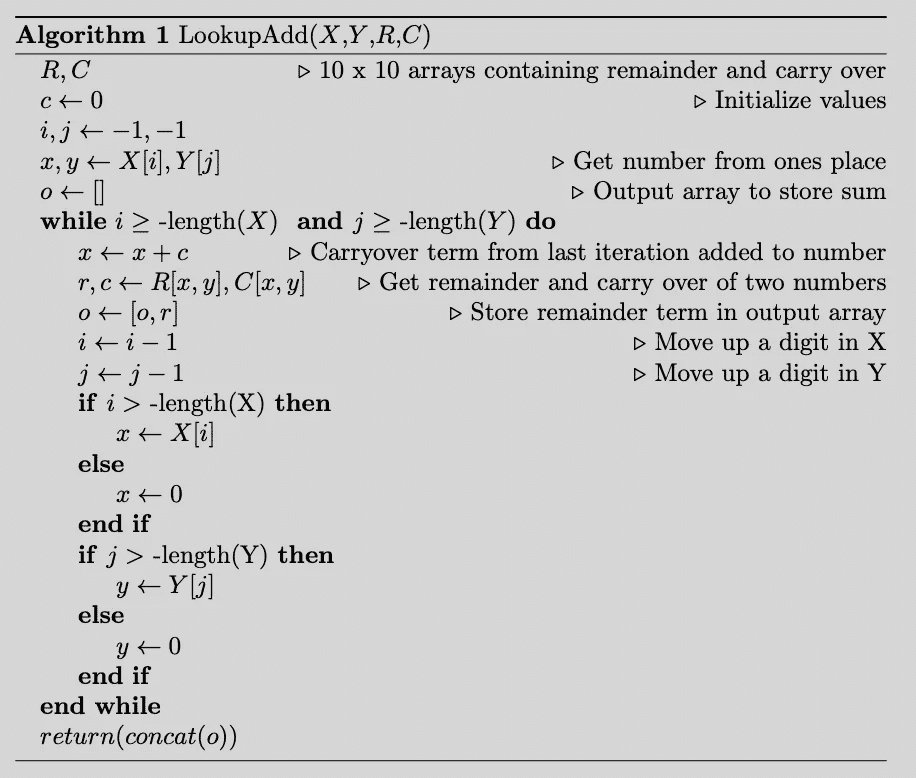
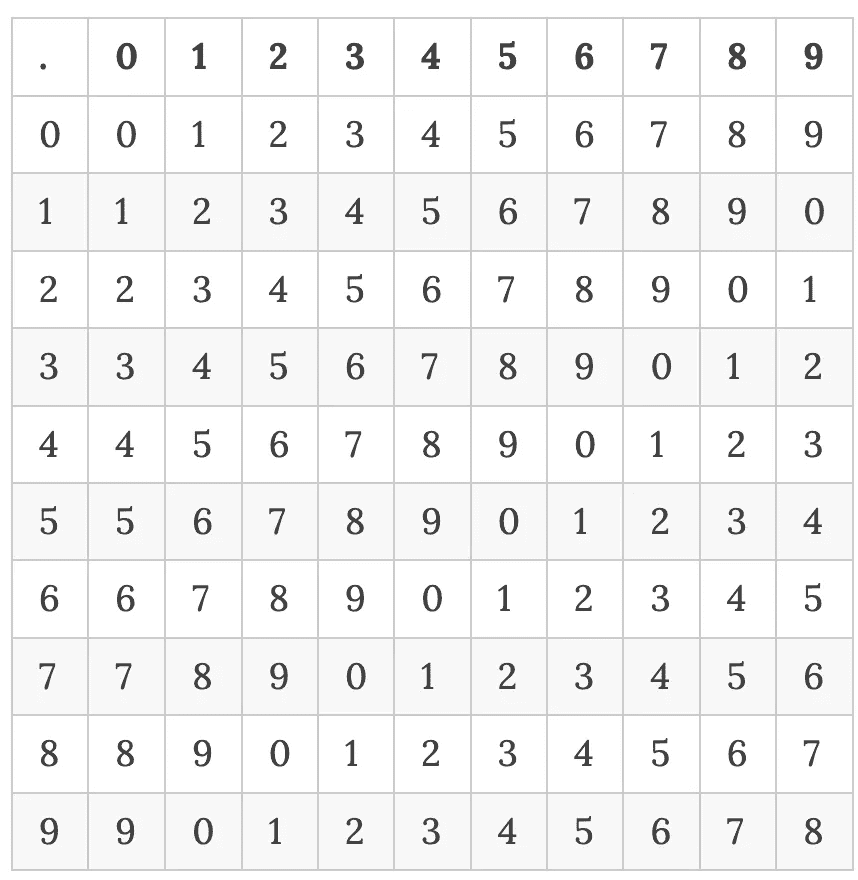
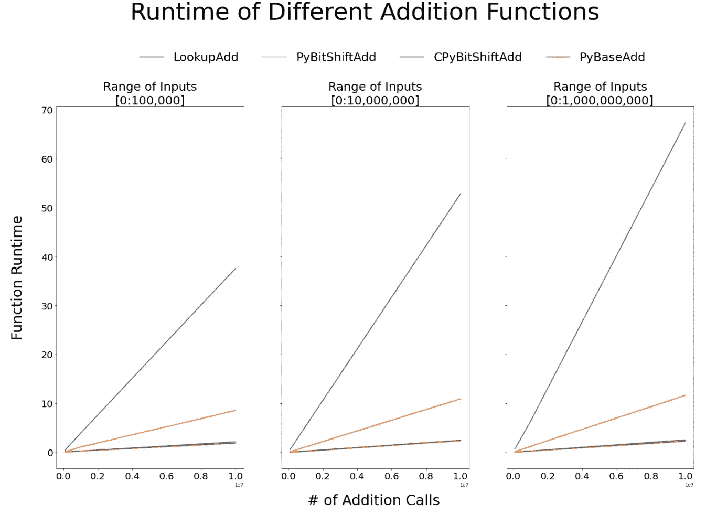

# 使用按位运算提高 Python 性能

> 原文：<https://betterprogramming.pub/using-bitwise-operations-to-improve-python-performance-b0a5593e96aa>

## 或者为什么一点点 C++能让你走得更远


[附身摄影](https://unsplash.com/@possessedphotography?utm_source=medium&utm_medium=referral)在 [Unsplash](https://unsplash.com?utm_source=medium&utm_medium=referral) 上拍照

我将通过一个算法来使用 Python 做加法。使用按位运算符和 C++扩展模块可以获得与基本 Python 加法几乎相当的性能。

# 背景

我最近一直在与字节和位打交道。我想我应该重温一下我记得以前看到的一些老算法问题。一个经典的问题是:

创建一个整数加法“+”运算符。假设你不会用乘法、除法或减法。为简单起见，假设输入只能是非负整数。

我们先来想一个简单幼稚的解决方法。一种方法是复制长加法，但使用一些简单的记忆来优化它。

# **慢速法:查找加法**

对于长加法，你要把你要加的两个数对齐。从最右边(第一个数字)开始，如果您添加的两个术语大于 9，您将继续添加和结转术语。

我们用伪代码描述这个算法，然后通过一个简单的例子来说明。

## **伪代码**

我们将使用一个示例更深入地解释这段伪代码的含义。



查找附加伪代码

## **遍历伪代码**

让我们举一个把 23 和 48 这两个数字相加的例子。将这两个数字视为两个字符串数组:

```
[‘2’, ‘3’] and [‘4’, ‘8’]
```

我们排列数字，然后从右到左。在每个位置，我们将只添加两个一位数(例如位置 1 的 3+8 和位置 0 的 2+4)。

我们需要确定两件事:

1.  余项
2.  结转术语

我们在这个例子中讨论它们的含义。

**位置 1**

*   从两个术语开始:(3，8)
*   余数步骤:余数(3，8) = 1(因为 3+8 = 11 mod 10 = 1)
*   结转步骤:结转(3，8) = 1(因为 3+8 > 9)
*   将余数步骤添加到输出数组:[1]

**位置 0**

*   从两个术语开始:(2，4)
*   将上一步的剩余项前移:(2+1，4)
*   余数步骤:余数(3，4) = 7
*   结转步骤:结转(3，4) = 0
*   将余数步骤添加到输出数组:[7，1]

**最后一步**

*   返回串联数组:71

我们看到的是，在位置 1，余数步骤给出输出中的数字，而进位步骤将增加下一个位置(即位置 0)的数字。我们重复这个过程，使用余数步骤追加一个输出数组，直到我们用完两个数组。

## Python 代码

现在谈谈 python 代码。不幸的是，这很复杂。我们不会花时间对此进行重构，因为另一种解决方案可读性更好，速度也更快。

## 简单加速

我们可以通过定义查找数组来记忆余数和结转步骤:**余数**和**结转数**。我们不会对此进行更深入的研究，但这是该算法的主要速度改进。

**余数数组**



**遗留阵列**


# 快速方法:位移加法

另一个解决方案是使用位移位操作符。移位相当于将一个数乘以或除以某个基数。例如，在二进制中，数字 4 表示为[1，0，0]。记住，比特只是系数，所以`4=1*2²+0*2¹+0*2⁰`。

左移 4 位相当于 4 乘以数字 2，因此`BitshiftLeft(4)=8=[1,0,0,0]`。

## 伪码

下面我们有一个基于位的算法的伪代码。您马上会注意到，位移加法不依赖于查找数组，而且它的伪代码要短得多。原来它的 python/c++代码也非常非常短。


## 遍历伪代码

我将介绍这是如何工作的逻辑。我们来做一个比之前更简单的加法，假设要加 5+3。

让我们将 5、3 和 8(答案)转换成基数为 2 的二进制表示:

*   `5=1*2² +0*2¹+1*2⁰`
*   `3=0*2² +1*2¹+1*2⁰`
*   `8=1*2³+0*2²+0*2¹ +0*2⁰`

我们要做的基本上是从上面复制我们的结转逻辑，但这次是二进制的。这允许我们以“矢量化”的方式进行结转。

该方法试图找到两位集，使得它们没有值大于 0 的重叠位。为此，我们交替使用位移位和位掩码。该算法的基本情况是将 x，y 定义为我们试图相加的输入值:

*   `x=[1, 0, 1]`(即基数-2 中的 5)
*   `y=[0,1,1]`(即 3 进制-2)

**迭代 1**

*步骤 1:使用 AND 和 Bitshift 位运算符的结转步骤*

这一步只是查找 3 和 5 之间共享的位，然后在下一步中继续执行。我们结合 AND 和左移来重新定义 x:

*   `x=BitshiftLeft(And(x,y)) = [0,1,0]`

分解这些步骤:

*   `And(x,y) = [0, 0, 1]`(因为 5 和 3 共用 2⁰)
*   `BitshiftLeft([0,0,1]) = [0, 1, 0]`(这相当于 2 =2⁰+2⁰)

*步骤 2:使用 OR 和位掩码位运算符防止重复计数步骤*

在步骤 1 中，我们删除了 x 和 y 之间共享的位，我们想从 y 中删除这些位。

*   `y=BitMask(Or(x,y), ~And(x,y))=[1,1,0]`

分解这些步骤:

*   `~And(x,y) = [1, 1, 0]`(这些是我们在步骤 1 中没有消除的位，我们希望保留)
*   `Or(x,y) = [1, 1, 1]`(这些是我们需要屏蔽的位)
*   `BitMask([1, 1, 1], [1, 1, 0]) = [1, 1, 0]`(屏蔽 2⁰位置的位)

**停止条件**

我们继续进行这些迭代，直到 x 和 y 不共享任何位，也就是说，我们可以简单地将位表示相加。在本例中，这是 x 和 y 的最终值:

*   最终 x=[1，0，0，0]
*   最终 y=[0，0，0，0]

我们使用 OR 运算符来得到我们的解:

*   `8 = Or(x, y) = [1, 0, 0, 0]`

## Python 代码

python 代码相对简单明了。

## 简单加速— C++扩展模块

一个“简单”的加速方法是用 C++编写代码并创建一个 [C++扩展模块](https://docs.python.org/3/extending/index.html)。扩展模块的代码如下。我们将在 python 中调用的实际 C++函数被定义为`c_bitadd_method`，剩下的代码是定义 c++类/方法，以便它可以与 Python 集成。

# 结果

我做了一个简单的实验，改变两个参数:

*   样本总数:使用三个值:100k、1 密耳、10 密耳
*   最大可能数量:使用三个值:100k、10mil、1gl

这两个参数改变了加法的总数，以及整数的大小。例如，当最大可能数= 1bil 时，这意味着 add 函数可能需要将 10 亿个整数加在一起。

我测试了 4 种算法:

1.  Python 基本加法运算符
2.  查找加法(LookupAdd)
3.  位移加法-Python(PyBitshiftAdd)
4.  移位加法— C++ (CPyBitshiftAdd)

结果如下，并且相当清楚:

*   查找添加非常慢:这是意料之中的
*   用 C++编译的比特移位加法执行起来非常接近 Python 的基本加法操作，鉴于这是第一个版本，很高兴看到这一点:



# 结论

这篇文章简单介绍了如何使用位运算和 C++创建一个与 Python 的加法运算符性能相当的加法函数。

```
Want to Connect?I discuss on similar topics on my [personal website](https://ryanlstevens.github.io/2022-05-02-bitshiftAddition/).
```