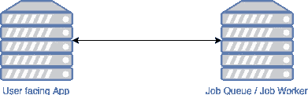
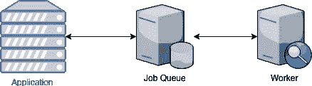
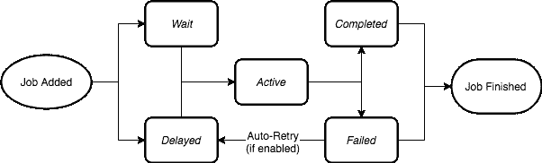

# 使用 Bull 管理 Node.js 微服务堆栈中的作业队列

> 原文：<https://betterprogramming.pub/using-bull-to-manage-job-queues-in-a-node-js-micro-service-stack-7a6257e64509>

## 当您切换到面向微服务的架构时，新的问题出现了

米奇·奥尼尔在 [Unsplash](https://unsplash.com/s/photos/queue?utm_source=unsplash&utm_medium=referral&utm_content=creditCopyText) 上的照片

当切换到面向微服务的架构而不是单一的整体架构时，新的问题出现了。过去简单的作业处理器不适合这种新的体系结构。作业可能不再由单个应用程序实例处理，而是由多个应用程序实例处理。

我找到了 [Bull](https://optimalbits.github.io/bull/) ，一个基于 Redis 的 Node 队列，可以满足我的需求，但需要调整才能在这个新世界中工作。由于这个模块是开源的，我知道我对它的改进可以反馈到软件包中。

# 专业工作

比方说，我们想做一些专门的工作，例如扫描图像以提取文本。

在这种情况下，在你的主应用程序中做这项工作对大多数人来说没有意义。图像处理的需求不同于 web 服务器，可以优化为使用一组非常不同的硬件，如 GPU。

当需要进行图像处理时，一个作业队列就会派上用场，我们可以在远离面向用户的界面的独立进程中完成这项工作。

*   从 web UI 从用户处获取要处理的图像。
*   将新的图像处理作业排入队列。
*   工作开始了。
*   作业结果被发送回应用程序。

# 现有解决方案

两个在野外流行的软件包可以帮助你做前面提到的工作，它们是[延迟工作](https://github.com/collectiveidea/delayed_job/)和[芹菜](http://www.celeryproject.org/)。这些允许您使用键值存储来管理作业，比如 [Redis](https://redis.io/) 。

这些假设*作业的处理和作业队列生活在同一个服务中。*

这与典型的微服务架构非常不同。如果您有一个执行任务的服务，例如图像处理器，和另一个充当作业队列的服务，我们不能在没有一些额外工作的情况下使用这些类型的包。

典型设置(图 1)

对比:

微服务设置(图 2)

# 搜索和搜索

我最近遇到了这种情况，在搜索 Node.js 作业队列解决方案时，我发现了 [Bull](https://github.com/OptimalBits/bull) 。这个包非常快，是为了与 Redis 一起工作而构建的，并且有一个活跃的社区。

如前所述，开箱即用，这个包不支持跨服务作业排队(见图 2)。

让我们考虑一下我们希望如何管理作业的生命周期。Bull 的文档非常好，他们最近绘制了一个生命周期图，这将节省我们一些时间。

公牛的工作生命周期[图](https://github.com/OptimalBits/bull/blob/develop/docs/job-lifecycle.png)

Bull 有一个简单的方法来定义处理逻辑，即作业在`active`队列中做什么:

每当一个任务进入`waiting`队列时，Bull 知道如何处理它并将其移动到`completed`队列。使用 Bull，它将自己管理所有的状态转换，这对于在同一进程中工作的应用程序来说是有意义的。

我们需要切换到手动。您可能会想:“为了以这种新的方式工作，我们不定义这个`process`方法怎么样？”我试过这个，它*起作用了！*前进到杂草中。

# 履行

我们新的 Bull 服务将介于可以排队作业的服务和可以工作的服务之间。我们现在需要做的是学习如何手动跨队列移动作业，并将这些方法公开为其他服务可以使用的 API。

查看代码库，方法`queue.add()`、`queue.getNextJob()`、`job.moveToFailed()`和`job.moveToCompleted()`都是我们需要的。

唯一的问题是`job.moveToFailed()`和`job.moveToCompleted()`是私有的。这意味着作者没有编写这些公开使用的方法。

这是有道理的，因为 Bull 从来就不是设计来做我们正在尝试做的事情的。调查回购中的 GitHub 问题，[我发现有人试图做同样的事情](https://github.com/OptimalBits/bull/issues/790)。

我们新的作业队列服务器的实际实现相当简单，因为我们已经有了这些方法。看看我提出这个新模式后写的文档。

这正是我想要实现的，有人已经想到这么做了，这让我感觉更好。

在开始在生产中使用这段代码之前，一个好主意是打开一个 pull 请求来[添加关于这个模式](https://github.com/OptimalBits/bull/pull/1017/files#diff-375fc823554b090375d9c47199cb5ee2R201)的文档。Bull 是一个相当活跃的项目，所以维护者或贡献者可以给我们很好的洞察力。

# 贡献的

为了验证我们新的作业队列服务，在参考文档[中添加了](https://github.com/OptimalBits/bull/pull/1017/files#diff-375fc823554b090375d9c47199cb5ee2R201)，使其成为社区中的已知模式。这鼓励了特性的使用，并可能导致其他用户在生产中使用它时发现问题。

我对这个项目的结果非常满意，因为我们不仅满足了我们的需求，还让我做出了开源贡献。

这让我理解了包的内部，也让我能够很容易地为我的用例添加特性。拥有一个了解细节的积极的项目维护者也使得整个过程顺利进行。