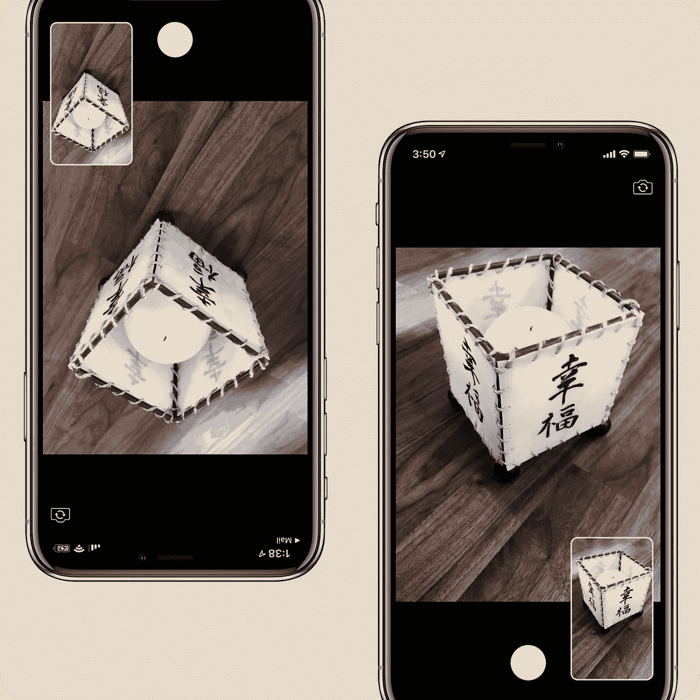
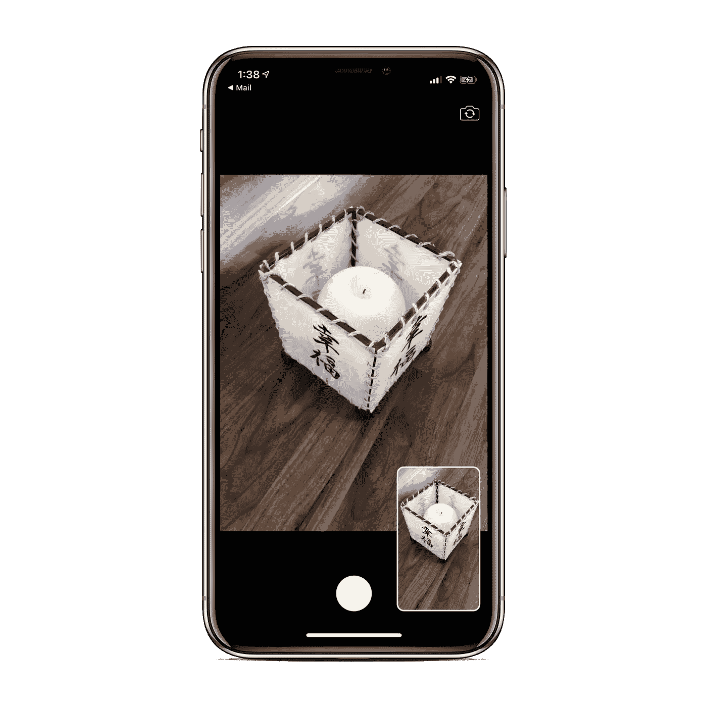
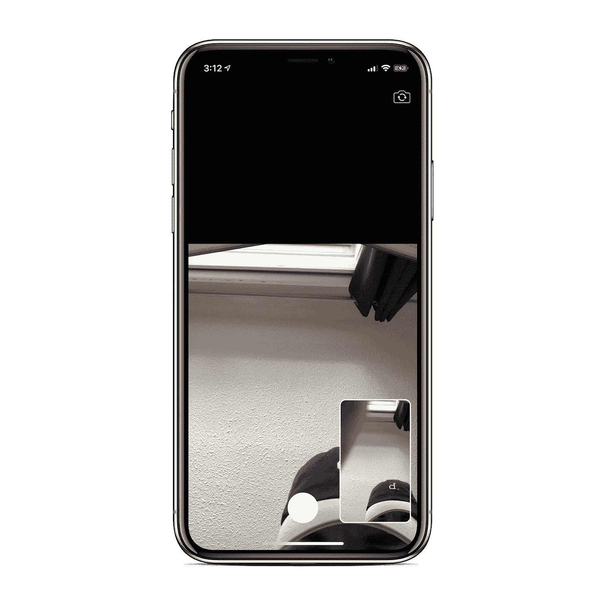
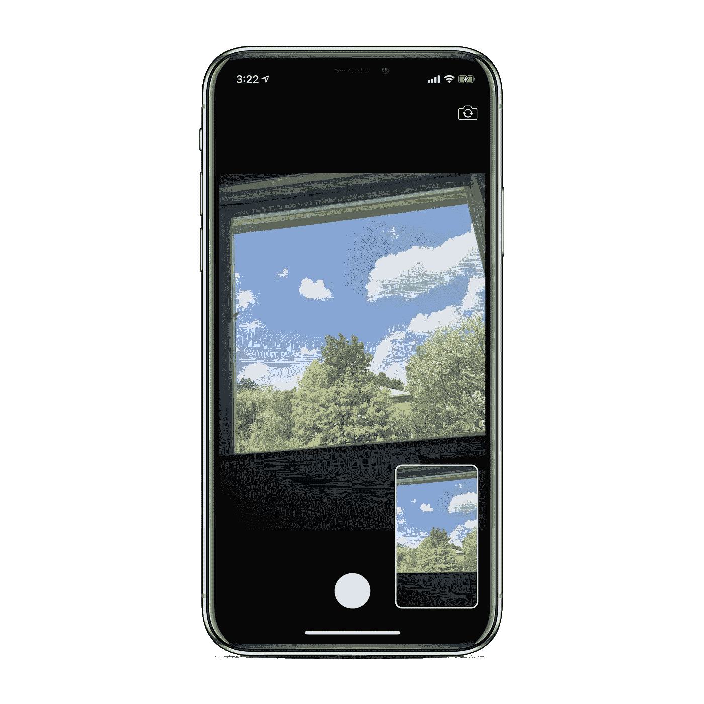
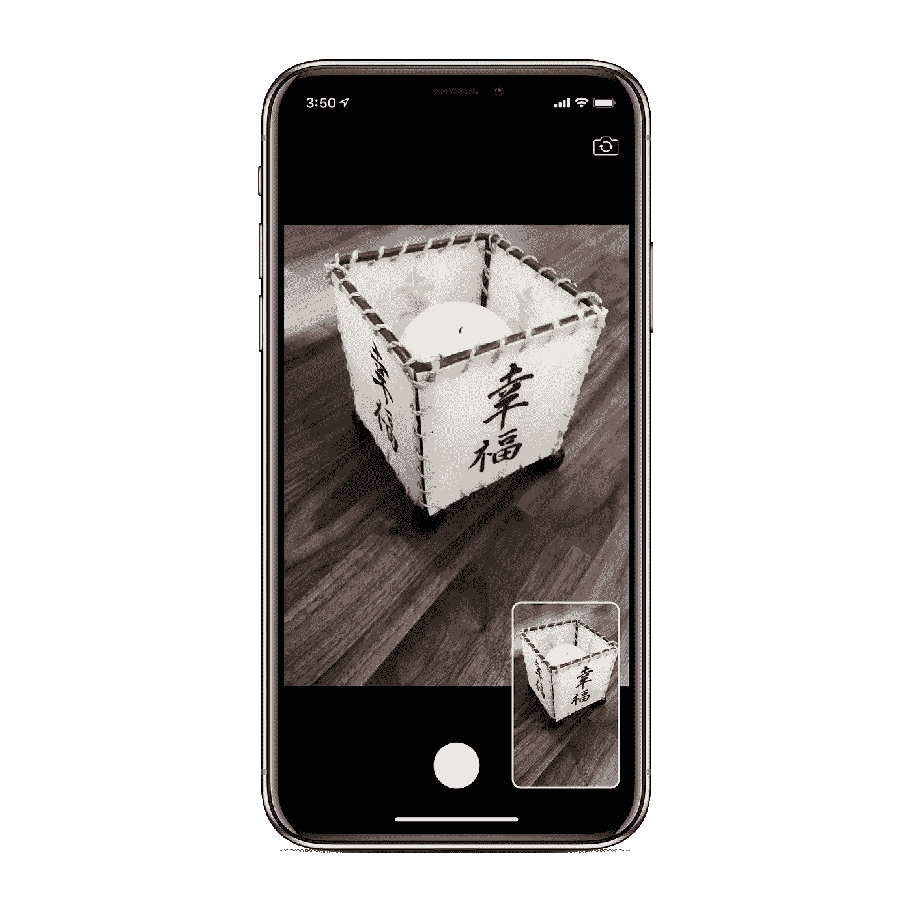

# 如何在 iOS 中使用 CIFilters 和 Metal 制作自定义相机

> 原文：<https://betterprogramming.pub/using-cifilters-metal-to-make-a-custom-camera-in-ios-c76134993316>

## 利用金属和核心图像为应用的摄像头实现快速高效的滤镜



图片来源:作者

我们都在 iOS 中见过这样或那样的定制相机。通常情况下，你会希望自己实现一个个人用户界面，而不是使用苹果的内置摄像头选项。但是我们如何让定制相机更进一步呢？过滤器！许多应用程序在相机上使用滤镜来扩展功能。

在本教程中，我们将讨论如何给你的相机添加滤镜。本教程旨在向您展示一种快速有效的方法来过滤您的摄像机实时视频和它拍摄的照片。

本教程假设您对如何在 iOS 中设置相机有一个实用的理解。不是这样？不用担心，你可以看看我之前的教程。事实上，本教程直接建立在该教程的成品代码之上:“[在 iOS](https://medium.com/@barbulescualex/making-a-custom-camera-in-ios-ea44e3087563) 中制作自定义相机。”

# 起始代码

启动程序代码可以在我的 GitHub 上找到:[barbulesculex/IOs metal camera](https://github.com/barbulescualex/iOSMetalCamera)。



图片来源:作者

如果你运行应用程序，你会看到我们有一个非常基本的相机设置。我们对前后摄像头都使用标准的`wideAngleCamera`。采集会话使用照片预置，采集设备本身没有配置。我们使用预览层来显示来自捕获会话的实时提要。最后，我们使用从视频数据输出对象获取的视频帧来拍摄照片。

如果你从未使用过`[AVCaptureVideoDataOutput](https://developer.apple.com/documentation/avfoundation/avcapturevideodataoutput)`，它所做的只是从捕获会话中返回视频帧，当用户拍照时，你可以用它来转换成`UIImage`。

UI 设置发生在`ViewController+Extras.swift`，所有主要逻辑发生在`ViewController.swift`。花几分钟时间试验一下，看看代码设置。

# 背景思维

有两种方法可以从捕获会话中拍照。第一种方法是使用`[AVPhotoCaptureOutput](https://developer.apple.com/documentation/avfoundation/avcapturephotooutput)`，这是一个输出对象，它使得从相机拍摄照片变得非常容易。第二种方法是使用一个`[AVCaptureVideoDataOutput](https://developer.apple.com/documentation/avfoundation/avcapturevideodataoutput)`,我们从中获取原始视频数据，并从中拍摄一张照片，即捕捉一帧。

现在让我们想一想。当前的设置使用`AVCaptureVideoDataOutput`获取原始视频数据，我们还使用`[AVCaptureVideoPreviewLayer](https://developer.apple.com/documentation/avfoundation/avcapturevideopreviewlayer)`向用户显示摄像机看到的内容。

在本教程中，我们希望将自定义滤镜应用于相机。当然，这可以在用户按下相机按钮后完成，但是您希望用户能够通过相机看到效果。这里我们唯一的选择是不依赖于`AVCaptureVideoPreviewLayer`，而是依赖于`AVCaptureVideoDataOutput`来处理带有我们的效果的帧，并将它们实时呈现给用户。

因此，当您真正需要的只是一个自定义的相机用户界面时，标准的预览层+照片捕捉输出是很好的。但是当您需要实际处理和应用效果到摄像机时，使用视频数据输出来接管这两个角色是很好的。

## 过滤器+金属与全金属

如果你不熟悉 [Metal](https://developer.apple.com/metal/) ，它是在 Cocoa 设备上使用 GPU 的框架。一个*金属视图*可以被认为是显示 GPU 渲染内容的视图。现在，iOS 上的所有视图都使用 GPU 进行渲染，但金属视图很特殊，因为你可以在更低的级别上控制渲染内容。

如果你不熟悉`[CIFilter](https://developer.apple.com/documentation/coreimage/cifilter)` [s](https://developer.apple.com/documentation/coreimage/cifilter) ，它们实际上只是将滤镜应用于图像的对象(是的，就是这么简单！).

那么我们如何应用效果呢？有多种方法可以做到这一点。

*   使用预定义的`CIFilter` s。这些是内置的插件和插件对象。
*   使用[金属着色语言](https://developer.apple.com/metal/Metal-Shading-Language-Specification.pdf)创建你自己的`CIFilter`。这与内置过滤器相同，只是您实际上自己编写了过滤器的代码。Metal 着色语言是你如何编写自己的指令，供 Metal 框架中的 GPU 使用。
*   使用金属制作你自己的纹理。这与上面的概念相同，但是随着范围的扩大，您可以做更多的事情，而不仅仅是添加过滤器。

两种方式(`CIFilter` s 或 Metal)都将纹理渲染到金属视图中。区别在于你处理图像的方式。`CIFilter` s 是一个更简单的高级抽象，预装了大量过滤器。但是正如我提到的，你可以创造你自己的。使用全金属会给你更多的灵活性，在你需要在图像上渲染东西的应用中会更有用(而不是仅仅给图像添加一个滤镜)。

就性能而言，我们想从中获得什么？我们希望所有的处理都在 GPU 上进行。显而易见，全金属方法固有地给我们带来了这一点，但`CIFilter`s+金属方法将带给我们几乎相同的性能。

# 第一部分。通过 MetalKit 显示框架

在第一部分中，我们将离开`AVCaptureVideoPreviewLayer`，自己显示结果。

首先，让我们考虑一下我们正在用这些数据框做什么。当用户按下相机按钮时，我们从该帧中创建一个`UIImage`。一种简单的显示帧的方法是用一个`UIImageView`来更新每一帧的图像。这显然对性能非常不利。这样的显示管道走的是 CPU(我们拿回来的帧)- > GPU ( `CIImage` ) - > CPU ( `UIImage`)。这就是为什么`MetalKit`视图是处理这个问题的最佳方式。

我不会在这里解释金属超级深入，因为我已经有一个教程，如果你有兴趣了解更多:“[如何使用金属着色器](https://medium.com/better-programming/making-your-first-circle-using-metal-shaders-1e5049ec8505)制作你的第一个圆。”

## **第一节。设置金属视图**

我们有一个使用标准预览层的相机应用程序的基本模板。我们现在想要为我们将使用的不同类型的视图删除它，一个`[MTKView](https://developer.apple.com/documentation/metalkit/mtkview)`。

> "`MTKView`类提供了一个金属感知视图的默认实现，你可以用它来使用金属渲染图形并在屏幕上显示它们。"

正如您可以从描述中推断的那样，我们实际上将把过滤后的帧渲染到这个视图中。

在`ViewController.swift`中，我们将移除`setupPreviewLayer()`，并添加一个实例变量来存储我们的金属视图。最后，要在应用程序内部使用 Metal，您需要导入`[MetalKit](https://developer.apple.com/documentation/metalkit)`。

在`ViewController.swift+Extras.swift`中，我们只是将金属视图添加到视图层次中，并使其横跨整个屏幕。

注意它只是`UIView`的一个子类。将它添加到 UI 中不需要特别考虑。

此时，如果你运行应用程序，你仍然可以像一切正常一样拍照；我们只是没有预览层了。

现在我们需要实际设置金属视图本身。

**连接到设备的 GPU**

第一步是 metal 视图通过渲染内容来工作，并使用 GPU 将内容渲染到屏幕上。`MetalKit`框架中的 GPU 由`[MTLDevice](https://developer.apple.com/documentation/metal/mtldevice)`表示，类似于`AVFoundation`框架中的摄像头或麦克风由`AVCaptureDevice`表示。

**告诉 MTKView 如何自我更新**

这可以在`MTKView`文档中的“[配置绘图行为](https://developer.apple.com/documentation/metalkit/mtkview)”*下找到。每次有新的帧要显示时，我们都要更新`MTKView`。所以我们将使用“显式绘制”选项。*

***创建一个命令队列***

*为了将指令发送到 GPU 进行处理，我们需要一个向下发送指令的管道。这条管道是由一个`[MTLCommandQueue](https://developer.apple.com/documentation/metal/mtlcommandqueue)`创建的。*

> *"一个`MTLCommandQueue`对象用于为一个`MTLDevice`执行的命令缓冲区的有序列表排队。"*

*您从`MTLDevice`对象创建这个命令队列。*

***向 GPU 发送指令***

*现在我们有了一个直接到 GPU 的队列，我们如何向它发送命令呢？我们向它发送命令到哪里？嗯，`MTKView`有一个`[MTKViewDelegate](https://developer.apple.com/documentation/metalkit/mtkviewdelegate)`，它的目的是响应视图的绘制事件。我们就是在这里发出命令的。*

*我们遵循的第一个函数告诉我们金属视图的可绘制性已经改变。什么是可画的？*

*`[MTLDrawable](https://developer.apple.com/documentation/metal/mtldrawable)`*

> *“可显示的资源，可以呈现或写入…能够在屏幕上显示内容。当你想用金属渲染图像并把它们呈现在屏幕上时，你可以使用可绘制对象。”*

*金属视图将有一个默认的可绘制对象，我们很快就会看到，我们可以将我们的`CIImage`(我们从相机中获取的视频帧制作)渲染到其中。*

*现在，如果您有使用 Metal 的经验，通常下一步将是使用渲染过程描述符和命令编码器制作一个管道，以便能够将指令编码到缓冲区中。因为我们使用的是`CIImage` s，所以我们可以使用`CIContext`将命令写入缓冲区，耶！*

## ***第二节。通过 MTKView 显示摄像机画面***

*这勾起了我的回忆。早在 2018 年，我就在 Stack Overflow 上发表了这篇文章，当时我使用了一个`UIImageView`来显示相机馈送，并错误地使用了`CIFilter`s:“[关于 CIContext、OpenGL 和 Metal (SWIFT)的混淆。CIContext 默认使用 CPU 还是 GPU？](https://stackoverflow.com/questions/51922595/confusion-about-cicontext-opengl-and-metal-swift-does-cicontext-use-cpu-or-g)*

*正如堆栈溢出用户 DFD 在他的回答中提到的，一个`CIImage`(我们从视频帧中创建的东西)只是一个图像的配方，每当我们转换到`CGImage`和`UIImage`时，我们都会遇到 CPU，所以我们希望只有在必要时才这样做。对我们来说，只有当用户实际拍摄图像时才有必要。我们将存储一个对我们已经创建的`CIImage`的引用，并在我们的金属视图上调用`[draw](https://developer.apple.com/documentation/metalkit/mtkview/1535943-draw)`来接管并渲染金属视图中的图像。*

*`[CoreImage](https://developer.apple.com/documentation/coreimage)`是一个图像处理和分析框架。它有自己的图像表示，称为`[CIImage](https://developer.apple.com/documentation/coreimage/ciimage)`，这是一个图像的配方。在这个图像配方上，你可以应用`[CIFilter](https://developer.apple.com/documentation/coreimage/cifilter)` [s](https://developer.apple.com/documentation/coreimage/cifilter) ，这将在下一部分中进行。CoreImage 框架的第三个基本类是`CIContext`。*

*`[CIContext](https://developer.apple.com/documentation/coreimage/cicontext)`*

> *"用于**渲染图像处理结果**并执行图像分析的评估上下文."*

*第一个关键点是我们真正感兴趣的，也就是渲染图像。事实证明，我们可以直接渲染金属纹理。什么是金属质感？我们很快会谈到这一点。*

*首先让我们创建一个。有多种方法可以初始化`CIContext`。其中一种方法是使用金属。这实际上是告诉它使用什么 GPU 设备来实现其内置的处理和评估功能。*

*接下来，我们需要在我们的类中存储一个对每个框架的引用，这样当我们在 metal 视图上调用 draw 时，它就知道需要使用什么框架。*

*我们如何将`CIImage`渲染到我们的金属视图中？`CIContext`有一整组渲染图像的函数，其中，我们遇到一个可以用的。*

```
*[func](https://developer.apple.com/documentation/coreimage/cicontext/1438026-render) render(_ image: [CIImage](https://developer.apple.com/documentation/coreimage/ciimage), 
         to texture: [MTLTexture](https://developer.apple.com/documentation/metal/mtltexture), 
      commandBuffer: [MTLCommandBuffer](https://developer.apple.com/documentation/metal/mtlcommandbuffer)?, 
             bounds: [CGRect](https://developer.apple.com/documentation/coregraphics/cgrect), 
         colorSpace: [CGColorSpace](https://developer.apple.com/documentation/coregraphics/cgcolorspace))*
```

*让我们剖析它的参数，这样我们就知道如何继续。*

*   *`image` —那很简单；这是我们为每一帧创建的`CIImage`。*
*   *`texture` —我说我们正在通过金属视图将它渲染到屏幕上，并提到我们将使用它的可绘制性。我们实际上“画”到的是金属视图是住房的可画的纹理。GPU 意义上的纹理是用于映射到对象上的图像。想想视频游戏中的纹理包。*
*   *`commandBuffer` —之前我们创建了一个命令队列，以便向 GPU 发送指令。这些“指令”被表示为命令缓冲区，并从命令队列中创建。*
*   *`bounds` —这是在纹理上绘制图像的`GCRect`。*
*   *`colorSpace` —这告诉`CIContext`如何解释来自`CIImage`的颜色信息。对我们来说，它只是标准的 RGB 颜色。*

*这里发生了很多事情。*

*首先，在我们获取视频帧的输出捕获中，如果用户没有按下相机按钮，我们不会立即返回，而是先存储`CIImage`，然后在我们的 metal 视图上调用 draw。*

*在 draw 函数中，我们所做的正是我们之前讨论过的。我们从命令队列中创建一个命令缓冲区来编码指令。我们确保我们有一个图像和金属视图的可绘制性。然后，我们调用上下文中的 render 函数，传递必要的参数。之后，我们告诉命令缓冲区在哪里显示结果，并提交执行。*

*最后，在 setup metal 中，我们将属性`[framebufferOnly](https://developer.apple.com/documentation/metalkit/mtkview/1535998-framebufferonly)`设置为`true`，这允许我们直接写入 metal 视图的可绘制对象的纹理。*

**

*现在，如果我们运行它，我们将得到我们的帧渲染到屏幕上，最好的部分是它的速度很快！从资源利用率来看，我们看到它的性能非常好。有一个小的 UI 问题:视频流没有正确居中。它粘在底部了。这可以很容易地通过向上移动原点 *y* 来改变，使其居中。*

**

*我们现在已经使用金属完美地复制了`AVVideoPreviewLayer`，而没有牺牲任何性能。*

# *第二部分。添加过滤器*

*下一部分相当短——建立金属视图是最难的部分。到目前为止，我们从相机到屏幕的步骤是`CMSampleBuffer`(从`AVVideoCaptureDateOutput`回调)- > `CIImage` - > `MTLTexture`。*

*我们从视频帧创建的`CIImage`既用于我们自己使用 Metal 定制的视频预览，也用于保存用户拍摄的图像。如果我们想要应用过滤器，我们所要做的就是在使用`CIImage`渲染到屏幕上之前和/或在用户拍照时保存之前应用它们。*

*`[CIFilter](https://developer.apple.com/documentation/coreimage/cifilter)`*

> *通过处理一个或多个输入图像或通过产生新的图像数据来产生图像的图像处理器。*
> 
> *"`CIFilter`类产生一个`CIImage`对象作为输出."*

*这一步再简单不过了。是为图像添加滤镜的高级抽象类，并且已经有了大量的预烘焙选项！*

*每个过滤器接受至少一个参数(一个`CIImage`)。一些过滤器具有额外的输入参数，例如强度、半径等。由于这些过滤器有如此多的选项，所有的参数都接受描述使用哪个过滤器和想要改变什么输入的字符串。*

*[核心图像过滤参考](https://cifilter.io) 包含了你需要的所有信息。它拥有所有可用的预定义过滤器，因此您可以按名称创建过滤器。它也有每个过滤器的所有输入选项，所以你可以设置它们。*

*为了向您展示它有多简单，将只有一个代码片段，然后我们就完成了！*

*如你所见，我们只做了很少的改动。我们声明了两个过滤器，并在设置我们的`CIContext`时设置了它们。然后，我们声明了一个新函数，它接受一个`CIImage`并将两个滤波器链接在一起，方法是将图像设置为滤波器的输入，然后从滤波器中获取滤波后的图像。在`captureOutput`回调函数中，我们用一个过滤过的函数替换了之前使用的`CIImage`。*

*我选择结合一个渐变滤镜和一个棕褐色滤镜来创建一个漂亮的复古色调。*

*如果你运行这个应用程序，你现在在 iOS 中就有了自己的快速高效的定制相机。*

**

*完整的零件代码可以在我的 GitHub 上找到:[barbulesculex/IOs metal camera](https://github.com/barbulescualex/iOSMetalCamera)。*

# *后续步骤*

*从这里你能去哪里？*

*   *建立一个用户界面来改变过滤器。这可以是从使用预定义的输入参数选择不同的过滤器到使用滑块来更改过滤器参数。*
*   *视频！我们从摄像机中获取的每一帧图像，我们都会过滤并显示在金属视图中。捕捉视频虽然不简单，但也不太难。它所暗示的是，你把视频帧捆绑在一起成为一个文件。这也是探索在 iOS 中使用音频设备的绝佳机会。*
*   *如果你对苹果的产品不满意，为什么不自己做呢？*

# *结论*

*如果你喜欢这个教程，并想了解更多关于金属的知识，请查看我对使用金属着色器的介绍，“[如何使用金属着色器](https://medium.com/better-programming/making-your-first-circle-using-metal-shaders-1e5049ec8505)制作你的第一个圆。”*

*已经熟悉金属，但想看看如何利用它做一些很酷的事情？查看我的音频可视化教程，“Swift 中的音频可视化使用 Metal 和 Accelerate(第 1 部分)”*

*一如既往，如果你有任何问题或意见，请在下面留下。*