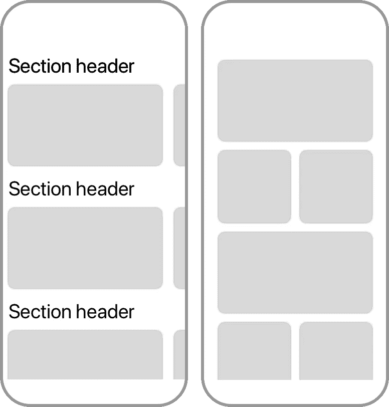
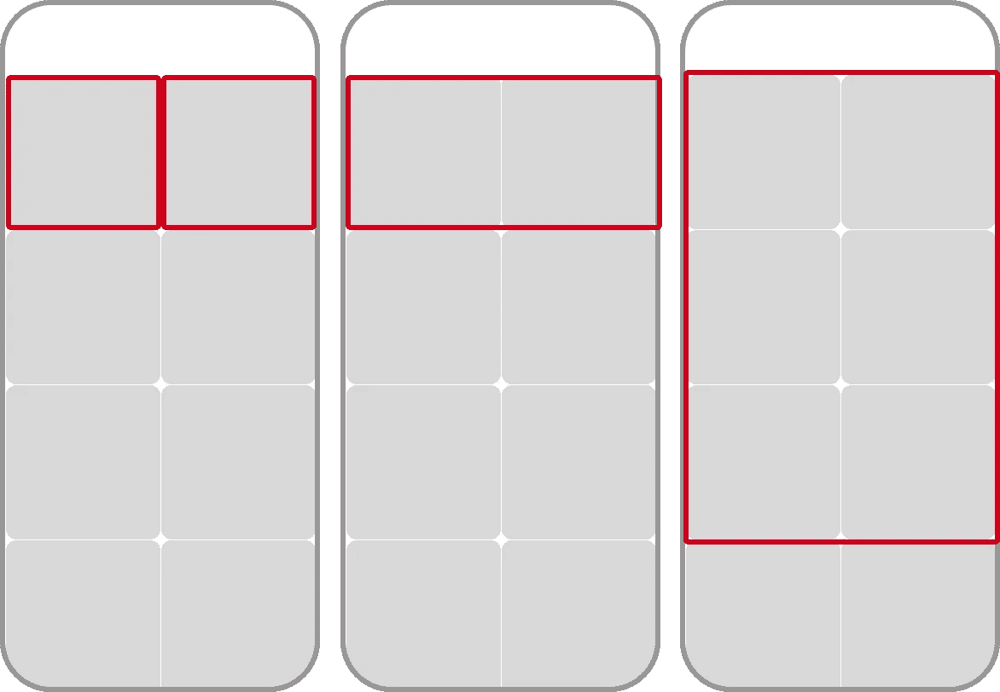
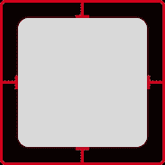
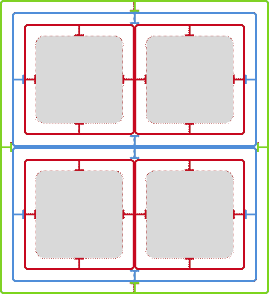
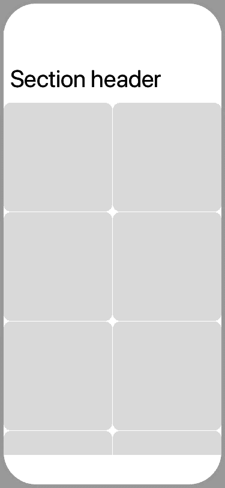

# 在 iOS 13 中使用合成收藏视图布局

> 原文：<https://betterprogramming.pub/using-compositional-collection-view-layouts-in-ios-13-3b23e9c75de4>

## 创建自定义布局的新方法


照片由[ján Jakub Nani sta](https://unsplash.com/@janjakubnanista?utm_source=unsplash&utm_medium=referral&utm_content=creditCopyText)在 [Unsplash](https://unsplash.com/s/photos/grid?utm_source=unsplash&utm_medium=referral&utm_content=creditCopyText) 上拍摄

自从 iOS 6 以来，开发人员已经能够使用集合视图，并通过子类化`UICollectionViewLayout`或`UICollectionViewFlowLayout`类来构建有趣的自定义布局。今天，我将向您介绍一种定义集合视图布局的新方法，称为组合布局。我们将构建这两种布局:



我将首先向您展示如何构建一个简单的网格布局，然后我们将继续朝着最终结果前进。

# 构建网格布局

集合视图的一个常见用途是显示网格布局。自从在 iOS 6 中引入`UICollectionView`以来，苹果已经在 iOS 中包含了网格布局——`UICollectionViewFlowLayout`——这是如此常见。既然这是一个如此熟悉且相对简单的布局，我想通过用它来构建一个网格来和你一起探索`UICollectionViewCompositionalLayout`的基础。我假设您已经设置了一个集合视图，可能还有一个[不同的数据源](https://www.donnywals.com/modern-table-views-with-diffable-data-sources/)。如果你想跟随这篇文章中的代码样本，我建议你总是把你的组合布局代码放在一个方法中，我将很快演示。然后，您可以通过在您的`viewDidLoad()`方法中编写以下内容，将布局分配到您的集合视图:

```
collectionView.collectionViewLayout = createCompositionalLayout()
```

在我详细解释组合布局之前，让我们先看一个例子:

```
func createCompositionalLayout() -> UICollectionViewCompositionalLayout {
  let itemSize = NSCollectionLayoutSize(widthDimension: .fractionalWidth(0.5), heightDimension: .fractionalHeight(1.0))

  let item = NSCollectionLayoutItem(layoutSize: itemSize)

  let groupSize = NSCollectionLayoutSize(widthDimension: .fractionalWidth(1.0), heightDimension: .fractionalWidth(0.5)) let group = NSCollectionLayoutGroup.horizontal(layoutSize: groupSize, subitems: [item])

  let section = NSCollectionLayoutSection(group: group)

  let layout = UICollectionViewCompositionalLayout(section: section)
  return layout
}
```

如果您检查前面的代码，在 return 语句之前，您会注意到`UICollectionViewCompositionalLayout`初始化器接受了一个`NSCollectionLayoutSection`的实例。换句话说，布局是使用截面构建的。这些部分是使用`NSCollectionLayoutGroup`实例构建的。一个部分可以包含多个组，正如我们将在本文的最后一部分看到的，一个部分也可以包含几个不同的组。组被认为是构图布局中最大的一部分。您通常会在组上完成大部分配置工作。

注意，示例代码使用`NSCollectionLayoutGroup.horizontal`来创建布局组。通过使布局组水平，添加到该组的所有项目都将水平放置。这意味着该组将在水平轴上放置项目，直到它填满其宽度，然后开始在下一行放置项目，直到它包含尽可能多的项目，以此类推。我们还向该组传递一个或多个项目配置。除了项目之外，布局组还接收大小。在示例代码中，我们使用分数大小。

你可能会注意到，我已经将`fractionalWidth`用于`heightDimension`和`widthDimension`。这样做的原因是我希望网格包含正方形的项目。为了实现这一点，我定义了一个组，它占据了整个屏幕的宽度，高度是屏幕宽度的一半。如果您现在查看传递给布局组的`NSCollectionLayoutItem`的声明，您会看到一个条目的高度分数为`1`，宽度分数为`0.5`。



除了部分宽度和高度，您还可以使用`.absolute(240)`指定一个绝对大小，这将使一个项目正好 240 磅宽或高。或者您可以使用`.estimated(240)`让系统根据物品的内容来决定物品的最佳高度。

如果您将我刚才展示的`createCompositionalLayout()`方法生成的布局分配给集合视图的`collectionViewLayout`属性，您将得到一个看起来非常相似的网格。不过这些项目有点狭窄，所以让我们探索一些间距选项。

有两种可能的方法给你的集合视图单元格一些空间:

*   在项目、组或部分上分配边缘插图。
*   指定单个项目和组之间的间距。



灰色正方形周围的红色框是该项目的边界框。它占据了由项目的`NSCollectionLayoutSize`定义的空间。从该边界框向内应用插入，最终在剩余空间(上图中的灰色区域)中呈现单元格。您可以使用以下代码在项目上分配边缘插入:

```
item.contentInsets = NSDirectionalEdgeInsets(top: 8, leading: 8, bottom: 8, trailing: 8)
```

尝试将这行代码添加到您之前定义的网格布局中，并注意它如何在单元格之间提供了一个很好的间距:


灰色方块是呈现的单元格，红线是项目的边界框，蓝线表示布局组的边界框。而且，像项目一样，这个蓝色边界框将具有您为组本身指定的大小，并且向内应用插入。



唯一的区别是截面总是占据视口的整个宽度，并且它们的高度总是动态确定的。


您可以使用以下代码应用项目和组间距:

```
// item spacing
group.interItemSpacing = .fixed(15)

// group spacing
section.interGroupSpacing = 15
```

请注意，我们在包含项目的组上定义项目间距，在包含组的节上定义组间距。还要注意，在这种情况下，项目间距被定义为`.fixed(15)`。这意味着各组将始终以 15 磅的间距放置它们的项目。您还可以使用`.flexible(<spacing>)`来允许该组根据其大小以及它所定位的项目的大小来确定项目之间的最佳间距。该组将使用其可变间距值作为项目之间的最小间距，项目之间的距离可能会比您指定的距离更远，但不会更近。

我强烈建议使用我在本节开始时分享的简单网格布局来探索我在本节中描述的插入和间距选项。网格布局简单且可预测，这使它成为探索选项的完美候选。

# 向布局添加区域标题

在本文的开始，我告诉你我将向你展示如何构建两种不同的布局。这两种布局之一包含节标题。让我们看看如何将部分标题添加到您的复合集合视图布局中。如果您遵循我在本文中介绍的代码，您可以在网格布局的上下文中使用下面的代码片段，或者您可能已经拥有的任何其他组合布局:

```
let headerSize = NSCollectionLayoutSize(widthDimension: .fractionalWidth(1.0), heightDimension: .estimated(44))let headerElement = NSCollectionLayoutBoundarySupplementaryItem(layoutSize: headerSize, elementKind: "header", alignment: .top)section.boundarySupplementaryItems = [headerElement]
```

您应该对前面代码片段的第一行很熟悉。集合视图标题的大小的定义方式与项目和组的大小完全相同。头部被定义为`NSCollectionLayoutBoundarySupplementaryItem`的一个实例。页眉和页脚都是不同类型的辅助视图，因此它们的定义方式完全相同。根据您传递给`NSCollectionLayoutBoundarySupplementaryItem`初始化器中的`alignment`参数的值，补充视图将作为页眉、页脚或只是一个装饰视图。另外，注意这里有一个`elementKind`参数。该参数是一个字符串标识符，类似于当要求提供补充视图时，在集合视图数据源中使用的单元格重用标识符。

***注意*** *由于这篇文章不是关于设置集合视图数据源的，所以我不打算深入解释节标题。简而言之，你需要从* `*UICollectionViewDataSource*` *协议中实现* `*collectionView(_:viewForSupplementaryElementOfKind:at:)*` *方法。您还需要使用集合视图的* `*register(_:forSupplementaryViewOfKind:withReuseIdentifier:)*` *方法在集合视图上注册一个* `*UICollectionViewCell*` *子类。该方法非常类似于在代码中注册集合视图单元格，除了您还提供元素种类字符串标识符。*

令人惊讶的是，上面的代码是你在布局中添加标题所需要的全部。下图显示了我们在实现本文开头的布局方面的进展:



# 构建在两个轴上滚动的布局

现在我们已经有了一个带有部分标题的基本网格，让我们通过修改几行代码来实现第一个集合视图布局。

要做的第一个改变是稍微重新配置网格布局中的组。我们将在组内制作占据整个组空间的项目。然后，我们将更新该组，使其占据大约 90%的可用宽度，并且该组的高度将与可用宽度相关，从而使组大小(和项目大小)基于纵横比:

```
let itemSize = NSCollectionLayoutSize(widthDimension: .fractionalWidth(1.0), heightDimension: .fractionalHeight(1.0))let item = NSCollectionLayoutItem(layoutSize: itemSize)

let groupSize = NSCollectionLayoutSize(widthDimension: .fractionalWidth(0.9), heightDimension: .fractionalWidth(0.5))let group = NSCollectionLayoutGroup.horizontal(layoutSize: groupSize, subitems: [item])
```

如果您将上面的代码与我们之前的网格代码进行比较，您会注意到您只更改了几个数字。如果您使用这些更改运行应用程序，您现在应该有一个带有节标题的布局，其中每个单元格几乎占据所有宽度，并且它们都垂直堆叠，如下图所示:


让我们再做一些改变。我们希望一个部分中的项目彼此相邻，这样我们就可以在水平轴上滚动每个部分:

```
let section = NSCollectionLayoutSection(group: group) section.orthogonalScrollingBehavior = .continuous section.interGroupSpacing = 16 section.contentInsets = NSDirectionalEdgeInsets(top: 0, leading: 16, bottom: 0, trailing: 16)
```

前面片段中的关键一行是`section.orthogonalScrollingBehavior = .continuous`。通过给一个部分的`orthogonalScrollingBehavior`属性赋值，您可以翻转它上面的所有内容。该部分现在会将组并排放置，而不是叠放在一起。因为我们布局中的每个组都包含一个项目，所以我们最终得到了一个与本文开头的设计相匹配的旋转木马。很神奇，不是吗？

我在前面的例子中选择的正交滚动选项是`.continuous`。此选项将使每个部分像普通滚动视图一样滚动。用户在屏幕上拖动手指，部分就会滚动。该选项的其他值有`.continuousGroupLeadingBoundary`、`.paging`、`.groupPaging`、`.groupPagingCentered`等等。其中一些选项实现了分页行为，其他选项以更微妙的方式操纵一个部分在滚动时如何响应。我绝对推荐您使用本文中的例子，尝试不同的行为，因为它们非常有趣。

这就完成了第一个集合视图布局！我们从一个简单的网格开始，通过更改几个数字，添加一个标题并在我们的部分上设置一个属性，我们现在有了一个可以水平和垂直滚动的布局。令人惊讶的是，我们需要的代码如此之少，尤其是与没有组合布局的情况下我们必须编写的代码相比。

# 创建高级网格

在本文的开始，我向您展示了第二个网格布局。这个布局很有趣，因为为了构建它，我们必须使用嵌套组。当使用复合布局时，可以向`NSCollectionLayoutGroup`的`subitems`数组传递多个项目。当您这样做时，该组将按布局顺序使用所有项目。因此，当您传递两个项目时，该组将对它包含的第一个单元格使用第一个项目，对第二个单元格使用第二个项目，然后对第三个单元格再次使用第一个项目，依此类推。

在我们的示例中，我们希望为全宽单元格创建一个常规项目，然后为位于宽单元格下方的两个较小单元格创建一个包含两个半尺寸项目的嵌套组。以下代码可用于创建我们正在寻找的布局:

```
func createCompositionalLayout() -> UICollectionViewCompositionalLayout {
  let inset: CGFloat = 8

  // Large item on top
  let topItemSize = NSCollectionLayoutSize(widthDimension: .fractionalWidth(1.0), heightDimension: .fractionalWidth(9/16))

  let topItem = NSCollectionLayoutItem(layoutSize: topItemSize) topItem.contentInsets = NSDirectionalEdgeInsets(top: inset, leading: inset, bottom: inset, trailing: inset)

  // Bottom item
  let bottomItemSize = NSCollectionLayoutSize(widthDimension: .fractionalWidth(0.5), heightDimension: .fractionalHeight(1.0)) let bottomItem = NSCollectionLayoutItem(layoutSize: bottomItemSize) bottomItem.contentInsets = NSDirectionalEdgeInsets(top: inset, leading: inset, bottom: inset, trailing: inset)

  // Group for bottom item, it repeats the bottom item twice
  let bottomGroupSize = NSCollectionLayoutSize(widthDimension: .fractionalWidth(1), heightDimension: .fractionalWidth(0.5)) let bottomGroup = NSCollectionLayoutGroup.horizontal(layoutSize: bottomGroupSize, subitem: bottomItem, count: 2)

  // Combine the top item and bottom group
  let fullGroupSize = NSCollectionLayoutSize(widthDimension: .fractionalWidth(1.0), heightDimension: .fractionalWidth(9/16 + 0.5)) let nestedGroup = NSCollectionLayoutGroup.vertical(layoutSize: fullGroupSize, subitems: [topItem, bottomGroup])

  let section = NSCollectionLayoutSection(group: nestedGroup)

  let layout = UICollectionViewCompositionalLayout(section: section)

  return layout
}
```

我在代码中添加了一些注释。所有这些对您来说应该很熟悉，这只是您在本文中学到的元素的不同组合方式。这种熟悉感正是组合布局如此强大的原因。不管你是想构建一个简单的东西，比如网格，还是像我们刚刚做的那样更复杂的东西，你总是使用完全相同的组件，以不同的方式组成。很酷，对吧？

# 概括起来

今天的文章介绍了新的`UICollectionViewCompositionalLayout`类。您了解了这个类允许您使用四个简单的构建块来指定复杂的集合视图布局；项目、组、部分和布局本身。有了这些块，你就可以构建布局，而使用传统的`UICollectionViewFlowLayout.`来实现这些布局将是一场噩梦。

您了解了如何构建一个集合视图布局，该布局垂直定位其各个部分，并且该部分中的项目可以水平滚动。您了解了这称为正交滚动，并且可以通过一行代码来实现。您还看到，您可以嵌套组来构建看起来有些不规则的布局，这在视觉上很有趣。

如果你对这个作品有任何问题，或者如果你已经做了一些很酷的布局，让我知道。我很想收到你的来信！