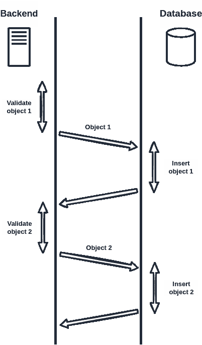
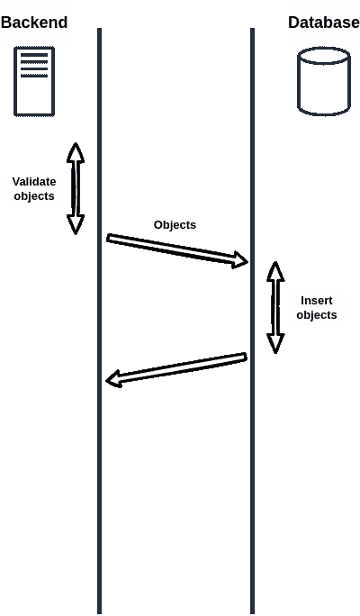
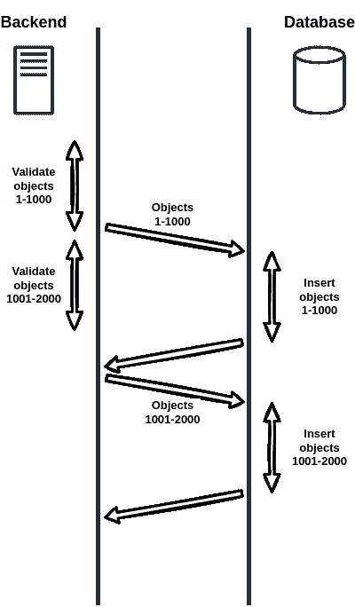

# 通过并发管道加速 JavaScript 应用

> 原文：<https://betterprogramming.pub/using-concurrent-pipelines-to-accelerate-javascript-applications-246cbdd167a>

## 我们如何在应用程序上实现 35%的加速


照片由[洋子科雷亚西宫](https://unsplash.com/@nishimiyaphotography?utm_source=medium&utm_medium=referral)在 [Unsplash](https://unsplash.com?utm_source=medium&utm_medium=referral) 拍摄

数据管道，比如著名的 ETL 管道，对于大多数后端开发人员来说并不陌生。

我最近发现自己在团队的 Node.js 后端使用这样的管道。我在一个端点上工作，接收许多对象，验证它们，并将它们插入数据库:

```
for (var obj of objects) {
    await validate(obj);
    await insert(obj);
}
```

这种模式在代码库中已经存在很长时间了。它过去可以完成工作，但效率不是特别高，因为每个对象都需要往返后端:



幼稚管道的时间表

在注意到大量的人力时间被浪费在等待操作上之后，我优化了端点，使其使用[批量数据库插入](https://www.mongodb.com/docs/manual/core/bulk-write-operations/)。这将往返数据库的次数减少到 1:

```
const bulk = new Bulk();
for (var obj of objects) {
    await validate(obj);
    bulk.insert(obj);
}
await bulk.execute();
```

以下是更改后的时间线:



带有批量数据库插入的时间线

结果非常好:端点的性能提高到了令人满意的水平。

但是还有另一个优化的机会:注意一个被验证的对象是如何完全独立于另一个被插入的对象的，然而所有的数据库插入都发生在所有的对象验证之后。如果我们将对象验证和数据库插入重叠在一起会怎么样，就像这样:



具有并发批量数据库写入和对象验证的时间线

但是如何在 JavaScript 中实现这样的行为呢？一种方法可能是完全删除最后一个`await`:

```
for (var batchStart=0; batchStart<objects.length; batchStart+=BATCH_SIZE) {
    const bulk = new Bulk();
    for (var i=batchStart; i<batchStart+BATCH_SIZE && i<objects.length; i++) {
        await validate(objects[i]);
        bulk.insert(objects[i]);
    }
    bulk.execute();
}
```

但是，当然，并发的运行中的数据库请求的数量是没有限制的，特别是如果与数据库插入相比，验证花费的时间很少，并且我们正在处理大量的对象，更不用说异步异常处理了。

为了解决这个问题，我们可以使用由我创作的 NPM 软件包`[concurrent-pipeline](https://www.npmjs.com/package/concurrent-pipeline)`。我们首先导入包并创建一个新的`Pipeline`:

```
const Pipeline = require('concurrent-pipeline');
const ppl = new Pipeline(10);
```

10 代表“最多 10 个并发运行的流”。

接下来，我们用`pipelined`包装内部 for 循环，允许外部 for 循环继续进行，而不必等待每个批处理:

```
for (var batchStart=0; batchStart<objects.length; batchStart+=BATCH_SIZE) {
    await ppl.pipelined(async (stage, batchStart) => {
        const bulk = new Bulk();
        for (var i=batchStart; i<batchStarts+BATCH_SIZE && i<objects.length; i++) {
            await validate(objects[i]);
            bulk.insert(objects[i]);
        }
        await bulk.execute();
    })(batchStart);
}
```

我们可以在代码的不同阶段实施不同的并发限制。让我们假设我们希望最多进行 5 个并发验证，但是将数据库插入阶段限制为 3 个并发操作:

```
for (var batchStart=0; batchStart<objects.length; batchStart+=BATCH_SIZE) {
    await ppl.pipelined(async (stage, batchStart) => {
        const bulk = new Bulk();
        await stage('validation', 5);
        for (var i=batchStart; i<batchStarts+BATCH_SIZE && i<objects.length; i++) {
            await validate(objects[i]);
            bulk.insert(objects[i]);
        }
        await stage('database', 3);
        await bulk.execute();
    })(batchStart);
}
```

`await stage`语句阻止流进入已经达到并发限制的阶段，直到出现一个点。

最后，我们等待所有流结束:

```
await ppl.finish();
```

这个调用还会抛出流没有处理的任何异常。

通过使用`concurrent-pipeline`将验证与数据库操作重叠，并保持多个数据库操作运行，我的应用程序获得了 35%的加速。

你可以在`concurrent-pipeline`的[回购](https://github.com/mstniy/concurrent-pipeline-js)上找到关于【】的更多细节。