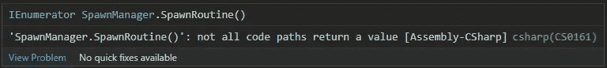

# 在 Unity 中使用协程

> 原文：<https://betterprogramming.pub/using-coroutines-in-unity-e293d2f17b57>

## 学习在 Unity 代码库中设置和使用协程

Unity 中的协程允许用户在继续之前等待一段时间。

我们这样来看。如果我想每隔几秒钟产生一个敌人，我会使用一个协程来完成。

看看如何设置一个。

首先，我们需要定义一个类型为`IEnumerator`的方法。这是一个集合类型，它将代码放入事件序列类型结构中。

这意味着用我们产卵的敌人为例，我们可以等待几秒钟，然后产卵另一个，然后再次等待，重复。

让我们看一下代码。首先，我为敌人预设设置了一个新的私有序列化字段`GameObject`。

接下来，我将设置`IEnumerator`方法，并将其命名为`SpawnRoutine`。

下面的红色曲线告诉我有东西不见了。错误消息指出并非所有代码路径都返回值。我们将在添加 yield return 命令时解决这个问题。

yield return 命令的作用是为我们设置事件的顺序。例如，如果我使用 yield 返回 null，1 号错误将被解决，2 号`IEnumerator`将等待一帧，然后运行它下面的代码。

然而，我们想要的行为是让协程每隔几秒钟运行一次。我们使用 yield return new `WaitForSeconds()`方法来完成这个任务。

太棒了，我们现在可以在跑步前等待一段时间了。但是这只会运行代码一次。现在我们必须实现一个叫做 while 循环的东西。

While loops，顾名思义，在满足某些条件时循环一段代码。举例来说，如果我们只想让这个敌人产卵 5 次，我们会说，当它少于 5 次时，每 5 秒产卵一次。

在代码中:

这里更新计数器是极其重要的。如果我们不这样做，那么我们就进入了所谓的无限循环。

无限循环可能有用，但也可能非常危险。如果做得不正确，他们可以崩溃你的电脑，并公然使你的游戏无法播放。

一些有用的无限循环的例子是 Unity。程序本身不会自动关闭，说一切运行正常，直到你自己关闭它。这是因为一个无限循环正在运行，以确保程序保持打开。

现在让我们回到繁殖我们的敌人，我们实际上将遵循同样的逻辑，当我们的游戏运行时，我们希望无限繁殖新的敌人。

为此，我们将这样设置我们的循环:

这一行代码说，虽然我们想等待 5 秒钟，然后运行我们的代码。

这是无限的，因为真永远不会自己变成假。因此，这个循环永远不会中断。

现在添加我们的敌人，我们将用一个随机的产卵位置来实例化我们的敌人预置游戏对象:

基础工作已经就绪。剩下唯一要做的事情就是弄清楚如何实际调用这个方法。

Unity 有一个名为`StartCoroutine()`的内置方法，它接受协程名称或协程调用的参数。因为我们希望这在游戏的整个生命周期中持续，所以我们将把它放在 Spawn Manager 脚本的 start 方法中。

在 [LinkedIn](https://www.linkedin.com/in/brantlee-mercer-433012112/) 上与我联系，关注更多！