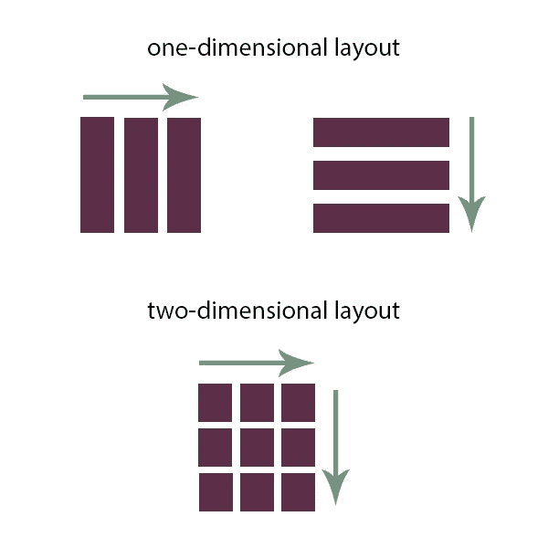
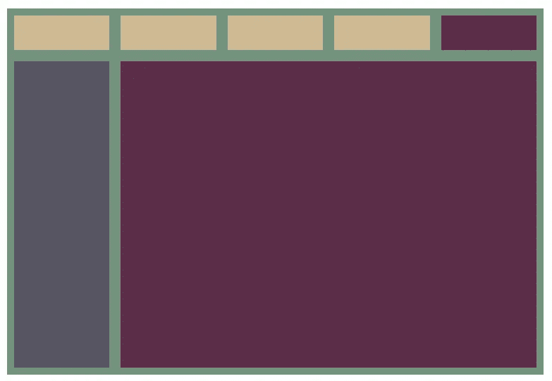
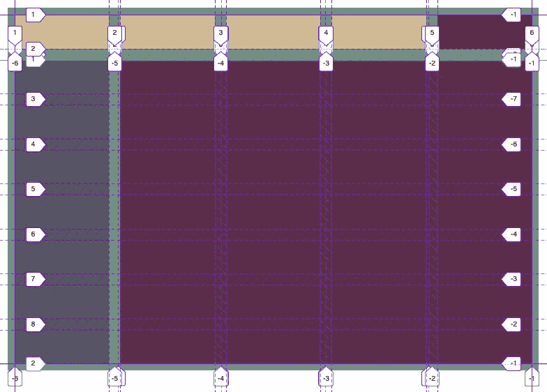
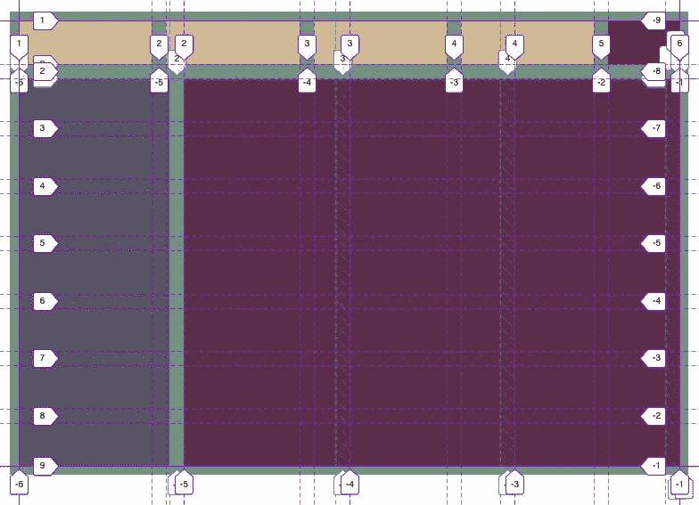
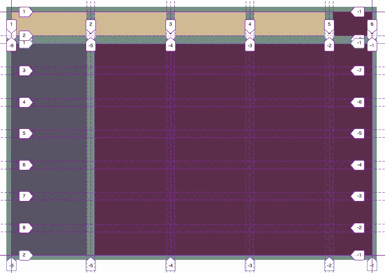
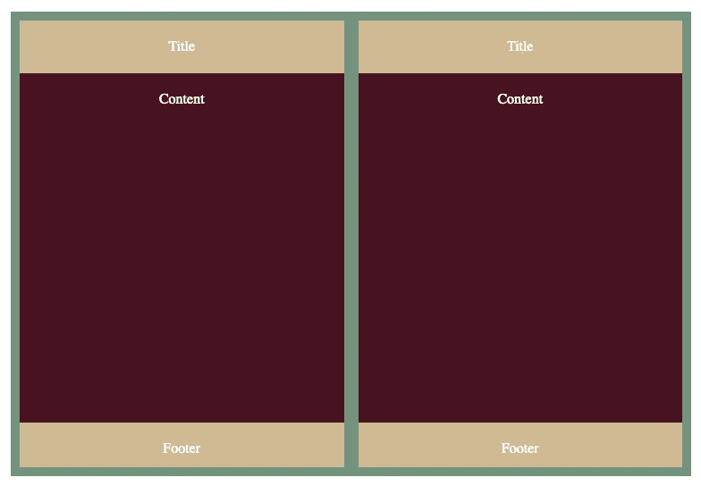
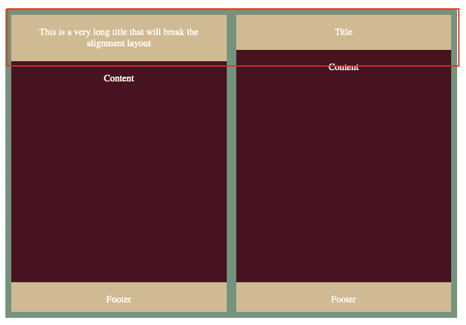
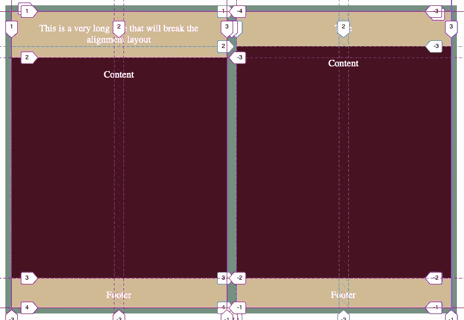
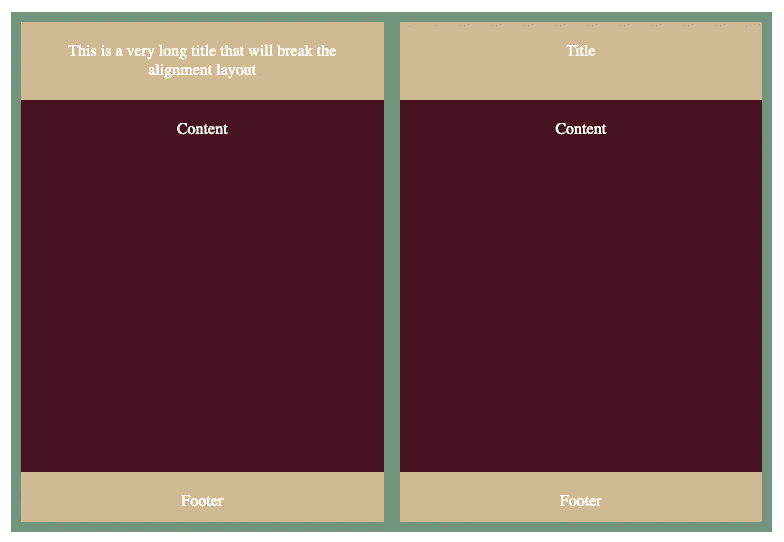

# 使用 CSS 子网格实现像素完美

> 原文：<https://betterprogramming.pub/using-css-subgrid-for-pixel-perfection-6d4343b057cd>

## 展示 CSS 的子网格特性的简单美丽


照片由[格伦·卡斯滕斯-彼得斯](https://unsplash.com/@glenncarstenspeters?utm_source=medium&utm_medium=referral)在 [Unsplash](https://unsplash.com?utm_source=medium&utm_medium=referral) 拍摄。

让我们快速回顾一下什么是网格:它是一个基于容器的二维布局系统。它可以在两个轴中的任何一个轴上增长，几乎所有的信息都存储在父容器中。



作者照片。

那么子网格有什么好大惊小怪的呢？它的目的是什么？网格不就解决了所有的问题吗？他们大多是，但我们渴望完美，没有这个新功能很难实现。一旦您开始使用网格功能，您就会意识到缺少了一些东西…

为了简单起见，在本文中，我们将忽略媒体查询和响应布局。

# 深入研究这个问题

一切都很好，直到我们开始嵌套网格。在这种情况下，我们开始遇到一些网格之间对齐和调整的问题。这是因为一个网格只能影响它的直接子网格，而不能影响它们的子网格。

这意味着当必须对齐一些嵌套网格时，我们需要大量的计算来进行补偿。这意味着试图达到像素完美将付出代价:脆弱的布局。你可能仍然需要做出许多让步。

对 subgrid 的支持离生产就绪还差得很远。目前我们只能以增量的方式使用它(也就是说，我们只能用它来增强支持它的浏览器的体验)。

让我们创建一些嵌套网格并一起探索它们:



一切都完美地对齐。



轨道和网格线。这些复制品排列得很好。

有什么问题？我们有一个主网格和两个嵌套网格，看起来一切正常。事实上，嵌套网格继承了带有`grid-template-columns: inherit`的`grid-column-template`定义。这不正是我们想要的吗？

理论总是非常美好，但当你开始添加内容时，它就开始分崩离析了。

假设我们希望第一行的最后一列的大小基于内容。为此，我们将使用`max-content`:

```
//using max-content on the last column#container {
  ...
  grid-template-columns: 1fr 1fr 1fr 1fr max-content;
  ...
}
```

结果如下:


对嵌套网格使用最大内容时布局被破坏



断开的最大内容嵌套网格的网格

就这样，一切都乱了套。内容不断破坏我们的布局，但这是内容的错吗？不，问题是我们的布局方式非常脆弱。有很多方法可以解决这个问题:

*   对于每个分辨率具有固定的列宽。
*   我们不使用`max-content`，而是测量内容并使其保持静态。
*   告诉我们的设计师这是太多的工作，并要求退而采用`1fr`方法。

所有这些解决方案都只是解决问题的方法，没有一个能带来完美的像素。我们真正的问题是什么？父网格无助于将任何元素定位在第一个子级别之下。

目前的解决方案是上面列出的解决方案的混合。这导致大量的 CSS 代码充满了计算和可能出错的地方。更改/添加内容可能是一项令人生畏的任务，其中许多东西可能会损坏。另一个问题是代码审查。只是不可能在你的头脑中有这些计算，并正确地审查代码。

# CSS 子网格拯救世界

这个问题怎么解决？只要让所有嵌套的网格使用相同的轨迹。这就是子网格的具体用途:

就这样，我们完成了:



用子网格固定布局

那里发生了什么事？是怎么固定的？

子栅格强制子元素位于父元素的轨迹上。此外，父网格和嵌套网格正在相互通信，并一起制定布局。

看网格上的最后一列。它比其他的都小。如果您还记得，我们将该列设置为`max-content`。父网格和嵌套网格一起决定`max-content`的宽度，因为它们将共享相同的轨迹。它的网格与嵌套的子网格进行递归通信，以确保它们获得完美的单元大小。

这是基本要点:网格及其子网格*一起工作*来设计共享网格布局。知道这种布局是跨他们共享的，我们需要在设计它的时候多加注意。我们必须在父级定义网格和子网格的用途。这需要提前做一些额外的思考，但这确实是值得的。

子网格也是二维布局。它可以从父网格继承列和/或行。我们刚刚看到了列维子网格布局。现在让我们来看看行维度 1:



具有相同内容的嵌套网格

再一次，看起来一切都很好，不需要任何其他东西。如上面的代码所示，行模板的定义如下:

```
grid-template-rows: max-content 2fr 50px;
```

让我们看看如果我们的标题内容比这个长一点会发生什么:



使用嵌套网格的最大内容时布局被破坏



将最大内容与嵌套网格一起使用时，布局的网格被破坏

让我们用同样的原则再次修正它，在两个嵌套网格上使用子网格:



在行维度上应用子网格以修复布局

神奇的事情又发生了。这一切看起来像素完美。网格容器和嵌套容器正在一起定义`max-content`,这是小菜一碟，因为它们都使用相同的网格线和网格轨迹定位。

*注:我们已经看到了一个共享* `*grid-template-rows*` *的例子和一个共享* `*grid-template-columns*` *的例子。如果需要，* `*subgrid*` *可以在两个维度上扩展。*

# 包扎


[Ravi Palwe](https://unsplash.com/@ravipalwe?utm_source=medium&utm_medium=referral) 在 [Unsplash](https://unsplash.com?utm_source=medium&utm_medium=referral) 上拍摄的照片。

让我们回顾一下 subgrid 的所有优点:

*   它继承了命名的网格线。
*   它继承了命名的网格区域。
*   它继承了间隙并可以覆盖它们。
*   它可以定义命名的网格线，并将在父对象中可见。
*   它有助于母细胞的大小。
*   可以是一维，也可以是二维。
*   行号总是从 1 开始。

有了每一个 CSS 特性，我们修改布局的日子就一去不复返了。这一切都始于 Flex，它是主要的游戏规则改变者，并延续到 Grid。Subgrid 是最终的伴侣，与它一起你将实现完美定位的布局结构，它将 100%匹配设计者的布局结构。你再也不用担心内容会破坏你的布局了。它将永远在正确的轨道上。

如果你对 Flex 在今天仍然出色的用例感兴趣，你可以看看我以前关于 Flex 与网格的文章:

[](https://dioxmio.medium.com/grid-vs-flexbox-which-one-should-you-be-using-471cb955d3b5) [## Grid 和 Flexbox——你应该使用哪一个？

### 为合适的工作寻找合适的工具

dioxmio.medium.com](https://dioxmio.medium.com/grid-vs-flexbox-which-one-should-you-be-using-471cb955d3b5) 

将来会有更多的子网格内容出现。干杯！