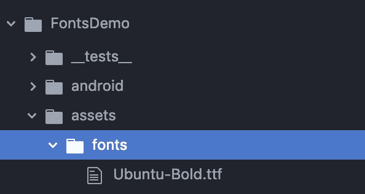

# 如何在 React Native 中使用自定义字体

> 原文：<https://betterprogramming.pub/using-custom-fonts-in-react-native-2019-289099609837>

## 脱离 Helvetica，给你的用户一些更有趣的东西来阅读

在 React Native 0.60 之前，我一直使用`package.json`和 RNPM 将我的自定义字体添加到我的项目中。

然而，从 0.60 开始，我每次构建都会收到以下警告:

```
warn Your project is using deprecated "rnpm" config that will stop working from next release. Please use a "react-native.config.js" file to configure the React Native CLI.
```

解决方案实际上非常简单，我认为它值得写一篇短文。

# 步骤 1:添加资产

第一步，在项目的根目录下创建一个`assets`文件夹。然后在里面创建一个`fonts`文件夹。最后，将你的字体文件复制到`fonts`文件夹中。



# 第二步:react-native.config.js

在项目的根文件夹中创建一个名为`react-native.config.js`的文件，并添加以下内容:

```
module.exports = {
    assets: ['./assets/fonts/']
};
```

然后，在终端中运行以下命令:

```
react-native link
```

您应该会看到类似这样的消息:


这应该负责复制资产并为 iOS 和 Android 创建引用。

在 Android 上，它会将字体文件复制到`/android/app/src/main/assets/fonts`。

在 iOS 上，它会修改您的`Info.plist file`,以包含对您的字体的引用，如下所示:

```
<key>UIAppFonts</key>
<array>
 <string>Ubuntu-Bold.ttf</string>
</array>
```

# 第三步:使用字体

当你成功链接了字体后，使用它们就变得非常简单了。您可以在样式表中简单地通过名称引用它们，就像这样:

```
const styles = StyleSheet.create({
    custom: {
        fontFamily: 'Ubuntu-Bold',
        fontSize: 32
    }
});
```

# 快速但重要的命名注意事项

当提到你的字体时，Android 和 iOS 是不同的。

在 Android 上，你可以通过文件名(区分大小写)来引用字体，而在 iOS 上，你应该通过它的名称来引用它，就像它的元描述中所描述的那样。

为了减少混淆的风险，请尝试以双击时在 FontBook (macOS)中显示的相同方式命名文件。否则，您总是可以使用特定于平台的代码，就像这样:

```
const styles = StyleSheet.create({
    custom: {
        fontFamily: Platform.OS === "ios" ? 'AsCalledByFontBook' : 'some_filename.ttf',
        fontSize: 32
    }
});
```

这就是所有的人。在 React Native 中使用自定义字体非常容易。