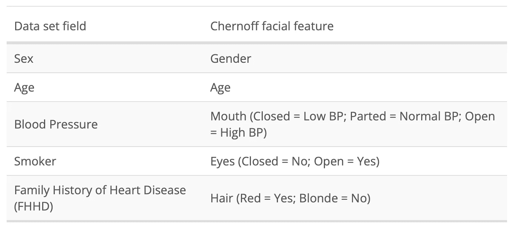

# 如何使用 DALL-E API 进行数据可视化

> 原文：<https://betterprogramming.pub/using-dall-e-for-data-visualization-59df580e66ab>

## 从数据集到文本提示再到生成的图像


托马斯·弗兰科斯基在 [Unsplash](https://unsplash.com?utm_source=medium&utm_medium=referral) 上的照片

*这是探索 DALL-e 如何用于数据可视化的两篇博文的第 1 部分。对于第 2 部分，参见* [*使用 DALL-E API*](https://medium.com/p/1ffb9250944d) 更有效地交流数据

DALL-e 现在已经开放给公众使用，大多数人都专注于探索它的能力，看看 DALL-E 能够多准确或创造性地描述提示。

它令人兴奋，玩起来很有趣。


从提示符生成的 DALL-e 图像

在玩了几个月 DALL-E 之后，我一直很好奇它会如何支持创造性和趣味性之外的用途。

我一直在考虑的一个应用:数据可视化。

我决定进行实验，开始探索切尔诺夫的面孔。它们是一种数据可视化，使用面部特征来表示不同的数据点。Chernoff 面通常用于可视化多维数据集，即有许多不同的变量要考虑。

# 数据可视化、Chernoff Faces 和 DALL-E

切尔诺夫脸是卡通式的线条画，其中一个面部特征对应于数据集中的一个字段。

例如，在一个假设的天气数据集中，您可能有:

*   温度→眉毛的形状
*   气压→眼睛的大小


代表天气数据集中记录的 Chernoff 面示例

切尔诺夫人脸利用人类固有的识别人脸的能力和面部特征的微小变化。如果你好奇想了解更多，请看爱德华·塔夫特的“[量化信息的可视化展示【亚马逊】](https://amzn.to/3UChD8P)”

DALL-E 生成更真实人脸的能力是否有助于更有效地传达数据？

# 方法

为了开始探索，我选择了一个开源数据集。我使用了来自 UCI 库[的克利夫兰心脏病数据集的变体](https://archive.ics.uci.edu/ml/index.php)。

然后，我选择了数据集特征的子集(性别、年龄、血压、吸烟者、心脏病家族史)，并将它们映射到切尔诺夫的面部特征。

我创建的映射是:



使用表中定义的规则，我编写了一个 Python 应用程序，将数据集中的每一行转换为文本提示。

例如，给定这些行:

```
Row #1: Sex=F; Age=29; BP=135/90; Smoker=1; FHHD= 1;
Row #2: Sex=F; Age=35; BP=80/65; Smoker=0; FHHD= 0;
```

Python 应用程序生成了以下提示:

```
Row #1: A photographic portrait a 29 year old woman’s face with red hair, opened mouth, and wide open eyesRow #2: A photographic portrait a 35 year old woman’s face with blonde hair, closed mouth, and closed eyes
```

# 结果呢

通过 DALL-E 运行这两个提示会生成以下图像:


第 2 排(左)，第 1 排(右)

# 结论

作为第一步，我认为仅仅通过观察这两个数据点，结果就相当令人信服。

显而易见的好处是:通过正确的领域→面部特征映射，生成的图像可以以一种漫画式对等物无法表达的方式包含情感。我认为 DALL-E 以这种方式生成人脸图像的能力使它成为一种非常有趣的数据探索工具。

显而易见的挑战是:由于控制生成图像中特征的能力有限，很难区分不同人脸之间的细微差别。

但总的来说，我认为现在和将来都有潜力，因为克服挑战成为可能。

你怎么想呢?

这是探讨 DALL-e 如何用于数据可视化的两篇博文的第 1 部分。对于第 2 部分，参见 [*使用 DALL-E API*](https://medium.com/p/1ffb9250944d) 更有效地传递数据